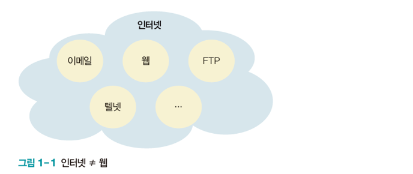

## 웹 사이트 작성

- **클라우드 서비스 - 구름 IDE (Goorm IDE)**

  - 웹 브라우저를 통하여 개발을 할 수 있는 클라우드 서비스
  - 개발 환경이 세팅이 따로 필요 없음
  - Web 프로젝트의 변경사항을 바로 볼 수 있도록 Preview 제공
  - 개인 url 제공 - 홈페이지 바로 게시 가능
  - 웹서버를 실행하는 클라우드 환경

  

- **로컬 환경 세팅**

  - Eclipse, VS Code 를 활용한 개발환경 세팅
  - 대규모 기업 개발 환경과 유사하게 세팅
  - 웹서버 따로 설치
  - Back end 연동 손쉬움
  - Frontend만 진행할때는 구름이 편하지만, 추후에는 Eclipse로 진행 필요

  

- **실습**

  - https://ide.goorm.io/ 
    - 로그인 > 대시보드 > 컨테이너 생성 > HTML/CSS/JS 선택

  - google > free html template(**Freecss.com**)에서 템플릿 다운 받고 구름에 옮기기 
  - 파비콘 만들기

  ```html
  <link href="img/sejin2.PNG" type="image/x-icon"  rel="icon"/>
  ```

  

## 웹

- **인터넷 vs 웹**

  - 인터넷은 전 세계를 연결하는 국제 정보 통신망으로, 컴퓨터나 스마트폰 같은 디지털 기기로 연결되어 사람들이 정보를 공유할 수 있는 공간
  - 웹은 http 프로토콜 기반의 서비스

  

