## 웹 프로젝트(서블릿)

- **서버 설정**

  - 2020년 12월 버전의 이클립스
    - https://www.eclipse.org/downloads/packages/release/2020-12/r

  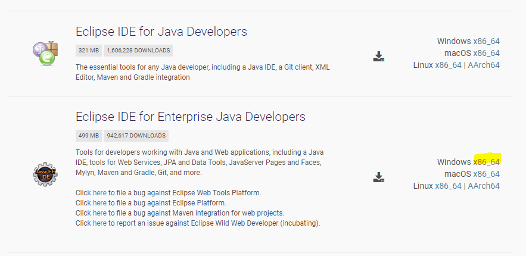

  

  - workspace 설정(web-workspace)

  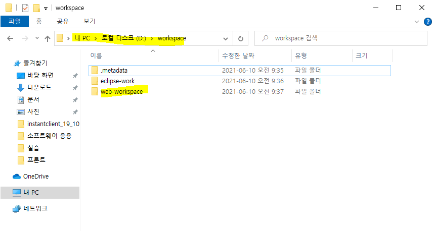

  

  - 톰캣 다운로드

  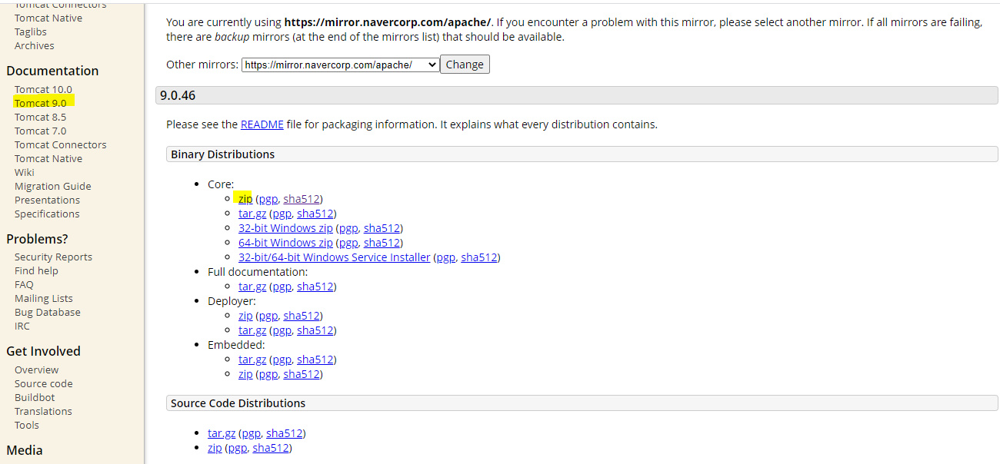

  

  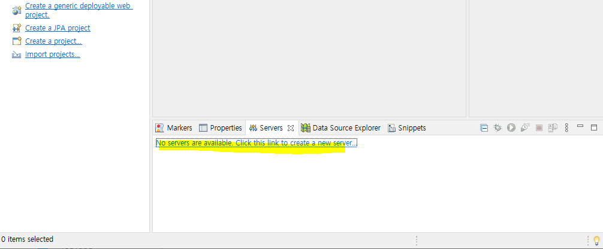

  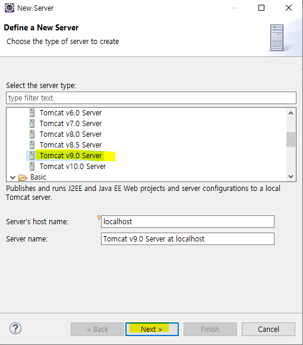

  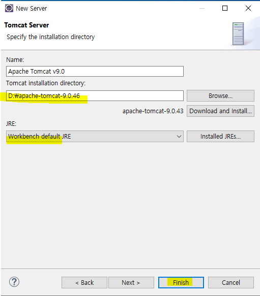

  

  - 서버를 위한 폴더 생성
    - 서버의 위치를 더 쉽게 볼 수 있게 따로 서버의 폴더를 생성

  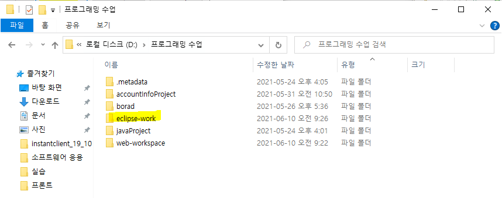

  

  - 서버 더블클릭

  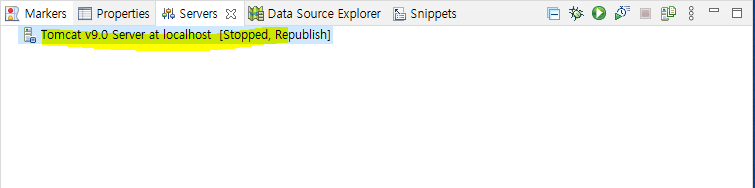

  

  - 오라클도 8080이라서 충돌난다. 그래서 9999로 변경

  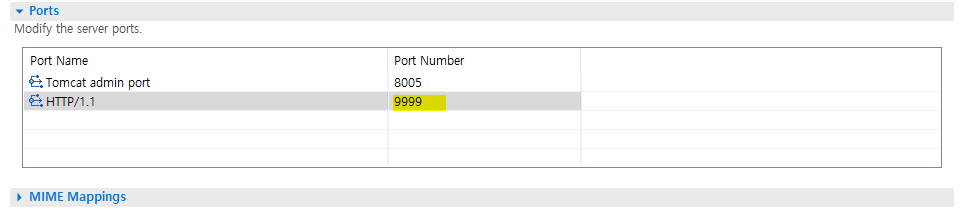

  

  - 서버를 start 하기 전에 설정해야 한다.
    - 서버의 위치를 더 쉽게 볼 수 있게 따로 생성한 서버 폴더의 경로를 설정

  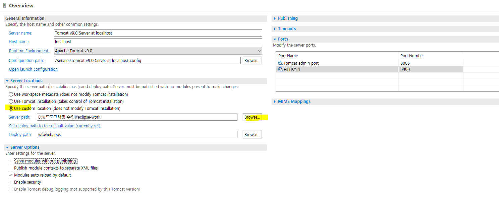

  

  - 아까 만들었던 서버 폴더로 선택

  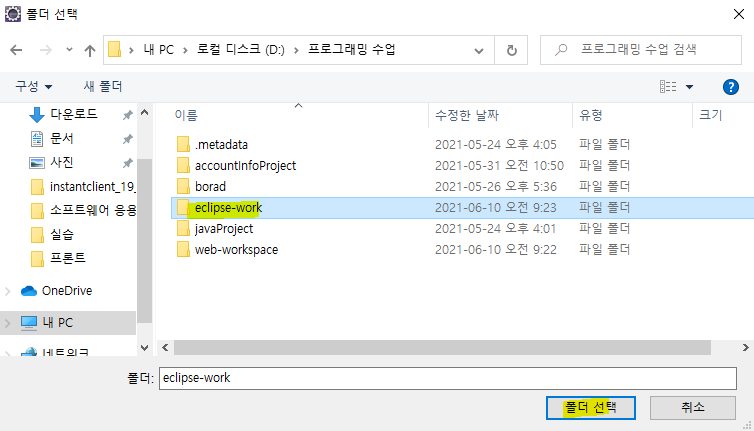

  

  - 서버 start

  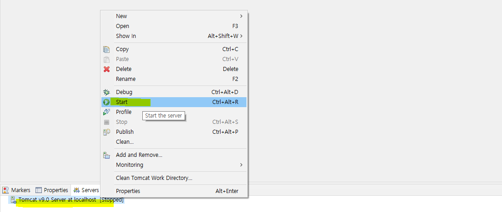


- **프로젝트 생성**

  - Dynamic Web Project

  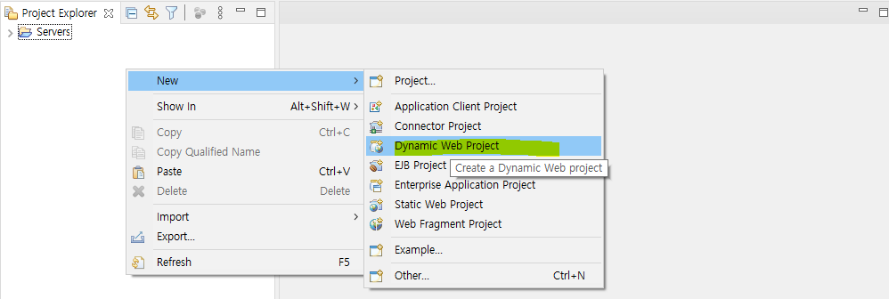

  

  - 3.1버전으로 선택
    - 서블릿 버전
    - 3.0부터 xml 파일에 모두 환경설정을 했는데 java에서 어노테이션을 사용해서 할 수 있어짐

  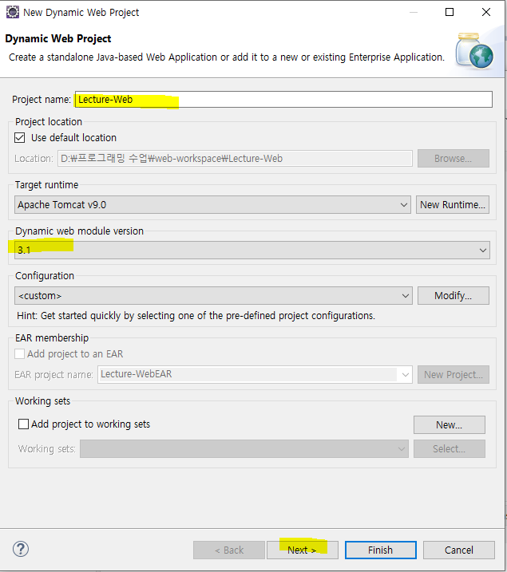

  

  - next

  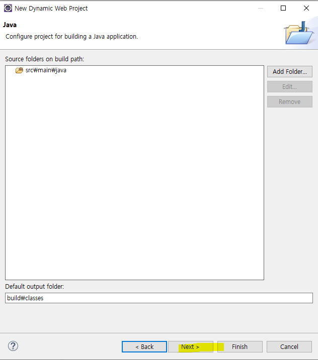

  

  - Generate web.xml deployment descriptor 선택 후 finish

  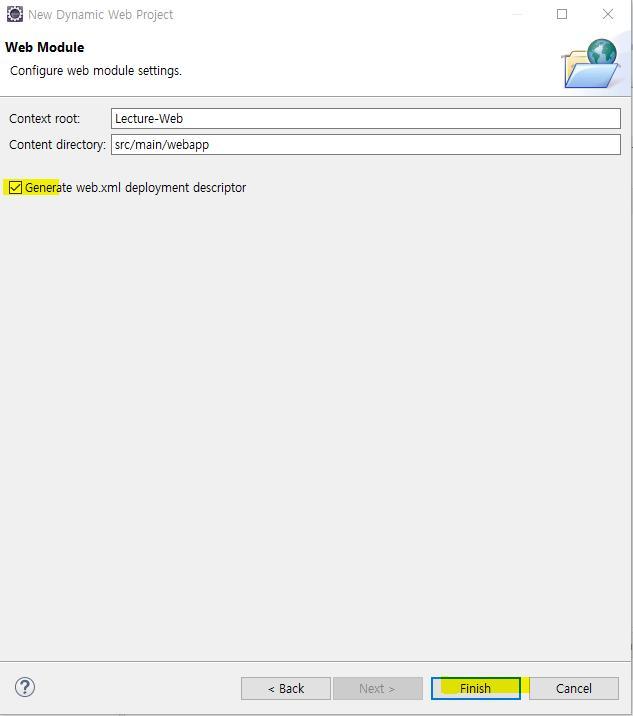


- 다이나믹 웹 프로젝트 인코딩 설정

  - 프로젝트 인코딩(MS949 > UTF-8)
  - html, css, jsp 인코딩(EUC-KR > UTF-8)
  - window > preferences

  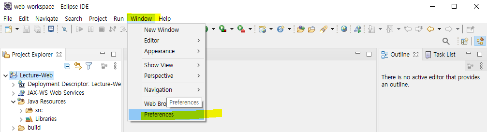

  

  - Workspace에서 utf-8로 변경

  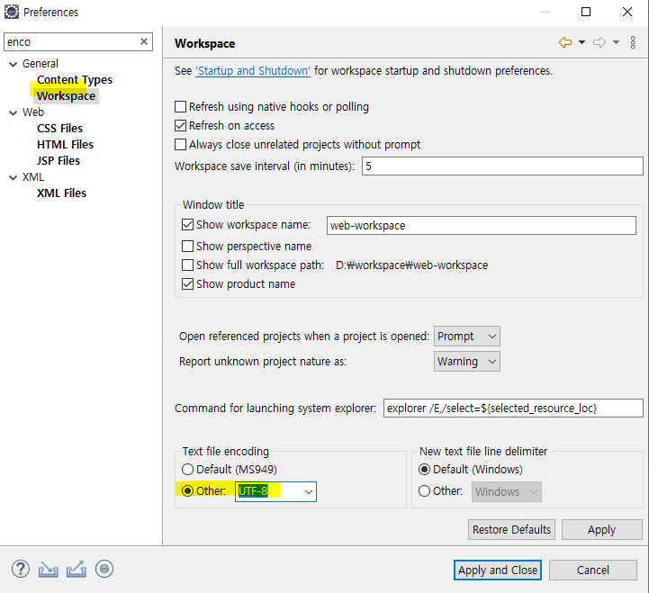

  

  - css, html, jsp 모두 utf-8로 변경

  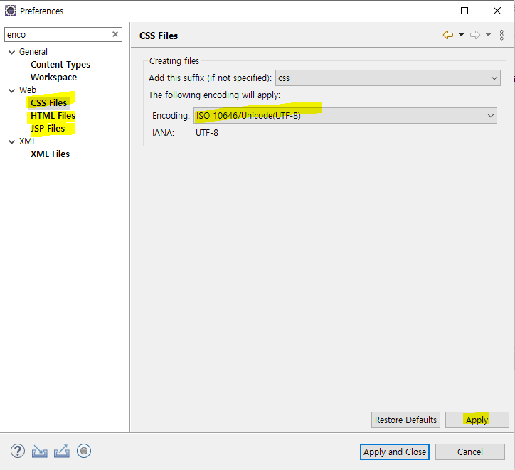


- **html 만들기**

  - 설정 변경 (window - web browser - chrome)

  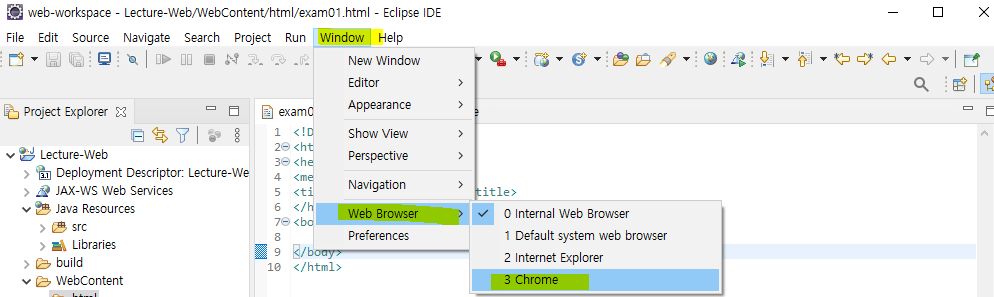

  

  - WebContent에서 html 폴더 생성 후 html 파일 추가

  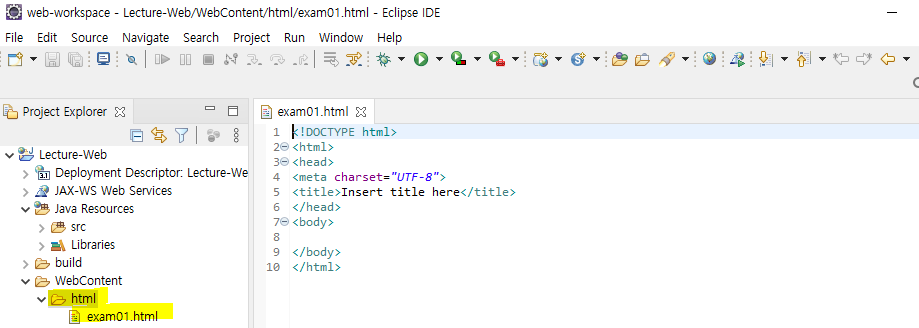

  

  - run

  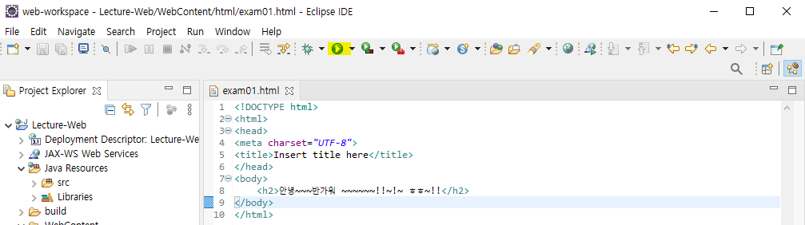

  

  - 실행 화면

  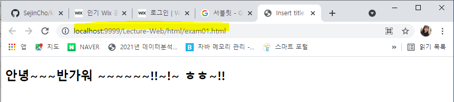

  


- **설정된 url** 

  - http://[ip주소]:[port번호]/[path]

  - http://localhost:9999/Lecture-Web/html/exam01.html

    - WebContent 폴더는 나오지 않음

      - 톰캣이라는 서버를 통해서 실행하는 것이므로 서버에 구축이 되어야 한다. 그래서 실행이 되면 workspace 폴더가 복사가 되어서 서버에 구축이 됨

    - 아까 설정했던 서버 폴더를 확인

      - wtpwebapps가 http://localhost:9999

      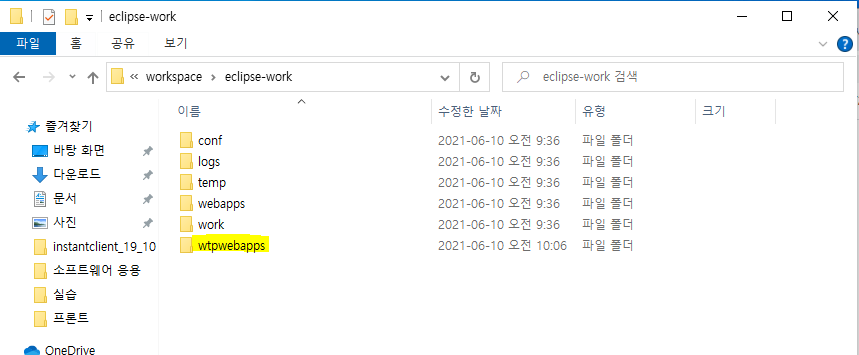

      - D:\workspace\eclipse-work\wtpwebapps\Lecture-Web\html로 가보면 exam01.html 파일이 있다. 
        - 즉, WebContent 폴더는 이클립스가 만들어준 폴더이고 실제 웹서버의 폴더가 아니다. 
        - 그래서 우리가 실제로 봐야하는 폴더는 eclipse-work(서버 폴더)이다.

      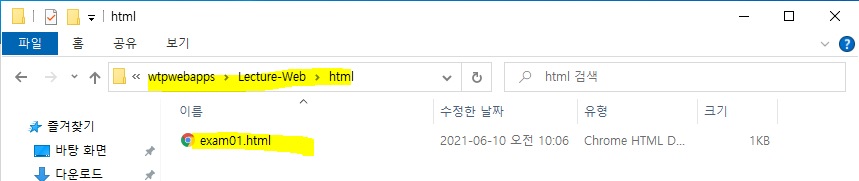

      - WebContent 폴더는 보안폴더로 외부 UI를 통해 직접적으로 접근할 수 없음

    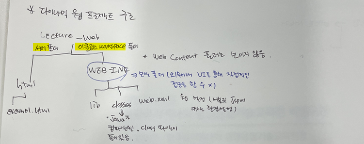


- **html**

  ```html
  <!DOCTYPE html>
  <html>
  <head>
  	<meta charset="UTF-8">
  	<title>Insert title here</title>
  </head>
  <body>
  	<div id="header">
  		<h2>한국폴리텍대학 광명융합기술교육원</h2>
  		<div>
  			<ul>
  				<li><a href="#">데이터분석</a></li>
  				<li><a href="#">바이오의약시스템</a></li>
  				<li><a href="#">증강현실시스템</a></li>
  			</ul>
  		</div>
  	</div>
  	<div>
  		<div>
  			<h2>데이터분석과</h2>
  			<p>
  				안녕하세요. <b> 데이터분석 </b>과입니다. <br>
  				기초프로그래밍 리눅스, 데이터베이스, 웹 어플리케이션, 데이터분석에 관한 교육을 수행합니다. <br>
  			</p>
  		</div>
  		<div>
  			<h2>바이오의약시스템</h2>
  			<p>
  				안녕하세요. <span style="background-color : yellow;">바이오의약시스템</span> 과 입니다. <br>
  				바이오에 관련된 수업을 진행합니다. <br>
  			</p>
  		</div>	
  		<div>
  			<h2>증강현실시스템</h2>
  			<p>
  				안녕하세요. <b> 증강현실시스템 </b> 과입니다. <br>
  				기초프로그래밍, 그래픽, 게임관련 수업을 진행합니다. <br>
  			</p>
  		</div>			
  	</div>
  	<div id="footer">
  		<i>주소 : 경기도 광명시 오리로 904 광명융합기술교육원</i>
  		전화번호 : 01-2139-4800
  	</div>
  </body>
  </html>
  ```


- **태그분리**

  - div가 많아서 복잡할 때 사용
  - strong, em 태그도 추가
    - strong = b
    - em = i 
  - mark 태그는 background-color 디폴트가 노란색이다.

  ```html
  <!DOCTYPE html>
  <html>
  <head>
  	<meta charset="UTF-8">
  	<title>Insert title here</title>
  	
  </head>
  <body>
  <!-- 
  	header  : 사이트명, 로고
  	nav     : 사이트의 메뉴를 포함하고 있는 경우 사용 
  	section : 문서의 주요 내용을 포함 
  	article : 문서의 주요 내용이 긴 경우 세부적으로 구분하기 위한 목적으로 사용
  	aside   : 문서의 주요 내용 옆에 배치되는 내용
  	footer  : 문서의 정보나 저작권, 부가정보를 표현할 때 사용
   -->
   	<header>
   		<h2>한국폴리텍대학 광명융합기술교육원</h2>
   		<nav>
   			<ul>
  				<li><a href="#">데이터분석</a></li>
  				<li><a href="#">바이오의약시스템</a></li>
  				<li><a href="#">증강현실시스템</a></li>
  			</ul>
   		</nav>
   	</header>
   	<section>
   		<article>
   			<h2>데이터분석과</h2>
  			<p>
  				안녕하세요. <b> 데이터분석 </b>과입니다. <br>
  				기초프로그래밍 리눅스, 데이터베이스, 웹 어플리케이션, 데이터분석에 관한 교육을 수행합니다. <br>
  			</p>
   		</article>
   		<article>
   			<h2>바이오의약시스템</h2>
  			<p>
  				안녕하세요. <mark style="background-color: pink;">바이오의약시스템</mark> 과 입니다. <br>
  				바이오에 관련된 수업을 진행합니다. <br>
  			</p>
   		</article>
   		<article>
   			<h2>증강현실시스템</h2>
  			<p>
  				안녕하세요. <strong> 증강현실시스템 </strong> 과입니다. <br>
  				기초프로그래밍, 그래픽, 게임관련 수업을 진행합니다. <br>
  			</p>
   		</article>
   	</section>
   	<footer>
   		<i>주소 : 경기도 광명시 오리로 904 광명융합기술교육원</i>
  		<em>전화번호 : 01-2139-4800</em>
   	</footer>
  </body>
  </html>
  ```

  


- input

  ```html
  <!DOCTYPE html>
  <html>
  <head>
  	<meta charset="UTF-8">
  	<title>Insert title here</title>
  </head>
  <body>
  <!-- 
  	<input type=""> : 하나의 태그가 시작태그면서 종료태그이다. xml은 /를 반드시 붙여야 한다.
  		type
  			- text : 한 줄 입력
  			- password : 암호 처리
  			- checkbox : 다중 선택
  			- radio : 단일 선택
  			- button : 사용자 이벤트 처리
  			- file : 첨부 파일
  			- reset : 초기화 
  			- hidden : 입력을 받지 않고 특정 값을 전달하기 위해서 만들어짐
  			- submit : 폼에서 입력받은 데이터를 서버에 전달
   -->
  	<form action="http://naver.com">
  		
  		<strong>회원가입</strong> <br><br>
  		<fieldset>
  		<!-- label을 입력하면 아이디 text를 클릭했을 때 text box안으로 커서가 들어감 -->
  		<label>아이디 : <input id="id" type="text"></label> <br>
  		<label for="pw">비밀번호 :</label> <input id="pw" type ="password">
  		</fieldset>
  		<br>
  		
  		<fieldset>
  		<legend>희망연봉</legend>
  		<input type="radio" name="salary"> 3000 ~ 3200<br>
  		<input type="radio" name="salary"> 3200 ~ 3500<br>
  		<input type="radio" name="salary"> 3500 ~ 3800<br>
  		<input type="radio" name="salary"> 3800 ~ 4200<br>
  		<input type="radio" name="salary"> 4200 이상
  		</fieldset>
  		<br>
  		
  		<strong>사용 가능한 언어(중복 가능)</strong> <br>
  		<input type="checkbox" name="language">C언어<br>
  		<input type="checkbox" name="language">JAVA<br>
  		<input type="checkbox" name="language">C#<br>
  		<input type="checkbox" name="language">Python<br>
  		<input type="checkbox" name="language">Servet/JSP<br>
  		<input type="checkbox" name="language">php<br><br>
  		
  		<strong>취미(중복 가능)</strong> <br>
  		<input type="checkbox" name="hobby"> 밥먹기<br>
  		<input type="checkbox" name="hobby"> 잠자기<br>
  		<input type="checkbox" name="hobby"> 눕기<br><br>
  		
  		<strong>자기소개</strong> <br>
  		<textarea rows="7" cols="40">
  		</textarea> <br><br>
  		
  		<strong>첨부파일 : </strong> 
  		<input type="file"> <br><br>
  		
  		<input type="submit">
  		<input type="reset">
  		
  	</form>
  </body>
  </html>
  ```

  

- **html5 추가된 input type**

  ```html
  <!DOCTYPE html>
  <html>
  <head>
  <meta charset="UTF-8">
  <title>Insert title here</title>
  </head>
  <body>
  	<form action="http://www.naver.com">
  		이메일 : <input type="email" required readonly="readonly"> <br>
  		SNS주소 : <input type="url"> <br>
  		전화번호 : <input type="tel" pattern="(010|011|017)-\d{3,4}-\d{4}" placeholder="xxx-xxxx-xxxx" size=550> <br>
  		검색어 : <input type="search"> <br>
  		수량 : <input type="number"  max="10" value="1" step="2"> <br>
  		범위 : <input type="range" min=10><br>
  		날짜: <input type="date" max="2021-08-12"> <br>
  		
  		<input type="submit" value="전송">
  		<input type="reset" value="취소"><br>
  		
  	</form>
  </body>
  </html>
  ```

  

- **css**

  - position : static이 디폴트(left top)
  - exam01.html

  ```html
  <!DOCTYPE html>
  <html>
  <head>
  <meta charset="UTF-8">
  <title>Insert title here</title>
  <style>
  	div {
  		position : static; 
  		width : 100px;
  		height : 100px;
  		left : 100px;
  	}
  	#div01 {
  		background-color: red;
  		z-index : 999;
  	}
  	#div02 {
  		background-color: blue;
  	}
  </style>	
  </head>
  <body>
  	<!-- 100x100 빨간사각형, 파란사각형 그리기 -->
  	<div id="div01">첫번째사각형</div>
  	<div id="div02">두번째사각형</div>
  </body>
  </html>
  ```

  - exam02.html
    - position : absolute은 설정한 값으로 이동

  ```html
  <!DOCTYPE html>
  <html>
  <head>
  <meta charset="UTF-8">
  <title>Insert title here</title>
  <style>
  	div {
  		position : absolute; 
  		width : 100px;
  		height : 100px;
  	}
  	#div01 {
  		background-color: red;
  		left : 100px;
  		top : 50px;
  	}
  	#div02 {
  		background-color: blue;
  		left : 50px;
  		top : 100px;
  	}
  </style>	
  </head>
  <body>
  	<!-- 100x100 빨간사각형, 파란사각형 그리기 -->
  	<div id="div01">첫번째사각형</div>
  	<div id="div02">두번째사각형</div>
  	<!-- 아래에 적혀있는 속성이 더 우선이다. -->
  	<div style="width : 200px; height: 200px; left: 200px; top:200px; background-color: gray;">
  		<div style="position : absolute; background-color: green; top:20px;">사각형</div>
  	</div>
  </body>
  </html>
  ```

  - exam04.html
    - position : relative
    - static의 위치를 기준으로 움직인다.(상대적인 위치)

  ```html
  <!DOCTYPE html>
  <html>
  <head>
  <meta charset="UTF-8">
  <title>Insert title here</title>
  <style>
  	div {
  		position : relative; 
  		width : 100px;
  		height : 100px;
  	}
  	#div01 {
  		background-color: red;
  	}
  	#div02 {
  		background-color: blue;
  		top : 100px;
  	}
  </style>	
  </head>
  <body>
  	<!-- 100x100 빨간사각형, 파란사각형 그리기 -->
  	<div id="div01">첫번째사각형</div>
  	<div id="div02">두번째사각형</div>
  	<!-- 아래에 적혀있는 속성이 더 우선이다. -->
  	<div style="width : 200px; height: 200px; left: 200px; top:200px; background-color: gray;">
  		<div style="position : absolute; background-color: green; top:20px;">사각형</div>
  	</div>
  </body>
  </html>
  ```

  - exam04.html
    - position : fixed
    - 고정위치

  ```html
  <!DOCTYPE html>
  <html>
  <head>
  <meta charset="UTF-8">
  <title>Insert title here</title>
  <style>
  	div {
  		width : 100px;
  		height : 100px;
  	}
  	#div01 {
  		position : fixed; 
  		background-color: red;
  	}
  	#div02 {
  		position : absolute; 
  		background-color: blue;
  		top : 200px;
  	}
  </style>	
  </head>
  <body>
  	<!-- 100x100 빨간사각형, 파란사각형 그리기 -->
  	<div id="div01">첫번째사각형</div>
  	<div id="div02">두번째사각형</div>
  	
  	<br><br><br><br><br><br><br><br><br><br><br><br><br><br><br><br><br><br><br><br><br><br><br><br><br><br><br><br>
  	<br><br><br><br><br><br><br><br><br><br><br><br><br><br><br><br><br><br><br><br><br><br><br><br><br><br><br><br>
  	<br><br><br><br><br><br><br><br><br><br><br><br><br><br><br><br><br><br><br><br><br><br><br><br><br><br><br><br>
  	<br><br><br><br><br><br><br><br><br><br><br><br><br><br><br><br><br><br><br><br><br><br><br><br><br><br><br><br>
  	<br><br><br><br><br><br><br><br><br><br><br><br><br><br><br><br><br><br><br><br><br><br><br><br><br><br><br><br>
  </body>
  </html>
  ```

  - exam05.html

  ```html
  <!DOCTYPE html>
  <html>
  <head>
  <meta charset="UTF-8">
  <title>Insert title here</title>
  <style>
  	div {
  		width: 100px;
  		margin: 10px;
  		padding: 10px;
  		border-color: blue;
  		border-width: 3px;
  		float: left;	
  	}
  	
  	#div01 {
  		border-style: solid;
  	}
  	
  	#div02 {
  		border-style: dotted;
  		/* visibility: hidden; */
  		/* display: none; */
  	}
  	
  	#div03 {
  		border-style: dashed;
  	}
  	
  	#div04 {
  		border-style: double;
  	}
  	
  	#div05 {
  		border-style: groove;
  		/* border-style: groove; */
  	}
  	
  	#div06 {
  		border-style: outset;
  		/* border-style: inset; */
  	}
  </style>
  </head>
  <body>
  	<div id="div01">사각형1</div>
  	<div id="div02">사각형2</div>
  	<div id="div03">사각형3</div>
  	<div id="div04">사각형4</div>
  	<div id="div05">사각형5</div>
  	<div id="div06">사각형6</div>
  </body>
  </html>
  ```


- **display와 visibility 차이**
  - display : 어떻게 표시할지 말지 선택
    - inline : 기본값으로, 요소를 inline 요소처럼 표시한다. 즉, 앞뒤로 줄바꿈을 하지 않음
    - block : 요소 앞 뒤로 줄바꿈을 한다.
    - none: 박스가 생성되지 않음. 즉, 공간을 차지하지도 않음
    - inline-block : inline인데 내부에는 block처럼 표시함. 즉, 박스 모양이 inline처럼 옆으로 늘어선다.
  - visibility : 요소를 보일지 말지 결정


- css 공부 site

  > https://www.w3schools.com/


- 마진(margin) - 테두리(border) - 패딩(padding) 이란?

  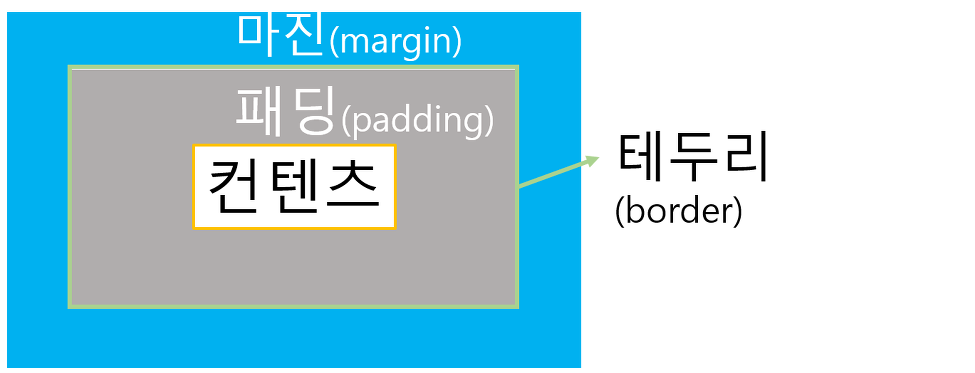