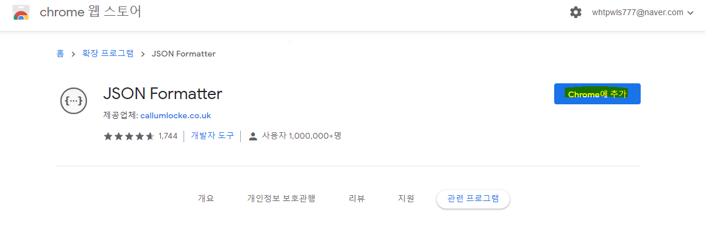
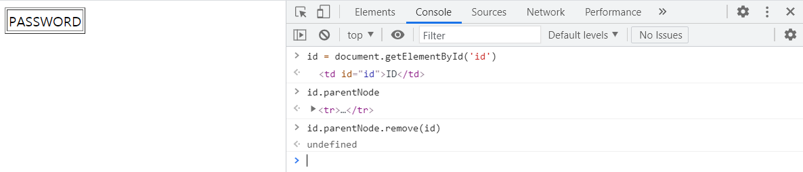
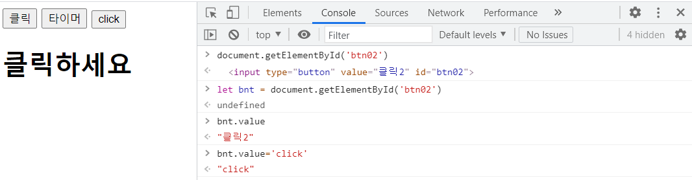

## 자바스크립트

- **상속 - prototype 사용**

  ```html
  <!DOCTYPE html>
  <html>
  <head>
  	<meta charset="UTF-8">
  	<title>Insert title here</title>
  	<script type="text/javascript">
  		function Person(name, phone, addr) {
  			this.name = name
  			this.phone = phone
  			this.addr = addr
  		}
  		
  		Person.prototype.hobby = '영화감상'
  		Person.prototype.info = function() {
  			let msg = ''
  			for(let key in this){
  				//if(key != 'info')
  				if(typeof(this[key]) != 'function')	
  					msg += key + ':' + this[key] + '\n'
  			}
  			alert(msg)
  		}
  		
  		function Doctor (name, phone, addr, major) {
  			this.name = name
  			this.phone = phone
  			this.addr = addr
  			this.major = major 
  		}
  		
  		let d = new Doctor('양현석','010-2323-2323','의정부시 민락동','성형외과')
  		console.log(d) //이때 _proto__ : Object
  		console.log(d instanceof Doctor) //true
  		console.log(d instanceof Person) //false
  		
  		//person을 상속받아서 person이 가지고 있는 것으로 사용하게 만들기
  		function Doctor2 (name, phone, addr, major) {
  			this.super = Person
  			this.super(name,phone,addr)
  			this.major = major 
  		}		
  		
  		let d2 = new Doctor2('양현석2','010-2323-2323','의정부시 민락동','성형외과')
  		console.log(d2)
  		console.log(d2 instanceof Person) //여전히 false
  		//이렇게 만든다고 상속관계는 아님 
  		//그냥 Person생성자 함수를 이용해서 내 멤버변수 값을 
  		//자동으로 만들어주는 기능만 가지고 있다.
  		
  		//person을 호출하기 
  		function Doctor3 (name, phone, addr, major) {
  			//Person.call(this, name, phone, addr) //this는 Doctor에 대한 this임을 알려주는 것임
  			//Person.call(this, ...arguments) // = 같은 의미 
  			Person.apply(this,arguments) // = 같은 의미 
  			
  			this.major = major 
  		}	
  		
  		let d3 = new Doctor3('양현석3','010-2323-2323','의정부시 민락동','성형외과')
  		console.log(d3)
  		console.log(d3 instanceof Person) //false
  		
  		//person에서 name, phone, addr만 사용할 수 있음
  		//상속관계를 만들기 위해서는 prototype을 변경해야 한다.
  		Doctor3.prototype = Person.prototype
  		
  		//상속 받았는지 확인
  		d3 = new Doctor3('양현석3','010-2323-2323','의정부시 민락동','성형외과')
  		console.log(d3 instanceof Person)
  		console.log(d3)
  		console.log('취미 : ' + d3.hobby) //name, phone, addr 외에도 prototype도 사용할 수 있음
  		
  	</script>
  </head>
  <body>
  
  </body>
  </html>
  ```

  

- **class**

  - getter, setter

  ```html
  <!DOCTYPE html>
  <html>
  <head>
  <meta charset="UTF-8">
  <title>Insert title here</title>
  <script>
  
  	class Person {
  		//함수를 사용할 때 class 안에서는 function을 사용하지 않음
  		constructor(name, phone, addr) { //생성자 함수
  			this.name = name
  			this.phone = phone
  			this.addr = addr
  		}
  		info() {
  			alert(`name : ${this.name}, phone : ${this.phone}, addr : ${this.addr}`)
  		}		
  	}
  
  	//let p = new Person()
  	let p = new Person("홍길동", "010-1111-2222", "경기도 광명시")
  	console.log(p) //info 함수가 알아서 prototype으로 들어감(?)
  	p.info() 
  	
  	p.name = '홍길순'
  	console.log(p) //이름이 바뀐다.
  	
  	//***********************************************************************************
  	
  	//이름이 바뀌지 않도록 은닉성의 성질을 만족할 수 있도록 하기
  	//_ 붙여주기
  	class Person2 {
  		//함수를 사용할 때 class 안에서는 function을 사용하지 않음
  		constructor(name, phone, addr) { //생성자 함수
  			this._name = name
  			this._phone = phone
  			this._addr = addr
  		}
  		info() {
  			alert(`name : ${this.name}, phone : ${this.phone}, addr : ${this.addr}`)
  		}		
  	}
  	
  	let p2 = new Person2("홍길동", "010-1111-2222", "경기도 광명시")
  	p2.name = '홍길순'
  	console.log(p2)
  	p2.name //홍길순 name이라는 key값이 하나 더 생김
  	p2._name //홍길동
  	
  	//*******************************************************************************
  	//getter, setter 메소드 만들기
  	class Person3 {
  		//함수를 사용할 때 class 안에서는 function을 사용하지 않음
  		constructor(name, phone, addr) { //생성자 함수
  			this._name = name
  			this._phone = phone
  			this._addr = addr
  		}
  		info() {
  			alert(`name : ${this.name}, phone : ${this.phone}, addr : ${this.addr}`)
  		}
  		//setter, getter 메소드
  		get name(){
  			return this._name
  		}
  		set name(name) {
  			this._name = name
  		}
  		get phone(){
  			return this._phone
  		}
  		set phone(phone) {
  			this._phone = phone
  		}
  		get addr() {
  			return this._addr
  		}
  		set addr(addr) {
  			this._addr = addr
  		}
  		
  	}
  	
  	let p3 = new Person3("홍길동", "010-1111-2222", "경기도 광명시")
  	console.log(p3)
  	p3.name = '홍길순' //setter 
  	console.log(p3.name) //getter 홍길순
  	console.log(p3)
  </script>
  </head>
  <body>
  
  </body>
  </html>
  ```


- **class 기반의 상속**

  ```html
  <!DOCTYPE html>
  <html>
  <head>
  <meta charset="UTF-8">
  <title>Insert title here</title>
  <script>
  
  	//*******************************************************************************
  	class Person {
  		//함수를 사용할 때 class 안에서는 function을 사용하지 않음
  		constructor(name, phone, addr) { //생성자 함수
  			this._name = name
  			this._phone = phone
  			this._addr = addr
  		}
  		info() {
  			let msg = ''
  			for(let key in this) {
  				msg += key + ':' + this[key] + '\n'
  			}
  			alert(msg)
  		}
  		//setter, getter 메소드
  		get name(){
  			return this._name
  		}
  		set name(name) {
  			this._name = name
  		}
  		get phone(){
  			return this._phone
  		}
  		set phone(phone) {
  			this._phone = phone
  		}
  		get addr() {
  			return this._addr
  		}
  		set addr(addr) {
  			this._addr = addr
  		}
  		
  	}
  	
  	class Doctor extends Person{
  		constructor(name, phone, addr, major) {
  			super(name, phone, addr) //이걸 써줘야 한다. 자바스크립트는 자동으로 생성되지 않으 
  			this._major = major
  		}
  		get major() {
  			return this._major
  		}
  		set major(major){
  			this._major = major
  		}
  	}
  	
  	let p = new Person('양현석','010-2222-2222', '의정부시 민락동')
  	p.info()
  	
  	let d = new Doctor('조세진','010-1111-1111','의정부시 금오동','성형외과')
  	d.info()
  	console.log(d)
  </script>
  </head>
  <body>
  
  </body>
  </html>
  ```

  

- **내장객체**

  ```html
  <!DOCTYPE html>
  <html>
  <head>
  <meta charset="UTF-8">
  <title>Insert title here</title>
  <script type="text/javascript">
  	//자바스크립 내장객체 : Number, String, Array, Math, Object, Date
  	
  	//**********************************************************************************************
  	//string
  	let str = 'hello world!'
  	console.log(str.charAt(0))
  	console.log(str.concat('!!!'))
  	
  	String.prototype.changeStr = function() {
  		return this.bold().fontcolor('red').fontsize('20pt').link('http://www.naver.com')
  	}
  	
  	let str2 = new String('hello world')
  	document.write(str2 + '<br>')
  	document.write(str2.changeStr() + '<br>')
  	
  	
  	
  	//**********************************************************************************************
  	//num
  	let num = 100
  	let num2 = new Number(100)
  	
  	console.log(typeof(num) == 'number') //true
  	console.log(typeof(num2) == 'number') //false 
  	//왜냐하면, num2는 object이므로
  	
  	console.log(num)
  	console.log(num2)
  	
  	console.log(num.constructor == Number) //true
  	console.log(num2.constructor == Number) //true
  	
  	//info 함수 정의 
  	Object.prototype.info = function() {
  		alert(this) //자신의 값을 보여줌 
  	}
  	
  	//num2.info() //위에서 info를 정의해줘서 사용할 수 있음
  	
  	
  	
  </script>
  </head>
  <body>
  
  </body>
  </html>
  ```


- **JSON Formatter  추가**

  https://chrome.google.com/webstore/detail/json-formatter/bcjindcccaagfpapjjmafapmmgkkhgoa/related?hl=ko

  


- date 함수

  ```html
  <!DOCTYPE html>
  <html>
  <head>
  <meta charset="UTF-8">
  <title>Insert title here</title>
  <script type="text/javascript">
  	let d = new Date()
  	console.log(d)
  	console.log(d.getYear())
  	
  	//오늘은 2021년 6월 15일 화요일입니다.
  	Date.prototype.today = function(){
  		let day = ''
  		let week = ['일요일','월요일','화요일','수요일','목요일','금요일','토요일']
  		alert(`오늘은 ${this.getFullYear()}년 ${this.getMonth() + 1}월 ${this.getDate()}일 ${week[this.getDay()]}입니다. `)
  	}
  	
  	d.today()
  	
  	let d2 = new Date(2020,12-1, 25)
  	d2.today()
  	
  </script>
  </head>
  <body>
  
  </body>
  </html>
  ```

  

- JSON

  ```html
  <!DOCTYPE html>
  <html>
  <head>
  <meta charset="UTF-8">
  <title>Insert title here</title>
  <script type="text/javascript">
  	/*
  		JSON.parse() : 문자열을 자바스크립트 객체로 변환
  		JSON.stringify() : 자바스크립트객체를 JSON 문자열로 변환 
  	*/
  	let person = {
  			name : '양현석',
  			phone : '010-2222-3333',
  			addr : '경기도 의정부시 민락동'
  			/*
  			toJSON : function(){ //이게 없으면 자신이 가지고 있는 모든 멤버변수를 
  				return {		  //문자열로 변환해주는데 따로 정의해서 
  								  //내가 원하는 멤버변수만 문자열로 나오게 설정할 수 있다.
  					'name' : this.name,
  					'phone' : this.phone
  				}
  			}
  			*/
  		}
  		
  	console.log(person)
  	console.log(JSON.stringify(person)) //문자열로 변환 
  	alert(person)
  	alert(JSON.stringify(person))
  	
  	let strPerson = JSON.stringify(person)
  	console.log(strPerson) //문자열로 변환
  	document.write(strPerson + '<br>')
  	
  	//문자를 다시 json 객체로 바꿔주기
  	let person2 = JSON.parse(strPerson)
  	console.log(person2)
  	
  	//안에 묶는 것은 " " 로 묶어야 한다.
  	let str = '{"name" : "조세진", "phone" : "010-2424-2424", "addr" : "경기도 의정부시 금오동"}'
  	console.log(typeof(str)) //string
  	let obj = JSON.parse(str)
  	console.log(typeof(obj)) //object
  	console.log(obj)
  </script>
  </head>
  <body>
  
  </body>
  </html>
  ```

  

- 배열의 index 이름 정해주기

  - key값을 가지고 있는 형태로 사용

  ```html
  <!DOCTYPE html>
  <html>
  <head>
  	<meta charset="UTF-8">
  	<title>Insert title here</title>
  	<script type="text/javascript">
  		let state = new Array()
  		state['서초'] = '서울특별시'
  		state['광명'] = '경기도'
  		state['동래'] = '부산광역시'
  		//state[0]으로 하면 undefined가 나온다.
  		
  		for(let i in state) {
  			console.log(i) //서초, 광명, 동래가 index 형태로 나온다.
  			document.write(i + ' : ' + state[i] + '<br>')
  		}
  		let p = []
  		p['name'] = '양현석'
  		p['phone'] = '010-1111-1111'
  		for(let key in p) {
  			document.write(key + ' : ' + p[key] + '<br>') //배열이다. json 아님
  		}
  	</script>
  </head>
  <body>
  
  </body>
  </html>
  ```


- 배열 정렬

  ```html
  <!DOCTYPE html>
  <html>
  <head>
  	<meta charset="UTF-8">
  	<title>Insert title here</title>
  	<script type="text/javascript">
  		let books = ['콩쥐팥쥐', '신데렐라', '백설공주', '피터팬']
  		for(let index = 0; index < books.length ; ++index) {
  			document.write(books[index] + "&nbsp;&nbsp;&nbsp;")
  		}
  		document.write('<br>')
  		
  		for(let i in books) {
  			document.write(books[i] + "&nbsp;&nbsp;&nbsp;")
  		}
  		document.write('<br>')
  
  		for(let book of books) {
  			document.write(book + "&nbsp;&nbsp;&nbsp;")
  		}
  		document.write('<br>')
  		
  		//argument가 있는데 요소와 index, array가 들어있다.
  		books.forEach(function(element, index, array){
  			document.write(element + "&nbsp;&nbsp;&nbsp;")
  		})
  		document.write('<br>')
  		
  		books.sort() //정렬
  		books.forEach(function(element, index, array){
  			document.write(element + "&nbsp;&nbsp;&nbsp;")
  		})
  		document.write('<br>')
  		
  		let nums = [12, 6, 25, 63, 4, 32, 18, 4, 55, 35]
  		document.write('sort 전 : ' + nums)
  		document.write('<br>')
  		
  		nums.sort() //문자열의 형태처럼 정렬을 한다.(문자를 기준으로 정렬)
  		document.write('sort 후 : ' + nums)
  		document.write('<br>')
  		
  		//정수에 대한 오름차순을 하려면 콜백함수를 사용해야 한다.(?)
  		nums.sort(function(left, right) {
  		return left-right
  		})
  		document.write('오름차순 정렬 : ' + nums + '<br>')
  		
  		nums.sort(function(left, right) {
  			return right-left
  		})
  		document.write('내림차순 정렬 : ' + nums + '<br>')
  			
  	</script>
  </head>
  <body>
  
  </body>
  </html>
  ```


- df

  ```javascript
  <!DOCTYPE html>
  <html>
  <head>
  <meta charset="UTF-8">
  <title>Insert title here</title>
  <script type="text/javascript">
  	let nums = [10,20,30,40,50]
  	document.write('nums : ' + nums + '<br>')
  	
  	let copyNums = []
  	for(let num of nums){
  		copyNums.push(num + 100)
  	}
  	document.write('1 ) copyNums : ' + copyNums + '<br>')
  	
  	//***********************************************************************************
  	
  	//foreach와 비슷
  	let copyNums2 = nums.map(function(element){
  		//console.log(arguments)
  		return element + 100
  	})
  	document.write('2 ) copyNums2 : ' + copyNums + '<br>')
  	
  	//***********************************************************************************
  	
  	nums = [5, 23, 1, 676, 34, 67, 8, 34, 12, 56]
  	let evenNums = nums.filter(function(element, index, array){
  		return element % 2 == 0 //이 조건을 만족하는 element만 return
  	})
  	document.write('3 ) evenNums2 : ' + evenNums + '<br>')
  	
  	//***********************************************************************************
  
  	let bool = nums.every(function(element){
  		return element > 0 //모든 요소가 조건을 만족할 때만 true값을 가진다
  	}) //
  	document.write('4 ) 양의정수집합 판단 : ' + bool + '<br>') 
  	
  	//***********************************************************************************
  	bool = nums.some(function(element){ //하나라도 포함되면 true
  		return element % 2 == 0 
  	})	
  	document.write('5 ) 짝수포함여부 : ' + bool + '<br>') 
  	
  	nums = [1,2,3,4,5]
  	let sum = 0
  	for(const data of nums) {
  		sum += data
  	}
  	document.write('6 ) ' + nums + '총 합 : ' + sum + '<br>')
  	
  	
  	
  	sum = nums.reduce(function(before, element, index, array) {
  		return before + element
  	})
  	document.write(nums + ' 총합 : ' + sum + '<br>')
  </script>
  </head>
  <body>
  
  </body>
  </html>
  ```

  

- **브라우저 객체 모델(BOM)**

  - 실습

  ```html
  <!DOCTYPE html>
  <html>
  <head>
  <meta charset="UTF-8">
  <title>Insert title here</title>
  <script>
  /*
   	BOM(브라우저 객체 모델)
   	- window	:	브라우저의 최상의 객체
   		-location
   		-screen
   		-history
   		-document
   		-navigator
   */
   
   	window.alert('hello')
   	
   	let sub = window.open("","", "width=500, height=400")
   	if(!sub) {
   		alert('팝업창 옵션을 확인하세요.')
   	}
   	sub.moveTo(100, 100) //left, top을 기준으로 움직이기
   	
   	let pid = setInterval(function(){
   		sub.moveBy(10, 10) //현재를 기준으로 움직이기
   	},1000)
   	
   	let width = screen.width
   	let height = screen.height
   	
   	setTimeout(function(){
   		clearInterval(pid)
   		sub.resizeTo(width, height)
   	},10000)
  </script>
  </head>
  <body>
  
  </body>
  </html>
  
  ```

  - location

  ```html
  <!DOCTYPE html>
  <html>
  <head>
  <meta charset="UTF-8">
  <title>Insert title here</title>
  <script>
  	if(confirm('네이버로 이동하겠습니꽈???')){
  		location.href = 'http://naver.com'
  		//location = 'http://naver.com'
  		//location.assign('http://naver.com')
  		//location.replace('http://naver.com')
  	}
  </script>
  </head>
  <body>
  
  </body>
  </html>
  ```

  - audio

  ```html
  <!DOCTYPE html>
  <html>
  <head>
  <meta charset="UTF-8">
  <title>Insert title here</title>
  <script>
  	let audio = new Audio()
  	audio.src = 'play/Kalimba.mp3'
  	
  </script>
  </head>
  <body>
  	<button onclick="audio.play()" >play</button>
  	<button onclick="audio.pause()" >pause</button>
  	<!-- <audio src="play/Kalimba.mp3" controls></audio> -->
  </body>
  </html>
  ```

  - onload

  ```html
  <!DOCTYPE html>
  <html>
  <head>
  <meta charset="UTF-8">
  <title>Insert title here</title>
  <script>
  	//body의 내용이 다 끝나고 나면 호출 - onload(body 태그)
  	//자바스크립트 함수를 호출할 수 있다.
  	function autoCall(){
  		alert('로드 완료...')
  	}
  	
  	//body를 해석하자마자 띄우는 객체 - window.onload
  	//파싱이 끝나면 실행
  	//즉, 무거운 이미지가 다 올라가지 않아도 호출 
  	window.onload = function() {
  		alert('윈도우 완료...')
  	}
  	
  	//window.onload가 여러개 있어도 마지막 하나만 실행이 된다.
  	//그리고 body의 onload와 window.onload는 같이 쓰일 수 없다.
  	
  </script>
  </head>
  <body> <!-- onload="autoCall()" -->
  	<h2>Hello</h2>
  	<h1>Hi</h1>
  	
  	
  	
  	
  </body>
  </html>
  ```

  

- **DOM**

  - innerText, innerHTML

  ```html
  <!DOCTYPE html>
  <html>
  <head>
  <meta charset="UTF-8">
  <title>Insert title here</title>
  <script type="text/javascript">
  	window.onload = function() { //body 뜨고 window.onload가 나오면 
  		alert('innerText : ' + document.body.innerText) //body 내용을 태그는 없어지고 문자열만 추출
  		alert('innerHTML : ' + document.body.innerHTML) //태그까지 추출
  		
  		let list = ''
  		list += '<ul>'
  		list += '<li>aaa</li>'
  		list += '<li>bbb</li>'
  		list += '<li>ccc</li>'
  		list += '</ul>'
  		
  		//document.body.innerText = list //list에 가지고 있는 데이터를 text로 인식하겠다.
  		//즉, 문자열로 인식해서 넣어줘라 
  		//처음에 있던 body 부분은 전부 사라지고
  		//태그도 text로 인식해서 body에 들어간다 호호
  		
  		//html 태그로 인식하게 하고 싶다면
  		//document.body.innerHTML = list
  		
  		//원래 내용을 보존시키고 기존의 내용에 추가하고 싶다면?
  		document.body.innerHTML += list
  	}
  </script>
  </head>
  <body>
  	안녕하세요 <br>
  	<h2>Hello</h2>
  </body>
  </html>
  ```

  - 실습

  ```html
  <!DOCTYPE html>
  <html>
  <head>
  <meta charset="UTF-8">
  <title>Insert title here</title>
  <script type="text/javascript">
  	window.onload = function() {
  		//만약 여러 개를 수정하고 싶다면?
  		let tags = document.querySelectorAll('td') //배열로 나옴
  		console.log(tags[0].innerHTML)
  		tags[0].innerHTML = '아이디'
  		
  		tags = document.getElementsByTagName('td')
  		tags[1].innerText = '패스워드'
  	}
  </script>
  </head>
  <body>
  	<table style="width:100; height:100;" border ="1";">
  		<tr>
  			<td>ID</td>
  		</tr>
  		<tr>
  			<td>PASSWORD</td>
  		</tr>
  		
  	</table>
  </body>
  </html>
  ```

  - 실습
    - 동적 생성

  ```html
  <!DOCTYPE html>
  <html>
  <head>
  <meta charset="UTF-8">
  <title>Insert title here</title>
  <script type="text/javascript">
  	window.onload = function(){
  		//1. 
  		let h1Tag = document.createElement('h1') //태그 생성 createElement()
  		let text = document.createTextNode('hello') //text 생성
  		
  		h1Tag.appendChild(text) 
  		document.body.appendChild(h1Tag)
  		
  		//2.
  		let imgTag = document.createElement('img')
  		imgTag.setAttribute('src','https://t1.daumcdn.net/daumtop_chanel/op/20200723055344399.png')
  		
  		//3. 이미지 누르면 다음으로 가기(새창으로)
  		let aTag = document.createElement('a')
  		aTag.setAttribute('href','https://www.daum.net/')
  		aTag.setAttribute('target','_blank') //aTag.target = '_blank'로 해도됨
  		aTag.appendChild(imgTag)
  		document.body.appendChild(aTag)
  	}
  </script>
  </head>
  <body>
  	<!-- 1. -->
  	<!--<h1>Hello</h1>-->
  	<!-- 2. -->
  	<!--   -->
  	
  </body>
  </html>
  ```

  - 실습
    - remove는 크롬과 엣지에서만 가능하니까 parentNode.romove(id)를 사용해야 한다. 

  ```html
  <!DOCTYPE html>
  <html>
  <head>
  <meta charset="UTF-8">
  <title>Insert title here</title>
  <script type="text/javascript">
  	window.onload = function() {
  		let id = document.getElementById('id')
  		//id.remove() //해당 id 삭제(크롬, 엣지에서만 반영이 된다.)
  		id.parentNode.remove(id)
  		
  		let pwd = document.getElementById('pwd')
  		pwd.style.fontSize = '15pt'
  		pwd.style.color = 'red'
  		pwd.style.border = '2px dotted blue'
  		pwd.style.backgroundColor = 'yellow' //dash를 안 쓰고 대문자로 사용
  		pwd.style['background-color'] = 'pink' //일반적으로는 대문자를 많이 사용한다. 
  	}
  </script>
  </head>
  <body>
  	<table style="width:100; height:100;" border ="1">
  		<tr>
  			<td id = id>ID</td>
  		</tr>
  		<tr>
  			<td id="pwd">PASSWORD</td>
  		</tr>
  	</table>
  </body>
  </html>
  ```

  

  - 실습

  ```html
  <!DOCTYPE html>
  <html>
  <head>
  <meta charset="UTF-8">
  <title>Insert title here</title>
  <script type="text/javascript">
  	function clickBnt() {
  		setTimeout(function(){
  			alert('5초 지남')
  		},5000)
  	}
  	
  	window.onload = function(){
  		let h1Tag = document.createElement('h1')
  		let text = document.createTextNode('클릭하세요')
  		h1Tag.appendChild(text)
  		document.body.appendChild(h1Tag)
  		
  		//고전적 이벤트 모델 (DOM level 0)
  		h1Tag.onclick = function(){
  			alert('h1 click...')
  		}
  		let bnt = document.getElementById('btn02')
  		bnt.onclick = function(){
  			alert('클릭2 click...')
  		}
  	}
  </script>
  </head>
  <body>
  	<!-- 인라인이벤트 모델 (DOM level 0) -->
  	<input type="button" value="클릭" onclick="alert('click')">
  	<input type="button" value="타이머" onclick="clickBnt()">
  	<input type="button" value="클릭2" id="btn02">
  </body>
  </html>
  ```

  


