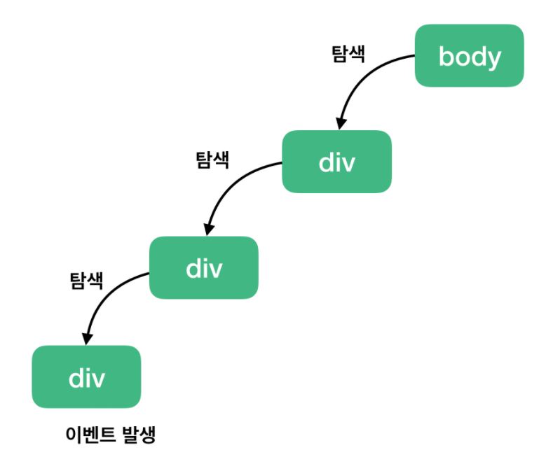
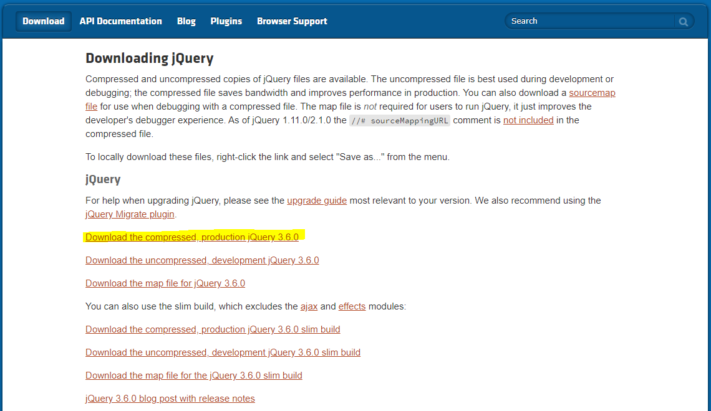

## 자바스크립트

- name : document.searchForm.searchType 
- id : document.getElementById('id이름')
- value : .value


- **DOM(Document Object Model), BOM(Brouser Object Model)**

  - DOM
    - 문서에 대한 모든 내용을 담고있는 객체. 도큐먼트에 관련 된 내용 모두
    - 문서 즉 열려진 페이지에 대한 정보를 따로 객체화 시켜서 관리함

  - BOM
    - 브라우저에 대한 모든 내용을 담고있는 객체. 브라우저에 관련 된 내용 모두
    - 뒤로가기, 북마크, 즐겨찾기, 히스토리, URL정보 등..
    - 브라우저가 가지고 있는 정보를 따로 객체화 시켜서 관리함

- 이벤트 버블링

  - 이벤트 버블링은 특정 화면 요소에서 이벤트가 발생했을 때 해당 이벤트가 더 상위의 화면 요소들로 전달되어 가는 특성을 의미한다.
  - 즉, 하위에서 상위 요소로의 이벤트 전파 방식을 **이벤트 버블링(Event Bubbling)**이라고 한다.

  

  ```html
  <!DOCTYPE html>
  <html>
  <head>
  <meta charset="UTF-8">
  <title>Insert title here</title>
  <script>
  	window.onload = function() {
  		let divTag  = document.getElementById("div01")
  		let h1Tag   = document.getElementById("h01")
  		let spanTag = document.getElementById("span01")
  		
  		divTag.onclick = function() {
  			alert('div click...')
  		}
  		
  		h1Tag.onclick = function(e) {
  			alert('h1 click...')
  			console.log(e)
  			
  			e = e || window.event
  			// 이벤트 버블링 무효화
  			e.cancelBubble = true
  		}
  		
  		spanTag.onclick = function() {
  			alert('span click...')
  		}
  	}
  </script>
  </head>
  <body>
  	<div id="div01">
  		<h1 id="h01">
  			<span id="span01">안녕하세요</span>
  		</h1>
  	</div>
  </body>
  </html>
  ```

  

- **이벤트 캡쳐(Event Capture)**

  - 이벤트 캡쳐는 이벤트 버블링과 반대 방향으로 진행되는 이벤트 전파 방식

  


- **표준이벤트 모델 DOM Level2**

  ```html
  <!DOCTYPE html>
  <html>
  <head>
  <meta charset="UTF-8">
  <title>Insert title here</title>
  <script>
  	window.onload = function() {
  		
  		// 표준이벤트 모델 DOM level2 : addEventListener(eventName, handler, useCapture), removeEventListener()
  		let btn01 = document.getElementById("btn01")
  		btn01.addEventListener('click', function() {
  			alert('btn01 click...')
  		})
  		
  		let btn02 = document.getElementById("btn02")
  		let span = document.getElementById("span01")
  		
  		btn02.addEventListener('click', function() {
  			alert('btn02 click...')
  		}, true)
  		
  		span.addEventListener('click', function() {
  			alert('span click...')
  		})
  	}
  </script>
  </head>
  <body>
  	<button id="btn01">click</button>
  	<button id="btn02"><span id="span01">click</span></button>
  </body>
  </html>
  ```


- **text box**

  ```html
  <!DOCTYPE html>
  <html>
  <head>
  <meta charset="UTF-8">
  <title>Insert title here</title>
  <script>
  	function whenSubmit() {
  		
  		let f = document.inputForm
  		
  		if(f.id.value == '') {
  			alert('아이디를 입력하세요')
  			return false
  		}
  		
  		if(f.pwd.value != f.pwdCheck.value) {
  			alert('패스워드가 서로 다릅니다')
  			return false
  		}
  			
  		return true
  	}
  </script>
  </head>
  <body>
  	<form action="exam08.html" name="inputForm" onsubmit="return whenSubmit()">
  		아이디 : <input type="text" name="id" ><br>
  		패스워드 : <input type="password" name="pwd"><br>
  		패스워드 확인 : <input type="password" name="pwdCheck" ><br>
  		<input type="submit" value="전송">
  	</form>
  </body>
  </html>
  ```

  

- **check box**

  ```html
  <!DOCTYPE html>
  <html>
  <head>
  <meta charset="UTF-8">
  <title>Insert title here</title>
  <script>
  	function showInfo() {
  		let f = document.inputForm
  		let msg = ''
  		for(let i = 0; i < f.hobby.length; i++) {
  			if(f.hobby[i].checked) {
  				msg += f.hobby[i].value + '\n'
  			}
  		}
  		alert(msg)
  	}
  	
  	function selectAll() {
  		let length = document.inputForm.hobby.length
  		
  		for(let i = 0; i < length; i++) {
  			document.inputForm.hobby[i].checked = true
  		}
  	}
  	
  	function deSelectAll() {
  		let length = document.inputForm.hobby.length
  		
  		for(let i = 0; i < length; i++) {
  			document.inputForm.hobby[i].checked = false
  		}
  	}
  	
  	function toggle(check) {
  		let length = document.inputForm.hobby.length
  		
  		for(let i = 0; i < length; i++) {
  			document.inputForm.hobby[i].checked = check
  		}
  	}
  	
  	function toggle() {
  		let hobby = document.inputForm.hobby
  		let cnt = hobby.length
  		
  		for(let i = 0; i < hobby.length && hobby[i].checked; i++) {
  			cnt --
  		}
  		
  		for(let i = 0; i < hobby.length; i++){
  			hobby[i].checked = Boolean(cnt)
  		}
  	}
  	
  </script>
  </head>
  <body>
  	<form name="inputForm">
  		당신의 취미는?<br>
  		<input type="checkbox" name="hobby" value="music">음악감상<br>
  		<input type="checkbox" name="hobby" value="movie">영화감상<br>
  		<input type="checkbox" name="hobby" value="reading">독서<br>
  		<input type="checkbox" name="hobby" value="game">게임<br>
  		<!-- <input type="button" value="전체선택" onclick="selectAll()">
  		<input type="button" value="전체해제" onclick="deSelectAll()"> -->
  		
  		<!-- <input type="button" value="전체선택" onclick="toggle(true)">
  		<input type="button" value="전체해제" onclick="toggle(false)">-->
  		
  		<input type="button" value="전체선택/해제" onclick="toggle()">
  		
  		<input type="button" value="결과보기" onclick="showInfo()">
  	</form>
  </body>
  </html>
  
  ```

  

- **select box**

  - form.searchType.value 각 option의 value값을 확인

  ```html
  <!DOCTYPE html>
  <html>
  <head>
  <meta charset="UTF-8">
  <title>Insert title here</title>
  <script type="text/javascript">
  	function checkForm() {
  		let form = document.searchForm
  		if(/*form.searchType.value = ''*/ form.searchType.selectedIndex == 0){
  			alert('옵션을 선택하세요.')
  			form.searchType.focus() //select box로 포커스가 된다.
  			return false
  		}
  		
  		let words = ['','제목','작성자']
  		
  		if(form.searchWord.value == '') {
  			//alert('검색어를 입력하세요')
  			alert('검색할 ' + words[form.searchType.selectedIndex] + '을(를) 입력하세요.')
  			form.searchWord.focus()
  			return false
  		}
  		
  		return true
  	}
  </script>
  </head>
  <body>
  	<form name="searchForm" onsubmit="return checkForm()">
  		<select name="searchType">
  			<option value="">선택하시오</option>
  			<option value="title">제목</option>
  			<option value="writer">작성자</option>
  		</select>
  		<input type="text" name="searchWord">
  		<input type="submit" value="검색">
  	</form>
  </body>
  </html>
  ```


- **계산기 만들기**

  - this 사용

  ```html
  <!DOCTYPE html>
  <html>
  <head>
  <meta charset="UTF-8">
  <title>Insert title here</title>
  <script type="text/javascript">
  	function clickBtn(data) {
  		console.log(data)
  		let moniter = document.getElementById('moniter')
  		if(data != '=') {
  			moniter.value += data
  		}else {
  			moniter.value = eval(moniter.value)			
  		}
  	}
  </script>
  </head>
  <body>
  	<input type="text" id="moniter">
  	<div>
  		<button value="1" onclick="clickBtn(this.value)">1</button> <!-- this.value 대신에 this.innerText를 사용해도 괜춘 -->
  		<button value="2" onclick="clickBtn(this.value)">2</button>
  		<button value="3" onclick="clickBtn(this.value)">3</button>
  		<button value="4" onclick="clickBtn(this.value)">4</button>
  		<button value="5" onclick="clickBtn(this.value)">5</button>
  		<button value="6" onclick="clickBtn(this.value)">6</button>
  		<button value="7" onclick="clickBtn(this.value)">7</button>
  		<button value="8" onclick="clickBtn(this.value)">8</button>
  		<button value="9" onclick="clickBtn(this.value)">9</button>
  		<button value="0" onclick="clickBtn(this.value)">0</button>
  		<button value="+" onclick="clickBtn(this.value)">+</button>
  		<button value="-" onclick="clickBtn(this.value)">-</button>
  		<button value="*" onclick="clickBtn(this.value)">*</button>
  		<button value="%" onclick="clickBtn(this.value)">%</button>
  		<button value="=" onclick="clickBtn(this.value)">=</button>
  	</div>                        
  </body>
  </html>
  ```


## jquery

- **jquery download**

  - https://jquery.com/
  - Download jQuery

  

  

  - Download the compressed, production jQuery 3.6.0

  
  
  
  
  - 오른쪽 마우스 클릭 > 다른 이름으로 저장
  
  
  
  
  
  - jquery > js 폴더에 저장
  
  
  
  
  
  - https://jquery.com/
  
  
  
  
  
  - minified 선택
  
  
  
  
  
  - copy
  
  
  
  
  
  - 붙여넣기
  
  


- $(document).ready()와 window.onload 차이점

  - **$(document).ready()**

    - 외부 리소스. 이미지와는 상관 없이 브라우저가 DOM (document object model) 트리를 생성한 직후 실행
    - window.load() 보다 더 빠르게 실행되고 중복 사용하여 실행해도 선언한 순서대로 실행 됨

  - **$(window).load()**

    - DOM의 standard 이벤트
    - html의 로딩이 끝난 후에 시작
    - 화면에 필요한 모든 요소(css, js, image, iframe etc..)들이 웹 브라우저 메모리에 모두 올려진 다음에 실행됨
    - 화면이 모두 그려진 다음의 메세징이나 이미지가 관련 요소가 모두 올려진 다음의 애니메이션에 적합함
    - 전체 페이지의 모든 외부 리소스와 이미지가 브러우저에 불려오고 그 이후 작동하게 되어 이미지가 안뜨너가 딜레이가 생길 때에는 그만큼의 시간을 기다려야 함
    - **외부 링크나 파일 인크루트시 그 안에 window.load 스크립트가 있으면 둘 중 하나만 적용됨**
    - body onload 이벤트와 같이 body에서 onload 이벤트를 쓰게 되면 모든 window.load() 가 실행되지 않는 현상이 발생함

  -  **window > document**

    - document는 window의 자식 객체

       (window의 자식 객체 : document, self, navigator, screen, forms, history, location etc..)

    - document : html의 요소들이나 속성들에 접근할 시 사용하는 객체


- **jquery와 javascript의 차이점**

  - **jquery 배열**

  

  

  - **javascript 배열**

    - S.fn.init()이 들어가지 않으면 자바스크립트 배열이다.

  - 자바스크립트 배열과 제이쿼리 배일의 문법이 다르다.

    - 위 : jqeury

    

  

- **jqueryui**

  - https://jqueryui.com/
  - ui를 사용하기 위하여 스크립트 추가

  ```html
  <script src="https://code.jquery.com/ui/1.12.1/jquery-ui.js"></script>
  ```

  ```html
  <!DOCTYPE html>
  <html>
  <head>
  <meta charset="UTF-8">
  <title>Insert title here</title>
  <script src="js/jquery-3.6.0.min.js"></script>
  <script src="https://code.jquery.com/ui/1.12.1/jquery-ui.js"></script>
  <script type="text/javascript">
  	$(document).ready(function(){
  		alert('!!!')
  		//$('ul li').hide()
  		//$('ul li:first').hide() //호랑이만 들어간다.
  		//ul li이면 전체의 ul들이 모두 모여서 하나의 배열로 들어간다.
  		//그래서 호랑이만 지워지는 것임
  		
  		//$('ul li:first-child').hide() //그룹별로 첫 번째 데이터
  		//$('ul li:last-child').hide() //그룹별로 마지막 데이터
  		
  		//속성
  		//속성은 []로 접근
  		//target 속성을 가지고 있는 것 숨기기
  		//$('a[target]').hide()
  		//$('a[href="http://www.naver.com"]').hide()
  		
  		//버튼
  		//input tag 중에서 타입이 button인 애 지우기
  		//$('input[type="button"]').hide()
  		//$('input:button').hide() //위와 같은 의미
  		
  		//$(':button').hide() //타입이 버튼인 애들 지우기
  		//버튼 1과 버튼 2가 모두 지워진다.
  		
  		//$('button').hide() //버튼 2가 지워진다.
  		
  		//click 이벤트
  		//어떤 버튼이든 클릭했다면
  		$(':button').click(function(){
  			//$('h2').hide()
  			//this는 클릭을 당한 대상
  			console.log($(this)) //jquery -> S.fn.init [input]
  			//console.log(this) //javascript -> <button>버튼2</button>
  			//$(this).hide()
  			$(this).hide('Explode')
  		}) 
  	})	
  	
  </script>
  
  </head>
  <body>
  	<h2>button 전</h2>
  	<input type="button" value="버튼1">
  	<button>버튼2</button>
  	<h2>button 후</h2>
  	
  	<h2>a Tag 전</h2>
  	<a href="http://www.naver.com">네이버</a>
  	<a href="http://wwww.daum.com" target="_blank">다음</a>
  	<h2>a Tag 후</h2>
  	
  	<h1>동물종류</h1>
  	<ul>
  		<li>호랑이</li>
  		<li>늑대</li>
  		<li>코끼리</li>
  		<li>여우</li>
  	</ul>
  	
  	<h1>음식종류</h1>
  	<ul>
  		<li>김밥</li>
  		<li>햄버거</li>
  		<li>부대찌개</li>
  		<li>초밥</li>
  	</ul>
  </body>
  </html>
  ```
  
  

