## jQuery

- **실습 - parent, parents**

  - parent : 상위 요소만
  - parents : 상위에 있는 모든 요소 

  ```html
  <!DOCTYPE html>
  <html>
  <head>
  <meta charset="UTF-8">
  <title>Insert title here</title>
  <style>
  	#ancester * {
  		display: block;
  		border: 2px solid red;
  		margin: 10px;
  		padding: 10px;
  	}
  </style>
  <script src="js/jquery-3.6.0.min.js"></script>
  <script>
  	$(document).ready(function() {
  		// $('span').parent().css('border-color', 'blue')
  		// $('span').parent().parent().css('border-color', 'blue')
  		// $('span').parents().css('border', '2px solid blue') //span 태그의 모든 조상들 
  		//$('span').parents('div').css('border', '2px solid blue') span태그 조상들 중에서 div인 것만
  		//$('span').parentsUntil('div').css('border-color', 'blue') //span태그 조상들 중에서 div가 나오기 전까지 (div 포함x)
  		//$('#ancester').children().css('border-color','blue') //ancester의 자식만 찾는 것임
  		//$('#ancester').children('#div02').css('border-color','blue') //abcester의 자식 중에서 div02인 아이디를 가진 자식만 변경
  		//$('#ancester').children('ul').css('border-color','blue') //children은 바로 아래의 후손만
  		//$('#ancester').find('ul').css('border-color','blue')
  		$('#ancester').find('span').last().css('border-color', 'blue') //ul 중에서 마지막 거
  	})
  </script>
  </head>
  <body>
  	<div id="ancester">
  		<div id="div01">div01
  			<ul>ul
  				<li>li
  					<span>span</span>
  				</li>
  			</ul>
  		</div>
  		<div id="div02">div02
  			<p>p
  				<span>span</span>
  			</p>
  		</div>
  	</div>
  
  </body>
  </html>
  ```


- **실습**

  ```html
  <!DOCTYPE html>
  <html>
  <head>
  <meta charset="UTF-8">
  <title>Insert title here</title>
  <style>
  	img {
  		width: 200px;
  		height: 200px;
  	}
  </style>
  <script src="js/jquery-3.6.0.min.js"></script>
  <script>
  	$(document).ready(function() {
  		
  		$('button').click(function(){
  			//$('body').append('')
  			//$('img').first().appendTo('body') //이미지의 맨 처음을 잘라서 body에 붙이기(즉, 맨 처음이 맨 뒤로 감)
  			$('img').last().prependTo('body')
  		})
  		
  	})
  </script>
  </head>
  <body>
  	
  	
  	
  	
  	<br><br>
  	<button>클릭</button>
  </body>
  </html>
  ```


- **실습**

  ```html
  <!DOCTYPE html>
  <html>
  <head>
  <meta charset="UTF-8">
  <title>Insert title here</title>
  <style>
  	button {
  		width: 100px;
  		height: 200px;
  		float: left;
  	}
  	img {
  		width: 200px;
  		height: 200px;
  		float: left;
  	}
  </style>
  <script src="js/jquery-3.6.0.min.js"></script>
  <script>
  	$(document).ready(function() {
  		$('#prev').click(function(){
  			$('img').first().appendTo('span')
  		})
  		
  		$('#next').click(function(){
  			$('img').last().prependTo('span')
  		})
  		
  		setInterval(function(){
  			$('#next').trigger('click')
  		},0.00000000000000000000000000001)
  	})
  </script>
  </head>
  <body>
  		<button id="prev">pre</button>
  		<span id="gallary">
  				
  				
  				
  				
  		</span>
  		<button id="next">next</button>
  </body>
  </html>
  ```


- **실습**

  - 박스 슬라이드

  ```html
  <!DOCTYPE html>
  <html>
  <head>
  <meta charset="UTF-8">
  <title>Insert title here</title>
  <link rel="stylesheet" href="https://cdn.jsdelivr.net/bxslider/4.2.12/jquery.bxslider.css">
  <script src="https://ajax.googleapis.com/ajax/libs/jquery/3.1.1/jquery.min.js"></script>
  <script src="https://cdn.jsdelivr.net/bxslider/4.2.12/jquery.bxslider.min.js"></script>
  <script type="text/javascript">
  	$(document).ready(function(){
  		$('.slider').bxSlider({
  			captions : true,
  			slideWidth : 400,
  			auto : true,
  			autoControls: true,
  		    stopAutoOnClick: true,
  		    mode : 'vertical'
  				    
  	    })
  	})
  </script>
  
  </head>
  <body>
  	<div class="slider">
  		<div></div>
  		<div></div>
  		<div></div>
  		<div></div>
  	</div>
  </body>
  </html>
  ```


## Servlet

- **서블릿의 이해**
  - 자바 플랫폼에서 컴포넌트 기반의 웹 애플리케이션 개발 기술
  - JSP는 서블릿 기술에 기반함
  - 서블릿의 프리젠테이션 문제를 해결하기 위해 JSP가 등장
  - JSP 모델2가 주목받으며 다시 서블릿에 대한 중요성 부각


- **서블릿 변천**
  - 서블릿 문제점 대두
    - 프로그램에서 HTML 핸들링 컨텐츠와 비즈니스 로직이 분리되지 안흥ㅁ
    - 개발과 관리의 어려움
  - JSP 등장
    - HTML에서 프로그램 핸들링이 가능
      - JSP 스크립팅 기술
  - JSP 스크립트 기술의 한계 
    - HTML에서 프로그램 핸들링
    - 컨텐츠와 비즈니스 로직이 분리되지 않음
    - 컨텐츠 과닐는 쉬워졌지만 프로그램 관리는 이전보다 더 복잡해짐
  - MVC 패턴 주목받기 시작
    - 애플리케이션 구성 요소 단위로 역할 분담
    - 모델 : 자바 클래스 (DAO,VO)
    - 뷰 : JSP(JSTL, EL)


- **서블릿 API**
  - 웹에서 동작하는 서블릿 클래스가 되기 위해서는 다음 3가지 클래스 중 하나를 상속 받아서 작성
    - Servlet : 인터페이스
    - GenericServlet : 추상클래스
    - HttpServlet : 추상클래스
      - 대부분의 사용자 정의 서브릿 클래스는 HttpServlet 클래스를 상속받아 구현


- **서블릿 생명주기**

  - JSP 페이지도 결국은 Servlet이기 때문에 아래와 같은 생명 주기를 갖는다.
  - 서블릿 클래스는 기본적인 메소드 호출 순서(LifeCycle)가 존재
  - 요청이 오면, Servlet 클래스가 로딩되어 요청에 대한 **Servlet 객체가 생성**된다.
  - 서버는 init() **메소드를** 호출해서 **Servlet을  초기화** 한다.
    - init : 최초 한 번만 실행
      - 서블릿에 대한 환경설정
      - 하나의 서블릿 당 하나만 호출

  - service() 메소드를 호출해서 Servlet이 **브라우저의 요청을 처리**하도록 한다.
    - service : 사용자 요청에 대한 실제 응답 처리 진행

  - service() 메소드는 특정 **HTTP 요청(GET, POST 등)을 처리**하는 메서드 (doGet(), doPost() 등)를 호출한다.
  - 서버는 destroy() 메소드를 호출하여 **Servlet을 제거**한다.
    - destroy : 메모리에서 해제딜 경우 호출(예 ) 서블릿 내용이 변경, 서버 재구동... )
  - init > service > destroy 

  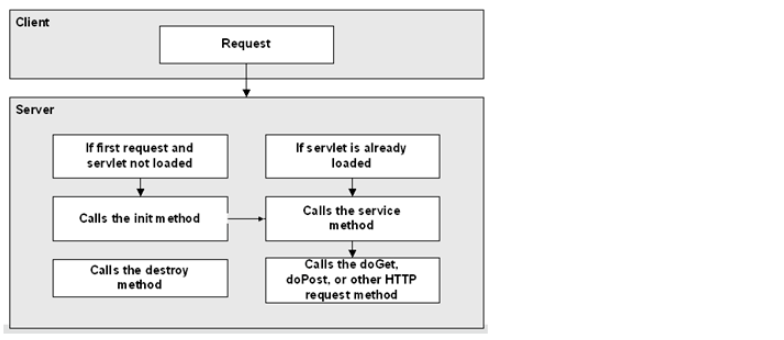


- **톰캣은 Servlet을 다음과 같이 관리**

  - Servlet 객체를 생성하고 초기화하는 작업은 비용이 많은 작업이므로, 다음에 또 요청이 올 때를 대비하여 이미 생성된 Servlet 객체는 메모리에 남겨놓는다.

  - 또 톰캣이 종료되기 전이나 reload 전에 모든 Servlet을 제거하게 된다.
  - 이렇게 톰캣은 자원을 아끼면서 Servlet을 사용하고 있다.


- **서블릿 실습**

  - **class 생성**

  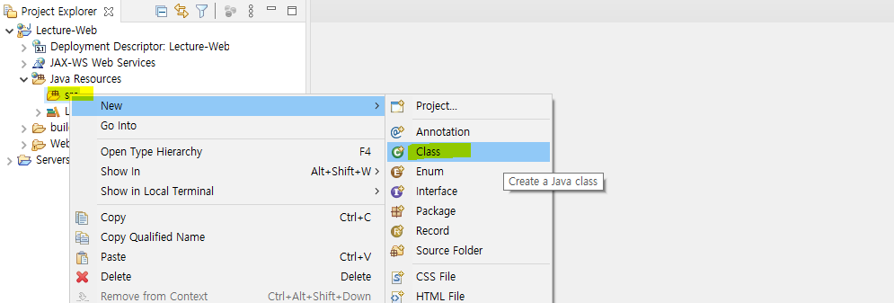

  

  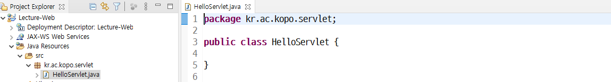

  

  - 만약 HttpServlet import가 되지 않을 때는?

    - tomcat 폴더에 lib 폴더로 들어가서 servlet-api.jar를 찾는다.

    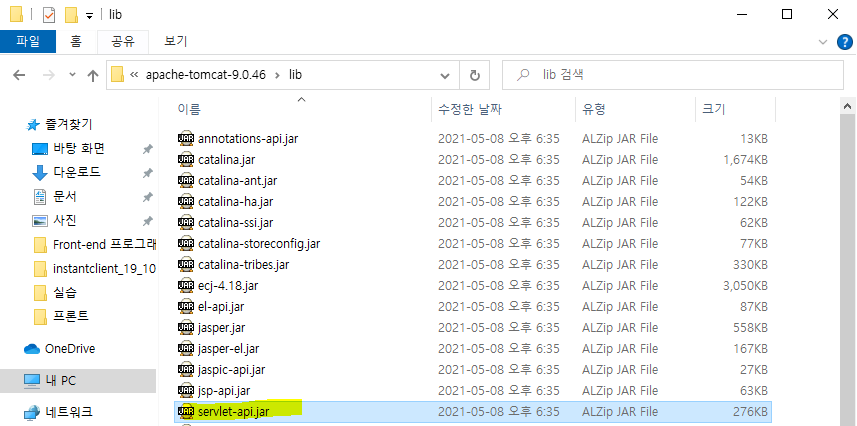

    

    - 프로젝트 lib 폴더에 jar 파일을 copy

    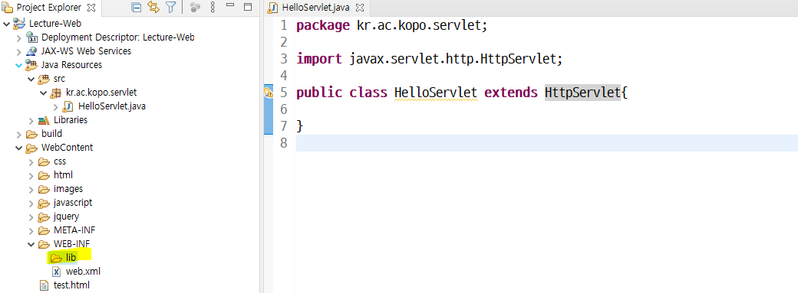

    

  - 저장버튼을 누르면 자동으로 import 하기 설정

  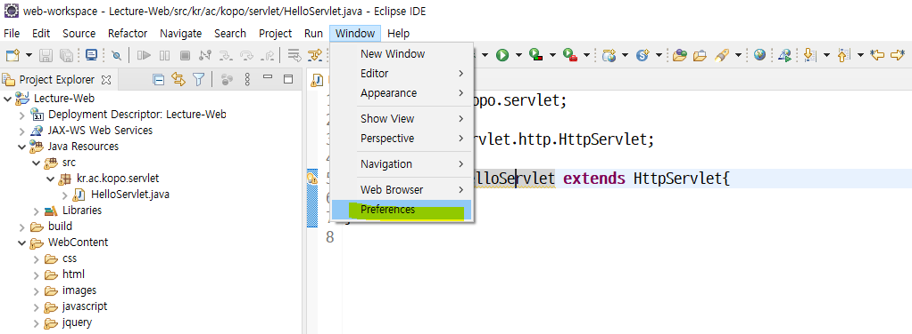

  

  - java > Editor > save actions > perform the selected action on sava > organize import 선택 

  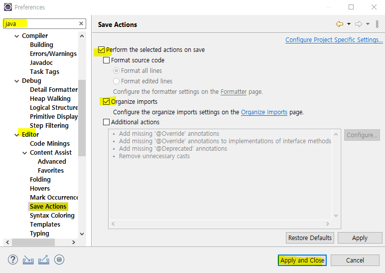

  

  - HttpServlet의 기본 메소드 작성

  ```java
  package kr.ac.kopo.servlet;
  
  import java.io.IOException;
  
  import javax.servlet.ServletConfig;
  import javax.servlet.ServletException;
  import javax.servlet.http.HttpServlet;
  import javax.servlet.http.HttpServletRequest;
  import javax.servlet.http.HttpServletResponse;
  
  public class HelloServlet extends HttpServlet{
  	
  	//init 메소드
  	@Override
  	public void init(ServletConfig config) throws ServletException {
  		System.out.println("최초 한 번만 실행되는 메소드입니다.");
  	}
  	
  	//service 메소드 
  	@Override
  	public void service(HttpServletRequest request, HttpServletResponse response) 
  			throws ServletException, IOException{
  		System.out.println("service() : 실제 작업이 실해오디는 메소드입니다.");
  		System.out.println("사용자가 요청할 때마다 호출되는 메소드입니다.");
  	}	
  }
  ```

  

  - **!!!!!web.xml에 서블릿 등록!!!!!!**

    - 서블릿은 보안이 적용되어 있는 WEB-INF/classes 폴더에 있으므로 직접 접근이 불가능하다.**(웹 url에서 직접 호출 불가능 > 그래서 가상의 url을 사용)**
    - 그래서 서블릿을 web.xml에 등록하여 서버에서 특정한 경로를 맵핑하여 호출

    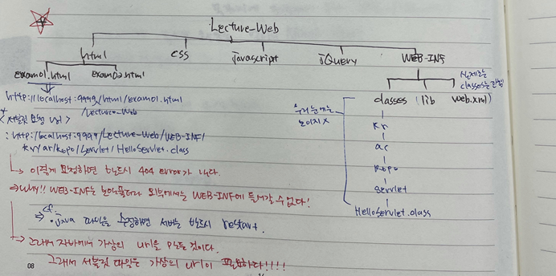

    - 서블릿의 여러 개 있을 수 있으므로 서블릿에 있는 네임과 servlet-mapping의 서블릿 네임을 매핑
      - HelloServlet 뒤에 확장자를 붙여주지 않고 작성한다.
      - url-pattern은 가상의 url 주소임
      - url을 여러 개 작성해도 된다.

    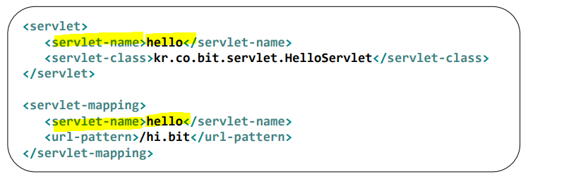

    ```xml
    <?xml version="1.0" encoding="UTF-8"?>
    <web-app xmlns:xsi="http://www.w3.org/2001/XMLSchema-instance" xmlns="http://xmlns.jcp.org/xml/ns/javaee" xsi:schemaLocation="http://xmlns.jcp.org/xml/ns/javaee http://xmlns.jcp.org/xml/ns/javaee/web-app_3_1.xsd" id="WebApp_ID" version="3.1">
      <display-name>Lecture-Web</display-name>
      <servlet>
      	<servlet-name>hello</servlet-name>
      	<servlet-class>kr.ac.kopo.servlet.HelloServlet</servlet-class>
      </servlet>
      <servlet-mapping>
      	<servlet-name>hello</servlet-name>
      	<url-pattern>/hello</url-pattern>
      </servlet-mapping>
        
      <servlet-mapping>
      	<servlet-name>hello</servlet-name>
      	<url-pattern>/hi</url-pattern>
      </servlet-mapping>
      
      <welcome-file-list>
        <welcome-file>index.html</welcome-file>
        <welcome-file>index.htm</welcome-file>
        <welcome-file>index.jsp</welcome-file>
        <welcome-file>default.html</welcome-file>
        <welcome-file>default.htm</welcome-file>
        <welcome-file>default.jsp</welcome-file>
      </welcome-file-list>
    </web-app>
    ```

    - 그러고 난 다음에 http://localhost:9999/Lecture-Web/hello 주소로 접근 가능
      - **!!!!!!!cf. xml 파일에서의 /는 http://localhost:9999/Lecture-Web/까지!!!!!!!** 
        - xml과 include, forward만 /의 의미가 다름
        - **!!!!!!!나머지는 http://localhost:9999/ 까지를 의미한다.!!!!!!!**
        - ex) <  img src="/images" >
    - init과 service 메소드 호출

    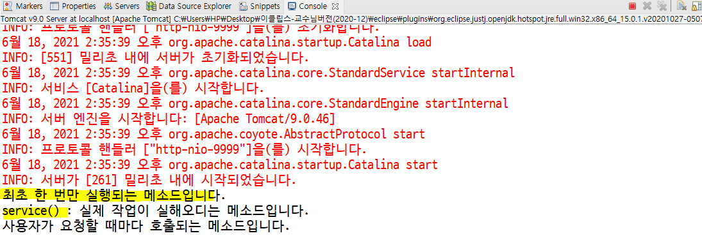

    

    - 새로고침 후 콘솔 확인
      - service 메소드만 실행된 것을 확인할 수 있다.

    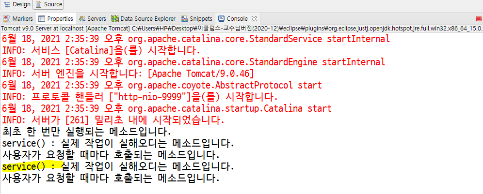

    

  - init 주석 처리 후 실행해도 실행 됨
    - 추상클래스에 이미 작성이 되어 있으므로
  - 그러나 service를 주석처리하고 실행하면 error(405 error)
    - url은 갔지만 요청 응답을 처리하는 메소드(service)가 없다는 것임

  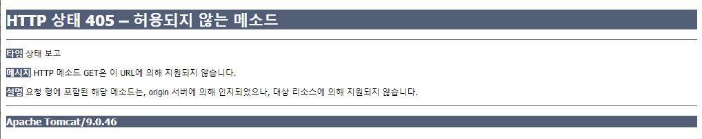


- **get과 post 차이**

  - GET 과 POST 는 HTTP 메서드로 클라이언트에서 서버로 무언가를 요청할 때 사용한다. 
  - service는 get과 post 모두 처리
  - 그러나 서블릿에서 서비스 대신에 doGet, doPost를 만들었으면 각각의 요청 방식에 따라서 처리한다.
    - form 태그에 method="post"를 사용하지 않으면 모두 get 방식
    - cf. doget() , dopost()  를할때 둘다 시작할때 doprocess(); 를 만들어서 get 이든 post 이든 한 메소드를 태워서 하나에서 처리하는게 좋음.

  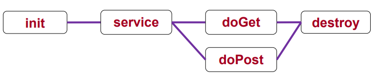

  - **get방식** 

    -  GET 은 클라이언트에서 서버로 어떠한 리소스로 부터 정보를 요청하기 위해 사용되는 메서드이다.

    - GET을 통한 요청은 URL 주소 끝에 파라미터로 포함되어 전송되며, 이 부분을 **쿼리 스트링 (query string)** 이라고 부른다.

      - 쿼리 스트링은 url에 나오지 않음 

      방식은 URL 끝에 " ? " 를 붙이고 그다음 변수명1=값1&변수명2=값2... 형식으로 이어 붙이면 된다.

      

  - **get의 특징**
    - GET 요청은 캐시가 가능하다. 
    - GET을 통해 서버에 리소스를 요청할 때 웹 캐시가 요청을 가로채 서버로부터 리소스를 다시 다운로드하는 대신 리소스의 복사본을 반환한다. HTTP 헤더에서 cache-control 헤더를 통해 캐시 옵션을 지정할 수 있다.
    - GET 요청은 브라우저 히스토리에 남는다.
    - GET 요청은 북마크 될 수 있다.
    - GET 요청은 길이 제한이 있다.
      - GET 요청의 길이 제한은 표준이 따로 있는건 아니고 브라우저마다 제한이 다르다고 한다. 
    - GET 요청은 중요한 정보를 다루면 안된다. ( 보안 )
      - GET 요청은 파라미터에 다 노출되어 버리기 때문에 최소한의 보안 의식이라 생각하자.
    - GET은 데이터를 요청할때만 사용 된다.

  

  - **post방식**
    -  POST는 클라이언트에서 서버로 리소스를 생성하거나 업데이트하기 위해 데이터를 보낼 때 사용 되는 메서드다.
    - POST는 전송할 데이터를 HTTP 메시지 body 부분에 담아서 서버로 보낸다. ( body 의 타입은 Content-Type 헤더에 따라 결정 된다.)
    - GET에서 URL 의 파라미터로 보냈던 name1=value1&name2=value2 가 body에 담겨 보내진다 생각하면 된다.
    - POST 로 데이터를 전송할 때 길이 제한이 따로 없어 용량이 큰 데이터를 보낼 때 사용하거나 GET처럼 데이터가 외부적으로 드러나는건 아니라서 보안이 필요한 부분에 많이 사용된다. 
    - POST를 통한 데이터 전송은 보통 HTML form 을 통해 서버로 전송된다. 
  - **post의 특징**
    - POST 요청은 캐시되지 않는다.
    - POST 요청은 브라우저 히스토리에 남지 않는다.
    - POST 요청은 북마크 되지 않는다.
    - POST 요청은 데이터 길이에 제한이 없다.
  - post와 get의 차이점 
    - **사용목적** : GET은 서버의 리소스에서 데이터를 요청할 때, POST는 서버의 리소스를 새로 생성하거나 업데이트할 때 사용한다. DB로 따지면 GET은 SELECT 에 가깝고, POST는 Create 에 가깝다고 보면 된다.
    - **요청에 body 유무** : GET 은 URL 파라미터에 요청하는 데이터를 담아 보내기 때문에 HTTP 메시지에 body가 없다. POST 는 body 에 데이터를 담아 보내기 때문에 당연히 HTTP 메시지에 body가 존재한다.
    - **멱등성 (idempotent)** : GET 요청은 멱등이며, POST는 멱등이 아니다.

  > https://noahlogs.tistory.com/35


- 실습

  - method.html 파일

  ```html
  <!DOCTYPE html>
  <html>
  <head>
  <meta charset="UTF-8">
  <title>Insert title here</title>
  </head>
  <body>
  	<form action="/Lecture-Web/method"> <!-- '/'는 http://localhost:9999 -->
  		아이디 : <input type="text" name="id">
  		<input type="submit" value="get()방식 호출"> 
  	</form>
  </body>
  </html>
  ```

  - MethodServlet.java

  ```java
  package kr.ac.kopo.servlet;
  
  import java.io.IOException;
  import java.io.PrintWriter;
  
  import javax.servlet.ServletException;
  import javax.servlet.http.HttpServlet;
  import javax.servlet.http.HttpServletRequest;
  import javax.servlet.http.HttpServletResponse;
  
  public class MethodServlet extends HttpServlet{
  	
  	// GET http://localhost:9999/Lecture-Web/method?id=aaa
  	@Override
  	public void doGet(HttpServletRequest request, HttpServletResponse response) 
  			throws ServletException, IOException {
  		
  		System.out.println("doGet() 호출....");
  		
  		String method = request.getMethod();
  		StringBuffer url = request.getRequestURL(); //url 값 가져오기
  		String uri = request.getRequestURI(); //uri 
  		
  		System.out.println("url : " + url.toString());  //http://localhost:9999/Lecture-Web/method
  		System.out.println("uri : " + uri); ///Lecture-Web/method
  		System.out.println("method : " + method); //GET
  		
  		
  		String id = request.getParameter("id"); //return값은 무조건 String
  		System.out.println("id : " + id);
  		
  		//client에게 응답
  		response.setContentType("text/html; charset=utf-8"); //text 중에서 html 문서를 넘긴다는 정보를 담음
  		PrintWriter out = response.getWriter();
  		out.println("<html>");
  		out.println("	<head>");
  		out.println("		<title> 메소드 호출방식 </title>");
  		out.println("	</head>");
  		out.println("	<body>");
  		out.println("======================================================<br>");
  		out.println("&nbsp;&nbsp;&nbsp;&nbsp;&nbsp;요 청 결 과 <br>");
  		out.println("======================================================<br>");
  		out.println("파라미터(id) : " + id + "<br>");
  		out.println("요청 방식 : " + method + "<br>");
  		out.println("요청 uri : " + uri);
  		out.println("======================================================<br>");
  		out.println("	</body>");
  		out.println("<html>");
  		
  		
  		out.flush();
  		out.close();
  		
  	}
  }
  ```

  - web.xml

  ```xml
  <?xml version="1.0" encoding="UTF-8"?>
  <web-app xmlns:xsi="http://www.w3.org/2001/XMLSchema-instance" xmlns="http://xmlns.jcp.org/xml/ns/javaee" xsi:schemaLocation="http://xmlns.jcp.org/xml/ns/javaee http://xmlns.jcp.org/xml/ns/javaee/web-app_3_1.xsd" id="WebApp_ID" version="3.1">
    <display-name>Lecture-Web</display-name>
    <servlet>
    	<servlet-name>method</servlet-name>
    	<servlet-class>kr.ac.kopo.servlet.MethodServlet</servlet-class>
    </servlet>
    <servlet-mapping>
    	<servlet-name>method</servlet-name>
    	<url-pattern>/method</url-pattern>
    </servlet-mapping>
    
    <welcome-file-list>
      <welcome-file>index.html</welcome-file>
      <welcome-file>index.htm</welcome-file>
      <welcome-file>index.jsp</welcome-file>
      <welcome-file>default.html</welcome-file>
      <welcome-file>default.htm</welcome-file>
      <welcome-file>default.jsp</welcome-file>
    </welcome-file-list>
  </web-app>
  ```

  - http://localhost:9999/Lecture-Web/method 실행하면 getGet()호출
    - form method="host"를 설정하지 않으면 get 방식으로 실행(디폴트 get)


