## DB와 DBMS의 차이

- **데이터베이스의 정의**
  - 하나의 조직이나 회사에서 다양한 응용 프로그램들이 공동으로 사용하는 데이터들을 통합해서 저장하고 운영하는 데이터의 집합
  - 여러 응용 시스템(프로그램)들의 통합된 정보들을 저장하여 운영할 수 있는 공용(share) 데이터의 집합
  - 효율적으로 저장, 검색, 갱신할 수 있도록 데이터 집합들끼리 연관시키고 조직화되어야 한다.
  - 기능이나 구조를 나타내는 추상적인 개념

- **데이터베이스의 특정**

  - 실시간 접근성(Real-time Accessability)
    \- 사용자의 요구(Query)를 실시간 처리 및 응답할 수 있다.

  - 계속적인 변화(Continuous Evolution)
    \- 정확한 값을 유지하려고 삽입·삭제·수정(갱신) 등의 동적인 작업을 통해 데이터를 지속적으로 갱신할 수 있다.

  - 동시 공유성(Concurrent Sharing)
    \- 사용자마다 서로 다른 목적으로 사용하므로 여러 사용자가 동일한 데이터 동시에 접근 및 이용할 수 있다.

  - 내용 참조(Content Reference)
    \- 저장한 데이터 레코드의 위치나 주소가 아닌 사용자가 요구하는 데이터의 내용, 즉 데이터 값에 따라 참조할 수 있어야 한다.

- **데이터베이스 관리 시스템 (Database Management System, DBMS)**
  - 데이터베이스를 생성 및 관리하며 응용 프로그램들이 데이터 베이스를 공유하며 사용할 수 있는 환경을 제공하는 소프트웨어
  - 데이터와 응용 프로그램 사이를 중계 (DB<-DBMS->응용프로그램)
  - 데이터베이스를 직접 응용 프로그램들이 조작하지 않고 DBMS를 통해 조작, 관리한다.
  - 여러 응용 소프트웨어(프로그램) 또는 시스템이 동시에 데이터베이스에 접근하여 사용할 수 있게 한다
  - 필수 3기능
    \- 정의기능 :  데이터 베이스의 논리적, 물리적 구조를 정의
    \- 조작기능 : 데이터를 검색, 삭제, 갱신, 삽입, 삭제하는 기능
    \- 제어기능 :  데이터베이스의 내용 정확성과 안전성을 유지하도록 제어하는 기능
  - Oracle, SQL Server, MySQL, DB2 등의 상용 또는 공개 DBMS가 있다.

- **DBMS 장/단점**
  - 장점
    - 데이터 중복 최소화
    - 데이터의 일관성 및 무결성 유지 
    - 데이터 보안 보장
  - 단점
    - 운영비가 비싸다
    - 백업 및 복구에 대한 관리 복잡
    - 부분적 데이터베이스 손실이 전체 시스템을 정지

## IPO(Input Processing Output)

## DevOps 

- **개념**

  소프트웨어의 개발(Development)과 운영(Operations)의 합성어로서, 소프트웨어 개발자와 정보기술 전문가 간의 소통, 협업 및 통합을 강조하는 개발 환경이나 문화를 말한다. 데브옵스는 소프트웨어 개발조직과 운영조직간의 상호 의존적 대응이며 조직이 소프트웨어 제품과 서비스를 빠른 시간에 개발 및 배포하는 것을 목적으로 한다. 

  - 이러한 빠른 속도를 통해 조직은 고객을 더 잘 지원하고 시장에서 좀 더 효과적으로 경쟁할 수 있습니다.

  > 위키백과

- **작동 방식**

DevOps 모델에서는 개발팀과 운영팀이 더 이상 "사일로"에 묶여 있지 않습니다. 때로는 이 두 팀이 단일팀으로 병합되어 엔지니어가 개발에서 테스트, 배포, 운영에 이르기까지 전체 애플리케이션 수명 주기에 걸쳐 작업하고 단일 기능에 한정되지 않은 광범위한 기술을 개발합니다.

일부 DevOps 모델에서 품질 보증팀과 보안팀 또한 애플리케이션 수명 주기에 걸쳐 개발 및 운영과 좀 더 긴밀하게 통합됩니다. DevOps 팀 전체가 보안을 중점으로 두는 경우 때때로 DevSecOps라고 불립니다.

이러한 팀에서는 DevOps 방식을 사용하여 속도가 느리고 수동으로 수행되던 프로세스를 자동화합니다. 또한, 애플리케이션을 안정적으로 빠르게 운영하고 개선하는 데 도움이 되는 기술 스택과 도구를 사용합니다. 이러한 도구 덕분에 엔지니어는 이전 같았으면 다른 팀의 도움이 필요했을 코드 배포 또는 인프라 프로비저닝과 같이 작업을 독립적으로 수행할 수 있으며, 따라서 팀의 작업 속도가 더욱 빨라집니다.

- **장점**

  - 속도

    작업 속도가 빨라지므로 고객을 위해 더 빠르게 혁신하고, 시장 변화에 더 잘 적응하고, 좀 더 효율적으로 비즈니스 성과를 창출할 수 있습니다. DevOps 모델을 사용하면 개발자와 운영팀이 이러한 성과를 실현할 수 있습니다. 예를 들어 마이크로 서비스와 지속적 전달을 사용하면 팀에서 서비스를 주도적으로 운영하여 업데이트를 좀 더 빠르게 릴리스할 수 있습니다.

  - 신속한 제공

    릴리스의 빈도와 속도를 개선하여 제품을 더 빠르게 혁신하고 개선할 수 있습니다. 새로운 기능의 릴리스와 버그 수정 속도가 빨라질수록 고객의 요구에 더 빠르게 대응하여 경쟁 우위를 강화할 수 있습니다. 지속적 통합과 지속적 전달은 빌드에서 배포까지 소프트웨어 릴리스 프로세스를 자동화하는 방식입니다.

  - 안전성

    최종 사용자에게 지속적으로 긍정적인 경험을 제공하는 한편 더욱 빠르게 안정적으로 제공할 수 있도록 애플리케이션 업데이트와 인프라 변경의 품질을 보장합니다. 지속적 통합 및 지속적 전달과 같은 방식을 사용하여 각 변경 사항이 제대로 작동하며 안전한지 테스트합니다. 모니터링과 로깅 방식을 통해 실시간으로 성능에 대한 정보를 얻을 수 있습니다.

  - 확장

    규모에 따라 인프라와 개발 프로세스를 운영 및 관리합니다. 자동화와 일관성이 지원되므로 위험을 줄이면서 복잡한 시스템 또는 변화하는 시스템을 효율적으로 관리할 수 있습니다. 예를 들어 코드형 인프라를 사용하면 개발, 테스트 및 프로덕션 환경을 반복 가능하고 좀 더 효율적인 방식으로 관리할 수 있습니다.

  - 협업 강화

    주인의식 및 책임과 같은 가치를 강조하는 DevOps 문화 모델에서 좀 더 효과적인 팀을 구축합니다. 개발자와 운영팀은 긴밀하게 협력하고, 많은 책임을 공유하며, 워크플로를 결합합니다. 이를 통해 비효율성을 줄이고 시간을 절약합니다(예: 개발자와 운영팀 간의 인도 기간 단축, 실행되는 환경을 고려한 코드 작성 등).

  - 보안

    제어를 유지하고 규정을 준수하면서 신속하게 진행할 수 있습니다. 자동화된 규정 준수 정책, 세분화된 제어 및 구성 관리 기술을 사용함으로써 보안을 그대로 유지하면서 DevOps 모델을 도입할 수 있습니다. 예를 들어 코드형 인프라와 코드형 정책을 사용하면 규모에 따라 규정 준수를 정의하고 추적할 수 있습니다.

- 프로젝트 관리, 품질관리, SW 아키텍트

- sql 4가지 특징
  - 비절차적 언어
  - 

## PL/SQL 

- 사용이유 
  - 생산성 향상
    - 개발
    - 운영, 유지보수
  - 성능 품질 향상 

## Pro*C

## SDLC(Software Development Life Cycle)

- 개념

  소프트웨어 개발부터 폐기까지 전 과정을 하나의 생명주기로 정의하고 단계 별 공정을 체계화 한 모델

- SDLC의 특징

|      특징       |                      내용                      |
| :-------------: | :--------------------------------------------: |
| 효율적 자원사용 |   프로젝트 비용의 산정, 일정 계획 수립 지원    |
|  산출물 표준화  |  용어, 산출물 등 일관성 있도록 산출물 표준화   |
|  프로젝트 관리  | 원활한 프로젝트 수행을 위한 프로젝트 관리 지원 |

- SDLC의 구성도

  타당성 조사, 분석, 설계, 개발, 테스트, 유지보수, 폐기 단계별로 구성된 요구사항이 시스템의 운영에 효과적으로 사용되기 위한 SW 생명주기

- **SDLC의 구성요소**

|     **구분**      |                           **내용**                           |
| :---------------: | :----------------------------------------------------------: |
|     **계획**      |    시스템이 갖추어야 할 기능 파악 및 비즈니스 타당성 검토    |
|     **분석**      |         사용자의 요구사항을 구체적으로 분석하고 파악         |
|     **설계**      |   시스템 골격을 형성하는 모듈간의 구조 및 인터페이스 설계    |
|     **구현**      |      정해진 설계 내용을 프로그래밍 언어로 표현하는 단계      |
|    **테스트**     |     실행 프로그램의 오류를 발견하고 수정하는 테스트 단계     |
| **운영/유지보수** | 사용자가 직접 운영하고 운영 시 발생 가능한 문제점을 수정/보완하는 단계 |

- **SDLC의 대표 유형 및 모델 비교**

|                 **모델**                 | **구분** |                       **특징 및 설명**                       |
| :--------------------------------------: | :------: | :----------------------------------------------------------: |
|          폭포수 모델(Waterfall)          |  정의__  | 분석, 설계, 개발, 구현, 시험, 납품 과정을  순차적으로 진행하는 생명주기 모델 |
|                                          |   장점   |      이해 용이, 다음단계 진행 전에 결과검증, 관리 용이       |
|                                          |   단점   |        요구사항 도출 및 프로젝트 단계별 피드백 어려움        |
|        프로토타입 모델(Prototype)        |   정의   | 시스템의 핵심 기능이나 위험성이 높은 기능을  시제품으로 먼저 만들어 평가한 후 구현하는 점진적 개발 방법 |
|                                          |   장점   |     요구사항 도출 용이, 시스템 이해 용이, 의사소통 향상      |
|                                          |   단점   | 사용자가 시제품을 완제품으로 오해할 가능성 폐기되는 시제품에 따른  오버헤드 및 개발자 불만 발생 가능성 |
|           나선형 모델(Spiral)            |   정의   | 폭포수 모델과 프로토타입 모델의 장점을 선택적으로 수용하고  위험분석을 추가하여 만든 모델  계획 → 위험분석 → 개발 → 고객평가 순으로 진행 |
|                                          |   장점   |      점증적으로 개발 함으로 실패위험 감소 및 테스트용이      |
|                                          |   단점   |       관리 복잡, 위험 식별 능력이 프로젝트 성패를 좌우       |
|   점증적 모델(Iterative & Incremental)   |   정의   | 사용자의 요구사항 일부분 혹은 제품의 일부분을  반복적으로 개발하여 점진적으로 최종 시스템을 완성하는 방법  1) 증분형 모델(Incremental Development Model)  2) 진화형 모델(Evolutionary Development Model) |
| RAD 모델 (Rapid Application Development) |   특징   | 1~3개월의 짧은 개발 주기 동안 소프트웨어를 개발하기 위한  순차적 프로세스 모델로 빠른 개발을 위해 CASE 도구(Tool)등을  활용하여 수행 |
|                                          |   장점   | 요구사항의 완전한 이해와 프로젝트 범위의 명확한 설정 시  신속한 개발 및 완전한 기능 구현가능 |
|                                          |   단점   | 책임감 있는 구성원이 없을 경우 실패가능  적절한 모듈화 가능성 전제 기술적 위험이 높을 경우 부적합 |

## Tier vs Layer

- 차이점 

  Tier는 물리적인 영역 분리이며 Layer는 논리적인 영역의 분리를 의미합니다. Tier는 물리적으로 물리적인 서버가 구분되는 경우에 사용합니다. Layer는 물리적이지 않은 역할의 구분등에 사용됩니다.

## 환경구성

- **가상머신 실행**

  - Player > File > Open

  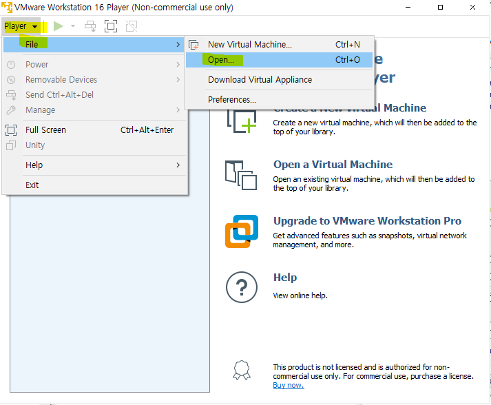

  

  - CentOS v7  64-bit.vmx 선택

  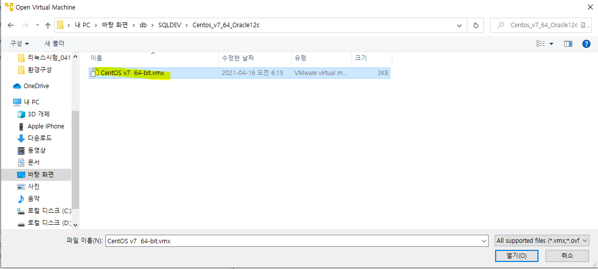

  
  
  - CentOS 생성
  
  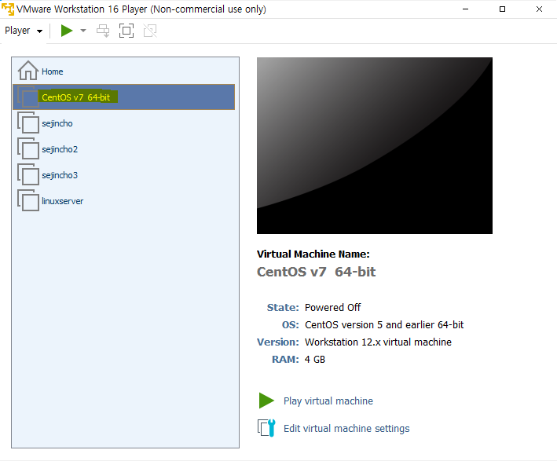
  
  
  
  - 컴퓨터 재부팅 > 모니터 부팅 시 ESC 연타
  
    - Continue Boot
  
    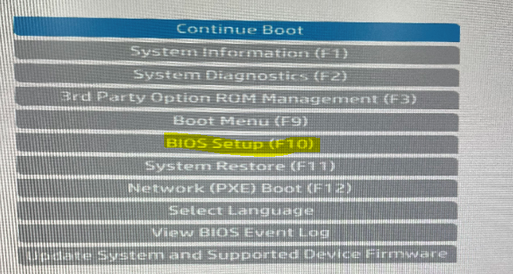
  
    
  
    - System Options
  
    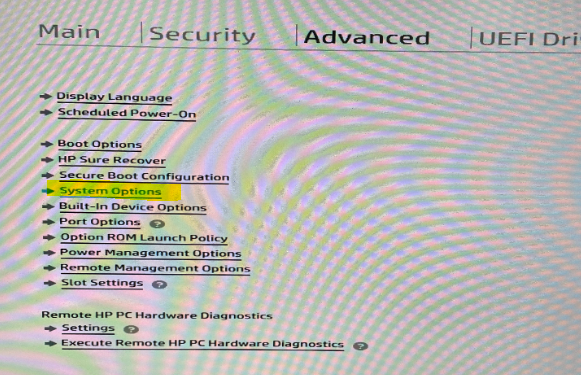
  
    
  
    - Virtualization Technology 선택
  
    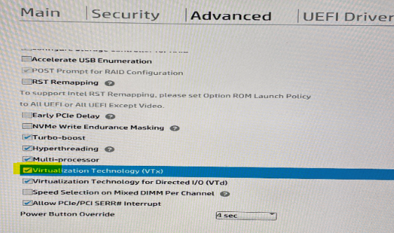
  
    
  
    - 변경사항 저장 후 종료
  
    

- **Centos7 64Bit 가상머신 네트워크 환경 구성**

  - vmnetcfg.exe을 C:\Program Files (x86)\VMware\VMware Player 에 복사

  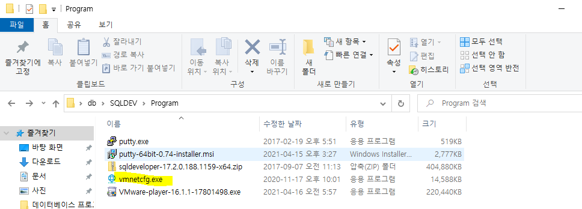

  

  - vmnetcfg.exe 클릭

  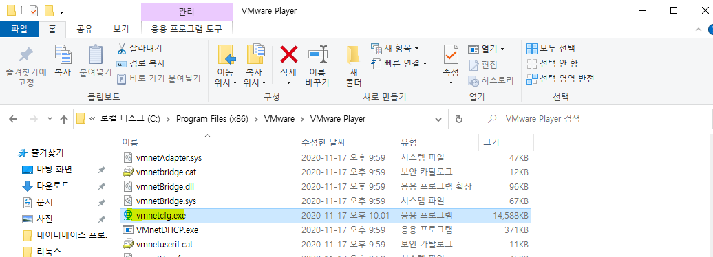

  

  - change setting 선택

  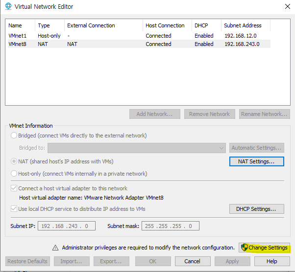

  

  - Use local DHCP service ~~ 체크 해제 후 Subnet IP 설정
    - 그리고 NAT Settings 선택

  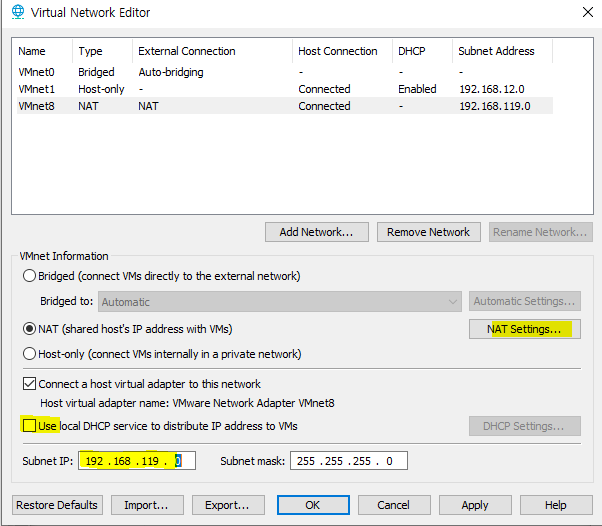

  

  - Gateway IP 수정 후 OK

  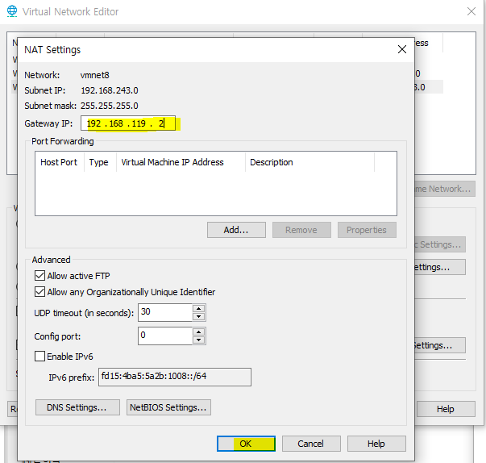

  

  - OK

  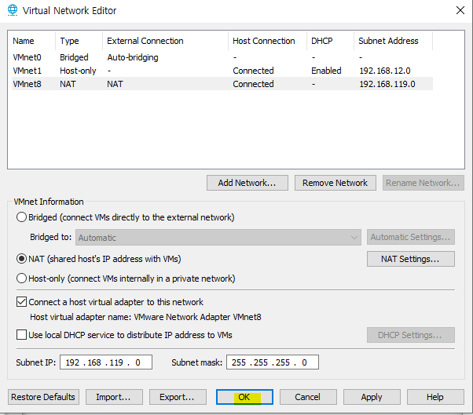

  

  

  - 실행 한 뒤 I Copied It

  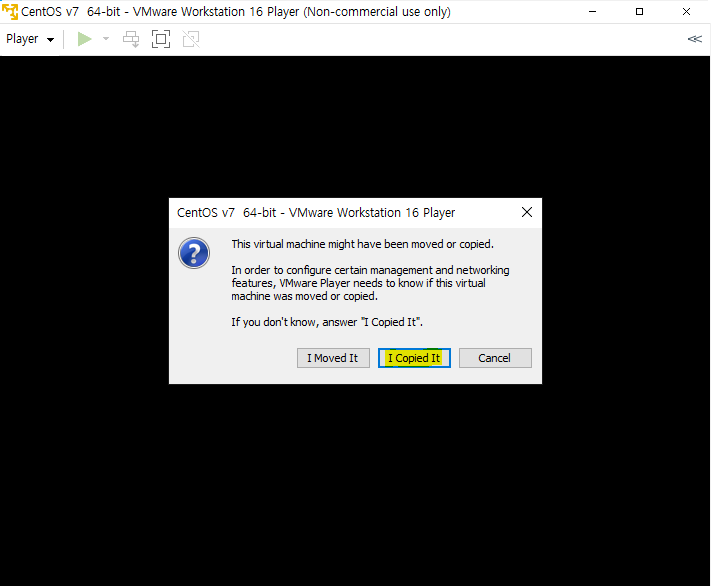

  

  - oracle / dba00

  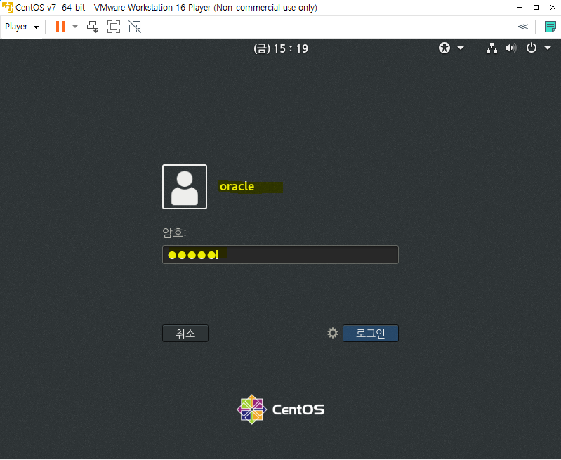

- **Putty 환경 구성**

  - putty 실행 > Host Name에 192.168.119.119 입력 > Saved Sessions에 DinkServer 입력 > Save > Open
    - Server의 IP를 고정

  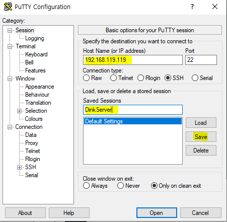

  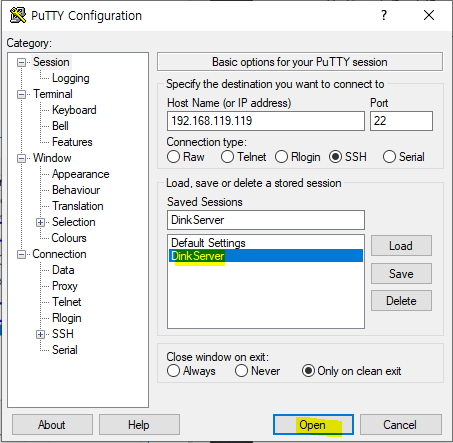

  

  - 예(Y)

  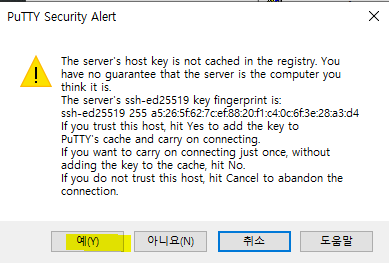

  - root / root00 으로 로그인

  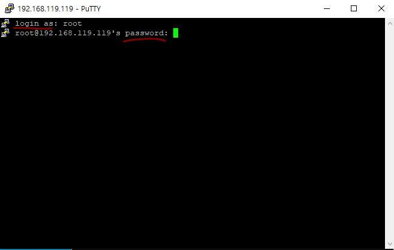

  

- **SQL Developer 설치(64bit)**

  - sqldeveloper.exe 실행

  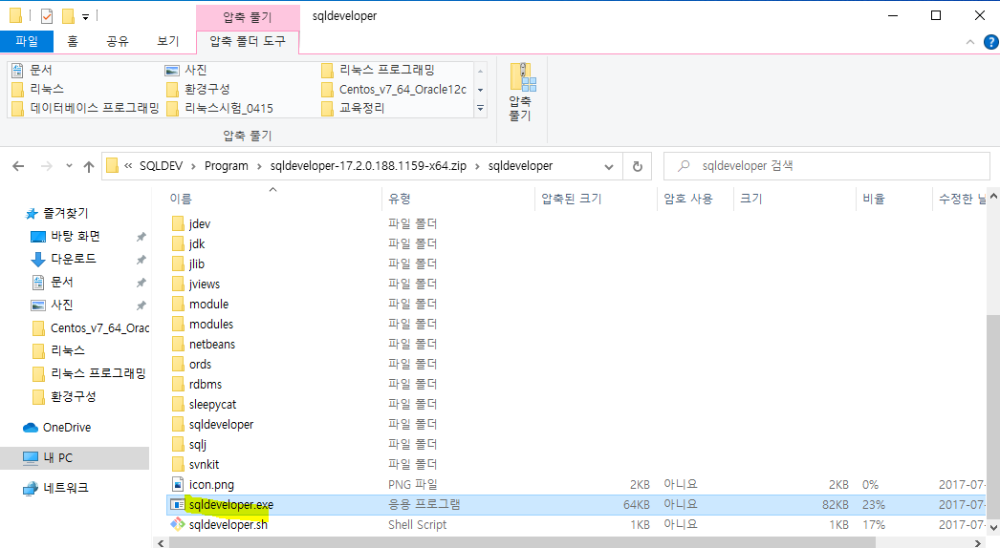

  

  - 접속 연결자(Connect String = Host String) 생성 (개발자 계정)

    - 접속 클릭

    

    - 개발자 계정 생성 (scott / tiger)
      - 아이디 비밀번호 입력하고 비밀번호 저장 
      - 호스트 이름은 아까 설정한 ip 주소 넣기
      - 서비스 이름은 dink
      - 테스트 클릭 

    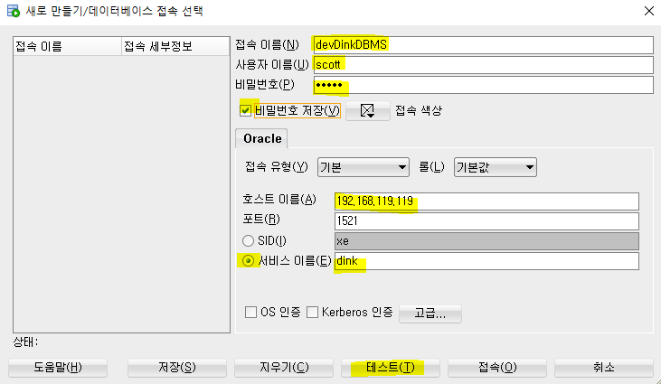

    - 테스트 상태 성공 > 저장

    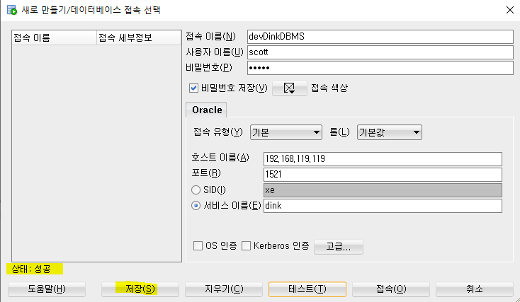

    

  - 테스트용 SQL 실행
    - select * from TAB;

  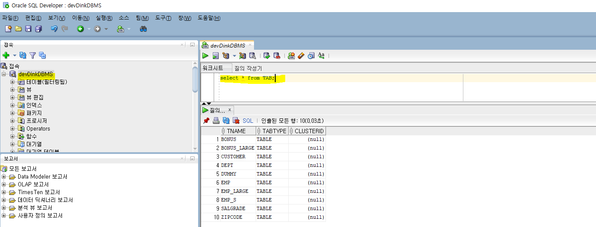

  

  - 접속 연결자(Connect String = Host String) 생성 (DBA 계정)

    - 아이디 비밀번호 입력하고 비밀번호 저장 (system / manager33)
    - 호스트 이름은 아까 설정한 ip 주소 넣기
    - 서비스 이름은 dink

    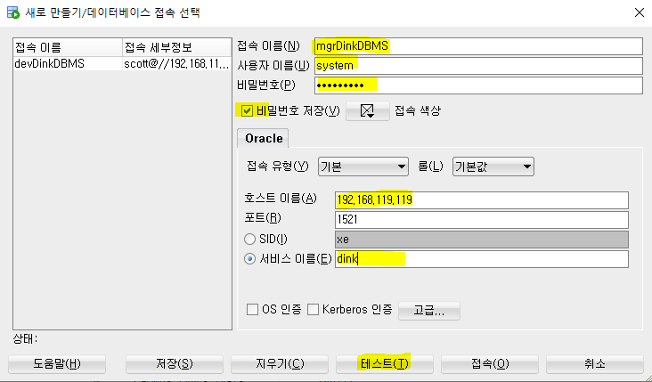

    

    - 테스트 상태 : 성공 > 저장

    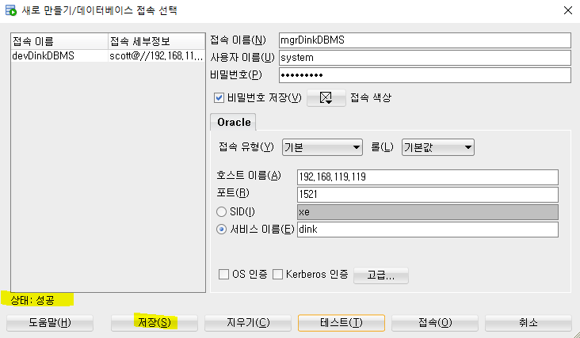

    

  - 테스트용 SQL 실행

  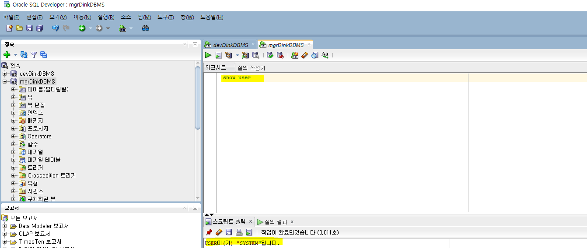

  

  