## Client / Server

- 클라이언트는 다른 프로그램에게 서비스를 요청하는 프로그램이며, 서버는 그 요청에 대해 응답을 해주는 프로그램이다. 클라이언트/서버 개념은 단일 컴퓨터 내에서도 적용될 수 있지만, 네트웍 환경에서 더 큰 의미를 가진다. 네트웍 상에서의 클라이언트/서버 모델은 여러 다른 지역에 걸쳐 분산되어 있는 프로그램들을 연결시켜주는 편리한 수단을 제공한다.

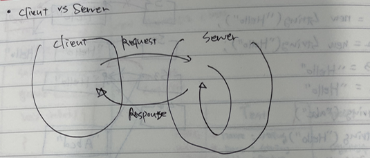

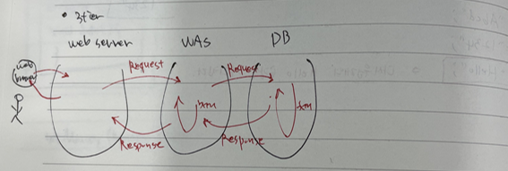

## 절차적 언어 / 비 절차적 언어 

- 절차적 언어(procedural language)
  - 순서를 명확한 계산법으로서 쉽게 표현할 수 있는 문제 지향 언어
  - 컴퓨터에 처리시키고자 할 때 그 순서를 명확하게 기술함으로써 처리를 쉽게 실행하는 언어
  - 절차란 처리를 나타내는 일련의 어(語), 구 (句), 문(文)이다.
  - 이는 프로그램이 너무 커져 전체를 하나로 내다보기가 어렵게 고안된 것
    -  ex. C언어

- 비절차적 언어(non-procedural language)
  - 컴퓨터의 실행 순서에 관계없이 처리 내용을 기술할 수 있는 프로그램 언어
  - 절차적 언어(procedural oriented language)와 대비된다.
  - 함수와 변수 등 절차적 언어에서 사용하는 것을 사용할 수 없으며 문제에 대한 처리를 바로 실행할 수 있는 것을 의미

## SQL

- SQL은 DBMS 서버만 실행할 수 있다.

- **ANSI/ISO SQL (중요!!!)**
  - **ANSI/ISO SQL**
    - DBMS(Oracle, My-SQL, DB2 등등)들에서 각기 다른 SQL를 사용하므로, 미국 표준 협회(American National Standards Institute)에서 이를 표준화하여 표준 SQL문을 정립 시켜 놓은 것이다.
    - 특징
      - 표준 SQL문이기 때문에 DBMS의 종류에 제약을 받지 않는다. (MySQL, Oracle..)
        즉, 특정 벤더에 종속적이지 않아 다른 벤더의 DBMS로 교체하더라도 빠르게 다른 벤더사를 이동할 수 있다.
        특정 DBMS의 이탈이 가속되는 것도 ANSI SQL의 영향이 크다고 할 수 있다.
      - 테이블간의 Join 관계가 FROM 에서 명시되기 때문에 WHERE 문에서 조건만 확인하면 된다.
        즉, 가독성이 일반 Query문보다 좋다.

- **SQL의 주요 특징(중요!! - 시험에 나옴)**

  - 관계형 DBMS에 접근하는 유일한 언어

    - 관계형 DBMS에 접근하는 유일한 언어가 SQL이기 때문에 DBMS 관련 업무를 수행하는 모든 사람들은 SQL을 통해서만 업무를 수행할 수 있다. SQL은 DBMS 관련 모든 분야에서 사용한다.

  - ANSI(American National Standards Institute)/ISO SQL

    미국 산업 표준화 기구이다. RDBMS 관련 연구소/기업들이 SQL을 채택하고 각기 자신만의 고유한 SQL기능을 추가하여 다양화 되자 표준 SQL 제정의 필요에 따라 1986년에 ANSI-SQL을 최초로 제정했다.

    - 시대적으로 필요한 기술이 늘어나면서 주기적으로 표준 제정을 통해 새로운 기능을 추가해 가고 있다.

  - English-Like

    SQL의 원래 명칭은 SEQUEL(Structured English QUEryLanguage) 이고 이중 English 라는 단어에 주목하면 영어권 사람들이 쉽게 데이터에 접근하고 관리하도록 만들다보니 SQL에 영어적인 특징이 들어가 있다.

  - English-Like의 2가지 특징
    - SQL 명령어의 문법적인 구조나 의미가 영어 문맥과 유사하다
    - SQL 명령어는 대-소문자를 구분하지 않는다.

  - 비절차적 언어

    개발자(사용자)가 처리 절차(처리 순서/방법)를 지정하지 않고 원하는 결과를 정의하여 요청하는 언어로 SQL이 대표적인 언어이다.

    - cf ) 절차적 언어는 개발자(사용자)가 처리절차를 처으부터 끝까지 정해줘야 하는 언어로 C, JAVA, COBOL가 대표적인 언어이다.

- **명령어 분류(시험!!!!)**
  - DML(Data Manipulation Language, 데이터 처리어) : 데이터베이스에 저장된 데이터를 삽입/수정/삭제하는 명령어
  - TCL(Transaction Control Language, 트랜잭션 제어어) : 데이터베이스에서 발생하는 트랜잭션을 저장/취소하는 명령어
  - DDL(Data Definition Language, 데이터 정의어) : 데이터베이스의 논리적 구조를 정의/변경/삭제하기 위한 명령어
  - DCL(Data Control Language, 데이터 제어어) : 데이터베이스에 저장된 데이터에 대한 접근 권한을 부여/회수하는 명령어

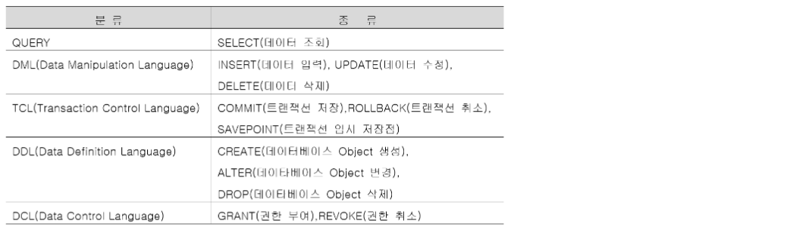

- **트랜잭션(Transaction)**

  데이터베이스의 상태를 변환시키는 하나의 논리적 기능을 수행하기 위한 작업의 단위 또는 한꺼번에 모두 수행되어야 할 일련의 연산들을 의미한다.

## 실습 환경

- 실습 환경

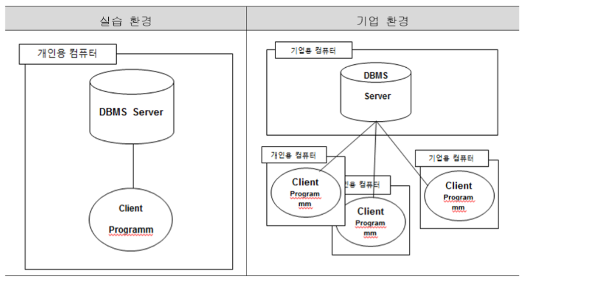

## OSS(Open Source Software)

- 개념

  소스 코드를 공개해 누구나 특별한 제한 없이 그 코드를 보고 사용할 수 있는 오픈 소스 라이선스를 만족하는 소프트웨어를 말한다. 

  - ex) MySQL

## RDBMS

- 계층형, 망형 데이터베이스에 비해 관계형 데이터베이스의 장점
  - 모델 단순성
    - 관계형모델은 데이터의 구조적인 표현이 행(Row) 과 열(Column)로 이루진 2차원 테이블(Rule 1) 형태로 구성됨으로 구조적으로 단순하며 데이터의 접근이 매우 편리함에 따라 데이터베이스 분석가, 설계자, 개발자,일반 사용자가 쉽게 이해하고 활용할 수 있는 장점을 제공한다.
  - 독립성과 유연성
    - 기존의 계층형 또는 망형 모델의 데이터 구조는 레코드 간에 직접 연결하는 방식으로 되어 있는 종속성으로 인해 논리적 저장 구조나 물리적 구조가 변경되면 어플리케이션 프로그램을 변경해야 하지만 관계형 모델은 논리적 독립성(Rule 8), 물리적 독립성(Rule 9)을 제공함에 따라 논리적 물리적 구조 변경 시 독립성으로 인해 어플리케이션 프로그램 수정을 최소화 한다. 개발 진행 중, 유지보수 시 빈번히 발생하는 데이터 구조 변경에 유연하게 대처할 수 있어 개발 생산성 및 유자보수 효율성을 가져온다. 
  - **비절차적 SQL(중요!)** 
  - 수학적 집합론이다.

- **ERD 개념 정리(중요!)**

  데이터 모델링 분야에서 개체-관계 모델이란 구조화된 데이터에 대한 일련의 표현이다. "구조"화된 데이터를 저장하기 위해 데이터베이스를 쓴다. 이 데이터의 "구조" 및 그에 수반한 제약 조건들은 다양한 기법에 의해 설계될 수 있다. 그 기법 중 하나가 개체-관계 모델링이다. ERM 프로세스의 산출물을 가리켜 개체-관계 다이어그램(Entity-Relationship Diagram)이라 한다.

- **Join이란?(중요!)**

  테이블간의 관계성에 대한 정확한 표현은 각각의 테이블 내에 존재하는 데이터 간 필수적, 선택적 관계성이다. 실시간으로 테이블간 관계를 형성하는 것을 JOIN 연산이라고 한다. JOIN은 관계형 데이터베이스의 가장 중요한 연산 중 하나이다.

## select 실습

- 용어

  - TABLE : 관계형 데이터베이스에서 데이터 저장하는 기본적인 구조
    - 즉, 데이터를 저장하는 그릇 역할
    - 테이블은 열(Column)과 행(Row)로 구성된 2차원 구조
  - ROW(=Record)
  - Column(=Field, Attribute)
  - Column Heading

  | File system | DBMS   |
  | ----------- | ------ |
  | Record      | Row    |
  | Field       | Column |

  

- **connection vs Session 설명 (그리고 개념 설명) - 시험!!**

  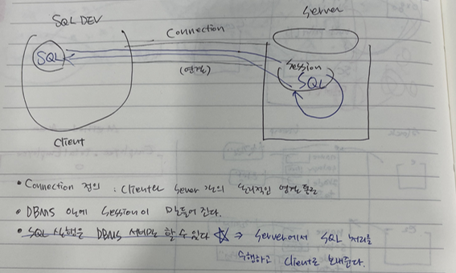

  - 디벨로퍼를 실행하면 sql을 server로 보내주고 server에서 sql 처리를 한 뒤 디벨로퍼로 보내주는 것이다.

- ***를 사용하는 것보다 컬럼명을 나열해서 select 하는 것이 더 좋다.**
  - 가독성
  - 안정성

- **column heading의 정렬 방향**
  - 데이터 타입에 따라서 데이터의 정렬 기준이 다르다.
    - 문자와 날짜 : 왼쪽 정렬 
    - 숫자 : 오른쪽 정렬

- **테이블의 구조**

  - desc 테이블명;

  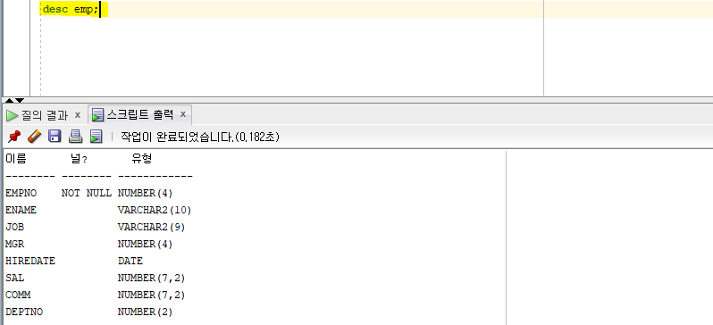

- **테이블에 없는 컬럼도 조회 가능**

  

  

  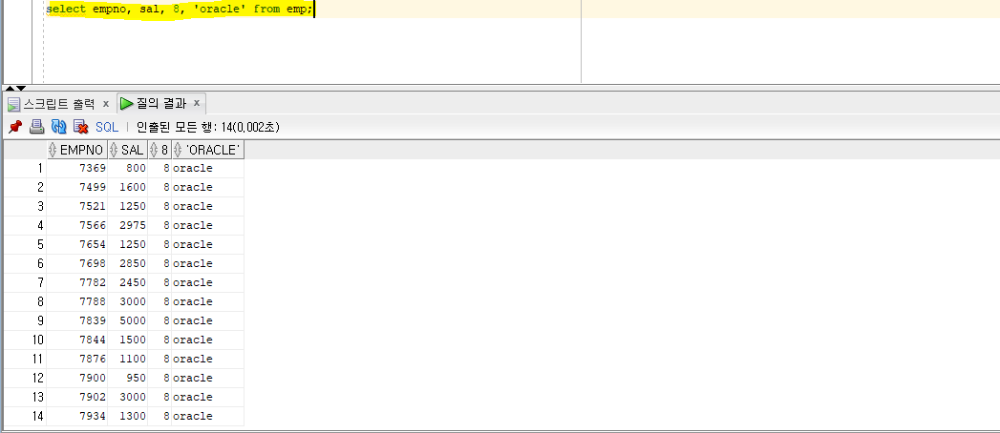

  

## where 조건절

- 실습

  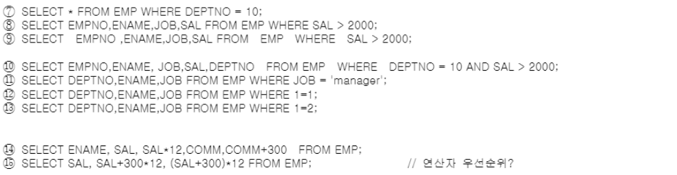

  - 11번 : 아무 것도 출력되지 않음. 즉, 데이터는 대소문자를 구분한다.
  - 12번과 13번
    - 13번을 제외하고 두 쿼리문은 같은 결과가 도출

  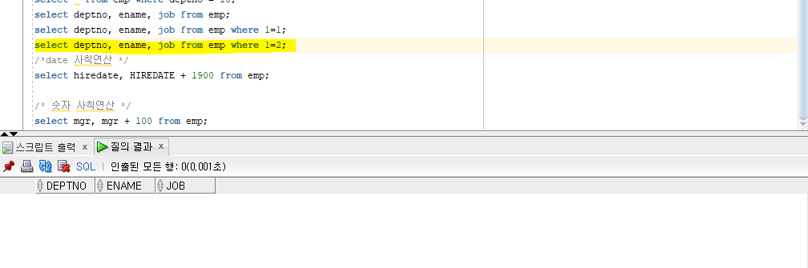

  - 14번 

  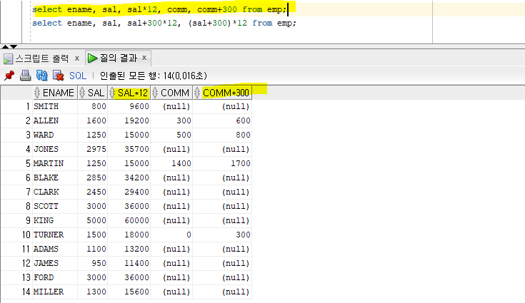

  

- 데이터 가공 방법

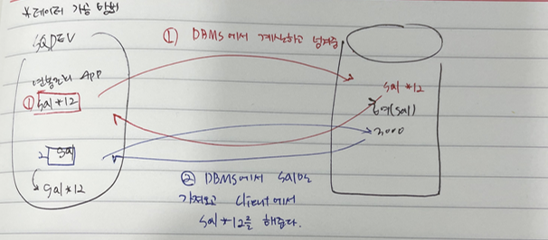

## ALIAS

- Alias 종류 : Table Alias, Column Alias

  - Table Alias 
    - 용도 : 일반적으로는 self join 시에 사용
    - 사용 방법 : 공백문자 ex) select e.empno, e.ename from emp e;
  - Column Alias 
    - 용도 : Column Heading(컬럼 레이블 변경)을 의미 있는 다른 이름으로 재정의
    - 사용 방법 
      - 공백문자
      - AS or as (ANSI 표준)
      - " " : 특수문자, 공백문자, 대소문자 구분이 필요한 경우
        - cf. 조건절은 ' ' 를 사용해야 한다.

  - 예(column alias)

    - select ename, sal+200 bonus, sal*12 as annual_sal, comm, comm+300 "special bonus" from emp;
      - as는 생략 가능
      - " " 생략 가능 : 단 공백이 포함되어 있는 경우 생략하면 안됨!!!!

    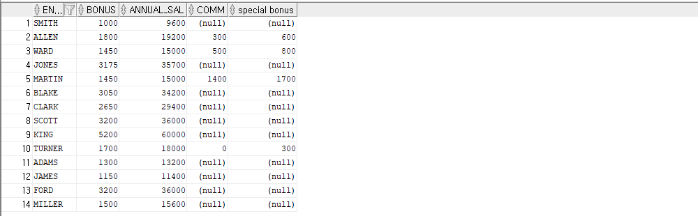

## (문자열) 결합(합성) 연산자

- 문자열 합성(결합) 연산자 : ||

  - select ename, job from emp;

  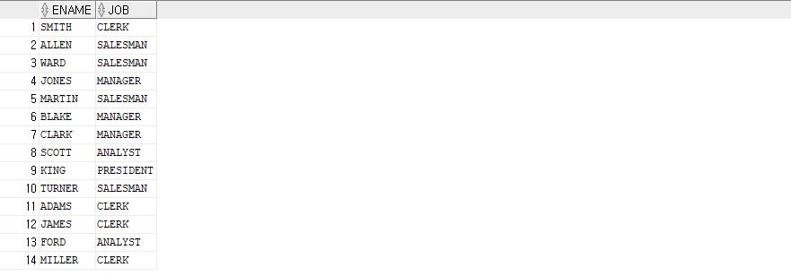

  

  - select ename || job from emp;

  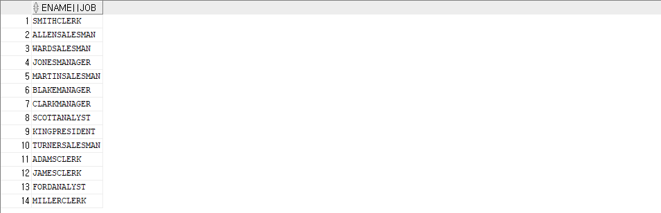

  

  - select dname || '부서는' || loc || '지역에 위치합니다.' as loc from dept;

  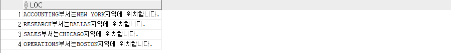

  

  - select ename || ' ''s JOB is ' || job as loc from emp;
    -  '를 문자로 사용하고 싶을 때 ''를 사용하면 '가 출력이 된다.

  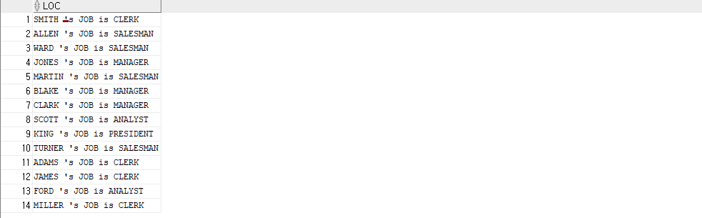

  

  - select ename, sal, sal*100, sal || '00', to_char(sal) || '00' from emp;
    - sal*100은 숫자, sal || '00'은 문자, to_char(sal) || '00'도 문자 

  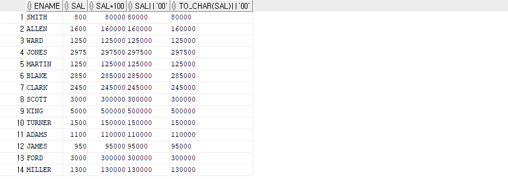

## Implicit / Explicit

- Implicit (암시적)
  - ex) sal || '00'

- Explicit (명시적)
  - ex) to_char(sal) || '00'

- 변환
  - to_char, to_number, to_date
  - 숫자를 날짜로 바꾸고 날짜를 숫자로 바꾸는 것은 존재하지 않는다.