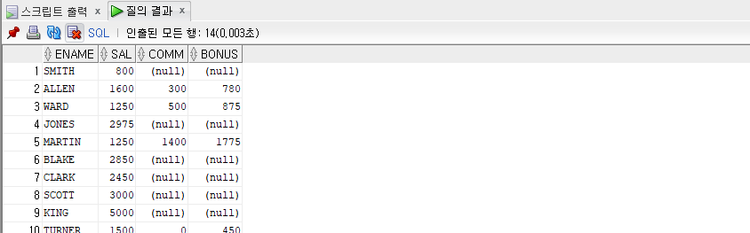

## File System / DBMS

- **File System**

- **DBMS**
  - 계층형
  - 망형
  - 관계형
  - 객체형
  - 객체 관계형

- **join 중요!!**

## Connection Pool

## DUAL

- **Dummy table**
  - SYS user 소유, 1개의 Row와 1개의 Column을 가진 작고 가벼운 테이블
  - 용도 : 실제 테이블로부터 데이터를 가져오는 것이 아닌 function 또는 calculation을 수행하기 위한 테이블

- **dual이란?**
  - DUAL 테이블은 오라클을 설치하면 자동으로 생성되는 테이블이다.
  - DUAL은 SYS 사용자의 스키마이지만 모든 사용자가 억세스할 수 있다.
  - 오직 하나의 DUMMY 컬럼만 가지며, VARCHAR2(1)의 데이터 타입이다.
  - x라는 하나의 행(row)만 가진다.
  - 산술 연산이나 가상 컬럼 등의 값을 한번만 출력하고 싶을 때 많이 사용
  - 간단하게 함수를 이용해서 계산 결과값을 확인 할 때 사용하는 테이블
  - sysdate client level의 api보다 성능이나 효율은 떨어지지만 많이 사용하는 이유가 있다.

- **sysdate : 현재 날짜와 시간을 가져옴** 

- **실습**

  - desc dual;

    describe dual;

  

  

  - select * from  dual;

  

  

  - select sysdate from dual;
    - 날짜는 보이지만 시간이 보이지 않음
    - sysdate를 사용하는 것보다 자바 날짜API를 사용하는 것이 더 빠른데 왜 sysdate를 많이 사용할까? 지역마다, 나라마다 시간이 다르기 때문에 공통된 시간을 얻어올 수 있는 sysdate를 사용한다.

  

  - select 12345 * 12345, to_char(12345 * 12345,'999,999,999,999,999') from dual;
    - dbms 서버에 계산처리를 시킴

  

## NULL

- **의미**

  값이 정의되지 않은, 존재하지 않는 -> 현재 데이터를 입력하지 못한 경우

  - 모든 데이터 유형에 null값이 적용된다.
  - numm의 연산 결과는 null이다.

  - ASCII 코드 0 -> 48, '   ' -> 32 (0과 공백문자는 아스키코드가 존재하고 데이터가 존재하는 것이다.) , null -> 00 

  - 연산 불가
    - 결과가 null이다.
  - 비교 불가
    - is null / is not null
  - 적용 불가

- **실습(연산불가 null값 연산)**

  - select 300+400, 300/0 from dual;

  

  

  - select 300+400, 300+NULL, 300/NULL from dual;

  

  

  - select ename, sql, comm, comm+sal*0.3 as bonus from emp;

  

- **putty로 oracle 접속**

  - cmd창에서 putty 192.168.119.119

  

  - oracle 계정 로그인 / 비밀번호 dba00

  

  - scott 계정으로 들어가기

  

  - select문
    - null값이 보여지지 않음

  

  

- **비교불가(null 값 비교, comm에 null이 포함되어 있음)**

  - select * from emp where comm > -1;
    - null은 제외되고 나온다.

  

  - select * from emp where comm = null;
    - null이 출력되지 않음 = 로 null을 출력하는 것이 아님
    - select * from emp where comm is null;

  

  - select * from emp where comm <> null;
    - <>은 not equal

  

  

  - select * from emp where comm is not null;

  

  

- **적용불가(null값 함수에 적용)**

  - select ename, length(ename), comm, length(comm) from emp;

  

  

  - select sal-empno, abs(sal-empno), abs(sal-comm)+100 from emp;
    - abs(comm)하면 null값은 null이 나온다.

  

- **null 무시하는 함수들**

  - select concat(ename || ' is ', comm), nvl(comm,-1), decode(comm,null,-999,comm) from emp;
    - concat(값, 값, 값 .....) : 여러 문자열을 하나로 합쳐주는 역할을 한다. 파라미터를 두 개 이상 사용할 수 있어서 문장을 만들어 출력을 할 수도 있다.
    - nuv("값", "지정값") : 값이 null인 경우 지정값을 출력한다.
    - nuv2("값", "지정값1", "지정값2") : 값이 null이 아닌 경우 지정값 1을 출력하고 null인 경우 지정값 2를 출력한다.
    - decode(컬럼, 조건1, 결과1, 조건2, 결과2, 조건3, 결과3.....) : if else와 비슷한 기능을 수행한다.

  

  