## ORDER BY

- **정렬(sorting)**
  - 정렬 시 값 비교기준
    - 숫자 : 작은 수 / 큰 수
    - 문자 : 알파벳 순서(ASCII)
      - ex) 'SCOTT' < 'T' (맨 앞글자로 판단한다.)
    - 날짜 : 숫자와 동일 (중요!!)
      - ex) '2003/11/16' > '19990916'
    - NULL : 가장 큰 값으로 간주 (중요!!)
  - 방향
    - ASC : 오름차순 (Default)
    - DESC : 내림차순
      - cf. desc emp; 는 describe의 약자이다.

- **cf. ASCII-CODE / UNICODE**

  - 아스키(ASCII) American Standard Code for Information Interchange

    - 1960년대 미국에서 정의한 표준화한 부호체계이다.
    - 여러 가지 이유로 아스키코드는 7비트 즉, 128개의 고유한 값만 사용
      - 1비트를 통신 에러 검출을 위해 사용하기 때문이다.(Parity Bit)
    - 0~127까지 각각 고유한 값이 할당되어 있는 걸 알 수 있다. (0부터 시작하니 총 128개)

    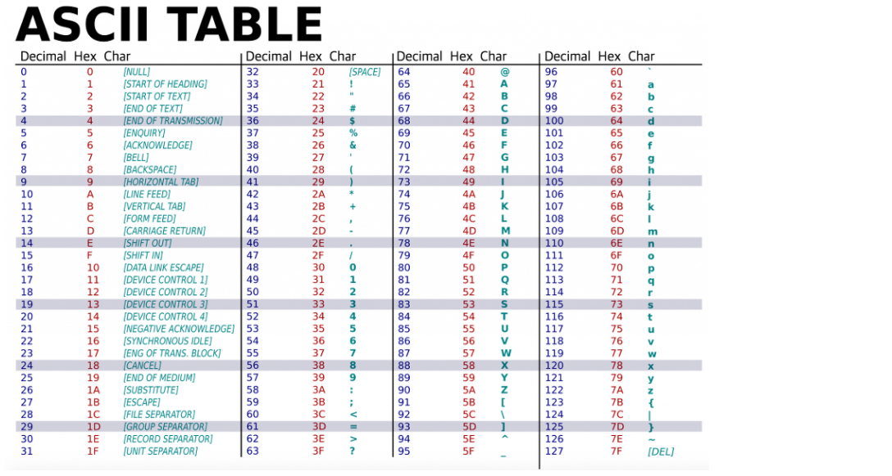

  - UNICODE

    - 한글과 중국어 같은 경우는 자음과 모음의 조합이 많고 한자의 개수가 많기 때문에 아스키 코드에 모두 담을 수 없다. 그래서 아스키 코드에서 용량을 크게 확장한 2byte (2의 16승 = 65536)의 유니코드가 등장하게 되었다.

- 실습

  - select ename, hiredate from emp order by ename asc; 
    - 즉, 디폴트 정렬 기준은 asc

  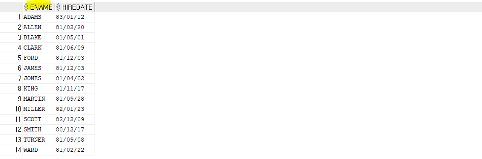

  

  - select ename, hiredate from emp order by ename desc;

  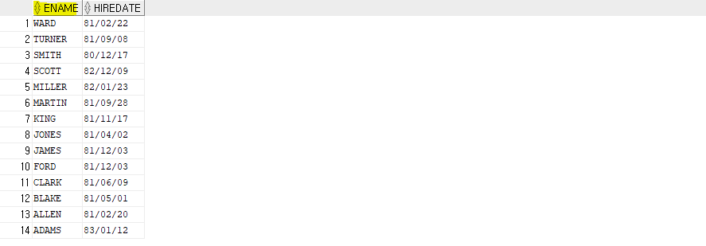

  

  - select ename, sal, hiredate from emp order by 2;
    - select list에 나오는 2번째 컬럼을 기준으로 정렬

  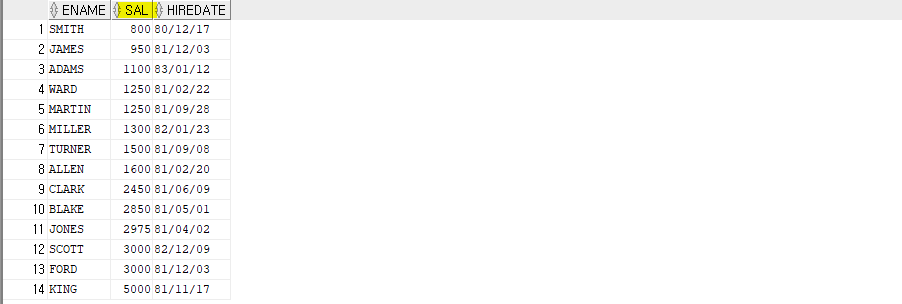

  

  - select ename, sal*12 as annual_sal, hiredate from emp order by annual_sal;
    - 앞에서 정한 alias를 order by에서 사용할 수 있다.

  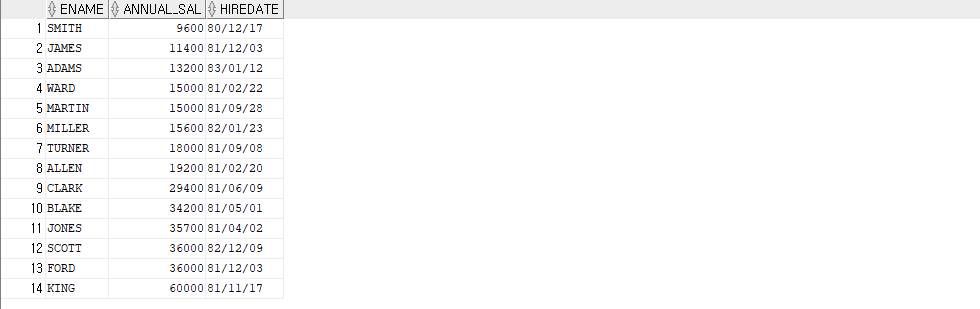

  

  - select deptno, job, ename, comm from emp order by comm*12;
    - 계산식이 order by에 올 수 있음
    - comm에 null이 포함되어 있고 null이 가장 큰 값으로 간주(디폴트 오름차순)

  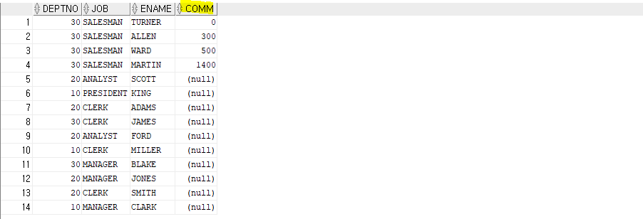

  

  - select deptno, job, ename from emp order by deptno, job desc;
    - deptno는 오름차순, job은 내림차순

  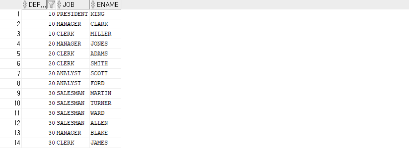

  

  - select ename, hiredate from emp order by sal desc;
    - select list에 없는 컬럼도 order by로 사용할 수 있다.

  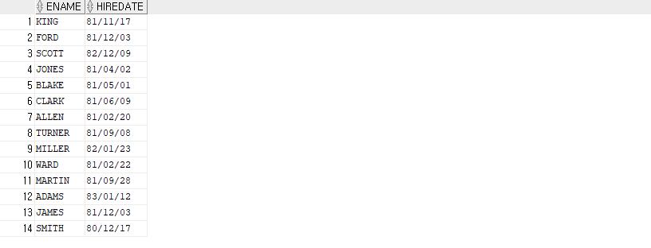

  

  - select empno, comm from emp order by comm asc;
    - order by 시 null의 위치 확인하기(null)은 가장 큰 값으로 간주한다.

  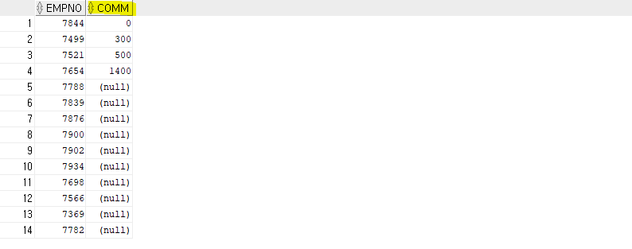

- 정렬(sort)

  - 명시적

    - order by

  - 암시적(묵시적)

    재정의 되지 않는 한 해당 데이터 정렬은 해당 데이터베이스 내에서 발생 하는 모든 텍스트 작업에 암시적으로 적용 됩니다. 데이터베이스 데이터 정렬은 일반적으로 DDL 문을 통해 데이터베이스를 만들 때 설정 되며 `CREATE DATABASE` , 지정 되지 않은 경우 기본적으로 설치 시 결정 되는 서버 수준 값으로 설정 됩니다. 예를 들어 SQL Server의 기본 서버 수준 데이터 정렬은 `SQL_Latin1_General_CP1_CI_AS` 대/소문자를 구분 하지 않고 악센트를 구분 하는 데이터 정렬입니다. 일반적으로 데이터베이스 시스템은 기존 데이터베이스의 데이터 정렬을 변경 하는 것을 허용 하지만 이렇게 하면 복잡 해질 수 있습니다. 데이터베이스를 만들기 전에 데이터 정렬을 선택 하는 것이 좋습니다.

## DISTINCT

- 용도 : 중복제거 (??)

- 실습

  - select job from emp;

  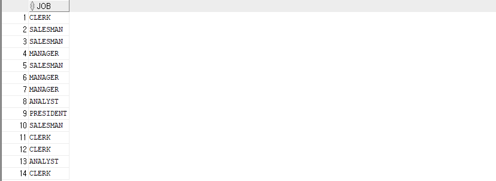

  - select all job from emp;

  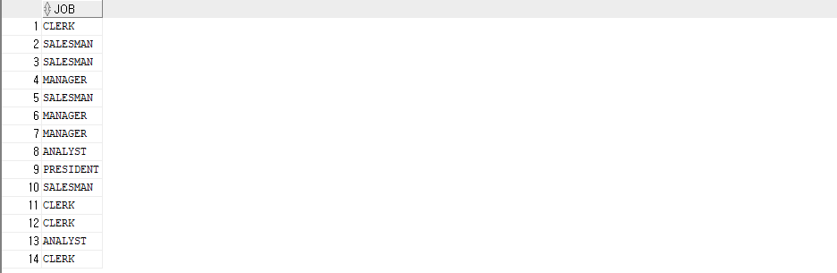

  - select unique job from emp;

  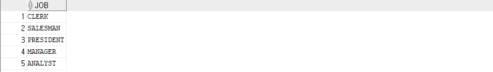

  

  - select distinct job from emp;

  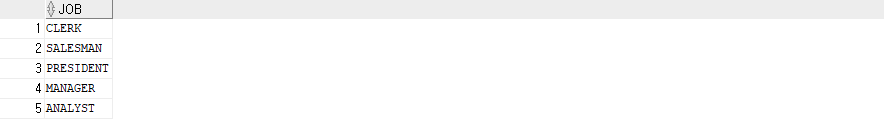

  - select distinct deptno, job from emp;

  

  - select distinct deptno, distinct job from emp; 과 select deptno, distinct job from emp; 는 에러가 발생한다. (문법적인 구조 상 에러가 발생)
    - distinct는 select 절의 가장 첫 번째 위치에 있어야 한다.
    - DISTINCT 키워드 뒤에 2개 이상의 칼럼을 정의하면 하나의 RECORD로 인식하여 DISTINCT 키워드 이후에 오는 컬럼들을 합쳤을때 중복되는 것을 제거 (즉, distinct 뒤에 있는 모든 컬럼에 영향을 미친다.)

- null과 distinct

  - select comm from emp where comm is not null;

  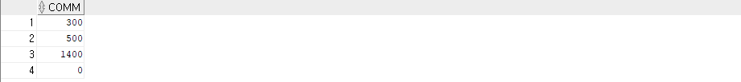

  - select distinct comm from emp;

  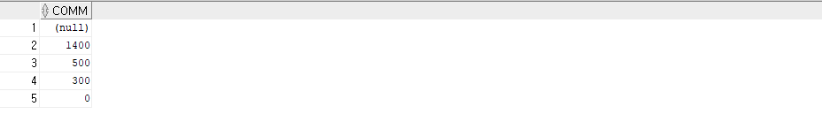

- distinct, unique는 같은 역할을 하는데 distinct가 ansi 표준이다.

## DECODE / CASE

- **조건절(IF) 연산자**

- **실습(decode)**

  - select deptno, ename, decode(deptno, 10, 'accounting', 20, 'research', 30, 'sales', 'etc') as dept from emp;

  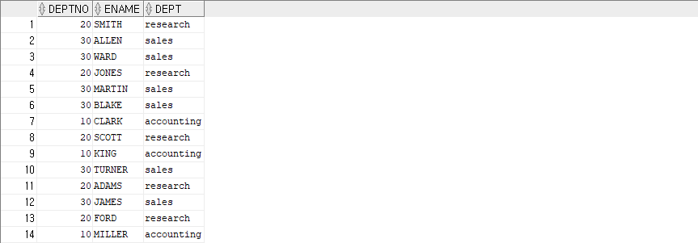

  

  - select comm, decode(comm,NULL, -99, comm) from emp;

  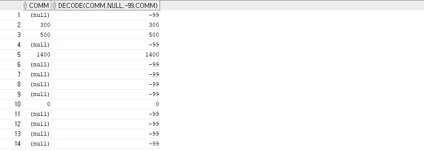

  

  - select greatest(3000,1500,2100,5000) as greatest, least(3000,1500,2100,5000) as least from dual;

  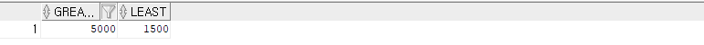

  

  - select deptno, ename, sal, decode(greatest(sal, 5000), sal, 'HIGH', decode(greatest(sal,2500), sal, 'MID', LOW' )) from emp order by deptno;

  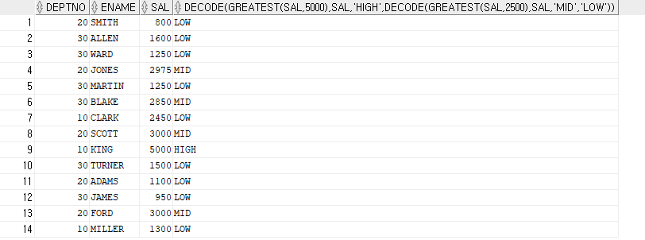

  

  - select deptno, ename, sal, comm, decode(greatest(comm,5000),comm,'HIGH',decode(greatest(comm,2500),comm,'MID','LOW')) from emp order by deptno;
    - null이 존재하는 경우
    - **null은 HIGH로 모두 출력된다.**

  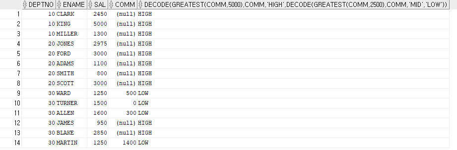

- **실습(case)**

  - select deptno, ename, sal,
        case 
            when sal >= 5000 then 'HIGH'
            when sal >=2500 then 'MID'
            when sal < 2500 then 'LOW'
        else
            'unknown'
        end
    from emp
    order by deptno;

  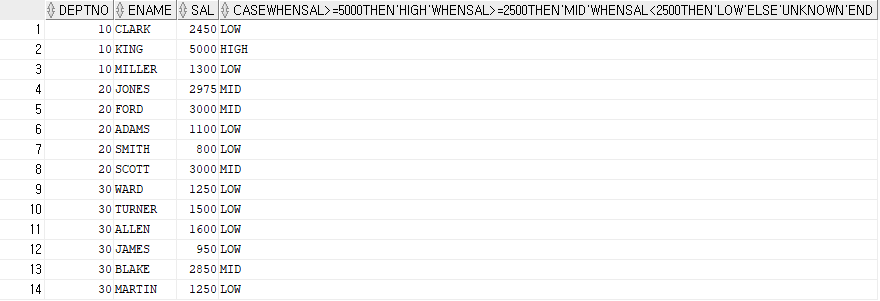

  

  - select deptno, ename, sal, 
        case
            when sal >= 5000 then 'HIGH'
            when sal >= 2500 then 'MID'
            when sal between 300 and 2500 then 'LOW'
        else
            'unknown'
        end
    from emp
    order by DEPTNO;
    - between and 를 사용할 수 있다.

  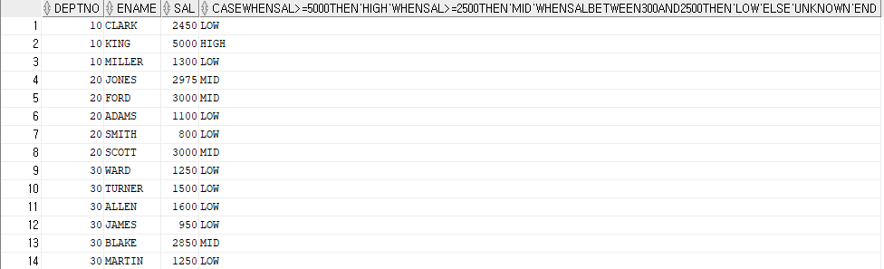

  

  - select deptno, ename, sal, comm,
        case
            when comm >= 5000 then 'HIGH'
            when comm >= 2500 then 'MID'
            when comm between 300 and 2500 then 'LOW'
        else
            'unknown'
        end
    from emp
    order by DEPTNO;
    - **else에서 null 처리 (중요!!!!!)**
    - **null이 포함된 경우 else로 보낸다.**

  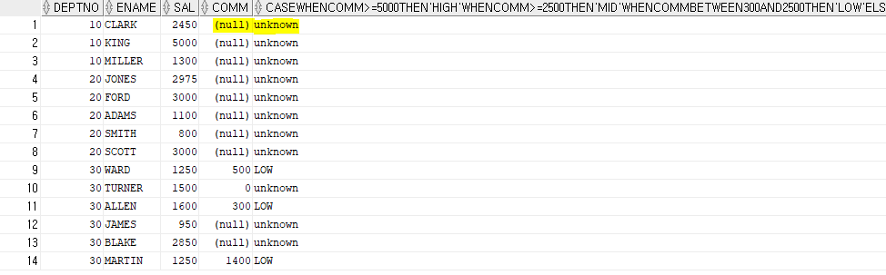

  

  - select deptno, 
        case deptno
            when 10 then 'accounting'
            when 20 then 'research'
            when 30 then 'sales'
            when 40 then 'operations'
            else 'unknown'
        end
    from emp
    order by deptno;

  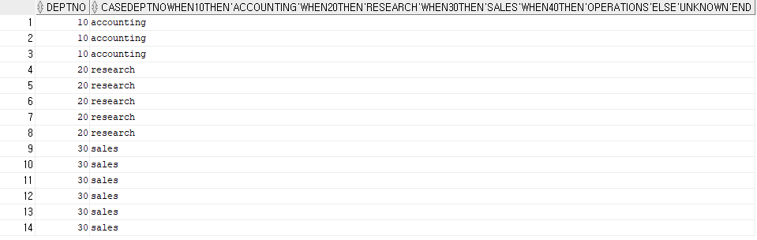

  - select sal, 
        case
            when sal >= 1000 then 1
            when sal >= 2000 then 2
            when sal >= 3000 then 3
            when sal >= 4000 then 4
            when sal >= 5000 then 5
            else 0
        end as sal_chk
    from emp
    order by sal;
    - 여러 개의 when 절에서 조건이 중첩되는 경우 처리 방식

  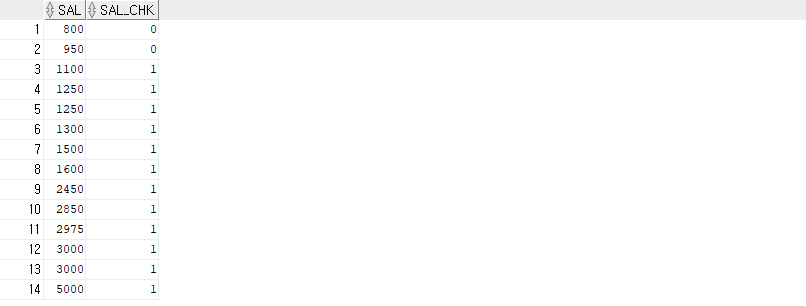

  

  - select sal, 
        case
            when sal >= 5000 then 5
            when sal >= 4000 then 4
            when sal >= 3000 then 3
            when sal >= 2000 then 2
            when sal >= 1000 then 1
            else 0
        end as sal_chk
    from emp
    order by sal;
    - 여러 개의 when 절에서 조건이 중첩되는 경우 처리 방식

  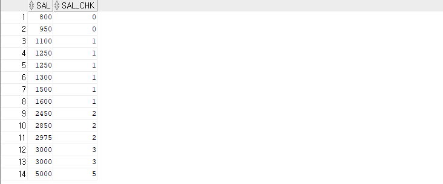

  

  - NULLIF 함수 시뮬레이션

    - 즉, nullif의 경우와 case의 경우 같은 결과를 도출

    select job, nullif(job,'MANAGER'),
        case 
            when job = 'MANAGER' then null
            else job
        end
    from emp;

  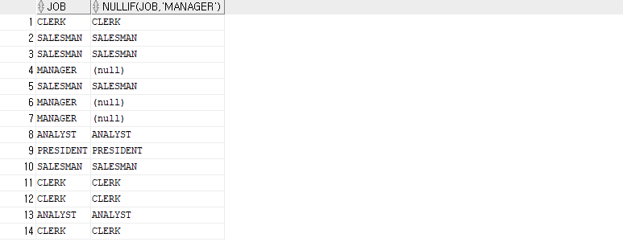

- 요구

  - 부서별 차등 보너스 계산 SQL을 작성 하십시오

    - 10번 부서 급여의 0.3% , 20번 부서 급여의 20%, 30번 부서 급여의 10%, 나머지 모든 부서 1%
    - 부서번호, 이름, 직무, 급여, 보너스
    - 부서별, 최고 보너스 순으로 정렬
    - 소수점절삭

    select deptno, ename, job, sal, 
        case deptno
            when 10 then trunc(sal * 0.3)
            when 20 then trunc(sal * 0.2)
            when 30 then trunc(sal * 0.1)
            else trunc(sal * 0.01)
        end as bonus
    from emp
    order by deptno, bonus desc;

  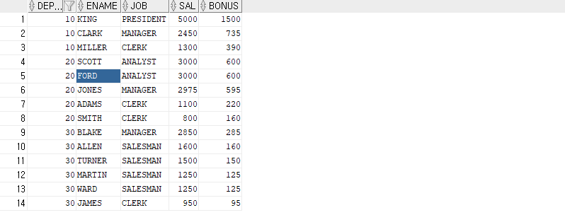

## ROWNUM

- **rownum**

  - 조회된 순서되로 순번을 매긴다.
  - ORDER BY 를 사용하면 순번이 뒤섞이므로 정렬된 서브쿼리 결과에 ROWNUM 을 매겨야 한다.

  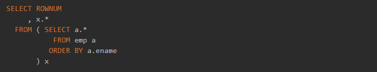

  

- rownum은 각각의 row에 부여된 절대적인 숫자인가? > no!

  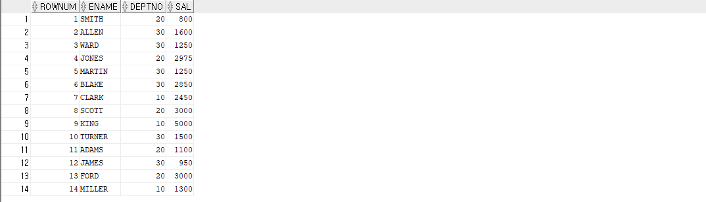

  - 위의 결과와 다른 결과가 나온다. 즉, select의 실행 순서를 잘 파악해야 한다. 
    - order by는 가장 마지막에 실행되는 것이다.

  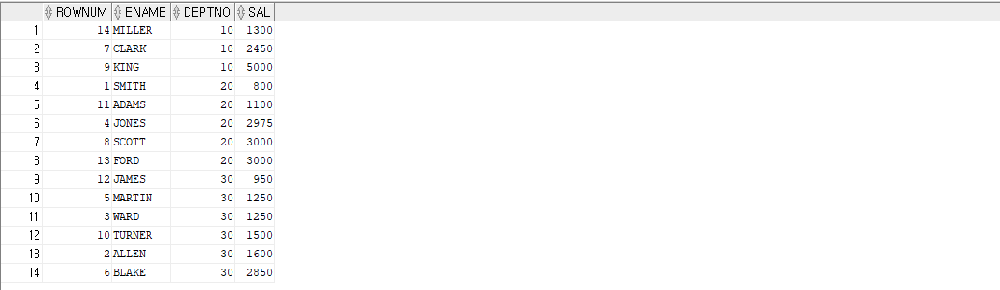

  

- **select 실행 순서**

  FROM - ON - JOIN - WHERE - GROUP BY - CUBE | ROLLUP - HAVING - SELECT -  DISTINCT - ORDER BY - TOP

  - rownum의 실행 순서는?? order by 앞에서 실행

- 실습

  - 최상위 급여자 5명을 조회하는 SQL문 작성

    select ename, sal from (select ename , sal from emp order by sal desc) where rownum <=5;

  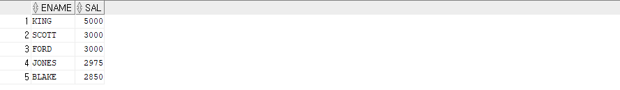

  - 조건절에서 rownum 사용 시 주의사항

    - select ename, deptno, sal from emp where rownum = 1;

    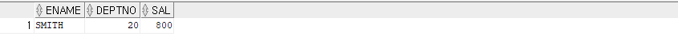

    

    - select ename, deptno, sal from emp where rownum = 5;                                                  select ename, deptno, sal from emp where rownum > 5;
      - 결과가 나오지 않음

    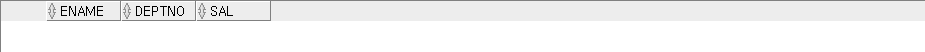

    

    - select ename, deptno, sal from emp where rownum <= 5;

    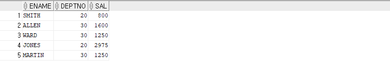

- rownum은 결과 집합에 부여되는 번호 

## 논리 연산자(AND OR NOT)

- 실습

  - select ename, job, sal, deptno from emp where deptno=10 and sal > 2000;
  - select ename, job, sal, deptno from emp where deptno=10 or sal>2000;
  - select * from emp where sal=2000 or sal>2000;
  - select ename, job, sal, deptno from emp where sal>1000 or sal>2000;
    - 데이터가 중복되어서 나오진 않음

  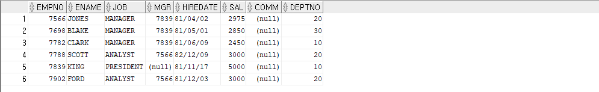

  

  - select ename, job, sal, deptno from emp where deptno=10 and sal > 2000 or job='CLERK';
    - **and가 or보다 연산자 우선순위가 높다(중요!!!)**
      - 왜? and연산(교집합)을 먼저 처리하면 중간 결과 집합이 줄어든다. 그래서 빠른 성능을 위해서 옵티마이저가 and 연산을 먼저 처리한다.  
    - where (deptno=10 and sal > 2000) or job='CLERK';

  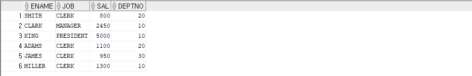

  

  - SELECT ENAME, JOB, SAL FROM EMP where SAL > 2000 or JOB = 'CLERK' and DEPTNO >= 20;
    - SELECT ENAME,JOB,SAL FROM EMP where SAL > 2000 or (JOB = 'CLERK' and DEPTNO >= 20);

  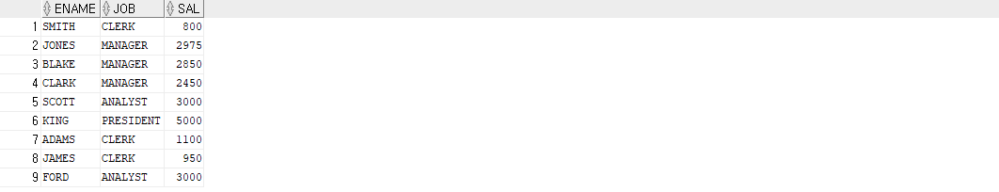

- **optimizer란?**
  - SQL을 가장 빠르고 효율적으로 수행할 최적(최저비용)의 처리 경로를 생성해 주는 DBMS 내부의 핵심엔진이다.
  - 사용자가 구조화된 질의 언어(SQL)로 결과 집합을 요구하면, 이를 생성하는데 필요한 처리 경로는 DBMS에 내장된 옵티마이저가 자동으로 생성해준다.
  - 옵티마이저가 생성한 SQL 처리 경로를 실행계획(Execution Plan)이라고 부른다.