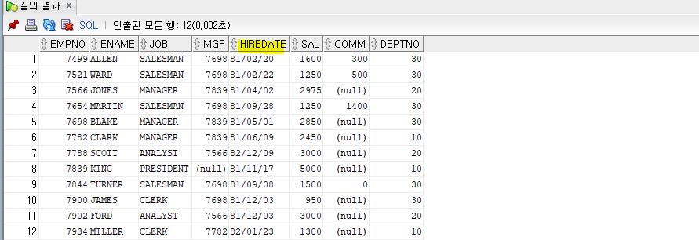
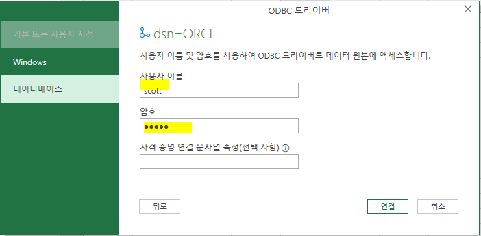
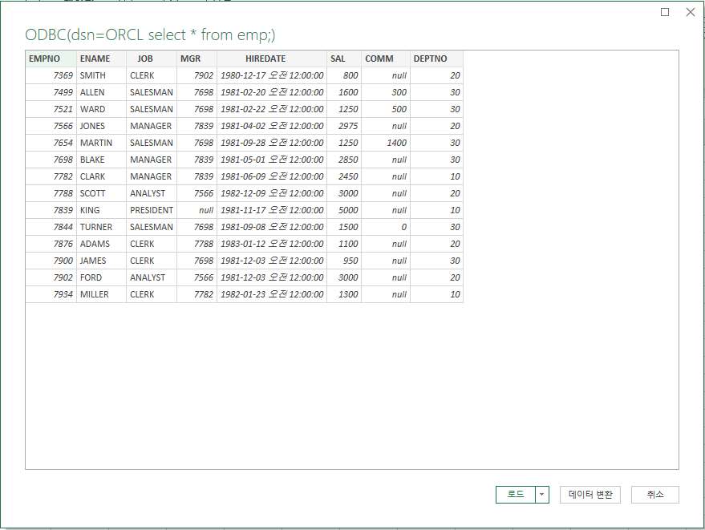

## 과제 설명

- **오라클은 숫자를 더 좋아함**
  - ex) where deptno = '10' 이렇게 쓰면 '10'을 숫자로 인식한다.


- 디스크는 영구적인 데이처가 저장되고 메모리는 임시적인 데이터가 저장된다.


- **Oracle 9i , Oracle 10g 이후 버전의 distinct**

  원래는 데이터를 정렬한 다음에 중복되는 값을 걸러내고 보여준다. 그러면 크기가 큰 데이터를 sort하면 메모리가 부족하여 메모리를 계속 늘리게 된다. 그래서 10g 버전에서는 sort를 위해 메모리 낭비가 발생하게 되는 것을 막기위해 해쉬를 이용한 중복제거를 사용한다.

  - 9i 버전 : sort 방식으로 중복을 걸러냄
    - sort 방식은 대용량 데이터를 sort하면 메모리와 디스크를 왔다갔다 해야하니까 성능이 저하가 된다.
  - 10g 버전 : hash 방법을 사용해서 중복을 걸러냄


- **집합연산자**

  - 집합연자는 데이터를 수직적으로 결합한다.(수평적으로 결합하는 것은 join이다.)
  - 집합연산자의 중복 제거
    - sort방식으로 중복을 제거해서 교집합을 구하는 것이 포함되어 있는 집합연산자는 정렬이 되어 출력된다.

   


- **Interactive SQL 과 Embedded SQL**
  - Interactive SQL
    - 사용자의 입력에 따라 동적으로 생성되고 애플리케이션에서 실행되는 SQL문
    - 개발할때 Interactive SQL에서 쿼리문을 먼저 확인하고 
  - Embedded SQL
    - SQL문을 응용 프로그램 내에서 포함되어 실행될 때 함께 실행되도록 호스트 프로그램 언어에 삽입된 SQL 
    - 그래서 C, C++, JAVA(host language) 등 다른 언어에 SQL문을 삽입된 형태를 "내장형 SQL"이라고 한다.
    - host language는 sql을 조합해서 만들고 (sql을 실행할 수 없다.) dbms 서버로 보내준다.
      - sql 디벨로퍼가 dbms서버로 보내주는 것과 같음


- decode, case 차이

| 차이점         | decode                            | case                                                         |
| -------------- | --------------------------------- | ------------------------------------------------------------ |
| 실행 속도      | 상대적으로 느림                   | 상대적으로 빠름                                              |
| 사용 범위      | (함수)SQL에서만 사용 가능         | (STATEMENT)PL/SQL에서 모두 사용 가능                         |
| 연산 범위      | 조건 값과 같은지 여부만 판별 가능 | WHEN 이후에 조건문 작성 가능<br />                           |
| NULL 비교 연산 | NULL과 NULL의 비교 시 TRUE 반환   | NULL과 NULL의 비교 시 FALSE를 반환 <br />(NULL IS NULL 비교 연산시에는 TRUE 반환) |


- 서브쿼리는 셀렉트에서만 올 수 있다. 

  - 서브쿼리가 먼저 실행되고 메인쿼리가 나중에 실행된다.

  


## ODBC / JDBC

- JDBC (Java Database Connectivity)
  - Java에서 DB에 접근하여 데이터 조회, 삽입, 수정, 삭제를 가능케하는 것을 말합니다.
  - 다시말해 Java가 Database를 사용할 수 있도록 연결해주는 **응용프로그램 인터페이스**인 Java API 입니다.


- ODBC (Open DataBase Connectivity)
  - ODBC는 데이터베이스를 액세스하기 위한 **표준 개방형 응용 프로그램 인터페이스**를 말합니다.
  - 마이크로소프트사에 의해 만들어진, 데이터베이스에 접근하기 위한 소프트웨어의 표준 규격으로,
    프로그램 내에 ODBC 문장을 사용하면 MS-Access, dBase, DB2, Excel, Text 등의 **여러 종류의 데이터베이스에 접근**할 수 있습니다.


- 워크시트를 하나 더 열면 같은 세션을 사용하는 것일까???

  

  

  


## between

- **sql 연산자(sql에만 있는 연산자)**
  - between a and b : 범위 연산자
  - in : list 연산자
  - like : 패턴 매칭 연산자


- sql 연산을 수행할 때 데이터 타입이 다른 경우 두 개의 데이터 타입을 똑같이 맞춰주고 연산한다.
  - 암시적으로 데이터 타입이 변경된다.


- **실습**

  - 3번) min, max의 범위가 바뀐 경우

  select * from emp where sal between 2000 and 1000;

  

  - 4번) 숫자 대신 문자가 들어간 경우

  select * from emp where ename between 'C' and 'K'; 

  

  

  - 5번) 날짜가 들어간 경우

  select * from emp where HIREDATE BETWEEN '81/02/20' and '82/12/09';

  

  - 6번

  select * from emp where HIREDATE BETWEEN to_date('81/02/20','yy/mm/dd') and to_date('82/12/09','yy/mm/dd') ;

  

  

  - 7번

  select * from emp where HIREDATE BETWEEN to_date('81/02/20','rr/mm/dd') and to_date('82/12/09','rr/mm/dd') ;

  

  

  - 6, 7의 차이점은?
    - 'YY'는 2000년대를 나타내고 'RR'은 1900년대를 포함한다. 즉, 'RR'은 50년을 기준으로 50 이상이면 1900년대, 50 미만이면 2000년대를 나타냅니다.
    - 

  - select * from salgrade where 3000 BETWEEN losal and hisal ;


## In

- 리스트 연산자
  - 11번. 암시적 데이터 형변환
  - 13번
    - 중복을 빼버린다.
    - a or b 는 합집합인 것이라서 먼저 sort 후 중복을 제거한다.


## like

- 문자 패턴 매칭 연산자, 정확한 값을 몰라도 찾을 수 있음

  - % : 0개 이상의 모든 문자
  - _ : 1개의 모든 문자, 위치가 의미를 가진다.

  - 13번

  SELECT ENAME,HIREDATE FROM EMP WHERE HIREDATE like '81%';

  

  - 14번

  SELECT ENAME,SAL FROM EMP WHERE SAL like 2%;

  

  - 15번

  


## Rvalue / Lvalue


----------


## R & Oracle 연동

```R

install.packages("rJava")
# install.packages("DBI")
install.packages("RJDBC") # rJava에 의존적이다.(rJava 먼저 로딩)

library(rJava)
# Sys.setenv(JAVA_HOME='C:\\Program Files\\Java\\jre1.8.0_291')
# library(DBI)
library(RJDBC)

# 1. Driver Loading
drv<-JDBC(driverClass = "oracle.jdbc.driver.OracleDriver", classPath = "C:\\Users\\HP\\Desktop\\ojdbc8.jar")

# 2. Connection
conn <-dbConnect(drv, "jdbc:oracle:thin:@//192.168.119.119:1521/dink", "scott", "tiger")

query <- "select * from emp"

dbGetQuery(conn, query)
```


- **패키지 설치 / 로딩**
  - RJDBC 패키지를 사용하기 위해서는 우선 java를 설치필요

```R
install.packages("rJava")
install.packages("RJDBC")

library(rJava)
library(RJDBC)
```


- **DBI driver 만들기 : JDBC(driverClass, classPath)**
  - JDBC creates a new DBI driver that can be used to start JDBC connections.

```R
# 1. Driver Loading
drv<-JDBC(driverClass = "oracle.jdbc.driver.OracleDriver", classPath = "C:\\Users\\HP\\Desktop\\ojdbc8.jar")
```


- **DB연동(driver, url, user_id, user_pw)**
  - dbConnect : Create a connection to a DBMS

```R
# 2. Connection
conn <-dbConnect(drv, "jdbc:oracle:thin:@//192.168.119.119:1521/dink", "scott", "tiger")
```


- **DB 연결확인**
  - dbetQuery(DBIConnection, query)

```R
query <- "select * from emp"

dbGetQuery(conn, query)
```


## 엑셀 sql db 연동

- **ODBC 설치**

  https://www.oracle.com/database/technologies/instant-client/winx64-64-downloads.html

  - 두 개 다 다운받아서 instantclient_11_2 하나의 폴더에 압축 풀기

  

  

  


- **오라클 폴더에 다운 받은 폴더 넣기**

  


- 환경변수 설정

  - 고급 시스템 설정 보기

  

  

  - 새로 만들기

  

  

  - TNS_ADMIN 추가

  

  

  - ORACLE_HOME 추가

  

  
  
  - PATH 설정
  
  
  
  
  
  - tnsnames.ora 파일 추가
  
  


- **cmd 관리자 권한 > odbc_install.exe 입력**

  


- **ODBC 추가**

  - ODBC 데이터 원본 

  

  

  - 시스템 DSN - 추가

  

  

  

  

  - NAME 입력 > Test Connection

  

  

  - 비밀번호 설정 (비밀번호 : tiger)

  


- **엑셀에서 ODBC 가져오기**

  - 데이터 > 기타 원본에서 > ODBC에서 

  

  

  - ORCL 선택

  

  

  - 아이디 : scott / 비밀번호 : tiger

  

  

  - 이 창이 뜨면 성공

  


- **sql 디벨로퍼에서 명령을 실행시켜 csv 파일로 저장하기**

  - F5 눌러서 실행

  ```sql
  SET FEEDBACK OFF
  SET HEAD ON
  SPOOL C:\Oracle\EMP_FINAL.CSV
  SELECT /*csv*/ DEPTNO,SAL*12 AS annual_SAL, ENAME, JOB, HIREDATE FROM EMP ORDER BY DEPTNO;
  ```
  
  
  
- Oracle 폴더에 csv 파일 생성
  


  - 결과


- **엑셀에서 SQL문을 사용해서 dbms에 저장되어 있는 테이블 가져오기**

  - 데이터 > 기타 원본에서 > ODBC에서

  

  

  - ORCL > sql문 작성 > 확인

  

  

  - 데이터 확인 

  