## Hash

- **해시함수(hash function)란 ?** 

  - 데이터의 효율적 관리를 목적으로 임의의 길이의 데이터를 고정된 길이의 데이터로 매핑하는 함수

  - 이 때 매핑 전 원래 데이터의 값을 키(key), 매핑 후 데이터의 값을 해시 값(hash value), 매핑하는 과정 자체를 해싱(hashing)이라고 한다.

  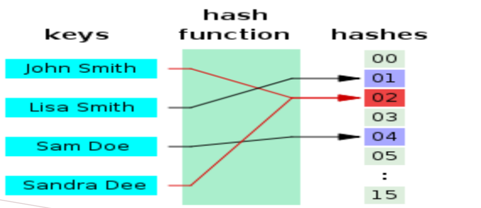

  

- **hash table**

  - 해시 함수를 사용하여 키를 해시값으로 매핑하고, 이 해시값을 색인(index) 혹은 주소 삼아 데이터의 값(value)을 키와 함께 저장하는 자료구조를 해시테이블(hash table)이라고 한다.
  - 이 때 데이터가 저장되는 곳을 버킷(bucket) 또는 슬롯(slot)이라고 한다.
  - 해시테이블의 기본 연산은 [삽입, 삭제, 탐색] 이다.

  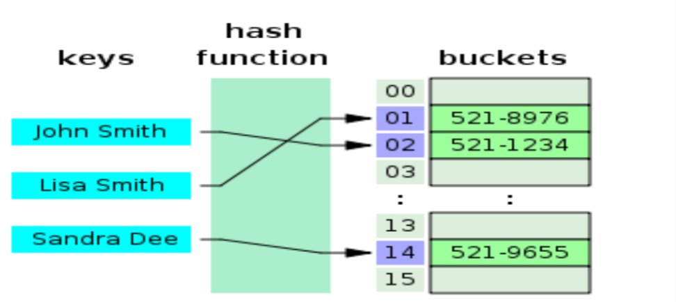

- **hash table adventage**

  - 해시 충돌이 발생할 가능성이 있음에도 해시 테이블을 쓰는 이유는 적은 리소스로 많은 데이터를 효율적으로 관리하기 위해서이다.
  - 색인(index)에 해시값을 사용함으로써 모든 데이터를 살피지 않아도 검색과 삽입/삭제를 빠르게 수행할 수 있다.
  - 해시함수로 변환하기 때문에 입력 값을 알아내기 힘들어서 보안에 용이
  - 해시의 용도
    - 무결성
    - DAM(Direct Access Method) : 데이터에 직접 접근해서 빠르다. 
    - 암호화 : 해시함수로 변환해서 입력 값을 알아내기 힘들어서 보안에 용이하다.
      - 위의 그림을 보면 john smith가 hash function에 의해 02로 바뀌는데 어떤 식으로 바뀌는지 모른다.
  - 해쉬의 특징
    - 고정 길이 : input 값(key)이 가변길이, 해시함수에서 나온 출력 값(value)이 고정 길이이다.  
    - 충돌 회피 : 
    - 단방향 : value를 가지고 key를 다시 추적할 수 없다.
  - 트리

  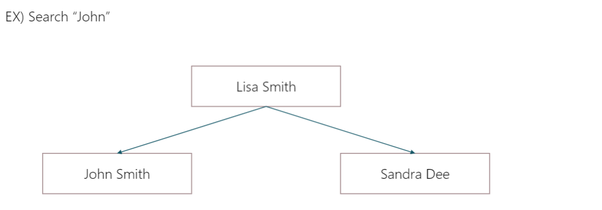

  

  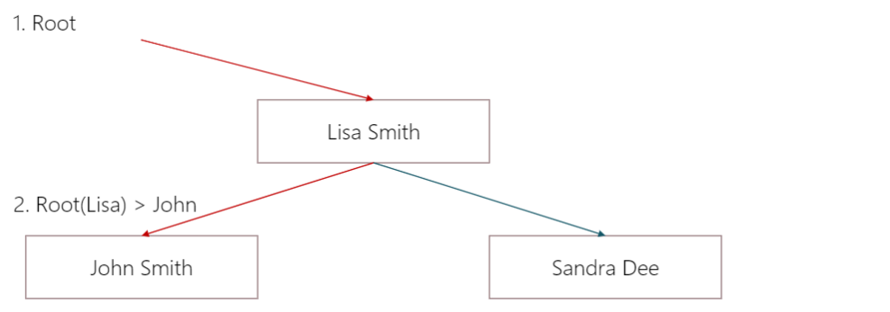

  - 해시

  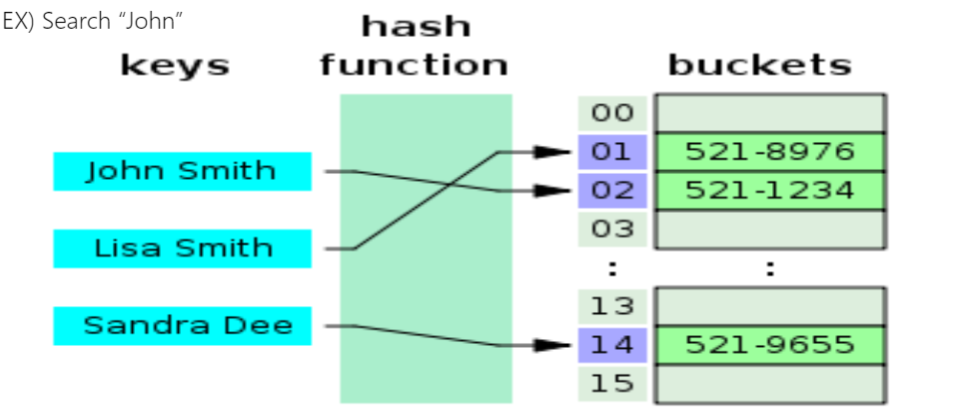

  

  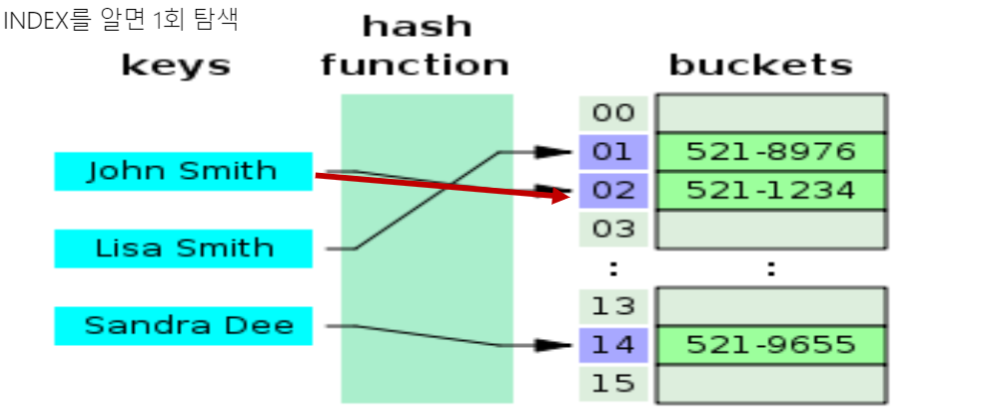

  - 위의 예제로 해키가 더 빠르다는 것을 알 수 있다.
    - 키가 해시함수를 거치면 value(01, 02, ...14, 15)가 나온다. value는 주소의 역할을 하고 있다.  

  

- **hash collision**

  - 해시 함수는  해시 값의 개수보다 대개 많은 키 값을 해시 값으로 변환(many-to-one 대응)하기 때문에 해시함수가 서로 다른 두 개의 키에 대해 동일한 해시값을 내는 해시충돌(collision)이 발생하게 된다.  

  - hash collision 해결 방안

    - Chaining
    - Open address

  - Chaining

    - 같은 value가 생기면 덮어쓰는 것이 아니고 chain처럼 연결한다. 
      - 즉, 같은 값에 대해서 list를 만들어 준다고 생각하면 된다.

    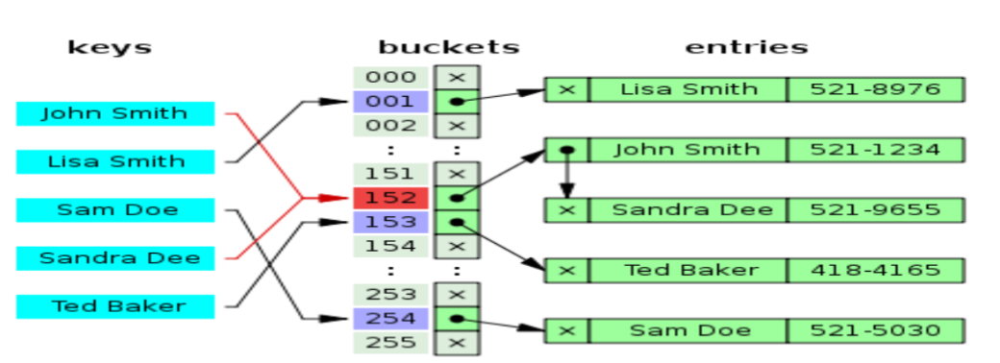

  - Open address

    - ex) divide 7 hash_F()
    - 값을 7로 나눴을 때 나오는 나머지에 키값을 넣는다.
    - 근데 충돌이 발생하면 그 나머지 값에 가까운 다음 방에 저장을 한다.

    

## 함수

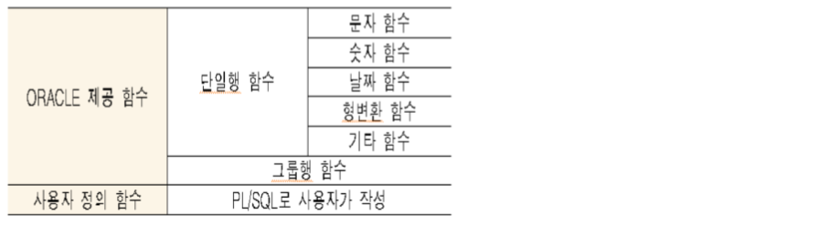

- **단일행 함수**

  - input이 하나인게 단일행 (input이 여러개면 그룹행 함수)
  - Single Row function 정의 : 1개의 row에 적용되고 1 row 당 1개의 결과를 return 
    - select list, where, order by, group by
  - select ename, lower(ename), upper(lower(ename)), length(ename), abs(sal-empno),comm from emp;
    - upper 사용할때 lower를 먼저 안해줘도 된다.
    - 함수 안에 함수가 들어갈 수 있다는 것을 보여준 것

  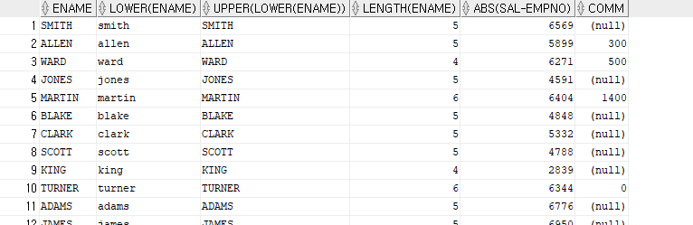

  

  

- **그룹행 함수**

  - Group Row function 정의 : N(여러 개)개의 row에 적용되고 **그룹 당** 1개의 결과를 return 한다.
  - input이 여러 row인 함수
  - group by 
    - 10g 버전에서는 hash를 사용해서 group by를 진행(distinct도)
  - select ename, substr(ename, 1, 3), hiredate from emp where hiredate between to_date('81/01/01','RR/MM/DD') and to_date('82/12/31','RR/MM/DD');
    - substr(str,startIndex,size) 

  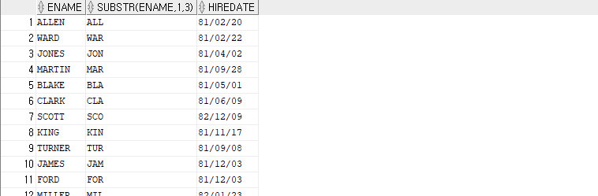

  - select avg(sal), sum(sal), sum(comm), count(*) from emp;
    - 결과 1개

  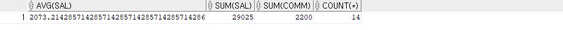

  - select deptno, count(*), sum(sal), avg(sal) from emp GROUP by DEPTNO;
    - 여러 개의 결과

  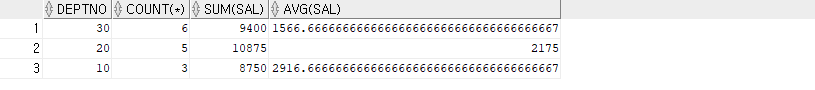

- **단일행 - 문자 함수**

  - lower, upper, substr, lengthm trim, replace 많이 쓰인다.

    - substr과 substrb 구분할줄 알아야 한다.
      - substrb : 부분 byte를 추출하는 함수
      - substr : 부분 문자를 추출하는 함수
    - length, lengthb
      - length : 문자열의 길이를 return
      - lengthb : 문자가 차지하고 있는 byte를 리턴(코드 체계와 함께 이해하기)
    - select length('대한민국') as length, lengthb('대한민국') as lengthb from dual;

    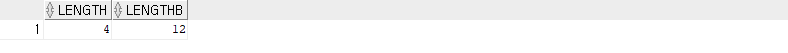

    - select length('abc') as length, lengthb('abc') as lengthb from dual;

    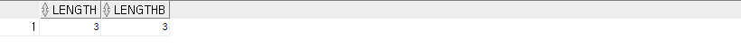

  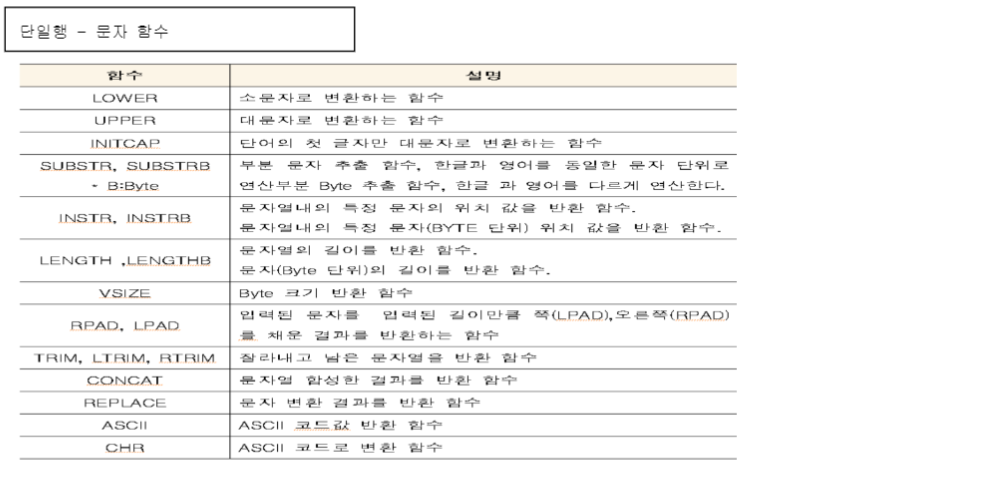

  - select initcap(ename) from emp;
    - 첫 글자만 대문자

  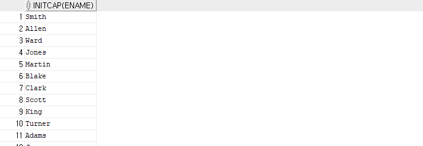

  

  - select ENAME, substr(ENAME,1,3), substr(ename,4), substr(ename,-3,2) from emp;

  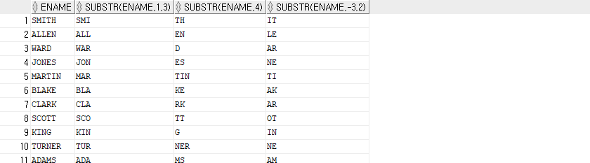

  

  - select ename, instr(ename,'A'), instr(ename,'A',2), instr(ename,'A',1,2) from emp;
    - instr : 문자의 위치를 return 
    - instr(str, 시작 위치, 발생 횟수)
      - **시작 위치와 발생 횟수의 default는 1이다. 만약 발생 횟수가 2이면 지정한 str이 2번 발생한 위치를 return**

  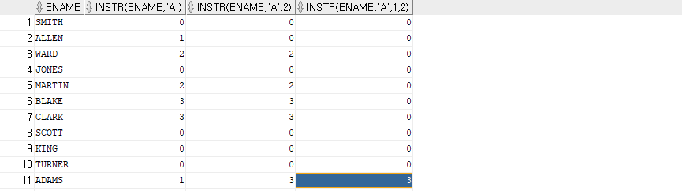

  - select ename, rpad(ename,10,'*'), lpad(ename,10,'+') from emp;
    - rpad : ename 오른쪽에 *을 찍어서 ename이 총 10의 length를 가지게 만듦
    - lpad : ename 왼쪽에 +를 찍어서 ename이 총 10의 length를 가지게 만듦

  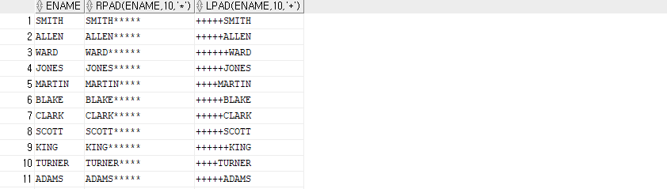

  - select ename, rpad(ename,10,' ') || ' ''s Job is' || lpad(job,10,' ')from emp;

  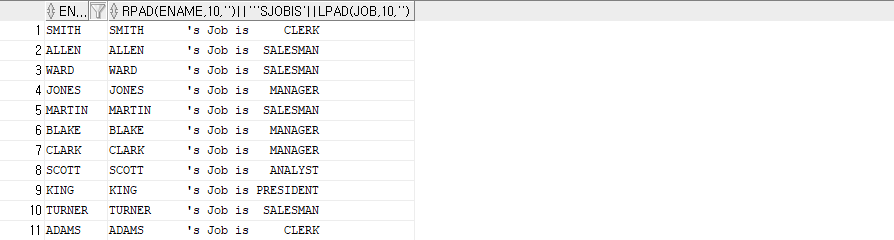

  

  - select ename, rpad(ename,10,'') || ' ''s Job is' || lpad(job,10,'')from emp;

    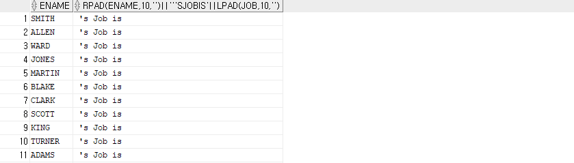

    - rpad(값, 총 문자길이, 채움문자)

    - **''에 띄어쓰기를 안 넣으면 ename과 job이 나오지 않음!!!!!!(이유 찾아보기!!!)**

      - **왜냐하면 ''는 null값이기 때문이다.**

        - select * from emp where rpad(ename,10,'') is null;

        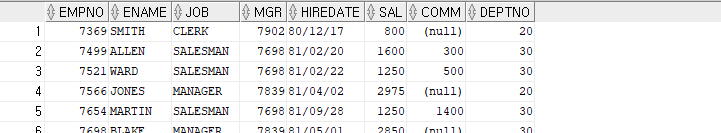

  

  - select ename, replace(ename,'S','s') from emp;
    - S를 s로 치환

  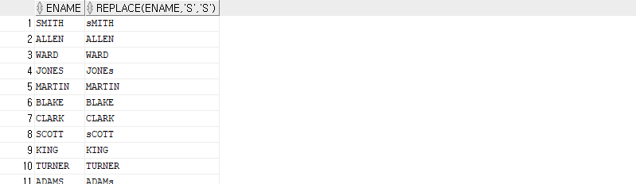

  

  - select vsize('대한민국'), substrb('대한민국', 2, 6) from dual;

    select vsize('대한민국'), substrb('대한민국', 2, 8) from dual;

    - 왜 이런 결과나 나오나?
    - **한글은 하나에 3byte가 아닌가?(찾아보기!!!!!!!!!)**

    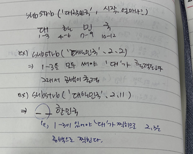 

  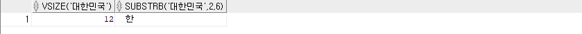

  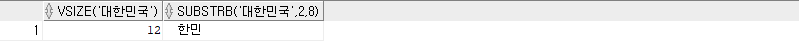

  

  - select ltrim(' 대한민국 ' ), rtrim(' 대한민국 ' ), trim(' 대한민국 ' ) from dual;
    - ltrim은 왼쪽의 공백을 제거
    - rtrim은 오른쪽의 공백 제거
    - trim은 양쪽 공백 제거
    - trim(str, 'a') = > a를 제거

  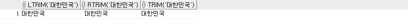

- **단일행 - 숫자 함수**

  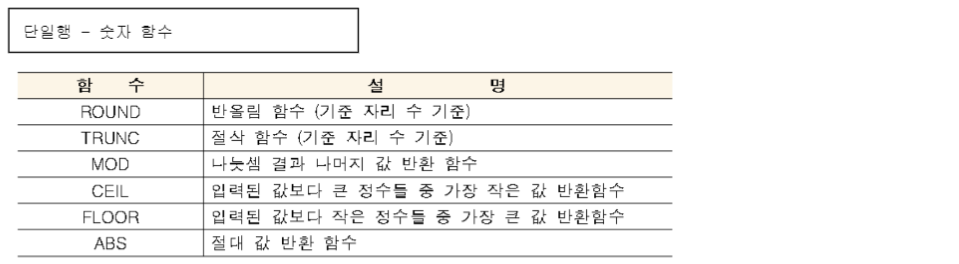

- **cf. 유니코드** 
  - 가변길이 유니코드와 고정길이 유니코드가 있다.
  - 한글이 3바이트 : utf-8, utf-16
  - 한글이 2바이트 : euc-kr

## date type

- date type

  - **연산이 가능하다.**
    - select sysdate, sysdate + 7, sysdate - 2 , sysdate + 1/24 from dual;
      - 1/24는 1시간
      - 시간은 단위를 정수가 아니고 소숫점으로 표현한다.

  - **date type은 고정된 7byte의 공간을 할당 받는다.**

  - **날짜와 시간 정보를 가지고 있음**

  - **저장된 포맷은**

    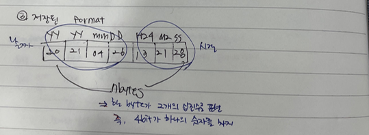 

    -  **dbms에 저장할때는 숫자와 같이 저장함 그러나 외부로 표현할때는 문자처럼 표현을 한다. 즉, 내부 저장 방식과 외부 표현 방식이 다르다(중요!!!!!!!!!!!!!!!!!!!)** 

  - **왜 날짜는 저장 방식과 외부 표현 방식을 분리했을까????**

    - 나라마다 날짜 표현 방식이 다르기 때문이다.**(National Language Support, NLS) 단어 외우기!!!**

  

- **round와 truncate는 날짜에도 쓰인다.**
  - 날짜만 구한다는 것 (시간은 버리겠다는 의미)

- **session**

  - **devDinkDBMS ~ 1, devDinkDBMS ~ 2의 워크시트는 같은 세션일까?**

    - 만약 다른 세션이면  devDinkDBMS ~ 1 안에서 ALTER SESSION을 사용하면 devDinkDBMS ~ 1에만 영향을 미친다.

    - 만약 같은 세션이면 devDinkDBMS ~ 1 안에서 ALTER SESSION을 사용하면 devDinkDBMS ~ 1, devDinkDBMS ~ 2 둘 다 영향을 미친다.
    - 같은 세션이다!!