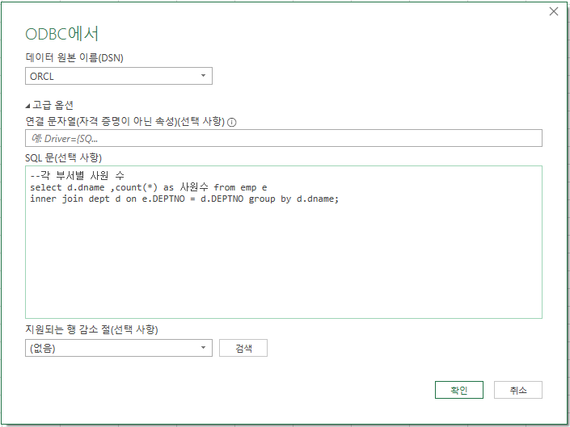

## 1번


- ### **고객 연령별 비율**


```sql
--연령대, 성별 고객의 수
select case 
    when birth_dt < '60/01/01'  then '50년생미만'
    when birth_dt between '60/01/01' and '69/12/31' then '60년생'
    when birth_dt between '70/01/01' and '79/12/31' then '70년생'
    when birth_dt between '80/01/01' and '89/12/31' then '80년생'
    when birth_dt between '90/01/01' and '99/12/31' then '90년생'
    when birth_dt > '99/12/31'  then '20년생~'
end as age, count(*) as 고객수 from customer
group by case 
    when birth_dt < '60/01/01'  then '50년생미만'
    when birth_dt between '60/01/01' and '69/12/31' then '60년생'
    when birth_dt between '70/01/01' and '79/12/31' then '70년생'
    when birth_dt between '80/01/01' and '89/12/31' then '80년생'
    when birth_dt between '90/01/01' and '99/12/31' then '90년생'
    when birth_dt > '99/12/31'  then '20년생~'
end
;
```


- ### 지역별 고객 비율


```sql
--지역별 고객 수
select decode(substr(address1,1,instr(address1,' ', 1, 1) -1 ), 'uC778천','인천광역시',substr(address1,1,instr(address1,' ', 1, 1) -1 )) 
as local, count(*) as "고객수" from customer group by substr(address1,1,instr(address1,' ', 1, 1) -1 );

```


- ### 각 부서별 사원 수

```sql
select d.dname ,count(*) from emp e
inner join dept d on e.DEPTNO = d.DEPTNO group by d.dname;
```





- ### 부서 별 고객 수

```sql
--부서 별 고객 수
select d.dname as 부서, count(*) as 고객수 from customer c 
inner join emp e
on c.ACCOUNT_MGR = e.EMPNO 
inner join dept d
on e.deptno = d.DEPTNO
group by d.DNAME;
```


## 파이썬 설치

- https://www.python.org/downloads/


- 아나콘다 설치

  https://www.anaconda.com/products/individual#download-section


```
import pyodbc
import pandas as pd
import numpy as np
import numpy as np
import matplotlib.pyplot as plt

cnxn = pyodbc.connect("DSN=ORCL; uid=scott; pwd=tiger")

query = "SELECT e.ENAME AS ENAME, COUNT(c.ID) AS customer_count, AVG(SAL)*12 AS annual_salary FROM CUSTOMER c, EMP e WHERE c.ACCOUNT_MGR = e.EMPNO GROUP BY e.ENAME;"
df = pd.read_sql(query, cnxn)

plt.figure(figsize=(20, 10))

plt.rc('font', family='Malgun Gothic')

plt.title("사원별 고객의 수와 연봉")

plt.scatter(df.CUSTOMER_COUNT, df.ANNUAL_SALARY)

plt.xlabel('고객수', fontsize=20)

plt.ylabel('연봉', fontsize=20)

plt.show()


js = df.to_json(orient = 'table')

#출력 : print(json.dumps(js, ensure_ascii=False,indent"\t"))
 
with open('df.json', 'w', encoding='utf-8') as file:
    df.to_json(file, force_ascii=False)

```


