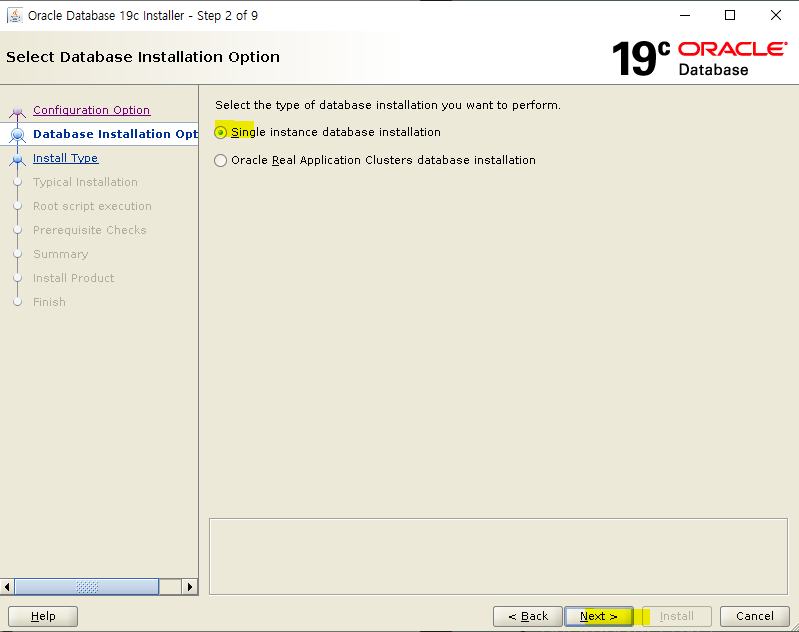
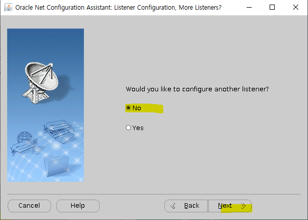

## Oracle Linux 8.1에 Oracle 19c 설치


- ### Oracle Linux 8.1 (64bit) 설치 

  -  https://yum.oracle.com/oracle-linux-isos.html **에서 다운로드 받음**

  

  

  - **VMware Workstation 에서 New Virtual Machine 선택**

  

  - **I will install the operating system later. 선택**

  

  - **Linux - Oracle Linux 8 64-bit 선택**

  

  - **Virtual machine 이름 설정**

  

  - **50, Store virtual disk as a single file 선택**

  

  - **Finish**

  

  - **Settings 클릭**

  

  - **Memory > 4096MB 선택**

  

  -  **USB, Printer, 사운드 삭제**

  

  - **CD/DVD 에서 Browse 선택**

  

  - **Oracle linux 8.1 설치 미디어 삽입**

  

  - **전원 ON**

  

  - **Install Oracle Linux 8.1.0 선택**

  

  - **한국어 선택**

  

  - **시간 및 날짜 선택**

  

  - **아시아 - 서울 선택 후 완료**

  

  - **소프트웨어 선택**

  

  - **서버 - GUI 사용 - 레거시 UNIX 호환성, 개발용 툴 선택 후 완료**

  

  - **설치 대상 선택 **

  

  - **Custom 선택 후 완료**

  

  - **수동으로 파티션 설정, + 버튼 **

  

  - **/boot 500MB 마운트 지점 추가**

  

  - **수동으로 파티션 설정, + 버튼 - swap 4096MB 마운트 지점 추가**

  

  - **수동으로 파티션 설정, + 버튼 - / 용량설정X 마운트 지점 추가(자동으로 나머지 모두 할당)**
  
  
  
  - **수동으로 파티션 설정, 설정된 파티션 확인 후 완료** 
  
  
  
  - **변경 사항 적용 선택**
  
  
  
  - **KDUMP **
  
  
  
  - **kdump 활성화 체크 해제 후 완료**
  
  
  
  - **네트워크 & 호스트 이름**
  
  
  
  - **Host Name 설정 후 적용 - 설정**
  
  
  
  - **일반, Connect automatically with priority 체크**
  
  
  
  - **IPv4 설정. 주소 192.168.119.111 설정**
  
  
  
  - **IPv6 설정, 무시**
  
  
  
  - **켬 선택 후 완료**
  
  
  
  - **보안 정책**
  
  
  
  - **끔 선택 후 완료**
  
  
  
  - **Root 암호 선택**
  
  
  
  - **ROOT 암호, root 2번 입력 후 완료 2번 선택**
    - 암호 root
  
  
  
  - **설치 시작**
  
  
  
  - **설치 중**
  
  
  
  - **시스템 재시작 선택**
  
  
  
  - **사용자 생성 선택**
  
  
  
  - **admin/admin 입력 후 완료 2번 선택**
  
  
  
  - **License Information**
  
  
  
  - **약관 동의 후 완료**
  
  
  
  - **설정완료 선택**
  
  
  
  


## 오라클 설치 전 사전 설정

- **oracle linux로 들어간 후 /etc/hosts 설정**

  ```shell
  vi /etc/hosts
  ```

  

  

- **/etc/hostname 확인**

  ```shell
  vi /etc/hostname 
  ```

  


- **자동 설정**

  ```shell
  yum -y install oracle-database-preinstall-19c
  ```


- **수동 설정**

  - **/etc/sysctl.conf에 아래 내용 추가**

  ```shell
  vi /etc/sysctl.conf
  ```

  ```shell
  fs.file-max = 6815744
  kernel.sem = 250 32000 100 128
  kernel.shmmni = 4096
  kernel.shmall = 1073741824
  kernel.shmmax = 4398046511104
  kernel.panic_on_oops = 1
  net.core.rmem_default = 262144
  net.core.rmem_max = 4194304
  net.core.wmem_default = 262144
  net.core.wmem_max = 1048576
  net.ipv4.conf.all.rp_filter = 2
  net.ipv4.conf.default.rp_filter = 2
  fs.aio-max-nr = 1048576
  net.ipv4.ip_local_port_range = 9000 65500
  ```

  

  - **잘 입력되었는지 확인**

  ```shell
  /sbin/sysctl -p
  ```

  ```shell
  fs.file-max = 6815744
  kernel.sem = 250 32000 100 128
  kernel.shmmni = 4096
  kernel.shmall = 1073741824
  kernel.shmmax = 4398046511104
  kernel.panic_on_oops = 1
  net.core.rmem_default = 262144
  net.core.rmem_max = 4194304
  net.core.wmem_default = 262144
  net.core.wmem_max = 1048576
  net.ipv4.conf.all.rp_filter = 2
  net.ipv4.conf.default.rp_filter = 2
  fs.aio-max-nr = 1048576
  net.ipv4.ip_local_port_range = 9000 65500
  ```

  

  - **cf. 커널 파라미터란?!**

    오라클 프로세스에게 RAM 메모리를 할당하기 위해 sysctl.conf 파일에 적혀있는 커널 파라미터를 참조하여 메모리를 할당한다. 

    - shmmax : 공유 메모리 세그먼트의 최대 크기를 정의 
      - 커널이 응용 프로그램들에게 메모리를 할당해 줄 때 작게 여러 번 할당하지 않고 큰 덩어리(=세그먼트)로 한꺼번에 준다. 이 값이 너무 작으면 DB를 시작 시켰을 때 ORA-27123 : unable to attach to shared moemory segment라는 메시지가 발생할 수 있고 너무 크면 세그먼트의 사용되지 않는 빈 공간을 두기 때문에 메모리 낭비가 발생 
      - 이 값의 기본값은 32MB입니다. 그러나 오라클이 사용하기엔 양이 부족하므로 2GB로 설정도록 권장
    - shmmni : 공유 메모리 세그먼트의 최대 개수를 설정
      - 기본값 4096으로 냅둬도 괜찮음
    - shmall : 특정 시점에서 시스템에서 사용 가능한 공유 메모리의 최대 크기를 설정
      - 이 값은 "ceil(shmmax/page_size)"으로 권장
      - 디폴트 사이즈는 2097152 바이트이다.
    - shmmin : 단일 공유메모리 세그먼트의 최소 크기
    - shmseg : 1개의 프로세스에 부여될 수 있는 공유메모리 세그먼트의 최대 개수 
      - 위에서 살펴본 shmmni는 시스템 전체에서 사용가능한 공유 메모리 세그먼트의 최대 개수이고 이 파라미터는 1개의 프로세스가 사용할 수 있는 공유 메모리 세그먼트의 최대 개수이다.

    

  - **아래 파일 생성 후 내용 추가**
    - nproc : User당 사용할 수 있는 프로세스 최대 개수
    - nofile : User당 오픈할 수 있는 파일 개수 (리눅스에서는 모든 개체를 파일로 본다.)

  ```shell
  vi /etc/security/limits.d/oracle-database-preinstall-19c.conf
  ```

  ```shell
  # oracle-database-preinstall-19c setting for nofile soft limit is 1024
  oracle   soft   nofile    1024
  # oracle-database-preinstall-19c setting for nofile hard limit is 65536
  oracle   hard   nofile    65536
  # oracle-database-preinstall-19c setting for nproc soft limit is 16384
  # refer orabug15971421 for more info.
  oracle   soft   nproc    16384
  # oracle-database-preinstall-19c setting for nproc hard limit is 16384
  oracle   hard   nproc    16384
  # oracle-database-preinstall-19c setting for stack soft limit is 10240KB
  oracle   soft   stack    10240
  # oracle-database-preinstall-19c setting for stack hard limit is 32768KB
  oracle   hard   stack    32768
  # oracle-database-preinstall-19c setting for memlock hard limit is maximum of 128GB on x86_64 or 3GB on x86 OR 90 % of RAM
  oracle   hard   memlock    134217728
  # oracle-database-preinstall-19c setting for memlock soft limit is maximum of 128GB on x86_64 or 3GB on x86 OR 90% of RAM
  oracle   soft   memlock    134217728
  ```

  

  - **rpm 설치용 쉘파일 생성**

  ```shell
  vi rpm.sh
  ```

  ```shell
  # vi rpm.sh
  dnf install -y bc    
  dnf install -y binutils
  #dnf install -y compat-libcap1
  dnf install -y compat-libstdc++-33
  #dnf install -y dtrace-modules
  #dnf install -y dtrace-modules-headers
  #dnf install -y dtrace-modules-provider-headers
  #dnf install -y dtrace-utils
  dnf install -y elfutils-libelf
  dnf install -y elfutils-libelf-devel
  dnf install -y fontconfig-devel
  dnf install -y glibc
  dnf install -y glibc-devel
  dnf install -y ksh
  dnf install -y libaio
  dnf install -y libaio-devel
  #dnf install -y libdtrace-ctf-devel
  dnf install -y libXrender
  dnf install -y libXrender-devel
  dnf install -y libX11
  dnf install -y libXau
  dnf install -y libXi
  dnf install -y libXtst
  dnf install -y libgcc
  dnf install -y librdmacm-devel
  dnf install -y libstdc++
  dnf install -y libstdc++-devel
  dnf install -y libxcb
  dnf install -y make
  dnf install -y net-tools # Clusterware
  dnf install -y nfs-utils # ACFS
  dnf install -y python # ACFS
  dnf install -y python-configshell # ACFS
  dnf install -y python-rtslib # ACFS
  dnf install -y python-six # ACFS
  dnf install -y targetcli # ACFS
  dnf install -y smartmontools
  dnf install -y sysstat
  dnf install -y unixODBC
   
  # New for OL8
  dnf install -y libnsl
  dnf install -y libnsl.i686
  dnf install -y libnsl2
  dnf install -y libnsl2.i686
  ```


- **쉘 실행**

  ```shell
  sh rpm.sh
  ```
  
  

- **유저 및 그룹 생성**

  ```shell
  groupadd -g 54321 oinstall
  groupadd -g 54322 dba
  groupadd -g 54323 oper 
  useradd -u 54321 -g oinstall -G dba,oper oracle
  ```

  

- **selinux disable 설정**

  ```shell
  vi /etc/selinux/config
  ```

  


- **방화벽 해제**

  ```shell
  systemctl stop firewalld
  systemctl disable firewalld
  ```


- **설치 경로 생성**

  ```shell
  mkdir -p /ORA19/app/oracle/product/19.0.0/db_1/
  mkdir -p /ORA19/app/oradata
  chown -R oracle:oinstall /ORA19
  chmod -R 775 /ORA19
  ```

  

- **서버에 Oracle Database 설치 미디어 업로드 후 권한 부여**

  - **window에서 설치 후 리눅스로 파일 옮기기**

  

  

  - **option > shared folders > add**

  

  

  - **next**

  

  

  - **옮길 파일이 있는 window 폴더 위치** 

  

  

  - **finish**

  

  

  - **window에서 linux로 옮긴 폴더 위치**

  
  
  
  
  - **zip 파일을 아까 생성한 /ORA19/app/oracle/product/19.0.0/db_1/ 폴더로 옮기기**
  
    ```shell
    mv LINUX.X64_193000_db_home.zip  /ORA19/app/oracle/product/19.0.0/db_1/
    ```
  
    
  
    
  
  - **서버에 Oracle Database 설치 미디어 업로드 후 권한 부여**
  
    ```
    chown oracle:oinstall LINUX.X64_193000_db_home.zip
    ```


-  **.bash_profile 에 아래 내용 추가**

  ```shell
  su - oracle
  vi .bash_profile
  ```

  ```shell
  export TMP=/tmp
  export TMPDIR=$TMP
   
  export ORACLE_HOSTNAME=oel8
  export ORACLE_UNQNAME=oracle19
  export ORACLE_BASE=/ORA19/app/oracle
  export ORACLE_HOME=$ORACLE_BASE/product/19.0.0/db_1
  export ORA_INVENTORY=/ORA19/oraInventory
  export ORACLE_SID=oracle19
  export DATA_DIR=/ORA19/app/oradata
  export PATH=/usr/sbin:/usr/local/bin:$PATH
  export PATH=$ORACLE_HOME/bin:$PATH
  export LD_LIBRARY_PATH=$ORACLE_HOME/lib:/lib:/usr/lib
  export CLASSPATH=$ORACLE_HOME/jlib:$ORACLE_HOME/rdbms/jlib
   
  export DISPLAY=192.168.119.111:0.0
  ```


- **오라클 설치 파일 압축 해제**	

  ```shell
  cd $ORACLE_HOME
  unzip Oracle\ Database\ 19.3.0.0.0\ for\ Linux\ x86-64\(V982063-01\).zip 
  ```


## Oracle Software 설치

- **oracle linux로 들어가서 profile 로 들어가서 주석처리**

  

  


- **환경변수 적용 완료**


- **윈도우에서 xming 다운로드 - gui 환경설정**

  https://sourceforge.net/projects/xming/

  

  

  

  

  

  

  

  - XLaunch

  

  

  

  

  

  

  

- **putty 접속 후 오라클 설치**

  - **SSH - X11**

  

  - **Session 설정**

  

  - **oracle 리눅스에 있는 oracle 계정으로 login**
  


- **비밀번호 : oracle**
    - export LANG=c : 한글 깨짐 방지

  

  

  - **오라클 설치**

  

  

  - **에러 발생**
  
  
  
  
  
- **에러  조치 방법**
  
  - **CV_ASSUME_DISTID 값을 설정**
  
    ```shell
  $ export CV_ASSUME_DISTID=RHEL7.6
    $ ./runInstaller
    ```
  
  
  
  
  
- 에러 원인 : **OS 호환성 문제**
      - **oracle 19c docs 를 보니 oracle linux 8은 아직 지원하지 않는다고 나옴**

  - **Set Up Software Only 선택**

  

  

  - **Single instance database installation 선택**

  

  

  - **Enterprise Edition 선택**

  
  
  
  
- **Oracle base 경로 설정**


- **Inventory 경로 선택**
  


- **그룹 권한 선택**
  
  
  
  
  
  - **./runinstaller 실행후 자동으로 root 스크립트 실행을 위한 root 패스워드 입력****(root.sh 등)**
    - passwd : root
  
  
  
  
  
  - **install**
  
  
  
  
  
  - **root 스크립트를 돌리기 전 확인차 물어보는 메세지 Yes 선택**
  
  
  
  
  
  - **db 소프트웨어(엔진) 설치 완료 Close 선택**
  
  


- #### 리스너 설정

  - **오라클 리눅스에서 netca 입력**

  

  - **Listener configuration 선택**

  

  - **Add 선택**

  

  - **리스너 이름 설정**

  

  - **프로토콜 설정**

  

  - **Use the standard port number of 1521 선택**

  

  - **no**

  

  - **next**

  

  - **finish**

  


- db생성

  ```
  $ dbca
  ```

  

  - **Create a database 선택**

  

  - **Advanced configuration 선택**

  

  - **Custom Database 선택**

  

  - **oracle SID 입력**

  

  

  - - **Use following for the database storage attributes 선택**

    

    - **next 선택**

    

    - **리스너 선택**

    

    - **모두 체크 해제**

    

    - **Memory 에서 AMM 사이즈는 1024MB 선택**

    

    - **Choose from the list of character sets 는 KO16MSWIN949 선택**

    

    - **Connection mode 는 Dedicated server mode 선택**

    

    - **Sample schemas 는 선택 안함**

    

    - **EM 체크 해제**

    

    - **sys 계정 패스워드 설정**
      - passwd : oracle

    

    - **Create database 선택**

    

    - **Finish 선택**

    

    - db instance 생성 중

    

    - **db 인스턴스 생성 완료**

    

    - **db 접속 후 버전 및 상태 확인**

      - 리눅스에서

      ```
      $ sqlplus / as sysdba
      SQL> select instance_name, version, status from v$instance;
      ```

    

    

  - db를 사용할 수 있는 계정을 생성

    - user name : linux_scott / passwd : 1234
    - 그리고 계정에 권한주기 (모든 권한주기)

    ```
    SQL> CREATE USER linux_scott IDENTIFIED BY 1234;
    
    SQL> GRANT CONNECT, DBA, RESOURCE TO linux_scott;
    ```

    

  

  - SQL Developer에 접속

    

  

  

  

