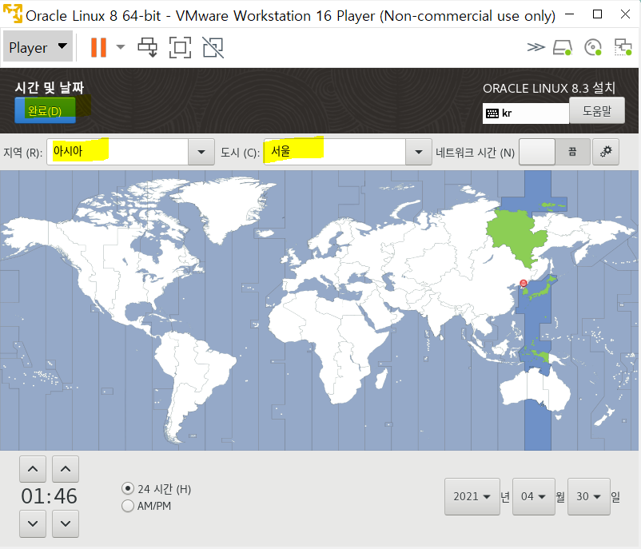
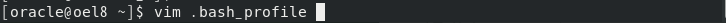

## LinuxOS에 Oracle 12g R2or 19cR2 설치 및 구성


- Oracle Linux 8.1 (64bit) 설치 

  -  https://yum.oracle.com/oracle-linux-isos.html

  

  ​	

  

  

  

  

  

  

  

  

  

  

  

  

  

  

  

  

  

  

  

  

  

  

  

  

  

  

  

  

  

  

  

  

  

  

  

  

  

  

  

  

  

  

  

  

  

  

  


## 환경설정


- **/etc/hosts 설정**


- **/etc/hostname 확인**


- 오라클 설치 전 사전 설정


- rpm 설치용 쉘파일 생성

```
# vi rpm.sh
dnf install -y bc    
dnf install -y binutils
#dnf install -y compat-libcap1
dnf install -y compat-libstdc++-33
#dnf install -y dtrace-modules
#dnf install -y dtrace-modules-headers
#dnf install -y dtrace-modules-provider-headers
#dnf install -y dtrace-utils
dnf install -y elfutils-libelf
dnf install -y elfutils-libelf-devel
dnf install -y fontconfig-devel
dnf install -y glibc
dnf install -y glibc-devel
dnf install -y ksh
dnf install -y libaio
dnf install -y libaio-devel
#dnf install -y libdtrace-ctf-devel
dnf install -y libXrender
dnf install -y libXrender-devel
dnf install -y libX11
dnf install -y libXau
dnf install -y libXi
dnf install -y libXtst
dnf install -y libgcc
dnf install -y librdmacm-devel
dnf install -y libstdc++
dnf install -y libstdc++-devel
dnf install -y libxcb
dnf install -y make
dnf install -y net-tools # Clusterware
dnf install -y nfs-utils # ACFS
dnf install -y python # ACFS
dnf install -y python-configshell # ACFS
dnf install -y python-rtslib # ACFS
dnf install -y python-six # ACFS
dnf install -y targetcli # ACFS
dnf install -y smartmontools
dnf install -y sysstat
dnf install -y unixODBC
 
# New for OL8
dnf install -y libnsl
dnf install -y libnsl.i686
dnf install -y libnsl2
dnf install -y libnsl2.i686
```


- 쉘 실행

  sh rpm.sh


- 유저 및 그룹 생성

```
groupadd -g 54321 oinstall
groupadd -g 54322 dba
groupadd -g 54323 oper 
useradd -u 54321 -g oinstall -G dba,oper oracle

```


- selinux disable 설정
  - vi /etc/selinux/config


- 방화벽 해제

  ```
  systemctl stop firewalld
  systemctl disable firewalld
  
  ```


- 설치 경로 생성

```
mkdir -p /ORA19/app/oracle/product/19.0.0/db_1/
mkdir -p /ORA19/app/oradata
chown -R oracle:oinstall /ORA19
chmod -R 775 /ORA19
```


- **서버에 Oracle Database 설치 미디어 업로드 후 권한 부여**

  - window에서 설치 후 리눅스로 파일 옮기기

  

  - option > shared folders > add

  

  - next

  

  - 폴더 위치 

  

  - finish

  

  - 폴더 위치

  

  - zip 파일을 아까 생성한 /ORA19/app/oracle/product/19.0.0/db_1/ 폴더로 옮기기

    mv LINUX.X64_193000_db_home.zip  /ORA19/app/oracle/product/19.0.0/db_1/

    

  - 서버에 Oracle Database 설치 미디어 업로드 후 권한 부여

  ```
  chown oracle:oinstall LINUX.X64_193000_db_home.zip
  ```


- 오라클 계정 접속 후 **.bash_profile 에 아래 내용 추가**

```
# su - oracle
$ vi .bash_profile
```

```
export TMP=/tmp
export TMPDIR=$TMP
 
export ORACLE_HOSTNAME=oel8
export ORACLE_UNQNAME=oracle19
export ORACLE_BASE=/ORA19/app/oracle
export ORACLE_HOME=$ORACLE_BASE/product/19.0.0/db_1
export ORA_INVENTORY=/ORA19/oraInventory
export ORACLE_SID=oracle19
export DATA_DIR=/ORA19/app/oradata
export PATH=/usr/sbin:/usr/local/bin:$PATH
export PATH=$ORACLE_HOME/bin:$PATH
export LD_LIBRARY_PATH=$ORACLE_HOME/lib:/lib:/usr/lib
export CLASSPATH=$ORACLE_HOME/jlib:$ORACLE_HOME/rdbms/jlib
 
export DISPLAY=192.168.119.111:0.0
```


- 오라클 설치 파일 압축 해제

```
$ cd $ORACLE_HOME
$ unzip Oracle\ Database\ 19.3.0.0.0\ for\ Linux\ x86-64\(V982063-01\).zip 
```


## Oracle Software 설치


- profile 로 들어가서 주석처리

  

  


- 환경변수 적용 완료


- 윈도우에서 xming 다운로드 - gui 환경설정

  https://sourceforge.net/projects/xming/

  

  

  

  

  

  

  

  

  

  

  

  

  

  

- putty 접속 후 오라클 설치

  - 오라클 설치

  

  

  

  - 비밀번호 : oracle
    - export LANG=c : 한글 깨짐 방지

  

  - 오라클 설치

  

  - 에러 발생

  

  - 에러 조치 방법

    - **CV_ASSUME_DISTID 값을 설정**

    ```
    $ export CV_ASSUME_DISTID=RHEL7.6
    $ ./runInstaller
    ```

    

    - 에러 원인 : **OS 호환성 문제**
      - **oracle 19c docs 를 보니 oracle linux 8은 아직 지원하지 않는다고 나옴**

  - **Set Up Software Only 선택**

  

  - **Single instance database installation 선택**

  

  - **Enterprise Edition 선택**

  

  - **Oracle base 경로 설정**

  

  - **oraInventory 경로 선택**

  

  - **그룹 권한 선택**

  

  - **./runinstaller 실행후 자동으로 root 스크립트 실행을 위한 root 패스워드 입력****(root.sh 등)**
    - passwd : root

  

  - install

  

  - **root 스크립트를 돌리기 전 확인차 물어보는 메세지 Yes 선택**

  

  - db 소프트웨어(엔진) 설치 완료 Close 선택

  


- 리스너 설정

  netca

  

  - **Listener configuration 선택**

  

  - **Add 선택**

  

  - **리스너 이름 설정**

  

  - 프로토콜 설정

  

  - **Use the standard port number of 1521 선택**

  

  - no

  

  - next

  

  - finish

  


- db생성

  ```
  $ dbca
  ```

  

  - **Create a database 선택**

  

  - **Advanced configuration 선택**

  

  - **Custom Database 선택**

  

  - oracle SID 입력

  

  

  - - **Use following for the database storage attributes 선택**

    

    - next 선택

    

    - 리스너 선택

    

    - **모두 체크 해제**

    

    - **Memory 에서 AMM 사이즈는 1024MB 선택**

    

    - **Choose from the list of character sets 는 KO16MSWIN949 선택**

    

    - **Connection mode 는 Dedicated server mode 선택**

    

    - **Sample schemas 는 선택 안함**

    

    - **EM 체크 해제**

    

    - **sys 계정 패스워드 설정**
      - passwd : oracle

    

    - Create database 선택

    

    - **Finish 선택**

    

    - db instance 생성 중

    

    - **db 인스턴스 생성 완료**

    

    - **db 접속 후 버전 및 상태 확인**

      - 리눅스에서

      ```
      $ sqlplus / as sysdba
      SQL> select instance_name, version, status from v$instance;
      ```

    

    

  - db를 사용할 수 있는 계정을 생성

    - user name : linux_scott / passwd : 1234
    - 그리고 계정에 권한주기 (모든 권한주기)

    ```
    SQL> CREATE USER linux_scott IDENTIFIED BY 1234;
    
    SQL> GRANT CONNECT, DBA, RESOURCE TO linux_scott;
    ```

    

  

  - SQL Developer에 접속

    

  

  

  

