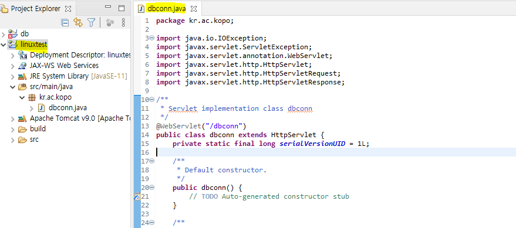
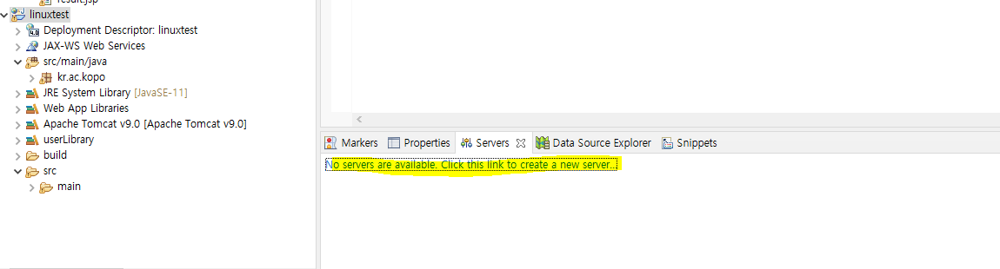
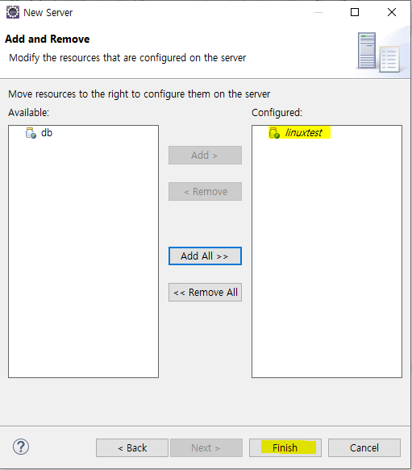
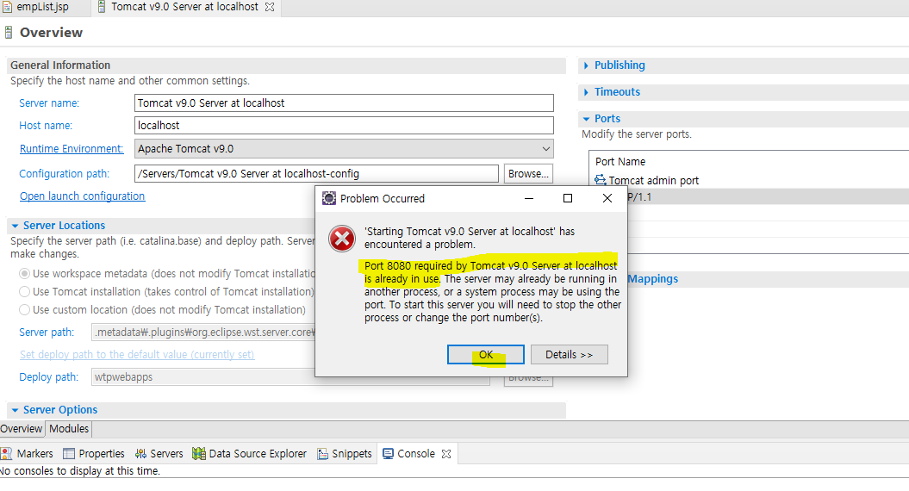
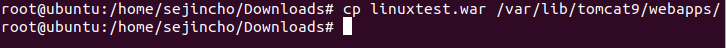

## WEB/WAS/DBMS 연동

- #### **emp table을 linux_scott 계정으로 가져오기(app deploy를 위한 프로젝트에서 emp 테이블을 사용하기 위함**

  - emp 오른쪽 버튼 > 익스포트

  

  

  

  

  

  

  - **계정에 접속하기 위해서 오라클DB는 인스턴스와 리스너를 따로 시작하도록 되어 있다.** 

    - 인스턴스 시작/중지

    ```shell
    sqlplus '/as sysdba'
    startup
    shutdown
    ```

    

    

    - 리스너 시작/중지

    ```shell
    lsnrctl start
    lsnrctl stop
    ```

    

  

  

  

  

  

  

  

  

  

  

  

  

- ### **tomcat에 올릴 war 생성을 위한 이클립스 설치**

  https://www.eclipse.org/downloads/packages/

  

  

  

- **이클립스에 새로운 프로젝트 생성**

  

  

  

  

  

  

  - dbconn 생성 
    - 에러 발생

  

  - 위의 에러 해결 방법

  

  

  

  

  - apache tomcat v9.0 설치

    http://tomcat.apache.org/

  

  

  

  - 압축 풀어서 program files에 넣기

  

  

  

  

  

  

  - new - class

  

  

  

  - emp table의 column 넣기

  

  - web.xml 설정
    - display-name에 프로젝트 명을 작성
    - 위의 dbconn calss에 서블릿 매핑을 dbconn으로 설정되어 있어서 servlet-name을 dbconn으로 설정

  

  ```xml
  <?xml version="1.0" encoding="UTF-8"?>
  <web-app xmlns:xsi="http://www.w3.org/2001/XMLSchema-instance" xmlns="http://xmlns.jcp.org/xml/ns/javaee" xsi:schemaLocation="http://xmlns.jcp.org/xml/ns/javaee http://xmlns.jcp.org/xml/ns/javaee/web-app_4_0.xsd" id="WebApp_ID" version="4.0">
    <display-name>linuxtest</display-name>
    
    <servlet>
    	<servlet-name>dbconn</servlet-name>
    	<servlet-class>kr.ac.kopo.dbconn</servlet-class>
    </servlet>
    
    
    <welcome-file-list>
      <welcome-file>index.html</welcome-file>
      <welcome-file>index.htm</welcome-file>
      <welcome-file>index.jsp</welcome-file>
      <welcome-file>default.html</welcome-file>
      <welcome-file>default.htm</welcome-file>
      <welcome-file>default.jsp</welcome-file>
    </welcome-file-list>
  </web-app>
  ```

  - dbconn class에 db와 연결하는 코드 작성

  

  ```java
  package kr.ac.kopo;
  
  import java.io.IOException;
  import java.sql.Connection;
  import java.sql.DriverManager;
  import java.sql.PreparedStatement;
  import java.sql.ResultSet;
  import java.sql.SQLException;
  import java.util.ArrayList;
  import java.util.List;
  
  import javax.servlet.ServletException;
  import javax.servlet.annotation.WebServlet;
  import javax.servlet.http.HttpServlet;
  import javax.servlet.http.HttpServletRequest;
  import javax.servlet.http.HttpServletResponse;
  
  
  /**
   * Servlet implementation class dbconn
   */
  //db
  @WebServlet("/dbconn")
  public class dbconn extends HttpServlet {
  	private static final long serialVersionUID = 1L;
  	
  	private Connection con = null;
  	private PreparedStatement psmt = null;
  	private ResultSet rs = null;
  	
  	protected void doGet(HttpServletRequest request, HttpServletResponse response) throws ServletException, IOException {
  		//response.getWriter().append("Served at: ").append(request.getContextPath());
  		
  		List<EMP> empList = new ArrayList<EMP>();
  		
  		try {
  			Class.forName("oracle.jdbc.driver.OracleDriver");
  			String url = "jdbc:oracle:thin:@//192.168.119.111:1521/oracle19";
  			String id = "linux_scott";
  			String pw = "1234";
  			try {
  				con = DriverManager.getConnection(url, id, pw);
  			} catch (SQLException e) {
  				e.printStackTrace();
  			}
  		} catch (ClassNotFoundException e) {
  			e.printStackTrace();
  
  		}
  		
  		try {
  			String sql = "select * from emp";
  
  			psmt = con.prepareStatement(sql);
  			rs = psmt.executeQuery();
  
  			String empno = "";
  			String ename= "";
  			String job= "";
  			String mgr= "";
  			String sal= "";
  			String deptno= "";
  			
  			
  			while (rs.next()) {
  				
  				EMP emp = new EMP();
  				
  				empno = Integer.toString(rs.getInt("EMPNO"));
  				ename = rs.getString("ENAME");
  				job = rs.getString("JOB");
  				mgr = Integer.toString(rs.getInt("MGR"));
  				sal = Integer.toString(rs.getInt("SAL"));
  				deptno = Integer.toString(rs.getInt("DEPTNO"));
  					
  				emp.setDeptno(deptno);
  				emp.setEname(ename);
  				emp.setJob(job);
  				emp.setMgr(mgr);
  				emp.setSal(sal);
  				emp.setDeptno(deptno);
  				
  				empList.add(emp);
  			
  			}
  			
  
  		} catch (Exception e) {
  			e.printStackTrace();
  		}
  		
  		request.setAttribute("data", empList);
          /*뿌리 경로가 webapp이므로 webapp을 기준으로 경로를 작성을 한다.*/
  		request.getRequestDispatcher("/empList.jsp").forward(request, response);
  
  	}
  
  	/**
  	 * @see HttpServlet#doPost(HttpServletRequest request, HttpServletResponse response)
  	 */
  //	protected void doPost(HttpServletRequest request, HttpServletResponse response) throws ServletException, IOException {
  //		// TODO Auto-generated method stub
  //		doGet(request, response);
  //	}
  
  }
  ```

  위에서 Dispatcher가 서블릿에서 특정 URL이나 페이지로 이동하는 경로를 /empList.jsp로 설정했으므로 webapp폴더에 JSP File을 생성해야 한다.

  

  

  ```jsp
  <%@ page language="java" contentType="text/html; charset=UTF-8"
      pageEncoding="UTF-8"%>
      <%@ taglib uri="http://java.sun.com/jsp/jstl/core" prefix="c" %>
  <!DOCTYPE html>
  <html>
  <head>
  <meta charset="UTF-8">
  <title>empTable</title>
  
  </head>
  <body>
  	<div></div>
  			<c:forEach var="data" items="${data}">
  			<table>
  				<tr>
  					<td>${data.deptno}</td>
  					<td>${data.ename}</a></td>
  					<td>${data.job}</a></td>
  					<td>${data.mgr}</td>
  					<td>${data.sal}</td>
  					<td>${data.deptno}</td>
  				</tr>
  			</table>
  			</c:forEach>
  			
  </body>
  </html>
  ```

  - 라이브러리 넣기

    - JSTL : taglib의 사용을 위해 추가
    - https://mvnrepository.com/artifact/javax.servlet/jstl/1.2

    

    - odbc8.jar 다운
    - https://www.oracle.com/database/technologies/appdev/jdbc-downloads.html

    

    

  - 다운 받은 것 lib 폴더에 넣기

  

  - **build path 설정**

  

  

  

  

  

  

  

  

  

  

  

  

  

  

  - 실행

  

  - 만약 다음과 같은 에러가 발생한다면 8080이 이미 사용 중이므로 port 번호를 변경해줘야 한다.

  

  

  
  
  - war 파일 만들기
  
  
  
  - export
  
  


- #### **window에 있는 war 파일 리눅스로 옮기기(Apache-Tomcat이 깔려있는 리눅스로)**

  - 폴더 확인

  


- #### **window에 있는 war 파일 리눅스로 옮기기(Apache-Tomcat이 깔려있는 리눅스로)**

  - 다운로드 폴더 확인

  

  

- #### 톰캣 구동시 띄워지게 되는 웹서비스 인스턴스의 베이스 디렉토로 war 파일 옮기기

  

  

  

- #### 리눅스에서 test

  - localhost/linuxtest/dbconn

  


- #### **윈도우에서 리눅스의 ip주소를 넣어서 test**

  


- #### cf. 만약에 공유 폴더가 뜨지 않는 경우!!!

  - 공유 폴더가 unmount된 상태이다. 그래서 다시 마운트 시켜줘야 한다.

  ```shell
  sudo mount -t fuse.vmhgfs-fuse .host:/ /mnt/hgfs -o allow_other
  ```

  