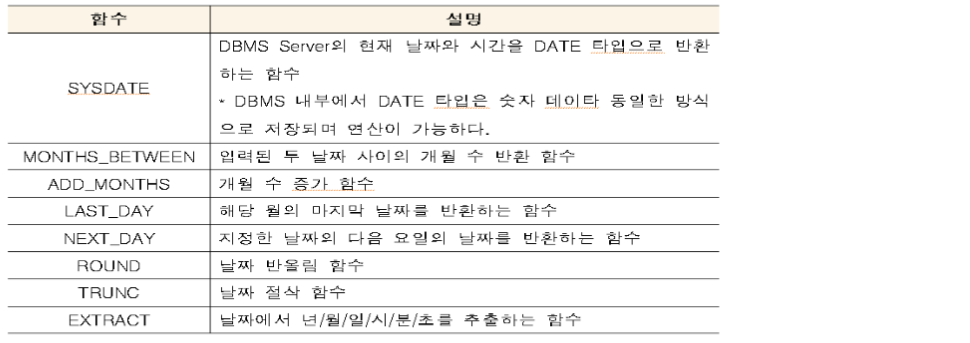

## 단일행 - 날짜함수

- date는 날짜와 시간 데이터를 모두 가지고 있다.



- 실습

  - 입력된 두 날짜 사이의 개월 수 반환 함수 : months_between
    - // 찌꺼기 일자 처리: trunc(months_between(sysdate,HIREDATE))

  ```sql
  select HIREDATE, months_between(sysdate,hiredate),months_between(hiredate,sysdate) from emp;
  ```

  

  

  - add_months : 개월 수 증가 함수

  ```sql
  select sysdate, add_months(sysdate,3), add_months(sysdate,-1) from dual;
  ```

  

  

  - last_day : 해당 월의 마지막 날짜를 반환하는 함수

    next_day : 지정한 날짜의 다음 요일의 날짜를 반환하는 함수

    ​	- 1이 일욜

  ```sql
  select sysdate, last_day(sysdate), next_day(sysdate,'일요일'), next_day(sysdate,1), next_day(sysdate,2) from dual;
  ```

  

  

  - round : 날짜 올림 함수
    - // 06월30일 전/후(6월30일이면 내림), 15일 전/후(15일이면 내림), 수요일 전/후(수요일이면 내일),   전은 = 의 의미를포함하고있다. // 11시59분일 때는 오늘 12:00은 내일...
    - 요일은 올림이면 그 다음 주의 일요일의 날짜가 출력되고 요일이 내림이면 해당 날짜의 그 전의 일요일의 날짜가 출력된다.

  ```sql
  select sysdate, round(sysdate,'YEAR'),round(sysdate,'MONTH'),round(sysdate,'DAY'), round(sysdate) from dual;
  ```

  

  

  - DD : 일(06)

    D : 요일(5)

    DDD : 1월 1일부터 오늘까지의 일 수(126)

  ```sql
  select to_char(sysdate,'DDD'), to_char(sysdate,'DD'), to_char(sysdate,'D') from dual;
  select last_day(sysdate) from dual;
  ```

  

  

  

  - trunc : 날짜 절삭 함수
    - 모두 다 내림
    - YEAR : 해당 연도의 처음으로 감
    - MONTH : 해당 월의 처음으로 감
    - DAY : 해당 날짜보다 전의 일요일로 감
    - default : 해당 날짜의 시간이 처음으로 감 (즉, 오전 12:00로 간다.)

  ```sql
  select sysdate, trunc(sysdate,'YEAR'), trunc(sysdate,'MONTH'), trunc(sysdate,'DAY'), trunc(sysdate) FROM dual;
  ```

  

  

  

  - 날짜 포맷 변경

  ```sql
  select to_char(sysdate,'MM"월"DD"일"') as mmdd1, 
      to_char(sysdate,'MM') || '월' || to_char(sysdate,'DD') || '일' as mmdd2 from dual;
  ```

  

  

  - extract : 날짜에서 년/월/일/시/분/초를 추출하는 함수

  ```sql
  select 
      extract(year from sysdate),
      extract(month from sysdate),
      extract(day from sysdate)
  from dual;
  ```

  

  

- **PL/SQL (간단하게 알아봄)**

  - Module화 프로그래밍

    - 모듈을 사용하는 이유는?

      - 모듈로 나누면 코드 작성과 관리가 쉬워진다.  어느 정도 규모가 있는 프로그램을 만들 때 파일 하나에 모든 코드를 작성하면 코드가 복잡해져 관리하기가 어려워진다. 따라서 어느 정도 규모가 큰 프로그램을 작성할 경우 파일 하나에 전체 코드를 구현하지 않고 기능별로 나눈 후에 여러 파일에서 해당 기능의 코드를 구현한다.

      - 이미 작성된 코드를 재사용할 수 있다. 특정 프로그램을 만들기 위해 작성한 모듈은 다른 코드를 만들 때도 활용할 수 있다. 즉, 특정 기능을 구현한 모듈은 다른 프로그램을 작성할 때 재사용할 수 있다. 
      - 공동 작업이 편리해진다. 규모가 큰 프로그램을 만들 때는 일반적으로 여러 사람이 같이 작업을 진행한다. 공동으로 프로그램을 만들 때는 전체 프로그램을 모듈별로 설계하고 개인별로 나누어 코딩한 후 전체 모듈을 통합한다.

    - stored function : DBMS에 저장된

    - stored procedure

    - stored package(java에서 class와 유사) 


- **cf. round(56.123,  -1)**

  round(sysdate,'YEAR')

  sysdate + 5/24 => 현재 시간에서 5시간 뒤 


- **날짜 포맷 변경하는 방법** : alter session, to_char()


- **회사끼리 데이터를 주고받는 방법**

  - 내부 데이터 저장 위치
    - DBMS vs Hadoop(big data)
  - 외부 데이터 저장 위치

  - 같은 회사끼리 dbms를 연결하는 가장 쉬운 방법은 **(방법1)** link를 사용, 그러나 동일한 회사가 아닌 다른 회사가 dbms를 연결하는 것은 어렵다. 
  - **(방법2)** dbms 안에 있는 데이터를 밖으로 꺼내서(export, dump) json, csv, xml 등의 파일로 꺼내서 파일로 전달해준다. 그리고 그 파일을 받은 회사는 자신의 dbms에 넣는다.(Loading, import)


- **on-premise vs cloud**

  - on-premise : 기업의 서버를 클라우드 같은 원격 환경에서 운영하는 방식이 아닌, 자체적으로 보유한 전산실 서버에 직접 설치해 운영하는 방식

  - 클라우드의 장점 

    - 신속한 인프라 도입 : 클라우드는 가입하고 10분 내로 인프라를 도입해서 서비스 구축을 시작할 수 있다. 주문한 서버가 도착하는데 2~3주의 시간이 걸렸던 예전과 비교할 수 없을 정도로 빠르다. 그만큼 인프라 도입에 들어가는 시간을 절감하고, 서비스 제공 시기를 앞당길 수 있다.

    - 유연한 인프라 관리 : 과거에는 인프라를 도입하기에 앞서 서비스 구축에 어느 정도의 인프라가 필요할지 미리 예상해야 했다. 예상이 맞으면 다행이지만, 만약 예상이 빗나가면 인프라 부족 또는 잉여 인프라에 따른 과도한 비용 지출이라는 문제가 발생했다. 클라우드는 인프라를 실시간으로 자유롭게 증감할 수 있기 때문에 인프라 부족 또는 과도한 인프라 도입이라는 문제가 발생하지 않는다. 서비스의 규모가 확대되면 그에 맞춰 클라우드에서 인프라를 빌려오면 된다.

    - 예상치 못한 트래픽 폭주 대응 : 과거에는 서비스에 사용자가 몰려 트래픽이 폭주하면 대응할 방법이 없었다. 남는 인프라가 있다면 다행이지만, 만약을 대비해 예비 인프라를 남겨두는 기업은 거의 없다. 트래픽이 폭주하면 기업은 사용자가 빠지길 기원하며 데이터 압축이나 사용자 순차 접속 등의 조치 밖에 취할 수 없었다.

      반면 클라우드는 서비스의 트래픽이 폭주하면 이에 맞춰 재빨리 인프라를 늘릴 수 있다. 트래픽 폭주로 서비스가 중단되는 사태를 걱정할 필요가 없어진 것이다. 최근에는 이러한 트래픽 폭주에 맞춰 기업이 별도로 인프라를 확충하지 않아도 알아서 인프라를 늘렸다가, 트래픽이 줄어들면 이에 맞춰 인프라를 줄이는 자동 트래픽 증감 기술 '오토 스케일링'이 개발되어 기업이 더욱 편리하게 인프라를 관리할 수 있게 해주고 있다.

    - 손쉬운 글로벌 서비스 : 많은 클라우드 사업자가 전 세계 주요 대륙에 데이터센터를 보유하고 있다. 보통 30~40개, 많은 곳은 100개가 넘는 데이터센터를 갖추고 있다. 이를 통해 기업은 전 세계 어디에나 빠른 서비스를 제공할 수 있다. 과거에는 글로벌 서비스를 위해 기업이 직접 특정 대륙 또는 지역별로 데이터센터를 구축해야 했지만, 이제는 클라우드 사업자가 미리 구축한 글로벌 데이터센터를 활용해 글로벌 서비스를 제공하면 된다. 그만큼 글로벌 서비스가 손쉬워진 것이다. 기업뿐만 아니라 규모가 작은 스타트업도 클라우드를 활용해 글로벌 서비스를 제공하고 있다.

    


## 단일행 - 변환 함수(TO_CHAR)

- **[주의] 명시적, 암시적(성능문제 & 오류 발생 가능성)**

- **실습**

  - 연도 포맷
    - alter session set NLS.LANGUAGE = '   '  로도 변환하는 법 알아놓기!!!!!!!!(해보기!!!!!)

  ```sql
  select sysdate, 
      to_char(sysdate,'YYYY'), to_char(sysdate,'YY'), to_char(sysdate,'Year'), to_char(sysdate,'YEAR') from dual;
  ```

  

  - 월(Month) 포맷

  ```sql
  select to_char(sysdate,'MONTH'), to_char(sysdate,'MON'), to_char(sysdate,'Mon'),
      to_char(sysdate,'mon'), to_char(sysdate,'MM'), to_char(sysdate,'mm') from dual;
  ```

  

  - 일(Day) 포맷

  ```sql
  select sysdate, to_char(sysdate,'DAY'), to_char(sysdate,'Day'), to_char(sysdate,'DY'), to_char(sysdate,'dy'),to_char(sysdate, 'DD'),to_char(sysdate,'dd') from dual;
  ```

  

  

  - to_char
    - // fm: remove padded blanks 
    - to_char를 진행했을 때 공백문자가 추가된다.(부호때문에 + or - )

  ```sql
  select 123456, to_char(123456,'999999'), length(to_char(123456,'999999')), length(to_char(123456,'fm999999')) from dual;
  ```

  

  

  

  - 숫자 포맷을 지정하여 to_char
    - 첫번째는 우리가 원하는 포맷으로 변경되지 않는다. 즉, 포맷의 길이는 지정된 숫자보다 길어야 한다.

  ```sql
  select to_char(12345*123.45,'999,999.99'), to_char(12345*123.45,'99,999,999.99') from dual;
  ```

  

  

  - 화폐(다시해보기!!!!!!)
    - L은 국가의 화폐 기호가 나온다.(우리나라의 화폐 단위는 원이기 때문에 원으로 나온다.)

  ```sql
  SELECT TO_CHAR(SAL,'$999,999'),REPLACE(TO_CHAR(SAL,'$999,999'),' ','?'),TO_CHAR(SAL,'L999,999'),TO_CHAR(SAL,'999,999L'),TO_CHAR(SAL,'fm999,999L')FROM EMP;
  ```

  

  

  - 0과 9의 차이
    - 9: 앞의 0은 출력되지 않음
    - 0: 0이 모두 출력된다.

  ```sql
  SELECT 0012345600,TO_CHAR(00123456,'999999999'),TO_CHAR(00123456,'000000000')FROM DUAL;
  ```

  


## 그룹행 함수

- **min이나 max를 구하는 방법**

  - sort
  - 순차접근(Full Table Scan) : 데이터베이스의 한 릴레이션에서 데이터를 찾거나 재배열하기 위해 데이터가 저장된 목록 중의 모든 데이터 요소를 차례차례 조사하여 원하는 것을 찾아내는 것을 **순차접근(Full Table Scan)**이라 한다.

  

- **제약조건**

  - Not null

    컬럼 생성시 지정하지 않으면 default로 Null이 허용가능하게 되어 있다. 따라서 해당 컬럼값을 입력하지 않고 튜플을 삽입시 Null이 들어가게 되는데 이를 방지하기 위해서는 Not Null을 기술해 주면 된다.

  - unique

    유일한 값만 들어가도록 하고 싶을 때 사용한다. 즉, 중복이 허용되지 않도록 데이터를 넣어야하는 경우 사용

  - primary key

    기본키이다. 기본키란 해당 테이블을 대표하는 컬럼으로 Primary key로 지정된 컬럼은 Null값을 가지지 못하며, 중복된 값을 가질 수 없다. 즉, 이 primary key에 의해 튜플들은 중복되지 않고 구분될 수 있게 된다. 따라서 UNIQUE와 NOT NULL을 동시에 정의한 것과 효과가 같게 된다.

  - foreign key

    외래키를 의미하는 제약조건입니다. 외래키는 참조 무결성을 위해 사용되는데 이 외래키로 지정된 컬럼은 반드시 다른 테이블의 "Primary key(기본키)"와 참조 관계를 가지게 되고 외래키로 지정된 컬럼은 참조관계를 가진 테이블의 기본키에 있는 값만을 가질 수 있다. 즉, Null 값은 허용하되, 참조하고 있는 테이블의 기본키에 있는 값만 입력될 수 있다.

  - check

    Mysql enum 데이터 타입과 비슷한 효과를 내주는 거로서, 입력될 수 있는 데이터의 종류를 제한할 수 있다.

    예를들어)

    **gender varchar2(8) CHECK ( gender IN ('남','여') )** 로 해서 만든다면 gender 필드에는 남, 여 둘 중 하나의 값만 들어갈 수 있게된다.

    또한,

    **bno number primary key CHECK ( bno between 1 and 1000 )** 으로 한다면 bno값은 1부터 1000 사이의 값만을 가질 수 있다.


- **null** 
  - 제어불가 : 함수 안에 null이 들어가면 결과가 null이 나온다.
    - 예외 : decode, nvl, concat, ***그룹행 함수(중요!!!!)***
  - 비교불가 
  - 연산불가


- **실습** 


## HASH

- **HASH의 용도**
  - 무결성
  - DAM
  - 보안


- **HASH의 특징**
  - 고정 길이(함수의 출력이 고정길이, 함수에 들어가는 입력은 가변길이)
    - 다양한 가변길이의 입력을 받아서 해시는 고정된 길이를 리턴한다. 
  - 단방향
  - 충돌 회피


- **HASH의 용도 - 무결성**

  - 데이터 무결성(영어: Data Integrity)은 컴퓨팅 분야에서 완전한 수명 주기를 거치며 데이터의 정확성과 일관성을 유지하고 보증하는 것을 가리키며 데이터베이스가 RDBMS 시스템의 중요한 기능이다.

  - HASH를 이용한 동일 문서 판별 방법
    - HASH 코드로 비교해서 빠르게 비교를 가능
    - 해시함수를 거치면 짧은 해시 코드로 변경(고정된 길이를 리턴)

  

  - 해시 함수의 강화 방안

  

  

  

## Timestamp 내부구조

- Timestamp 타입은 특정 시점을 나타내는데 사용되며, Timezone과 관련된 정보를 어떤 방식으로 저장하는지에 따라 3가지 세부 유형으로 구분된다.

- **Timestamp 세부사항**

  - 세기 / 년 / 월 / 일 / 시 / 분 / 초 데이터를 저장할 수 있음.
  - 초 이하 단위를 9자리까지 저장할 수 있으며, Timezone과 관련된 정보를 선택적으로 저장할 수 있음.
  - TIMESTAMP (TIMEZONE과 관련된 정보를 저장하지 않음)
  - TIMESTAMP WITH TIMEZONE (TIMEZONE과 관련된 정보를 저장)
  - TIMESTAMP WITH LOCAL TIMEZONE (세션의 기본 TIMEZONE값을 사용)

- **Date는 고정된 7bytes(고정길이 - yyyymmddhh24m2ss > 14자리)** 

  - 날짜는 년월일로 표현되고 내부적으로 시분초도 다 저장되어 있다. 

  - packed decimal로 number로 저장한다. 외부적으로 표현할때는 문자처럼 표현한다. 내부 저장방식과 외부 표현 방식이 다르다. 
    - packed decimal  : 빽빽하게 채워진 10 진수는 10 진수를 이진 인코딩하는 효율적인 방법입니다. 이진 코드 10 진수로 알려진 10 진수의 이진 인코딩 시스템은 4 비트를 사용하여 각 숫자를 인코딩하므로 압축 BCD를 사용할 때도 이진 데이터 대역폭이 크게 낭비됩니다. (위키백과)
  - 그래서 날짜는 연산이 가능하다.

- **cf. char(고정길이 문자 데이터 타입), varchar2(가변길이 문자 데이터 타입) 둘의 특징에 대해서 꼭 알아야함!!!!**


## 스키마

- **스키마** 
  - 스키마는 데이터 사전(Data Dictionary)에 저장된다.
  - 논리적 구조와 제약사항
    - 데이터 내부의 데이터 간의 관계
  - scott.emp (물리적인 구조)
    - scott 계정의 emp table을 의미 (schema.object_name)


- **데이터베이스**
  - 데이터의 집합
  - 데이터의 물리적인 저장 구조


## Group by - 그룹핑

- Group by 실행 방식이 10g부터 hash 방식으로 변경된 후에는 정렬된 것과 집합이 되지 않는다.


## Having

| where      | **조건절** | **테이블**   |
| ---------- | ---------- | ------------ |
| **Having** | **조건절** | **group by** |


- 쿼리 실행 순서
  - from - where - group by - having - select - order by