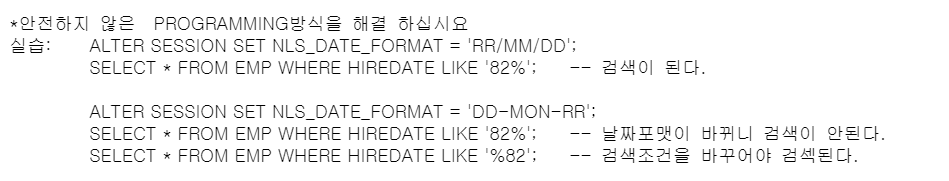
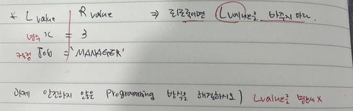
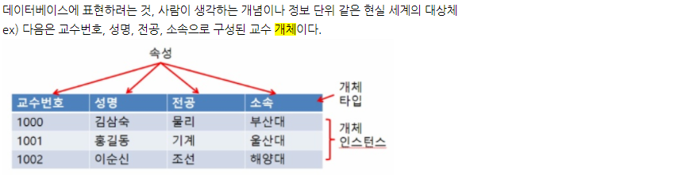
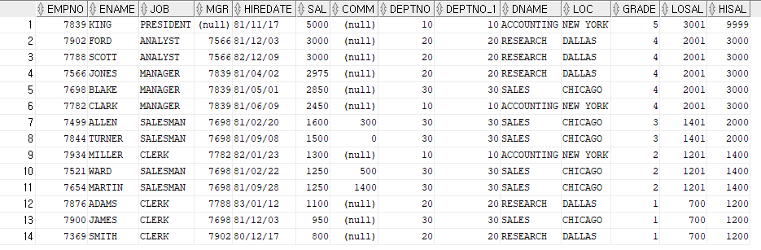

## 과제 

- 안전하지 않은 PROGRAMMING 방식을 해결하십시오

  

  ```sql
  select * from emp where to_char(hiredate,'RR') = '82'
  ```

  - 결과가 알맞게 나오긴 하지만 L value를 바꿨으므로 성능이 떨어진다.

  

  

  - **해결 방법**


- **관계**
  - 개체 : 실제 세계에서 서로 구별되는 객체 
  - **개체 내 관계 : 속성관계(Attribute Relationship)**
    - 한 개체 내에서만 존재한다는 뜻
  - **개체 간 관계 : 개체관계(Entity Relationship)**
    - 개체 외부에 존재
    - 개체와 관계를 도식으로 표현한 다이어그램을 ERD라고 한다.


## ERD

- **데이터 모델의 구성 요소** 

  \- **개체(Entity)** : 데이터베이스에 표현하려는 것, 사람이 생각하는 개념이나 정보 단위 같은 현실 세계의 대상체 (네모 박스) - TABLE

  \- **속성(Attribute)** : 데이터의 가장 작은 논리적 단위, 파일 구조상의 데이터 항목 또는 데이터 필드에 해당 - COLUMN

  \- **관계(Relationship)** : 개체 간의 관계 또는 속성 간의 논리적인 연결 의미 - FOREIGN KEY, JOIN 

  

  

- **SDLC (Software Development Life Cycle)**

  - 기획(계획)
  - 분석 : ERD
  - 설계
  - 개발
  - 테스트
  - 이행/릴리즈


# JOIN

- **데이터의 수평적 결합(cf. 수직적인 결합은 집합연산자)**


- **필요성**
  - Display data from multiple tables
  - 한 개 이상의 테이블로부터 데이터를 읽어야 할 때(수평적 결합)


- **종류**
  - EQUI JOIN
  - NON EQUI JOIN 
  - OUTER JOIN
  - SELF JOIN


- **내부 알고리즘**
  - NESTED LOOP JOIN
  - SORT MERGE JOIN
  - HASH JOIN


## 조인

- **실습**

  - Non Equi-Join

  ```sql
  select * from emp e, dept d, SALGRADE s
  where e.deptno = d.DEPTNO
  and e.sal BETWEEN s.LOSAL and s.HISAL;
  ```

  

  - 10번
    - (+)는 조인키가 더 부족한 쪽에 넣는다. 그러면 부족한 부분에는 null로 채워진다.
    - 데이터가 없는 부분에 (+)를 넣는다.
  - 12번
    - 부족하지 않은 부분에 (+)를 넣음.
    - 부족하지 않는다. 효율성이 떨어진다. 
  - 14번
    - 양방향 outer join (오라클에서는 양방향 outer join을 지원하지 않는다. ansi에서는 지원한다.)

