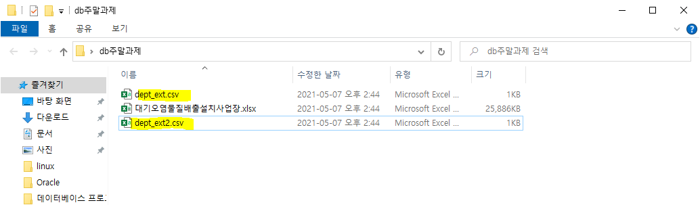

## 데이터 적재(Data Load)

- **오라클 디벨로퍼에서 csv 파일 가져오기** 

  

  

  

  

  

  

  

  

  


- **데이터 확인**

  ```sql
  select * from dept;
  ```

  - 인천과 대구의 데이터 앞에 공백이 들어가 있다.

  


- **데이터 보정**

  ```sql
  update dept set loc = ltrim(loc);
  select * from dept;
  ```

  


- 엑셀을 사용하여 insert into 쿼리문 생성하기

  - dept_ext.csv 파일 copy > dept_ext2.csv

  

  ```sql
  =(" insert into dept values(" & A2 & "," & B2 & "," & C2 & ");"
  ```

  

  

  

  


- 공공데이터를 가져와서 dept table과 join


