## 데이터 적재(Data Load) - 오라클 디벨로퍼에서 import

- **오라클 디벨로퍼에서 csv 파일 가져오기** 

  - import할 dept_ext.csv파일

  

  

  - 기존에 있던 dept table에 데이터 임포트

  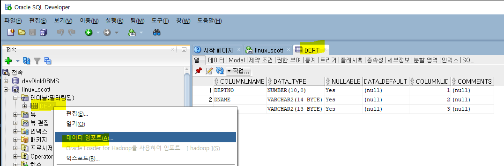

  

  - 파일 위치 입력 > 다음

  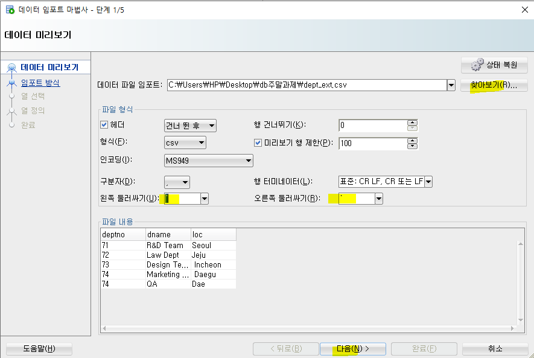

  
  
  - 임포트 방식: 삽입, 테이블 이름: dept > 다음
  
  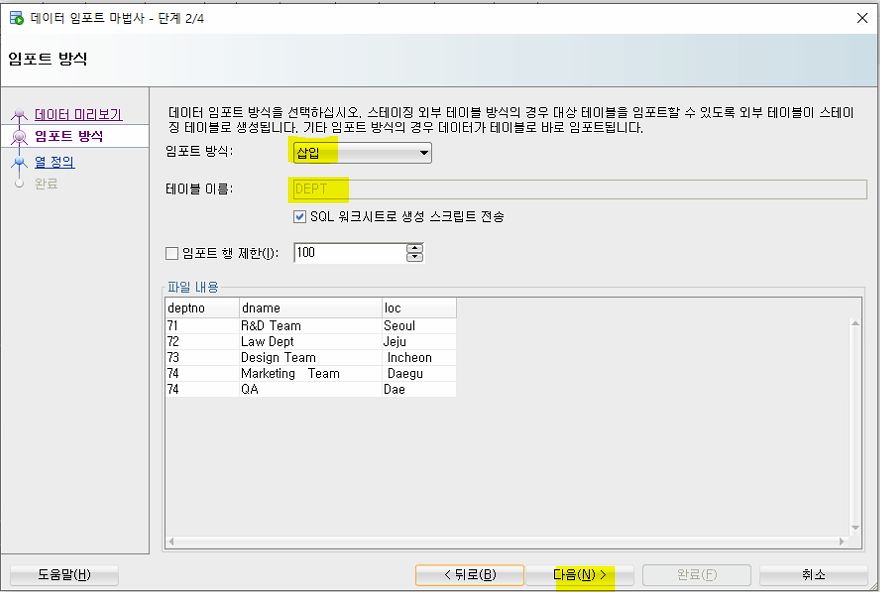
  
  
  
  - 열 선택하고 다음
  
  
  
  
  
  - 데이터 길이가 기존의 테이블에 정의된 컬럼 길이를 넘음
  
  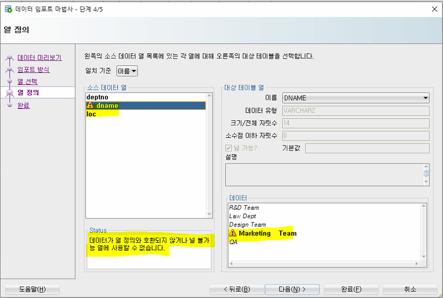
  
  
  
  - **문제 해결하기**
  
    - dept 테이블 정보 확인
  
    ```sql
    desc dept;
    ```
  
    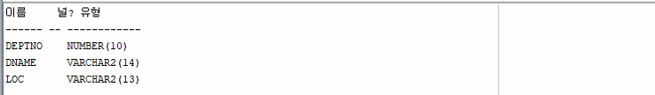
  
    
  
    - dname의 컬럼 길이 변경한뒤 테이블 정보 다시 확인
  
    ```sql
    alter table dept modify(dname varchar2(30));
    desc dept;
    ```
  
    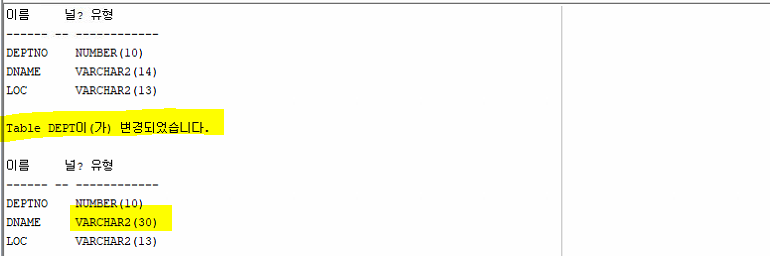
  
    
  
  - 위의 과정 다시 진행
  
    - 에러가 발생하지 않음
  
  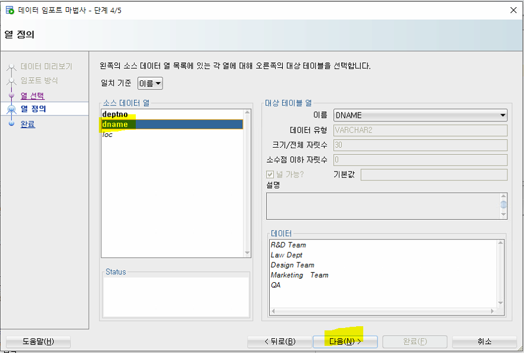
  
  
  
  - 완료
  
  
  
  
  
  - 임포트 성공
  
  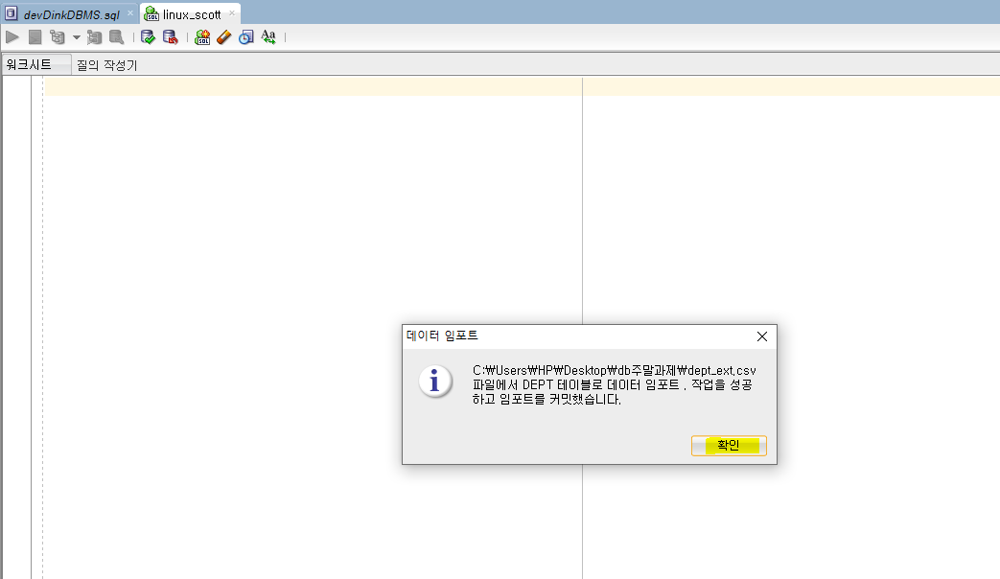


- **데이터 확인**

  ```sql
  select * from dept;
  ```

  - 인천과 대구의 데이터 앞에 공백이 들어가 있다.

  


- **데이터 보정**

  ```sql
  update dept set loc = ltrim(loc);
  select * from dept;
  ```

  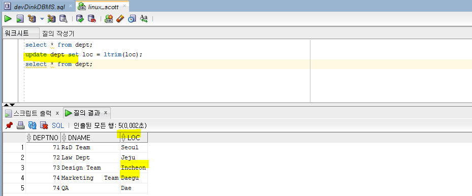


- **Marketing Team의 중간 공백 줄이기**

  ```sql
  update dept set dname = replace(dname,'   ',' ');
  ```

  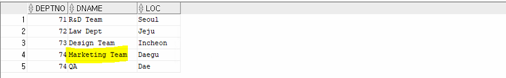


- **QA의 deptno과 loc 수정하기**

  - QA를 75로 변경하고 loc를 Daegu로 변경

  ```sql
  update dept set deptno = 75 , loc = 'Daegu' where dname = 'QA';
  ```

  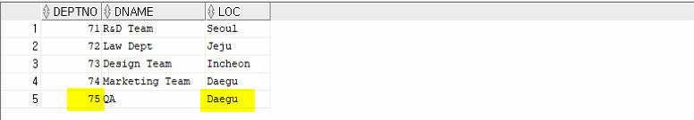


## 데이터 적재(load) - 엑셀에서 insert into 쿼리문 생성

- **dept_ext.csv > dept_ext2.csv copy**

  

  

  - dept_ext2.csv 파일에 쿼리문 입력 후 드래그

  ```sql
  =(" insert into dept values(" & A2 & "," & B2 & "," & C2 & ");"
  ```

  

  

  - 해당 쿼리문 전부 복사 

  

  

  - 오라클 디벨로퍼에 붙여넣기 

  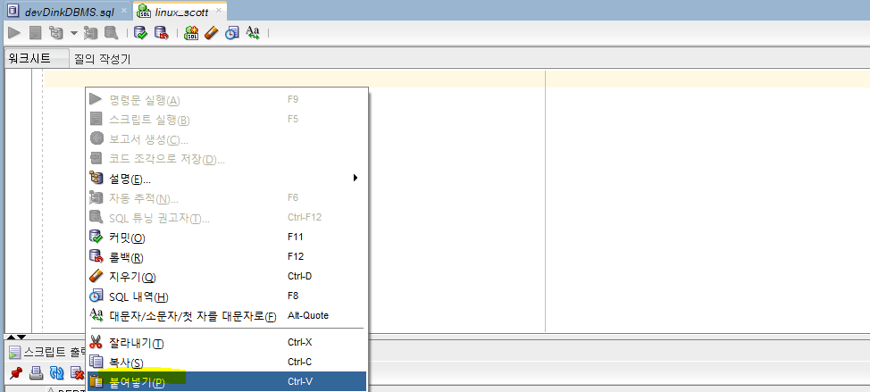

  

  - 생성한 insert문으로 dept 테이블에 insert 진행

  


## 공공데이터를 가져와서 customer table과 join

- **주제** 

  서울시 거주자 중 대기 오염 물질 배출 시설이 많은 지역(구단위) 고객(Customer) 대상 건강 제품 마케팅

  - **가장 배출 시설이 많은 구 중에서 어느 동에 마케팅을 해야할지 정하기**


- **사용할 데이터**
  - 서울시 빅데이터 캠퍼스 https://bigdata.seoul.go.kr
  - 대기오염물질배출설치 사업장
    - 대기오염물질배출설치사업장.xlsx


- **대기오염물질배출설치사업장.xlsx 데이터 전처리 및 정제 (R 사용)**

  - R에서 전체 데이터 가져오기

  ```R
  #전체 데이터 가져오기
  setwd("C:\\Users\\HP\\Desktop\\db주말과제")
  getwd()
  raw_data <- read_excel("대기오염물질배출설치사업장.xlsx")
  tail(raw_data)
  ```

  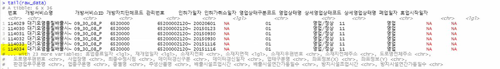

  

  - 특정 열 추출

  ```R
  df1 <- raw_data[,c("상세영업상태명","소재지전체주소","도로명전체주소")]
  View(df1)
  ```

  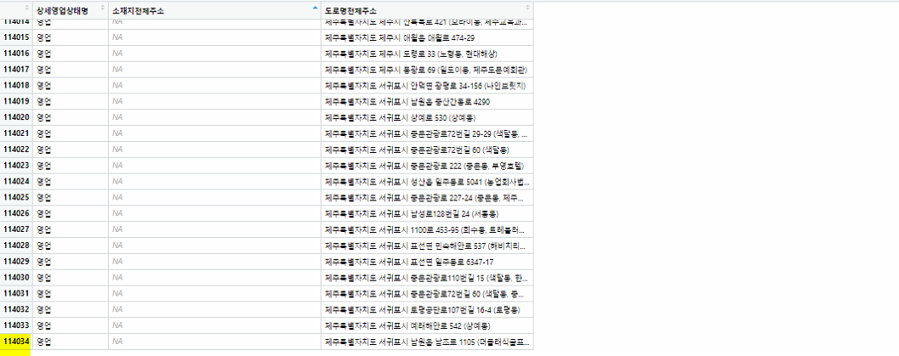

  

  - 영업상태가 영업이거나 재개업인 데이터만 추출
    - 총 74162개의 데이터

  ```R
  df2 <- df1[union(which(df1$상세영업상태명=="영업") , which(df1$상세영업상태명=="재개업")), ]
  View(df2)
  ```

  

  

  - 주소가 서울특별시로 시작하는 데이터만 남기기
    - 총 2599개

  ```R
  #서울인 데이터만 남기기
  install.packages('tidyverse')
  library('tidyverse')
  
  df4 <-df3 %>%
    filter(str_detect(df3$소재지전체주소,"^서울특별시") | str_detect(df3$도로명전체주소,"^서울특별시") )
  ```

  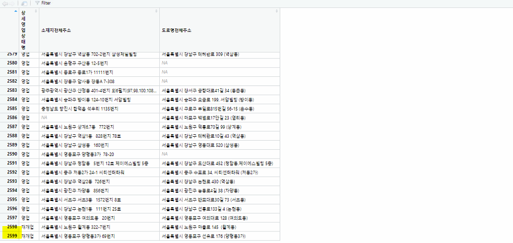

  

  - **csv 파일로 저장**
    - 처음에 설정한 디렉토리에 저장
    - ROW의 번호도 생성

  ```R
  write.csv(df4,"data.csv")
  ```

  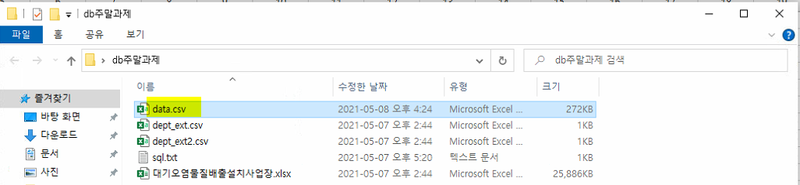

  


- **csv 파일 import**

  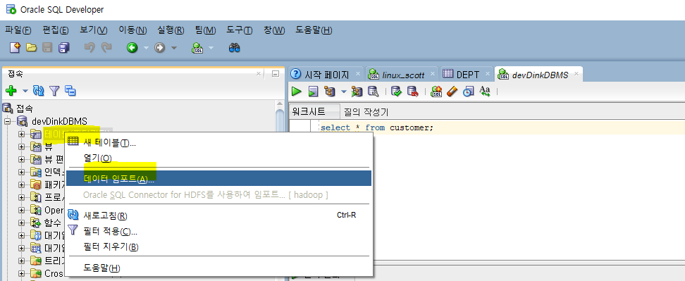

  

  - 파일 위치 지정 후 다음 

  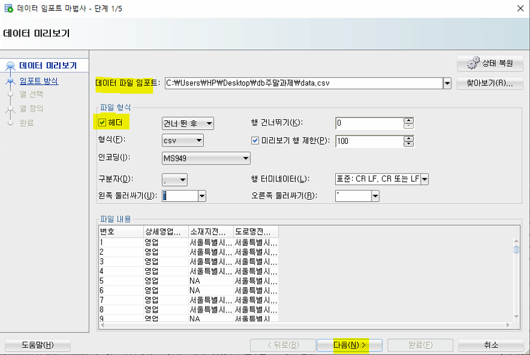

  

  - 테이블 이름 지정 > 다음

  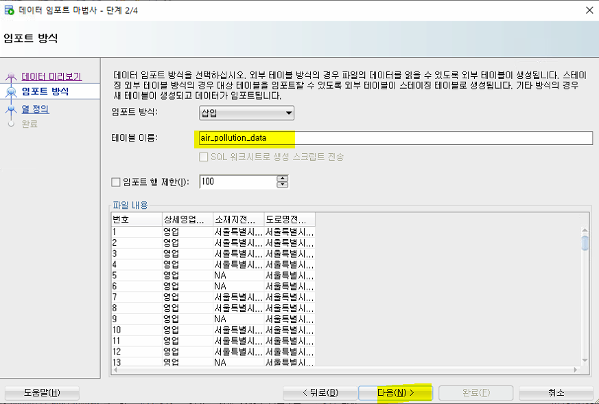

  

  - 테이블에 옮길 열 선택

  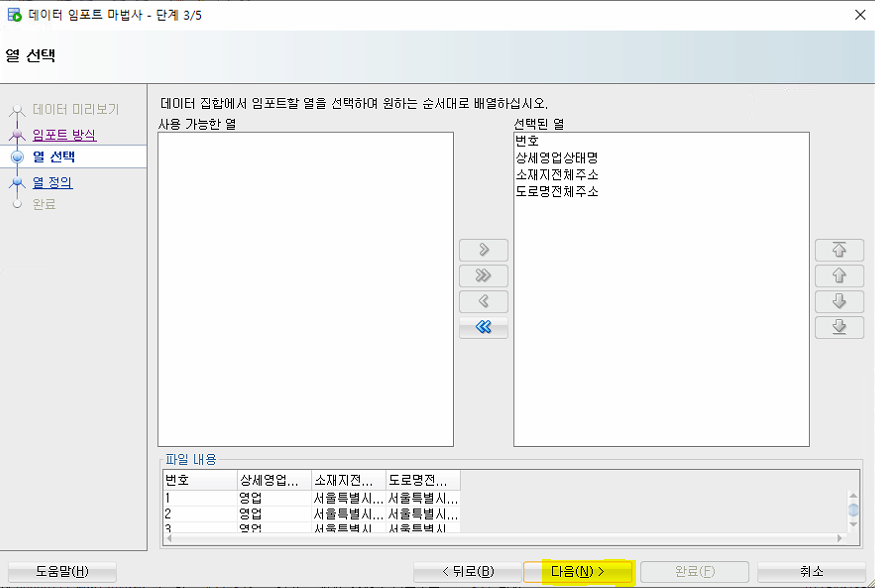

  

  - 각 컬럼마다 데이터 타입과 크기 확인

  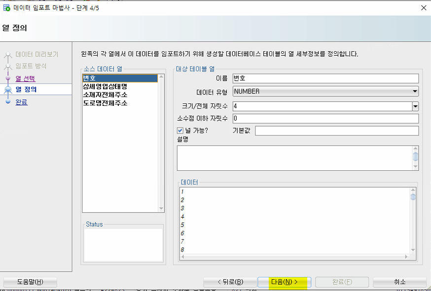

  

  - 완료

  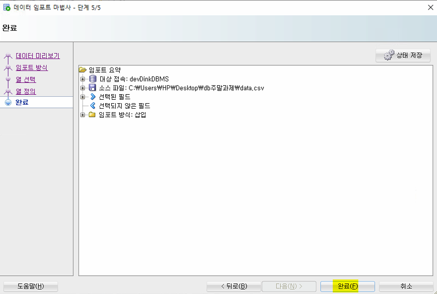

  

- **AIR_POLLUTION_DATA 테이블 분석**

  - 지역별 오염물질 배출설치 사업장 수와 rank 구하기
  - **!!지역은 소재지와 도로명 주소를 모두 확인해서 둘 중 하나라도 서울이면 추출!!**
  - 구로구가 오염물질 배출설치 사업장 수가 가장 많음

  ```sql
  select decode( substr(소재지전체주소,1,5), '서울특별시' , substr(소재지전체주소, 7, ( instr(소재지전체주소,' ',1,2)-instr(소재지전체주소,' ',1,1)-1) ) , substr(도로명전체주소, 7, ( instr(도로명전체주소,' ',1,2)-instr(도로명전체주소,' ',1,1)-1) ) ) as loc, count(*) as count, 
  rank() over(order by count(*) desc) rank
  from AIR_POLLUTION_DATA
  group by decode( substr(소재지전체주소,1,5), '서울특별시' , substr(소재지전체주소, 7, ( instr(소재지전체주소,' ',1,2)-instr(소재지전체주소,' ',1,1)-1) ) , substr(도로명전체주소, 7, ( instr(도로명전체주소,' ',1,2)-instr(도로명전체주소,' ',1,1)-1) ) )
  ;
  ```

  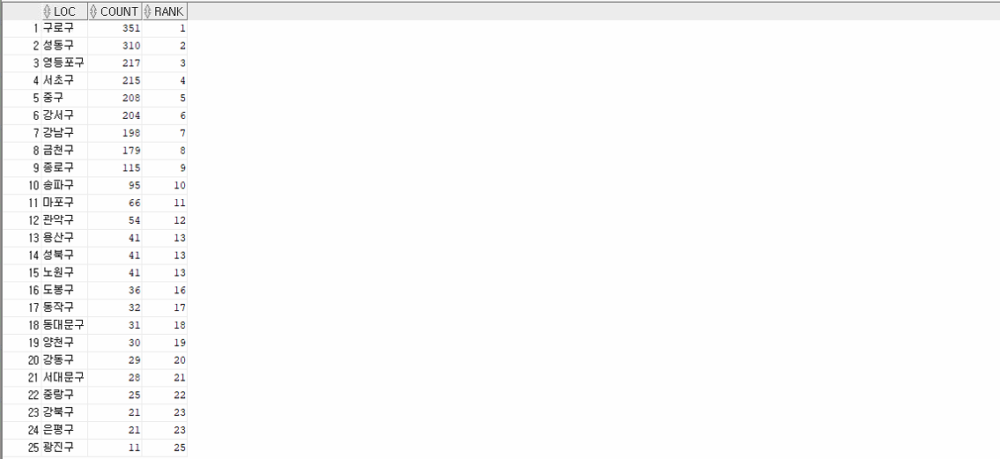


- **customer 테이블 분석**

  - 주소가 서울인 고객의 구만 추출해보기
  - **위의 추출한 구와 일치** 

  ```sql
  --customer table
  select substr(address1, 4, instr(address1,' ',1,2) - instr(address1,' ',1,1) -1 ) as loc from customer 
  where substr(address1, 1, instr(address1, ' ',1,1)-1 ) = '서울' 
  group by substr(address1, 4, instr(address1,' ',1,2) - instr(address1,' ',1,1) -1 );
  ```

  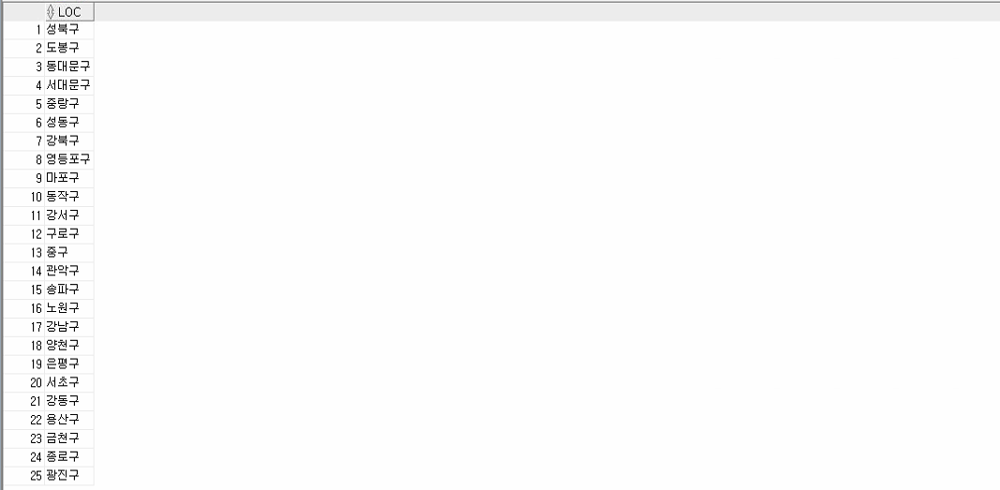


- **customer과 AIR_POLLUTION_DATA 테이블에서 서울시 구를 이용하여 join**

  ```sql
  select * from customer c, (select decode( substr(소재지전체주소,1,5), '서울특별시' , substr(소재지전체주소, 7, ( instr(소재지전체주소,' ',1,2)-instr(소재지전체주소,' ',1,1)-1) ) , substr(도로명전체주소, 7, ( instr(도로명전체주소,' ',1,2)-instr(도로명전체주소,' ',1,1)-1) ) ) as loc, 
  count(*) as count, rank() over(order by count(*) desc) rank from AIR_POLLUTION_DATA
  group by decode( substr(소재지전체주소,1,5), '서울특별시' , substr(소재지전체주소, 7, ( instr(소재지전체주소,' ',1,2)-instr(소재지전체주소,' ',1,1)-1) ) , substr(도로명전체주소, 7, ( instr(도로명전체주소,' ',1,2)-instr(도로명전체주소,' ',1,1)-1) ) ) ) a
  where substr(c.address1, 4, instr(c.address1,' ',1,2) - instr(c.address1,' ',1,1) -1 ) = a.loc
  and substr(address1, 1, instr(address1, ' ',1,1)-1 ) = '서울'  order by a.rank
  ;
  ```

   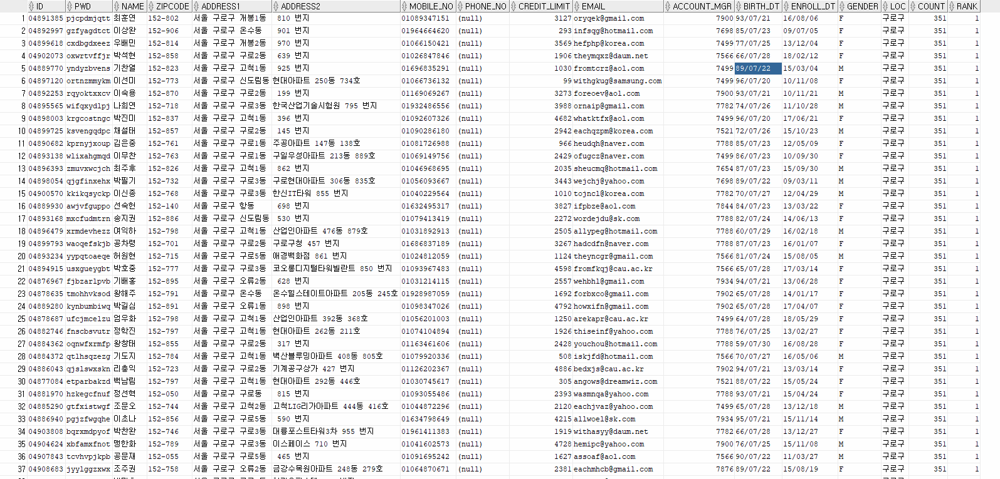

  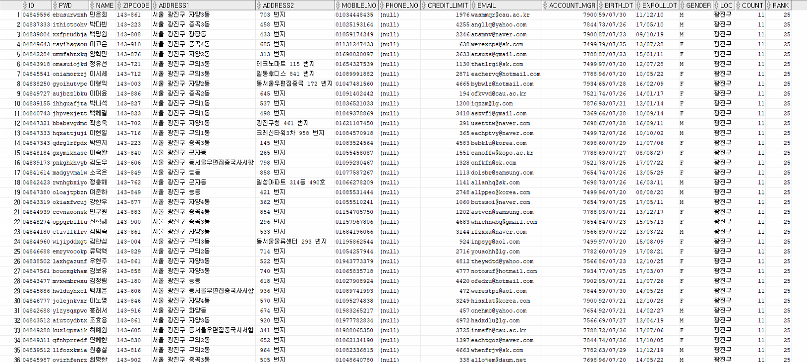


- **오염물질 배출설치 사업장 수가 가장 많은 1개의 구에 사는 고객의 정보만 가져오기**

  - **해당 구에서 '동'정보도 따로 컬럼에 추가**

  ```sql
  select c.id, c.name, c.ADDRESS1, substr(c.address1, instr(address1,' ',1,2)+1 ) as dong from customer c, (select decode( substr(소재지전체주소,1,5), '서울특별시' , substr(소재지전체주소, 7, ( instr(소재지전체주소,' ',1,2)-instr(소재지전체주소,' ',1,1)-1) ) , substr(도로명전체주소, 7, ( instr(도로명전체주소,' ',1,2)-instr(도로명전체주소,' ',1,1)-1) ) ) as loc, 
  count(*) as count, rank() over(order by count(*) desc) rank from AIR_POLLUTION_DATA
  group by decode( substr(소재지전체주소,1,5), '서울특별시' , substr(소재지전체주소, 7, ( instr(소재지전체주소,' ',1,2)-instr(소재지전체주소,' ',1,1)-1) ) , substr(도로명전체주소, 7, ( instr(도로명전체주소,' ',1,2)-instr(도로명전체주소,' ',1,1)-1) ) ) ) a
  where substr(c.address1, 4, instr(c.address1,' ',1,2) - instr(c.address1,' ',1,1) -1 ) = a.loc
  and substr(address1, 1, instr(address1, ' ',1,1)-1 ) = '서울'
  and rank = 1
  order by a.rank
  ;
  ```

  


## 마지막 쿼리문으로 R에서 시각화

- **오염물질 배출설치 사업장 수가 가장 많은 구가 구로구이고 customer table에 있는 고객의 정보를 이용해서 구로구의 무슨 동의 고객이 가장 많은지 시각화 **

  - 전체 코드

  ```R
  install.packages("rJava")
  install.packages("DBI")
  install.packages("RJDBC") # rJava에 의존적이다.(rJava 먼저 로딩)
  
  library(rJava)
  # Sys.setenv(JAVA_HOME='C:\\Program Files\\Java\\jre1.8.0_291')
  library(DBI)
  library(RJDBC)
  
  # 1. Driver Loading
  drv<-JDBC(driverClass = "oracle.jdbc.driver.OracleDriver", classPath = "C:\\Users\\HP\\Desktop\\ojdbc8.jar")
  
  # 2. Connection
  conn <-dbConnect(drv, "jdbc:oracle:thin:@//192.168.119.119:1521/dink", "scott", "tiger")
  
  query <- "select c.id, c.name, c.ADDRESS1, substr(c.address1, instr(address1,' ',1,2)+1 ) as dong from customer c, (select decode( substr(소재지전체주소,1,5), '서울특별시' , substr(소재지전체주소, 7, ( instr(소재지전체주소,' ',1,2)-instr(소재지전체주소,' ',1,1)-1) ) , substr(도로명전체주소, 7, ( instr(도로명전체주소,' ',1,2)-instr(도로명전체주소,' ',1,1)-1) ) ) as loc, 
  count(*) as count, rank() over(order by count(*) desc) rank from AIR_POLLUTION_DATA
  group by decode( substr(소재지전체주소,1,5), '서울특별시' , substr(소재지전체주소, 7, ( instr(소재지전체주소,' ',1,2)-instr(소재지전체주소,' ',1,1)-1) ) , substr(도로명전체주소, 7, ( instr(도로명전체주소,' ',1,2)-instr(도로명전체주소,' ',1,1)-1) ) ) ) a
  where substr(c.address1, 4, instr(c.address1,' ',1,2) - instr(c.address1,' ',1,1) -1 ) = a.loc
  and substr(address1, 1, instr(address1, ' ',1,1)-1 ) = '서울'
  and rank = 1
  order by a.rank"
  df <- dbGetQuery(conn, query)
  is.data.frame(df)
  
  head(df)
  word <- df[,4] #백터로 변환
  head(word)
  
  install.packages("wordcloud")
  install.packages("RColorBrewer")
  install.packages("KoNLP")
  
  #import
  library(wordcloud)
  library(RColorBrewer)
  library(KoNLP)
  
  word_table <- table(word)
  
  display.brewer.all()
  color <- brewer.pal(8, "Set2")
  
  windowsFonts(font=windowsFont("a한글사랑L"))
  wordcloud(names(word_table), word_table, colors = color, family = "font", random.order = FALSE)
  ```

  

  - 워드 클라우드를 만들기 위해서 데이터 프레임을 벡터 데이터로 변환

  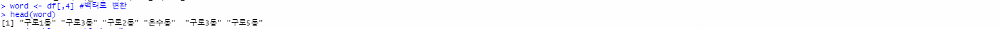

  

  - table로 각 동의 빈도수 확인

  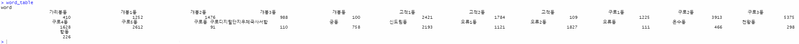

  

  - 시각화
    - 구로구 중에서 구로3동, 구로 2동의 

  ```R
  install.packages("wordcloud")
  install.packages("RColorBrewer")
  install.packages("KoNLP")
  
  #import
  library(wordcloud)
  library(RColorBrewer)
  library(KoNLP)
  
  word_table <- table(word)
  
  display.brewer.all()
  color <- brewer.pal(8, "Set2")
  
  windowsFonts(font=windowsFont("a한글사랑L"))
  wordcloud(names(word_table), word_table, colors = color, family = "font", random.order = FALSE)
  ```

  