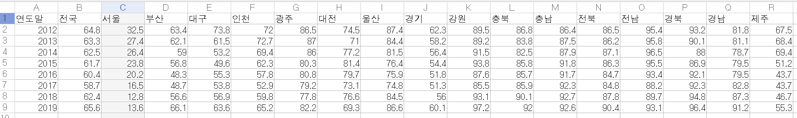
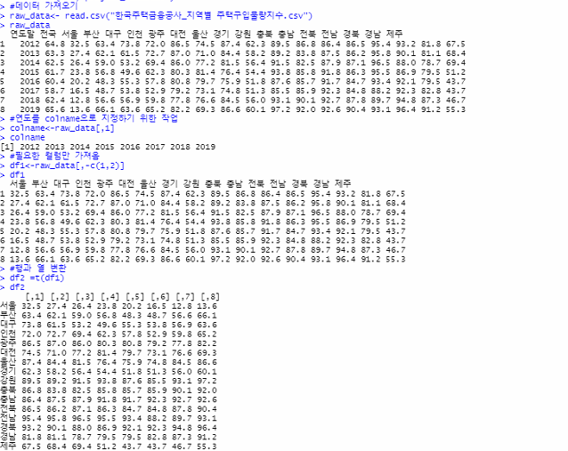
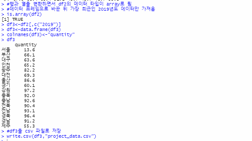
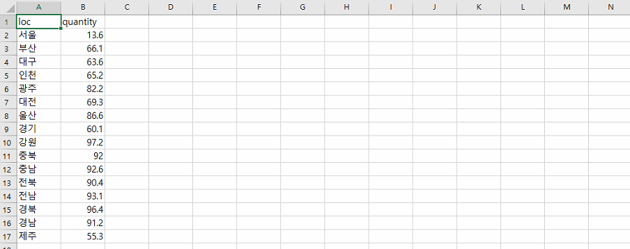
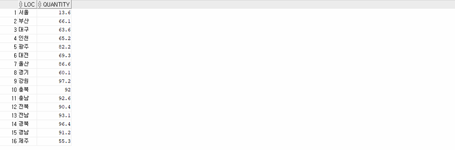
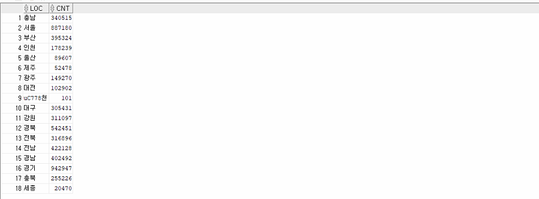
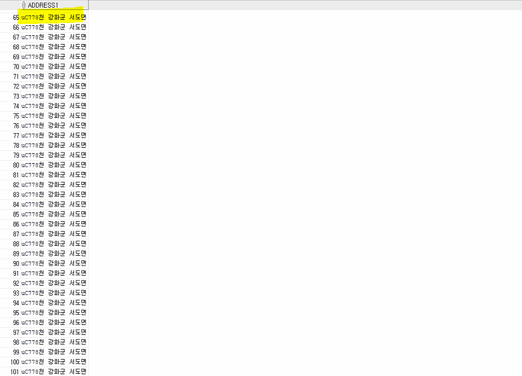
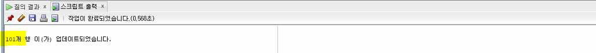
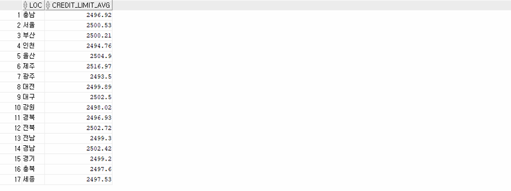
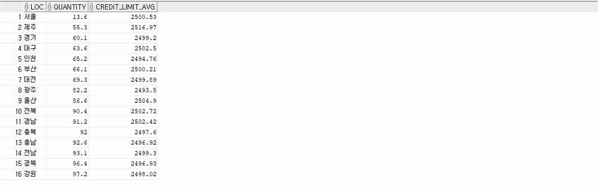

## 내/외부 데이터를 활용한 데이터분석(자율주제–금융/통신)

- **외부 데이터 확인**

  - 사용할 데이터 : **한국주택금융공사_지역별 주택구입 물량지수(csv파일)**
    - 출처 : 공공데이터 포털
    - 단위 : 건
    - 국내 지역별 주택구입 물량지수(서울,경기,강원,충북,충남,전북,전남,경북,경남,부산,제주,대구,인천,광주,대전,울산,세종)
  - [한국주택금융공사_지역별 주택구입물량지수_20201123 | 공공데이터포털 (data.go.kr)](https://www.data.go.kr/data/15073706/fileData.do)
  
  


## 데이터 전처리 및 정제 - R

- **필요한 데이터만 추출(전체코드)**

  - 가장 최근 데이터인 2019년도의 데이터만 가져옴
  
  ```R
  setwd("C:\\Users\\HP\\Desktop\\db주말과제")
  getwd()
  
  #데이터 가져오기
  raw_data<- read.csv("한국주택금융공사_지역별 주택구입물량지수.csv")
  raw_data
   
  #연도를 colname으로 지정하기 위한 작업
  colname<-raw_data[,1]
  colname
  
  #필요한 컬럼만 가져옴
  df1<-raw_data[,-c(1,2)]
  df1
  
  #행과 열 변환
  df2 =t(df1)
  df2
  
  #열 이름을 연도로 설정
  colnames(df2) <- colname
  df2
  
  #행과 열을 변환하면서 df2의 데이터 타입이 array로 됨
  #데이터 프레임으로 바꾼 뒤 가장 최근인 2019년도 데이터만 가져옴
  is.array(df2)
  df3<-df2[,c("2019")]
  df3<-data.frame(df3)
  colnames(df3)<-"quantity"
  df3
  
  #df3을 csv 파일로 저장
  write.csv(df3,"project_data.csv")
  ```
  
   
  
   
  
   
  
  ​	

## 데이터 Import 및 데이터 분석

- **지역별 주택구입 물량지수 Table 분석**

  - **세종시의 데이터가 없음**

  ```sql
  select * from PROJECT_TABLE;
  ```

  


- **내부 CUSTOMER TABLE 데이터 확인**

  - 주소의 지역이 잘 적혀있는지 확인

  ```sql
  select substr(address1,1, instr(address1,' ',1,1)-1) as loc, count(*) as cnt from customer group by substr(address1,1, instr(address1,' ',1,1)-1);
  ```

  

  

  - uC778천의 잘못 입력된 데이터 존재
    - uC778천 데이터 확인
    - 전부 인천의 강화군 서도면

  ```sql
  select address1 from customer where substr(address1, 1, instr(address1, ' ', 1, 1)-1) = 'uC778천';
  ```

  

  

  - 데이터 update

  ```sql
  update customer set address1 = '인천 강화군 서도면' where address1 = 'uC778천 강화군 서도면';
  ```

  

  

  - update 확인
    - 각 지역 별 credit_limit의 평균
    - update가 잘 되어있는 것을 확인 

  ```sql
  select substr(address1,1, instr(address1,' ',1,1)-1) as loc, round(avg(credit_limit),2) as credit_limit_avg from customer group by substr(address1,1, instr(address1,' ',1,1)-1);
  ```

  


- **join**

  - **신용 한도와 주택구입 물량지수의 상관관계를 알아보기 위한 데이터 Join**
  
  ```sql
  select p.loc, p.quantity, t.credit_limit_avg from PROJECT_TABLE p inner join
  (select substr(address1,1, instr(address1,' ',1,1)-1) as loc, round(avg(credit_limit),2) as credit_limit_avg from customer group by substr(address1,1, instr(address1,' ',1,1)-1)) t
  on p.LOC = t.loc order by p.quantity;
  ```
  
  


## 시각화 - R

- **상관관계를 알아보기 위한 산점도**

  - 지역별 신용 한도와 주택구입 물량지수는 상관관계가 없어보임

  ```R
  ####시각화
  library(rJava)
  # Sys.setenv(JAVA_HOME='C:\\Program Files\\Java\\jre1.8.0_291')
  library(DBI)
  library(RJDBC)
  
  # 1. Driver Loading
  drv<-JDBC(driverClass = "oracle.jdbc.driver.OracleDriver", classPath = "C:\\Users\\HP\\Desktop\\ojdbc8.jar")
  
  # 2. Connection
  conn <-dbConnect(drv, "jdbc:oracle:thin:@//192.168.119.119:1521/dink", "scott", "tiger")
  
  query <- "select p.loc, p.quantity, t.credit_limit_avg from PROJECT_TABLE p inner join
  (select substr(address1,1, instr(address1,' ',1,1)-1) as loc, round(avg(credit_limit),2) as credit_limit_avg from customer group by substr(address1,1, instr(address1,' ',1,1)-1)) t
  on p.LOC = t.loc order by p.quantity"
  
  df <- dbGetQuery(conn, query)
  df
  library(ggplot2)
  ggplot(data=df,aes(x=QUANTITY ,y=CREDIT_LIMIT_AVG))+geom_point()
  ```

  

