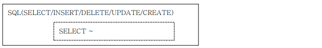
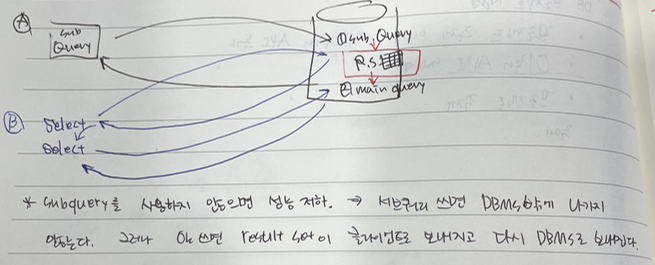
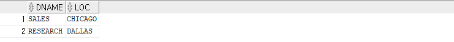
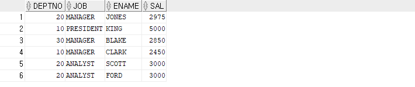

## 서브쿼리

- **다른 SQL(select, insert, delete, update, create...) 문 안에 포함되는 select문**

  


- **Query라는 단어의 2가지 의미** 
  - SQL
  - SELECT


- **실행 순서(중요!)**
  - SUBQUERY 실행 > MAIN QUERY 실행
  - **예외 ) CORRELATED SUBQUERY(상관 서브쿼리)**


- **동작하는 방식에 따른 분류(중요!!)**
  - **Un-Correlated Subquery**
    - 서브쿼리가 메인쿼리의 컬럼을 참조하지 않는다. 
    - 메인쿼리에 값(서브쿼리의 실행결과)을 제공하는 목적으로 사용
  - **Correlated Subquery**
    - 서브쿼리가 메인쿼리의 컬럼을 참조 한다. 
    - 메인 쿼리가 먼저 실행되고 서브쿼리에서 필터링 하는 목적으로 사용


- **서브쿼리를 사용하는 이유**

  - 서브쿼리를 사용하지 않아도 select 문을 2번 사용하는 방법도 있다.

  


- **실습**

  - Multiple Rows

  ```sql
  -- 에러 발생
  SELECT DNAME,LOC FROM DEPT
  WHERE DEPTNO = (SELECT DEPTNO FROM EMP GROUP BY DEPTNO HAVING COUNT(*) > 3 ); 
  -- '=' 뒤에는 하나의 결과값만 나와야 한다.
  -- 결과 값이 Multiple Rows이므로 = 대신 in으로 바꾸면 된다.
  SELECT DNAME,LOC FROM DEPT
  WHERE DEPTNO in (SELECT DEPTNO FROM EMP GROUP BY DEPTNO HAVING COUNT(*) > 3 );
  ```

  

  - Multiple Column

  ```sql
  -- where 조건이 컬럼이 여러개
  SELECT DEPTNO,JOB,ENAME,SAL FROM EMP
  WHERE (DEPTNO,JOB) IN (SELECT DEPTNO,JOB FROM EMP
   GROUP BY DEPTNO,JOB HAVING AVG(SAL) > 2000);
  ```

  

  

- **Scalar Subquery** 

  - SELECT 절에서 사용하는 Subquery 이다.
  - 한 행, 한 컬럼(1 Row 1 Column)만을 반환하는 서브쿼리를 말한다.
    - 스칼라 서브쿼리는 단일 행 서브쿼리이기 때문에 결과가 2건 이상 반환되면 SQL문은 오류를 반환한다.
  - 장점 : 편리성
  - select list에 있으면 서브쿼리는 가장 먼저 실행되지 않는다.
  - 예)

  ```sql
  -- 상관 서브쿼리
  -- 서브쿼리 안에 alias가 m이 있다. 이 값은 서브쿼리 안에 있는 alias가 아니다.(메인쿼리 안에 있는 alias) 그럼 서브쿼리는 나중에 실행되어야 한다.!!! 
  SELECT DEPTNO,ENAME,JOB,SAL,
   (SELECT ROUND(AVG(SAL),0) FROM EMP S WHERE S.JOB=M.JOB) AS JOB_AVG_SAL
  FROM EMP M
  ORDER BY JOB;
  ```

  - 그럼 이 서브쿼리는 몇 번 반복되는가?
    - row의 개수만큼 반복된다. 즉, 메인 쿼리에서 추출되는 데이터 건 수만큼 수행되기 때문에 조인으로 수행될 때보다 수행 횟수가 적을 수 있다.
    - 그럼 비효율적이지 않나???? (성능저하를 발생한다.)
    - 그래서 hash를 사용해서 성능 저하가 일어나지 않게 된다.(나중에 설명)
  - 일치하는 값이 없는 경우 NULL을 반환한다.


- **In-Line View (FROM 절에 사용된 SUBQUERY)**
  - [설명] SQL이 실행되는 시점에 동적으로 생성되는 View의 역할을 한다고 해서 Dynamic View 라고도 한다. 일반으로 Subquery의 컬럼을 Mainquery에서 사용할수 없지만 Inline View에서 Subquery의 컬럼을 Mainquery 에서 사용이 가능하다.


- **DML 연산과 Subquery** 

  - DML 연산에도 Subquery를 사용할수 있으며 해당 실습은 DML 과정에서 다루며 여기에서는 DML 연산에 사용되는 Subquery의 예를 보기만 하겠다.

  ```sql
  -- 여러 행 삽입 가능
  INSERT INTO BONUS(ENAME,JOB,SAL,COMM)
  SELECT ENAME,JOB,SAL,COMM FROM EMP;
  
  -- 여러 행을 삽입 가능
  -- 조건절과 함수도 사용할 수 있다.
  INSERT INTO BONUS(ENAME,JOB,SAL,COMM)
  SELECT ENAME,JOB,SAL,DECODE(DEPTNO,10,SAL*0.3,20,SAL*0.2)+NVL(COMM,0)
  FROM EMP
  WHERE DEPTNO IN (10,20);
  
  -- 여러 행 수정 가능
  UPDATE EMP SET COMM = (SELECT AVG(COMM)/2 FROM EMP)
  WHERE COMM IS NULL OR COMM = 0;
  
  -- 여러 행 삭제 가능
  DELETE FROM BONUS WHERE SAL > (SELECT AVG(SAL) FROM EMP ;
  ```

  


