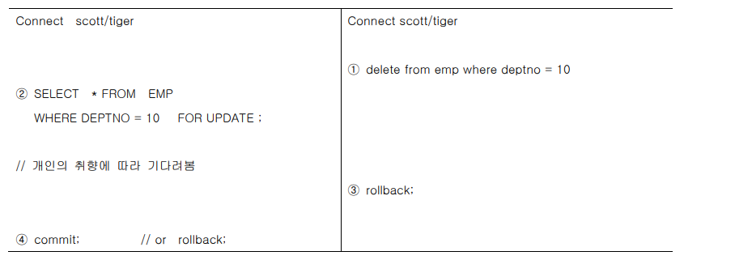

## 용어 정리

- **Listener**

  - Listener : 커넥션 request를 듣는다. (웹서버, WAS 서버, DB 등 모두 가지고 있음)
    
    > https://dololak.tistory.com/616
    
    - 1521 port : 오라클 포트
    
  - ip주소, port번호, dbms 이름, 계정 이름 등의 정보 가지고 요청을 보냄

  - 리스너가 요청을 받으면 별도의 서비스를 할 수 있는 서버 프로세스를 생성(fork)

  - 리스너가 서버 프로세스를 만들고 클라이언트와 서버 프로세스가 연결이 된다. 

  - 즉, 커넥션이 만들어짐 

  - 이때부터 클라이언트가 sql을 날리면 connect을 타고 서버 프로세스로 sql이 오는 것이다. 

  - 하나의 클라이언트 별로 하나의 서버 프로세스가 만들어진다. 

  - 즉, 실질적으로 sql을 처리하는 것은 서버 프로세스임

  - DBMS 서버 내에는 Optimizer가 있다.

    - 옵티마이저는 모든 dbms에 있다. 오라클에만 있는 것이 아님

  - 옵티마이저는 데이터 딕셔너리(Data Dictionary)에 있는 오브젝트 통계, 시스템 통계 등의 정보를 사용해서 예상되는 비용을 산정한다. 옵티마이저는 여러 개의 실행 계획 중에서 최저 비용을 가지고 있는 계획을 선택해서 SQL을 실행한다.

  - 즉, sql은 what를 정의 옵티마이저는 how를 정의(방법, 순서)

  

  

- **cf. Program과 Process의 차이**

  - 프로그램과 프로세스의 가장 큰 차이점은 프로그램은 지정된 작업을 수행하는 명령 그룹이며 프로세스는 실행중인 프로그램이라는 점이다. 프로세스가 활동적인 엔티티 인 동안, 프로그램은 수동적 인 것으로 간주된다.

  | 비교 근거   | 프로그램                                                     | 방법                                                         |
  | :---------- | :----------------------------------------------------------- | :----------------------------------------------------------- |
  | 기본        | 프로그램은 일련의 지시입니다.                                | 프로그램이 실행되면이를 프로세스라고합니다.                  |
  | 자연        | 수동태                                                       | 유효한                                                       |
  | 수명        | 더 길게                                                      | 제한된                                                       |
  | 필요한 자원 | 프로그램은 일부 파일의 디스크에 저장되며 다른 리소스는 필요하지 않습니다. | 프로세스는 CPU, 메모리 주소, 디스크, I / O 등과 같은 리소스를 보유합니다. |
  > https://ko.gadget-info.com/difference-between-program

   


- **cf. Memory, Disk**

  


## JOIN 내부 알고리즘

- **조인처리 알고리즘은 옵티마이저가 정한다.**

  > https://needjarvis.tistory.com/162

- **Nested Loop Join**

  - 이중 for문과 비슷

   

  - 2개 이상의 테이블에서 하나의 집합을 기준으로 순차적으로 상대방 Row를 결합하여 원하는 결과를 조합하는 방식
  - 먼저 선행 테이블의 처리 범위를 하나씩 액세스하면서 추출된 값으로 연결할 테이블을 조인한다

  

  

- **sort merge join**

  - 조인의 대상범위가 넓을 경우 발생하는 Random Access를 줄이기 위한 경우나 연결고리에 마땅한 인덱스가 존재하지 않을 경우 해결하기 위한 조인 방안
  - 양쪽 테이블의 처리범위를 각자 Access하여 정렬한 결과를 차례로 Scan하면서 연결고리의 조건으로 Merge하는 방식

  

  

  

## HASH

- **체크섬**(CHECKSUM)은 [중복 검사](https://ko.wikipedia.org/wiki/오류_정정_부호)의 한 형태로, [오류 정정](https://ko.wikipedia.org/wiki/오류_검출_부호)을 통해, 공간([전자 통신](https://ko.wikipedia.org/wiki/전자_통신))이나 시간([기억 장치](https://ko.wikipedia.org/wiki/기억_장치)) 속에서 송신된 자료의 무결성을 보호하는 방법이다.
- 일반적인 알고리즘에는 MD5, SHA-1, SHA-256 및 SHA-512 등이 있다.
  - MD5(Message-Digest algorithm 5)
    - MD5는 128비트 암호화 해시 함수이다. RFC 1321로 지정되어 있으며, 주로 프로그램이나 파일이 원본 그대로인지를 확인하는 무결성 검사 등에 사용된다. 1991년에 로널드 라이베스트가 예전에 쓰이던 MD4를 대체하기 위해 고안했다. (위키백과)

- check sum (= 순환 중복 검사 (CRC , CYCLICREDUNDANCYCHECK ))
  - 인터넷 등의 통신시스템에서 오류검증에 중요한 방법으로 사용한다.  정해진 다항식이 결정되어 있고, 이것에 따라 송신 쪽에서 계산하여 헤더에 붙여 보내면 수신 쪽에서 다시 계산하고 보내진 체크섬과 비교한다 


- **Scalar subquery**
  - Subquery 중에서 함수처럼 한 레코드당 정확히 하나의 값 만을 리턴하는 Subquery 를 'Scalar  Subquery'라고 한다.
  -  Scalar Subquery는 내부적으로 캐싱 기법이 작용


- **Scalar Subquery Caching**
  - Scalar Subquery를 사용하면 내부적으로 캐시를 생성하고, 여기에 Subquery 에 대한 입력 값과 출력 값을 저장한다.
    - Cache란?
      - 캐시(cache, 문화어: 캐쉬, 고속완충기, 고속완충기억기)는 컴퓨터 과학에서 데이터나 값을 미리 복사해 놓는 임시 장소를 가리킨다. 캐시는 캐시의 접근 시간에 비해 원래 데이터를 접근하는 시간이 오래 걸리는 경우나 값을 다시 계산하는 시간을 절약하고 싶은 경우에 사용한다. 캐시에 데이터를 미리 복사해 놓으면 계산이나 접근 시간 없이 더 빠른 속도로 데이터에 접근할 수 있다.
  - 쿼리로부터 같은 입력 값이 들어오면 Subquery 를 실행하는 대신 캐시된 출력 값을 리턴한다. 
  - 캐시에서 찾지 못할 때만 쿼리를 수행하며, 결과는 버리지 않고 캐시에 저장해 둔다
  - Scalar Subquery를 수행할 때, 입력 값과 출력 값을 빠르게 저장하고 찾기 위해 해싱 알고리즘이 사용된다.


## Insert

- **1번에 1개의 Row 입력, 2가지 유형중, 좋은 방식은 ?**

  - 두 번째 : 컬럼명과 값을 1:1로 매핑-> 테이블에 정의된 컬럼 순서 필요(X)
  - 두 번째 방법이 더 안전하긴 하다. 

  ```sql
  INSERT INTO DEPT VALUES(50,'연구소1','서울'); -- 모든 컬럼이 insert의 대상
  
  INSERT INTO DEPT(DEPTNO,DNAME,LOC) VALUES(51,'연구소2','대전'); -- 좋은방식의 SQL문은?
  ```


- **cf. 오라클에서 한글은 한 글자에 3byte이다.** 

- **예**

  - 1번

  ```sql
  desc dept;
  ```

   

  ```sql
  INSERT INTO DEPT(DNAME,LOC) VALUES('중부영업점','대구'); 
  ```

  

  

  

  ```sql
  INSERT INTO DEPT VALUES('중부영업점','대구'); 
  ```

  


- **INSERT시에 특정 COLUM에 NULL값 삽입방법**

  - EXPLICIT방법 2가지

    ```sql
    INSERT INTO DEPT(DEPTNO,DNAME,LOC) VALUES(52, '북부영업점',NULL); 
    --'NULL' 과 다른점은? 'NULL'은 문자 NULL을 의미한다.
    INSERT INTO DEPT(DEPTNO,DNAME,LOC) VALUES(53, '남부영업점','');
    ```

  - \- IMPLICIT방법 1가지

    ```sql
    INSERT INTO DEPT(DEPTNO,DNAME) VALUES(54,'서부영업점'); -- 대상 컬럼 생략
    ```


## UPDATE

- **사용방법**

  ```
  update 테이블명 set [수정할 컬럼명 = 수정할 값] where ~
  ```


- **예**

  - 여러 개의 컬럼을 수정할 경우 콤마(,)로 이어 쓰기 (조건)

  ```sql
  UPDATE DEPT SET DNAME = '중부연구소' WHERE DEPTNO = 50; -- 단일 COLUMN수정
  UPDATE DEPT SET DNAME = '북서부연구소', LOC='인천' WHERE DEPTNO = 51; -- 복수 COLUMN수정
  commit;
  ```

  - where 절 조건이 없는 경우 전체 ROW가 수정이 된다.

  ```sql
  UPDATE DEPT SET LOC='미개척지역';
  ```

  - 전체 data를 수정하면 안되므로 다시 commit 시점으로 복구

  ```sql
  rollback;
  ```

  


## DELETE

- 예

  - null인 데이터를 삭제

  ```sql
  delete from dept where loc is null
  ```

  - from은 생략이 가능
    - dept 테이블의 모든 데이터가 삭제
    - 단! 테이블이 삭제되는 것이 아님
    - 그냥 데이터만 삭제 

  ```sql
  delete dept;
  ```

  - 전부 삭제되면 안되므로 rollback을 진행
    - 마지막 commit 시점으로 돌아감

  ```sql
  rollback
  ```

  


## DML SUBQUERY

- subquery로 한 번에 여러 row를 insert 할 수 있다.

  - insert의 values 대신에 select가 사용됨

  ```sql
  insert into bonus(ename, job, sal, comm)
  select ename, job, sal, comm from emp;
  ```

  - 부서별로 보너스를 계산한 후 insert 작업

  ```sql
  insert into bonus 
  select ename, job, sal, decode(deptno, 10, sal*0.3, 20, sal*0.2)+nvl(comm,0) 
  from emp where deptno in (10,20);
  ```

  - 평상시에 COMM을 받지 못하는 사원들에게 평균 COMM 금액의 50%를 보너스로 지급

  ```sql
  UPDATE EMP SET COMM = (SELECT AVG(COMM)/2 FROM EMP)
  WHERE COMM IS NULL OR COMM = 0;
  ```

  -  평균 이상의 급여를 받는 사원들은 보너스 지급 대상자에서 제외

  ```sql
  DELETE FROM BONUS WHERE SAL > (SELECT AVG(SAL) FROM EMP ;
  ```


## TRANSACTION

- **정의**

  트랜잭션(Transaction)은 **데이터베이스의 상태를 변환시키는 하나의 논리적 기능을 수행하기 위한 작업의 단위 또는 한꺼번에 모두 수행되어야 할 일련의 연산들**을 의미한다.

  - 예를 들어 온라인 쇼핑을 한다고 가정해보자. 주문 완료를 위해 쇼핑몰 업체에 계좌이체를 하려고 한다.
    - 내 계좌에서 2만원을 인출 및 이체한다.
    - 내 계좌에 잔액이 차감된다.
    - 업체에 내 이름으로 2만원이 입금된다.
    - 업체 계좌에 잔액이 더해진다.

  - 이체에 필요한 위의 과정에서 만약, 카드사 및 은행 시스템의 문제로 내 계좌에서는 2만원이 인출됐지만 업체에는 입금되지 않았다면? 내 계좌의 인출 작업도 곧바로 취소돼야 한다. 
    처리하는 과정에서 문제가 발생하게 되면 진행 중이던 작업(전체)을 취소하고 처음부터 다시 시작해야 하는데(즉, 이체가 완료되거나 or 안되거나) 이것이 트랜잭션의 특성이다. 


- **Logical Unit of Work (LUW or database transaction)**

  A **Logical Unit of Work (LUW or database transaction)** is an inseparable sequence of database operations which must be executed either in its entirely or not at all. For the database system, it thus constitutes a unit.

  LUWs help to guarantee database integrity. When an LUW has been successfully concluded, the database is once again in a correct state. If, however, an error occurs within an LUW, all database changes made since the beginning of the LUW are cancelled and the database is then in the same state as before the LUW started. 


- **트랜잭션(오라클)**
  - 시작 : 첫 번재 실행 가능한(변경 가능한) SQL 실행 시
    - **insert, update, delete, (select는 아님)**
  - 종료
    - 명시적 종료 : commit(트랜잭션에서 변경된 사항을 데이터베이스에 영구히 반영하는 것), rollback(트랜잭션 시작 이전의 상태로 되돌리는 것)
    - 영구히 반영이란? 디스크에 저장되는 것
    - 암시적 종료 
      - DDL 실행시
      - 비정상 종료시


- **TRANSACTION 시작 과 종료**

  ```sql
  rollback --트랜잭션 종료
  insert into DEPT(DEPTNO,DNAME,LOC) VALUES(90,'신규사업부','경기도'); --트랜잭션 시작
  update emp set deptno = 90 where deptno = 30; --진행 중
  DELETE FROM DEPT WHERE DEPTNO = 30; --진행 중
  SELECT * FROM DEPT; --진행 중인 상태에서 조회 
  SELECT * FROM EMP WHERE DEPTNO = 30;
  rollback; -- 트랜잭션 종료(트랜잭션을 명시적으로 종료)
  select * from dept; --종료 후 조회
  ```


- **TRANSACTION 종료후 ROLLBACK 처리범위**

  ```sql
  INSERT INTO EMP(EMPNO,ENAME,JOB,SAL) VALUES(1111,'오라클','DBA',3500); --TRANSACTION START
  UPDATE EMP SET SAL = SAL* 1.3;
  COMMIT; -- TRANSACTION END
  ROLLBACK WORK; --ansi 표준이고 work를 생각해도 된다.
  --commit으로 트랜잭션이 종료가 된 상태이므로 이 rollback은 취소할 것이 아무 것도 없다. 
  SELECT * FROM EMP;
  ```

  

- **트랜잭션 4가지 특성**
  - 원자성(Atomicity, All or Nothing)
    - 트랜잭션과 관련된 작업들이 부분적으로 실행되다가 중단되지 않는 것을 보장하는 능력이다.
    - 위의 예시와 같이, 이체는 성공할 수도 실패할 수도 있지만 보내는 쪽에서 돈을 빼 오는 작업만 성공하고 받는 쪽에 돈을 넣는 작업을 실패해서는 안된다. 
      원자성은 이와 같이 중간 단계까지 실행되고 실패하는 일이 없도록 하는 것이다.
  - 일관성(Consistency)
    - 트랜잭션이 실행을 성공적으로 완료하면 언제나 일관성 있는 데이터베이스 상태로 유지하는 것을 의미한다.
    - 무결성 제약이 모든 계좌는 잔고가 있어야 한다면 이를 위반하는 트랜잭션은 중단된다.
  - 격리성, 고립성(lsolation)
    - 트랜잭션을 수행 시 다른 트랜잭션의 연산 작업이 끼어들지 못하도록 보장하는 것을 의미한다. 
    - 이것은 트랜잭션 밖에 있는 어떤 연산도 중간 단계의 데이터를 볼 수 없음을 의미한다. 
    - 은행 관리자는 이체 작업을 하는 도중에 쿼리를 실행하더라도 특정 계좌간 이체하는 양 쪽을 볼 수 없다. 공식적으로 독립성은 트랜잭션 실행내역은 연속적이어야 함을 의미한다. 성능관련 이유로 인해 이 특성은 가장 유연성 있는 제약 조건이다. 
  - 영속성, 지속성(Durability)
    - 성공적으로 수행된 트랜잭션은 영원히 반영되어야 함을 의미한다. 
    - 시스템 문제, DB 일관성 체크 등을 하더라도 유지되어야 함을 의미한다. 전형적으로 모든 트랜잭션은 로그로 남고 시스템 장애 발생 전 상태로 되돌릴 수 있다.
    - 트랜잭션은 로그에 모든 것이 저장된 후에만 commit 상태로 간주될 수 있다.


-  **TRANSACTION 과 DDL** 

  - **DDL 명령어는 자동으로 commit이나 rollback을 한다.**
  - **!!!즉, 하나의 ddl은 하나의 트랜잭션이다.(ddl문이 끝났을때는 트랜잭션이 종료)!!!**

  - ddl 명령이 성공적으로 끝나면 알아서 commit을 해주고 ddl 명령이 실패했으면 알아서 rollback을 해준다.
  - 그래서 1. rollback는 아무 것도 취소를 하지 않음(아무런 영향도 미치지 않음)
    - 왜냐하면 바로 위에 ddl이 있어서 자동으로 트랜잭션이 종료가 되었으므로
  - 그러면 2. rollback 또한 아무 것도 취소를 하지 않음(아무런 영향도 미치지 않음)
    - 위와 같은 이유로 ddl문이 있어서 자동으로 트랜잭션을 종료

  ```sql
  INSERT INTO EMP(EMPNO,ENAME,DEPTNO) VALUES(9999,'OCPOK',20); --TRANSACTION START
  ALTER TABLE EMP ADD( SEX CHAR(1) DEFAULT 'M'); -- DDL
  ROLLBACK; -- 1. 취소 범위는?
  DESC EMP;
  ALTER TABLE EMP DROP COLUMN SEX; -- DDL
  ROLLBACK; -- 2. 취소 범위는?
  DESC EMP
  ```


## Rollback Level

- **rollback 정의**

  > 위키백과 
  >
  > 데이터베이스에서 업데이트에 오류가 발생할 때, 이전 상태로 되돌리는 것을 말한다. 후진 복귀라고도 한다. 데이터베이스는 업데이트 이전 저널 파일을 사용하여 원래의 정상적인 상태로 되돌린다. 이것은 오류 동작 이후에도 깨끗한 사본으로 복원시킬 수 있기 때문에, 무결성을 위해 중요하다. 데이터베이스 서버의 충돌로부터 복원하는데도 중요하다. 충돌이 일어날 때, 특정 트랜잭션을 롤백시킴으로써 데이터베이스는 일관적인 상태로 되돌려진다. 


- **테이블 복사(구조와 데이터 모두)**

  ```sql
  create table emp_copy
  as select * from emp;
  ```


- **rollback level**
  - statement level
    - dbms가 자동으로 rollback을 처리
    - 문장을 수행하다가 문장이 에러가 나면 자동으로 rollback
  - transaction level


- **실습(transaction level)**

  - ③ 성공
  - ④에서 error 발생sal의 데이터 타입은 number(7,2) 이므로
  - ⑤ 성공
  - **나머지 문장은 성공하고 4번 실행시 update 에러가 나므로 이 update문만 rollback 처리를 한다.**
  -  **즉, 이 트랜잭션은 원자성이라는 것을 위반하게 됨**
  - **!!!sql만 묶어놔서는 트랜잭션의 원자성을 만족할 수 없다. > 해결 방법 : PL/SQL!!!** 

  ```sql
  ① ROLLBACK;
  ② SELECT /* Before Transaction */ EMPNO,SAL FROM EMP WHERE EMPNO IN (7788,7902);
  ③ DELETE FROM EMP WHERE DEPTNO = 10; --트랜잭션 start
  ④ UPDATE /* STATEMENT LEVEL ROLLBACK */ EMP SET SAL = 123456789 WHERE EMPNO = 7788;
  ⑤ UPDATE EMP SET SAL = 1234 WHERE EMPNO = 7902;
  ⑥ COMMIT; --트랜잭션 끝
  ⑦ -- 데이터 확인
  SELECT /* After Transaction */ EMPNO,SAL FROM EMP WHERE EMPNO IN (7788,7902);
  SELECT /* After Transaction */ EMPNO,SAL FROM EMP WHERE DEPTNO = 10;
  ```

  


- **statement level**

  - 예
    - **원자성을 만족**

  

  

- **PL/SQL**

  - **!!!transaction level에서 원자성을 만족하지 못해서 PL/SQL을 사용!!!**
  - Block으로 구조화된 언어 (자바의 try~catche와 비슷)
  - Block의 3개의 영역
    - 선언부
    - 실행부 : BEGIN 영역
    - 예외처리부 : EXCEPTION ~ END
      - EXCEPTION은 RUNTIME ERROR (실행시간에 발생하는 에러)
  - 예
    - ① 성공
    - ② 에러 발생 > 데이터의 길이가 길다.
    - **에러가 발생하면 exception 구문으로 들어감**
    - exception 구문으로 가서 rollback을 진행
    - 문제가 없으면 commit

  ```plsql
  SELECT /* Before Transaction */ EMPNO,SAL FROM EMP WHERE EMPNO IN (7499,7698);
  SELECT /* Before Transaction */ EMPNO,SAL FROM EMP WHERE DEPTNO = 20;
  BEGIN
   /* 1. 멀티행 라인
   2. 주석 테스트 */
  ① DELETE FROM EMP WHERE DEPTNO = 20;
  ② -- 자리수 초과 에러 발생
  UPDATE EMP SET SAL = 123456789 WHERE EMPNO = 7499;
  ③ UPDATE EMP SET SAL = 1234 WHERE EMPNO = 7698;
  ④ COMMIT;
  EXCEPTION
  WHEN OTHERS THEN
   ⑤ ROLLBACK; -- TRANSACTION LEVEL ROLLBACK
  END;
  /
  SELECT /* After Transaction */ EMPNO,SAL FROM EMP WHERE DEPTNO = 20;
  SELECT /* After Transaction */ EMPNO,SAL FROM EMP WHERE EMPNO IN (7499,7698);
  ```

  


## TRANSACTION과 읽기일관성(READ CONSISTENCY)

- **실습**

  - 2개의 세션을 생성 후 실습

  

  - 1 ~ 3
    - 변경이 진행 중인 불안정한 데이터는 자신만(변경을 진행 중인 현재 세션) 볼 수 있다.
    - 다른 세션에서는 변경 전 안정적인 데이터만 확인할 수 있다.

  

  - **커밋을 하면 변경 후 데이터를 모든 세션에서 확인 가능**
  - 이게 읽기 일관성이다.

  


## TRANSACTION 과 Row Level Lock

- Lock

  - 동시성을 제어
  - 트랜잭션이 시작되기 전에 lock을 걸고 트랜잭션이 종료되면 lock을 해제한다. 
  - Row Level : row 단위로 자동으로 lock을 거는 것임
    - ①을 보면 deptno가 10인 row만 lock을 걸고 update를 진행한 다음에 lock을 해제한다.
    - 다른 세션에서 ②를 진행 > delete를 진행하기 위해서 deptno가 20인 row에 lock을 걸고 delete를 진행한다. 
    - 다른 세션에서 ③을 진행하려고 하는데 이미 deptno가 10인 row에는 lock이 걸려있어서 delete를 진행할 수 없다. 
    - 전의 트랜잭션이 끝날 때까지 기다림
    - 단 select는 lock과 상관이 없어서 볼 수 있음
    - 대신 commit이 되기 전까지의 데이터가 보임(update가 진행되었지만 commit이 되지 않은 상태면 update 전의 데이터가 보이는 것임) 
  - Table Level : 
  - **실습**

  

  - ①을 통해서 deptno = 10 데이터 lock
  - ②에서는 deptno = 20 데이터를 lock (20은 lock이 걸리지 않아서 해당 쿼리문이 실행)

  

  

  

  

## SELECT * FOR UPDATE (ROW LEVEL LOCK)

- select 문에서도 lock을 걸 수 있다.

- **Repeatable Read 보장**

  - for update 뒤에 써주면 select의 데이터에 lock을 걸어둠 (나중에 수정할거니까 건들지 말라는 의미로 lock을 하는 것임)
  - 실습

  

  

  

  

  