## 과제 정리

- **date**
  - FM : Fill Mode
  - FF : Fractional seconds


- **언어 설정**

  ```sql
  alter session set nls_language = '언어'
  --nls_date_language는 nls_language를 따름
  ```

  - 예

  ```sql
  select * from sys.props$ where name like '%LANG%';
  alter session set nls_language = 'KOREAN'
  
  --YEAR는 항상 영어로 나온다.
  SELECT TO_CHAR(SYSDATE, 'YEAR, year, YYYY, YYY, YY, Y') FROM DUAL;
  SELECT TO_CHAR(SYSDATE, 'MONTH, MON, month, mon') FROM DUAL;
  ```

   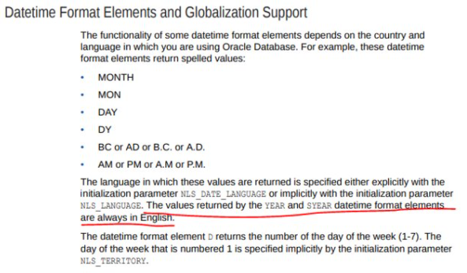


- **DDL 문장이 수행 시 트랜잭션**
  - DDL 문장이 **실행되기 전**에 **commit**을 한 번 하고 **DDL이 끝나면** **commit**이 자동으로 이루어 진다. 
  - truncate도 DDL문


- **DELETE & TRUNCATE & DROP 차이**

  - TRUNCATE 
    - 테이블의 데이터를 전부 삭제하고 사용하고 있던 공간을 반납
    - 해당 테이블의 데이터가 모두 삭제되지만 테이블 자체가 지워지는 것은 아님
    - 해당 테이블에 생성되어 있던 인덱스도 함게 truncate 됨
    - 조건절을 사용할 수 없음
    - ex) truncate table 테이블명
  - DROP 
    - 테이블 자체를 삭제하는 명령어
    - 테이블 자체가 모두 지워지며, 해당 테이블에 생성되어 있던 인덱스도 삭제
    - 오라클 10g부터는 테이블이 삭제되는 것이 아니라 윈도우의 휴지통 개념처럼 잠시 삭제됨 그리고 테이블 이름이 BIN$..로 변경됨
    - 사용하고 있던 공간도 모두 반납하고 인덱스나 제약조건 등 오브젝트로 삭제
    - drop table 테이블명
  - delete
    - 데이터만 지워지고 쓰고 있던 디스크 상의 공간은 그대로 가지고 있음
    - 조건절 사용 가능 즉, 원하는 데이터만 지울 수 있음

  - Delete, Truncate, Drop의 중요한 차이점

    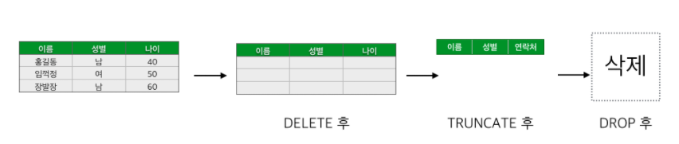

    - delete는 데이터만 지워지고 쓰고 있던 디스크 상의 공간은 그대로 가지고 있다.
    - truncate 작업은 최초 테이블이 만들어졌던 상태, 즉 데이터가 1건도 없는 상태로 모든 데이터를 삭제, 컬럼값만 남아있다. 그리고 용량도 줄고 인덱스 등도 모두 삭제 된다.
    - delete보다 truncate가 더 좋아보이나 delete는 원하는 데이터만 골라서 삭제가 가능하나 trucate는 그렇지 못함

    - drop은 데이터와 테이블 전체가 삭제하게 되고 사용하고 있던 공간도 모두 반납하고 인덱스나 제약조건 등 오브젝트로 삭제된다.


## DATA TYPE

- **DATA TYPE의 종류**
  - 문자 DATA TYPE
    - 작은유형 
      - CHAR : 고정길이 문자
        - **최대 2000byte까지 정의 가능**
      - VARCHAR2 [VAR(Variable, 가변의) + CHAR + 2(버전)] : 가변길이 문자
        - **최대 4000byte까지 정의 가능**
    - 긴유형 
      - LONG : 2G
      - CLOB(Character Large Object) : LONG TYPE을 개선한 것 (최대 4G)
  - 숫자 DATA TYPE
    - NUMBER (정수, 실수) : 가변길이
      - **!!!최대 38자 유효 숫자를 저장한다.!!!(외우기)** 
  - 날짜 DATA TYPE
    - DATE : 고정길이(7byte)
    - TIMEZONE : 고정길이(11byte) 
      - 첫 7 byte는 date 타입과 동일하고 마지막 4byte는 초 이하 단위(9자리)를 저장하는데 사용된다.
  - BINARY 
    - 작은유형 : RAW
    - 긴유형 : LONG RAW ,BLOB
  - 기타 DATA TYPE
    - ROWID


## CHAR

- **설명**
  - 1~2000 사이의고정길이(fixed-length character strings) 저장방식
  - 정의된 길이만큼 저장 공간이 할당이 되며 입력되고난 **나머지 공간은 공백문자(BLANK-PADDING)로 채워진다.**
    - 공백 문자도 data이다. 
- **용도** 
  - 데이터가 항상 지정된 길이를 전부 차지하는 경우에 유리함.


## VARCHAR2

- **설명**
  - 1~4000, 가변길이(VARiable-length character strings) 저장방식
  - 입력된 길이만큼 저장 공간이 할당된다. (ROW 내부에길이표시컬럼1~3Bytes)

- **용도**
  - 대부분의 문자 DATA에 사용

- **장점**
  - 데이터 저장공간을 유용하게 사용할 수 있다.


- 즉, char(20)과 varchar2(20)의 차이점은 char(20)은 무조건 20byte를 할당하겠다는 의미이고, varchar2(20)은 최대 20byte를 할당하겠다는 의미이다. 그래서 char(20)은 입력 데이터에서 남은 공간은 공백문자로 저장이 되고, varchar2(20)은 딱 정한 데이터만 저장되는 것이다. 

  - length byte를 저장하는 공간은 1~3byte이다.

  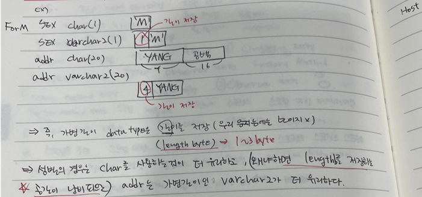


## NUMBER

- **NUMBER(P,S)**
  - 실수(floating-point-number), 정수(fixed number) ,가변길이(Packed Decimal) 저장
  - P(Precision)  : **1~ 38(전체유효숫자)** ,  S(Scale):  소수점이하자리수


- 예

  - 실수 : WEIGHT : NUMBER(4,2)
  - 정수 : SALARY : NUMBER(4)
  - 실수, 정수 : DCRATE : NUMBER
  - 권고 : PRECISION, SCALE을 표시하라 
    - 데이터 입력시 INTEGRITY CONSTRAINTS 역할을 한다.
    - ex. AGE NUMBER -> AGE NUMBER(3)

  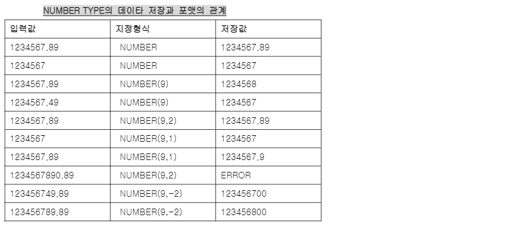

  - **만약 정수 자리를 초과하면 ERROR가 발생하고 , 소숫점 자리를 초과하면 알아서 ROUND 처리한다.** 


## ROWID

- 테이블 내에서도 ROWID를 저장할 수 있도록하는 데이터 타입


## 테이블생성(문자DATA TYPE)

- **예**

  ```sql
  create table customer_copy (
      id varchar2(8),
      pwd char(8),
      sex char(1)
  );
  
  select * from tab; --테이블 생성 확인
  desc customer_copy --생성된 테이블 구조(컬럼명, 데이터 타입, 컬럼길이) 확인
  ```

  ```sql
  INSERT INTO customer_copy VALUES('XMAN','XMAN', 'M');--컬럼명생략
  INSERT INTO customer_copy(ID,PWD,SEX) VALUES('ORACLE','OCM', 'F');--컬럼명지정
  COMMIT;
  
  -- INSERT시에 특정 COLUM에 NULL값 삽입 방법
  -- 명시적
  INSERT INTO customer_copy(ID,PWD,SEX) VALUES('NULL1','ZMAN',NULL); --'NULL' 과차이
  INSERT INTO customer_copy(ID,PWD,SEX) VALUES('NULL2','YMAN',''); 
  --암시적(Implicit)
  INSERT INTO customer_copy(ID,PWD)  VALUES('NULL3','LMAN');
  ```

  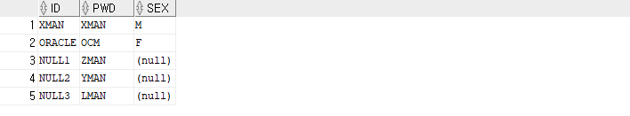


## 고정길이와 가변길이의 차이점 비교

- **데이터 저장 시**
  - 고정길이 : 정의된 길이만큼 저장 공간이 할당이 되며 입력되고난 **나머지 공간은 공백문자(BLANK-PADDING)로 채워진다.**
  - 가변길이 : 입력된 길이만큼 저장 공간이 할당된다. (ROW 내부에길이표시컬럼1~3Bytes)


- **데이터 비교 시 차이점**

  - **고정길이에서는 공백을 더 긴 공백만큼 채워서 비교를 한다.** 그래서 같은 데이터라고 판단
    - 즉, 공백(blank)을 채워 비교하는 방식 사용, 짧은 쪽의 끝에 공백을 추가하여 2개의 데이터가 같은 길이가 되도하고 앞에서부터 한 문자씩 비교, 끝의 공백만 다른 문자열은 같다고 판단
  - 가변길이에서는 공백도 문자로 취급해서 둘이 다른 문자로 판단

  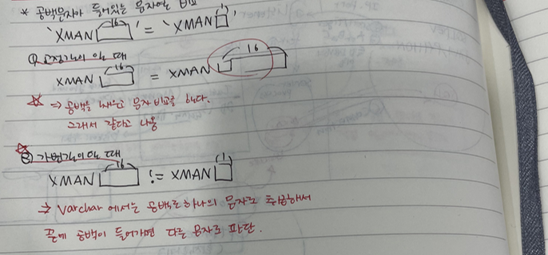


- **위에서 생성한 테이블로 예**

  - 데이터 저장시 차이점

  ```sql
  -- 데이터 저장 시 차이점
  SELECT ID, LENGTH(ID), VSIZE(ID), replace(PWD,' ','?' ), LENGTH(PWD), VSIZE(PWD)  FROM customer_copy;
  ```

  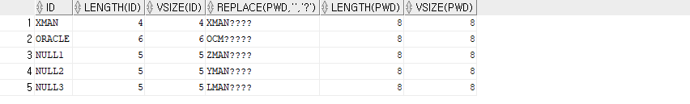

  

  - varchar2는 non-blank padding

  ```sql
  --비교시 차이점(BLANK-PADDING, NON-BLANK PADDING) 
  -- VARCHAR2 TYPE 비교시에는NON-BLANK PADDING 방식
  select * from customer_copy where id='XMAN '; --뒤에 공백 추가
  ```

  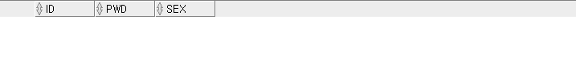

  - 문자 결합(가변 길이)
    - 결과 나옴

  ```sql
  select * from customer_copy where id= substr('XMAN',1,2)||substr('XMAN',3,2);
  ```

  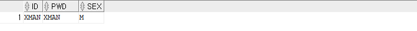

  

  - 가변길이(id)와 고정길이(pwd) 비교
    - 가변길이와 고정길이의 비교는 무조건 같아야 한다.
    - **!!!!가변길이에 우선순위가 있기 때문에 가변길이 비교 방식으로 non-blank padding를 사용한 것임!!!!**

  ```sql
  select * from CUSTOMER_COPY where id = pwd;
  ```

  

  - char type 비교
    - blank padding 방식

  ```sql
  --모두 같은 결과
  select * from CUSTOMER_COPY where pwd = 'XMAN  ';
  select * from CUSTOMER_COPY where pwd = 'XMAN';
  select * from CUSTOMER_COPY where pwd = 'XMAN   ';
  ```

  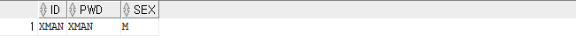

  

  - 문자 결합(고정 길이)
    - 결과 안나옴
    - **substr이 varchar type이므로 가변길이이다. 가변길이의 우선순위가 더 높아서 그래서 가변길이 문자 비교 방식을 사용한다.** 

  ```sql
  select * from customer_copy where pwd = substr('XMAN',1,2)||substr('XMAN',3,2);
  ```

  

  - **문자 결합(고정 길이)**
    - **!!!!!!!!!!!!!결과 나옴!!!!!!!!!!!!!**

  ```sql
  select * from customer_copy where pwd like substr('XMAN',1,2)||substr('XMAN',3,2)||'%';
  ```

  


## 테이블 생성(숫자DATA TYPE)

- **예**

  ```sql
  CREATE TABLE  TST_NUMBER(
      NUM NUMBER, --lengh가 없는 경우는?
      AGE NUMBER(3)  DEFAULT 18,--DEFAULT
      TAX NUMBER(7,2)
  );
  
  INSERT INTO TST_NUMBER VALUES(123.5, 123.5, 123.5); --소숫점 자리 초과시 round ( 결과 : 123.5 / 124 / 123.5 )
  INSERT INTO TST_NUMBER VALUES(123, 123, 123);
  INSERT INTO TST_NUMBER VALUES(123, 12345, 123); --정수형 자리 초과시 error
  INSERT INTO TST_NUMBER VALUES(123, 123, 123.56789); --소숫점 자리 초과시 round (결과 : 123, 123, 123.57)
  INSERT INTO TST_NUMBER VALUES(123,  '123', 123.56789); --error나지 않고 암시적 데이터 타입 변환
  --만약 원래 데이터 타입이 varchar2이고 숫자 데이터를 넣어도 암시적으로 데이터 타입이 변환된다. 
  INSERT INTO TST_NUMBER(NUM,TAX) VALUES(456, 456); --default는 18이므로 18이 들어간다.
  SELECT * FROM TST_NUMBER;
  ```

  


## 테이블생성(날짜DATA TYPE)

- **예**

  - table을 생성할 때 디폴트에 to_char(sysdate,'YY/MM/DD')를 사용할 수 있을까?
    - create에 생성되지만 select문으로 출력할 때는 디폴트 데이터 출력 타입으로 나온다. 

  ```sql
  CREATE TABLE TST_DATE(
      CHAR_HIREDATE VARCHAR2(8),
      DATE_HIREDATE DATE,
      LOG_DATE DATE DEFAULT  SYSDATE
  );
  ```

  


## ALTER

- **테이블 컬럼 추가**

  ```sql
  alter table 테이블명 add(컬럼명 데이터타입(사이즈))
  ```


- **테이블 컬럼 수정**

  ```sql
  alter table 테이블명 modify(컬럼명 데이터타입(사이즈))
  ```


- **테이블 컬럼 삭제**

  ```sql
  alter table 테이블명 drop column 컬럼명
  ```


- **테이블 컬럼 이름 변경하기**

  ```sql
  alter table 테이블명 rename column 원래컬럼명 to 바꿀컬럼명;
  ```


## delete, truncate, drop 차이점

- **dba_objects**

  ```sql
  select count(*) from dba_objects;
  ```

  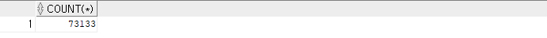


- **실습**

  - manager 계정에서 create

  ```sql
  --manager 계정에서 create
  create table scott.large_tbl 
  as select o.owner, o.object_name, e.ename from dba_objects o, scott.emp e; --join 조건이 제대로 적혀있지 않으면 카디션 곱
  ```

  

  - 대량의 데이터 생성 

  ```sql
  select count(*) from scott.large_tbl ;
  
  INSERT INTO SCOTT.large_tbl 
  SELECT * FROM SCOTT.large_tbl; --3번 실행
  ```

  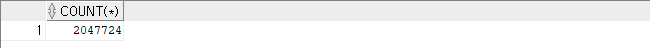

  

  - scott 계정에서 실습 table 생성

  ```sql
  CREATE TABLE DROP_TBL AS SELECT * FROM LARGE_TBL;
  CREATE TABLE TRUNCATE_TBL AS SELECT * FROM LARGE_TBL;
  CREATE TABLE DELETE_TBL AS SELECT * FROM LARGE_TBL;
  ```

  

  - sql에서 실행 속도를 보려면 다음 쿼리문을 실행

  ```sql
  SET TIMING ON;
  ```

  

  - drop으로 table 삭제

  ```sql
  DROP TABLE DROP_TBL;	
  ```

  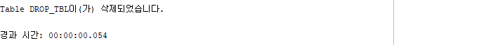

  

  - truncate로 table data 삭제

  ```sql
  truncate table truncate_tbl;
  ```

  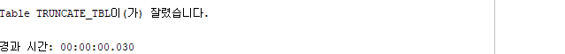

  

  - delete로 테이블 데이터 삭제
    - 시간이 가장 오래걸림

  ```sql
  delete from delete_tbl;
  ```

  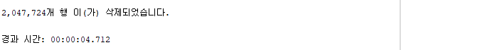

  

  - 왜 delete가 가장 시간이 오래 걸릴까?
    - delete는 실제로 데이터 영역으로 가서 데이터를 지운다.
    - drop은 데이터가 있는 영역이 빈공간이라고 표시를 하기 때문에 더 빠른 것이다.

  

  - 왜 delete는 rollback이 가능할까?
    - delete는 DML문이고 drop과 truncate는 DDL문이다. DDL문은 하나의 트랜잭션이므로 트랜잭션이 성공적으로 종료되면 자동으로 commit을 한다. 그러나 DML문은 자동으로 commit을 하지 않아서 commit을 명시적으로 입력하지 않으면 rollback이 가능하다.
    - TRUNCATE는 로그를 기록하지 않기 때문에 롤백이 되지 않고, delete로 삭제한 데이터는 로그를 사용해서 복구가 가능하다.


- **ALTER 예**

  ```sql
  ALTER TABLE DELETE_TBL ADD(AGE  NUMBER(3) DEFAULT 18); --왜 시간이 더 걸릴까? 
  ALTER TABLE DELETE_TBL ADD(ADDR VARCHAR2(60)); 
  
  SELECT * FROM DELETE_TBL WHERE ROWNUM < 10;
  ```

  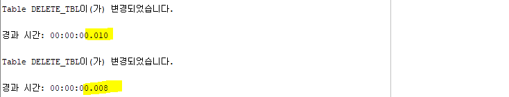

  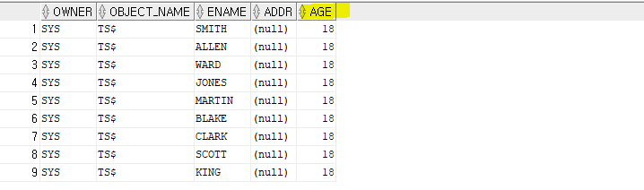


## 테이블명

- 문자명으로 시작해야 한다.
- 대소문자 구분하지 않는다 > 대문자로 만들어진다.


## 공간 확인

```sql
select tablespace_name, sum(bytes)/1024/1024 as free_space_m
from dba_free_space
group by tablespace_name; --내가 사용할 수 있는 free한 공간 

select SEGMENT_NAME, BYTES/1024/1024 as size_mega from DBA_SEGMENTS
where TABLESPACE_NAME = 'USERS'
order by 2 desc;
```


- **공간이 부족한 경우**
  - 메모리 스페이스가 부족한 경우
    - 성능 저하가 발생
  - 디스크 스페이스가 부족한 경우
    - 시스템이 멈추거나 재부팅이 된다.  


- **cf. sql 구문 순서**

  ```
  from > where > group by > having > select > order by
  ```


