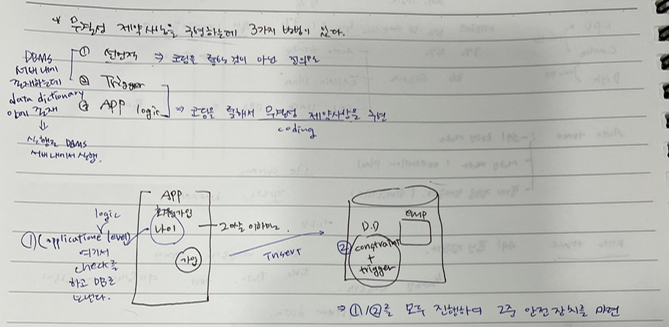

## 과제 정리

- **Cache**

  캐시(cache, 문화어: 캐쉬, 고속완충기, 고속완충기억기)는 컴퓨터 과학에서 데이터나 값을 미리 복사해 놓는 임시 장소를 가리킨다. 캐시는 캐시의 접근 시간에 비해 원래 데이터를 접근하는 시간이 오래 걸리는 경우나 값을 다시 계산하는 시간을 절약하고 싶은 경우에 사용한다. 캐시에 데이터를 미리 복사해 놓으면 계산이나 접근 시간 없이 더 빠른 속도로 데이터에 접근할 수 있다.

  

  

  - Cache의 특징 - 지역성
    - 시간 지역성( Temporal Locality ) : 한 번 참조된 데이터는 다시 참조될 확률이 높다.
    - 공간 지역성 ( Spatial Locality ) : 참조된 데이터 주변에 있는 데이터가 다음에 참조될 확률이 높다

  - CPU가 요청한 데이터가 캐시에 존재하면 => **Cache HIT** 이라고 부른다.

  - CPU가 요청한 데이터가 캐시에 존재X , Memory에서 가져오는 경우 =? **Cache Miss** 라고 부른다.
    
- 데이터가 캐시에 없으면 더 느린 메모리에서 데이터를 읽어야 한다.
    
- 하드웨어 관점에서 Cache
  
  - 마이크로 프로세서 내부에 있는 메모리이며 마이크로 프로세서의 물리적 구성 요소
  
    중앙처리장치(CPU)가 주 메모리에서 데이터에 접근하는데 시간 단축을 위해 사용하는 하드웨어 캐시
  
   
  
  - L1 & L2 Cache :CPU가 메모리로부터 데이터를 읽을 때, 우선 탐색
  
    L3 Cache  : 메모리부터 데이터를 읽을 때, 필요한 데이터보다 더 많은 데이터 블록을 읽음
  
- 소프트웨어 관점에서 Cache
  
  - 응용 프로그램 또는 브라우저 캐시라고도 하는 소프트웨어 캐시
  
  - 하드웨어 구성 요소가 아니라 하드 디스크에 저장되는 임시 파일 집합입니다.
  
  - 인터넷 연결과 같은 느린 소스에 액세스 하지 않고도 응용프로그램이 빠르게 액세스 가능
  
  
  
- Scalar Subquery와 Cache
  
    - 오라클은 스칼라 서브쿼리의 입력 값과 출력 값을 내부 캐시(Query Execution Cache)에 저장
  - 입력 값을 캐시에서 찾아보고 거기 있으면 저장된 출력 값을 리턴 -> 존재하지 않다면, 결과값은 캐시에 저장
  
  
  
    - 실행 횟수는 이런 상황에서는 row 개수만큼 실행한다. 그러나 캐시에 저장하면 한번에 불러옴


- **Query** **Transformation**

  - Oracle Optimizer 기본구조

    - Query Transformer (질의변환기) : 모든 Query의 TRANSFOMATION이 발생하는 영역
    - Estimator (비용산정기) : Query Block 단위로 Dictionary Table의 통계정보를 바탕으로 낮은 비용을 산정하고 최적의 실행계획을 선택
    - Plan generator (실행계획산정기) : Query Block 단위로 생성된 실행계획은 실행계획산정기에서 합쳐져 최종실행계획을 수립한다.

    

  

  - QUERY TRANSFORMATION 이란?

    - QUERY TRANSFORMATION 은 OPTIMIZER 가 Hard Parsing 을 수행할 때 복잡한 Query 를 단순화 시키기 위해서 수행하는 Query 단순화 과정
    - 옵티마이저가 SQL을 분석해 의미적으로 동일(같은 결과를 리턴)하면서도 더 나은 성능이 기대되는 형태로 재작성
    - 휴리스틱 쿼리 변환(Heuristic QT) : 결과만 보장된다면 무조건 쿼리 변환을 수행한다. 일종의 규칙 기반(Rule-based) 최적화 기법이라고 할 수 있으며, 경험적으로 (최소한 동일하거나) 항상 더 나은 성능을 보일 것이라는 옵티마이저 개발팀의 판단이 반영된 것이다.


    - 비용 기반 쿼리 변환(Cost Based QT) : 변환된 쿼리의 비용이 더 낮을 때만 그것을 사용하고, 그렇지 않을 때는 원본 쿼리 그대로 두고 최적화를 수행한다.
    
    


​    

  - 단순 Query Transformation

    - 해당 쿼리문을 옵티마이저가 사진에 있는 것처럼 바꿔준다.

  ```sql
  EX1)SELECT EMPNO, ENAME, JOB FROM EMP WHERE NOT SAL > (2000+200)/2;
  EX2)SELECT EMPNO, ENAME, JOB FROM EMP WHERE NOT SAL < 1000;
  ```

  

  

  

  ```sql
  EX3) SELECT EMPNO, ENAME, JOB FROM EMP WHERE JOB IN ('CLERK','SALESMAN');
  EX4) SELECT EMPNO, ENAME, JOB FROM EMP WHERE SAL BETWEEN 1000 AND 1300;
  ```

  

  - 왜 QUERY TRANSFORMATION을 하는가?

    OPTIMIZER 는 3 개 이상의 Table 간의 Join, InLine View 나 SubQuery가 포함된 복잡한 Query 에 대해서는 한번에 실행계획을 수립 하지 못하고 QUERYBLOCK 단위로 실행계획을 세운다음 마지막에 이를 하나로 합친다. (복잡한 쿼리가 들어오면 최대한 단순화 시키려고 한다.)

  - AUTOTRACE란?

    - AutoTrace 결과에는 SQL을 튜닝하는데 유용한 정보들이 많이 포함하고 있어 가장 즐겨 사용되는 도구 중 하나
    - SQL Plus에서 실행계획을 가장 쉽고 빠르게 확인해 볼 수 있는 방법

  - AUTOTRACE 확인 방법

    ```sql
    set autotrace on
    select * from emp;
    ```

    - table access full : emp table의 전체를 다 보여달라는 쿼리문이므로 테이블 전체를 access하라는 의미
    - Id : 실행계획에서의 구분자
    - Operation : 각 단계에서의 어떤 작업이 일어났는지 표시
    - Name : 테이블명이나 index 명을 표시함
    - Rows : 해당 쿼리 계획 단계에서 나올 것으로 예상되는 행의 수
    - Byte : 실행 계획의 각 단계가 반환할 것으로 예상 되는 데이터의 크기를 바이트로 나타낸 수. 이 수는 행의 수와 행의 예상 길이에 따라 결정됨
    - Cost : CBO가 쿼리 계획의 각 단계에 할당한 비용. CBO는 동일한 쿼리에 대해 다양한 실행 경로/계획을 생성하며 모든 쿼리에 대해 비용을 할당함. 즉, 위의 실행 계획에선 전체 비용이 12인것을 알수 있음
    - Time: 각 단계별 수행 시간

    

    

    

    - where절 추가

    ```sql
    set autotrace on
    select * from customer where name = '임기은';
    ```

     

    

    - where절 추가2
      - 위의 where과 다른 결과가 나온다.

    ```sql
    set autotrace on
    select * from customer where name = '임기은' AND ID = '00383764';
    ```

     


- **Logging이란?**
  - 로그(Log) :  시스템 동작 시 시스템 상태, 작동 정보를 시간의 경과에 따라 기록한 것
  - 로깅(Logging) :  정보를 제공하는 기록인 Log를 생성하도록 시스템을 작성하는 활동


## 제약사항(Constraint)

- **의미** : 데이터의 무결성(INTEGRITY)을 보장하기 위해서 사용되는 제약사항
- **종류**
  - 선언적 무결성 제약사항(Declarative Integrity Constraint)
  - TRIGGER
  - APPLICATION LOGIC


- **선언적 무결성 제약사항**
  - 종류
    - PRIMARY KEY: 대표성, **고유성**, 존재성 > NOT NULL    
      - **1개만 정의**, Unique Index
        - 인덱스의 존재 목적은 quick search
        - 인덱스를 통해서 빠르게 데이터가 중복되었는지 확인할 수 있다. 
      - not null + Unique 
    - UNIQUE KEY: 고유성, **N개 정의 가능**, NULL 허용, Unique Index 자동 생성 
      - NULL이 여러 개인 경우 어떻게 되나?
    - CHECK: 값의 유효성 제약, Boolean 연산 처리
    - NOT NULL: 필수 입력 사항
    - FOREIGN KEY: 테이블 간의 관계 정의, 기본키를 다른 테이블에 저장 -> 연결고리, 내용에 의한 참조
      - 참조무결성
  - LEVEL
    - Table Level
    - Column Level
      - 제약사항 위치가 특정컬럼 옆에 있으면 컬럼 레벨
  - 생성 시기
    - Table 생성시 생성
    - Table 생성 후 임의의 시점에 추가


## Not Null(필수 입력사항)

- **예**

  - Block 공간활용 Parameter PCTFREE , PCTUSED, INITRANS, MAXTRANS
  - pctfree : free로 남겨놓을 퍼센티지 
  - maxtrans : 동시에 사용한 트랜잭션의 수 

  ```sql
  create table test (
      ID varchar2(8) not null,
      pwd varchar2(8) constraint test_pwd_nn not null, --제약사항에 이름 부여
      -- 주로 not null에는 제약사항 이름을 부여하지 않음 처음처럼 많이 쓴다.
      name varchar2(20), --이름
      sex char(1), --성별 [M/F]
      age number(3) --나이
  )   tablespace users --tablespace는 논리적인 저장공간(어디에 만들지 위치를 지정)
      pctfree 5 pctused 60 initrans 2 maxtrans 20 
      storage(initial 100k next 100k minextents 3 maxextents 10 pctincrease 0) --storage는 얼마나 할당할지 양을 지정
  ;
  ```

  ```sql
  --스크립트 실행
  @C:\Users\HP\Desktop\스크립트\notnull.sql
  ```

  ```sql
  INSERT INTO test(ID,PWD,NAME,SEX,AGE) VALUES('xman','ok','kang', 'M',21);
  INSERT INTO test(ID,PWD,NAME,SEX,AGE) VALUES('XMAN','no','kim', 'T',-20);
  INSERT INTO test(ID,PWD,NAME,AGE) VALUES('rman',NULL,'jjang',24);
  -- pwd가 not null이므로 insert 에러 
  INSERT INTO test(ID,PWD,NAME,AGE) VALUES('','pwd' ,'jjang',24);
  --id가 not null이므로 insert 에러
  ```


- **DATA DICTIONARY란?**

  - data
    - user data : select, DML
    - system data : select, DML(X)
  - system data가 저장되어 있는 테이블들을 data dictionary라고 한다. 
    - DBA_  > ALL_  >  USER_
    - DBA_ : DBMS내의 모든 것 
    - ALL_ : accessible인 모든 것 
    - **USER_ : 내 소유의 모든 것(중요!!!!)** 
  - DATA DICTIONARY란?
    - 데이터 사전(Data Dictionary)이란 대부분 읽기전용으로 제공되는 테이블 및 뷰들의 집합으로 데이터베이스 전반에 대한 정보를 제공 한다.
    - 오라클 데이터베이스는 명령이 실행 될 때 마다 데이터 사전을 Access 한다.
    - DB작업동안 Oracle은 데이터 사전을 읽어 객체의 존재여부와 사용자에게 적합  Access 권한이 있는지를 확인한다. 또한 Oracle은 데이터 사전을 계속 갱신하여 DATABASE 구조, 감사, 사용자권한, 데이터등의 변경 사항을 반영 한다.
  - DATA DICTIONARY에서 constraint 정보 조회
    - 만약에 제약사항의 이름을 주지 않으면 DBMS가 자동으로 이름을 정해준다. 

  ```sql
  --유저가 소유한 모든 제약 조건을 불 수 있다.(USER_CONSTRAINTS)
  SELECT TABLE_NAME,CONSTRAINT_NAME,CONSTRAINT_TYPE,SEARCH_CONDITION FROM    USER_CONSTRAINTS WHERE TABLE_NAME = 'CUSTOMER';
  ```

  ```sql
  --특정 컬럼에 정의되어 있는 제약사항(USER_CONS_COLUMNS)
  SELECT TABLE_NAME,CONSTRAINT_NAME,POSITION,COLUMN_NAMEFROM    USER_CONS_COLUMNS WHERE TABLE_NAME = 'CUSTOMER'ORDER BY    CONSTRAINT_NAME,POSITION;
  ```

  


## CHECK 제약사항 - CHECK: BOOLEAN CHECK

- **실습**

  ```sql
  -- table 스크립트로 생성
  create table test2 (
      ID varchar2(8) not null,
      pwd varchar2(8) constraint test2_pwd_nn not null, --제약사항에 이름 부여
      name varchar2(20), --이름
      sex char(1) constraint test2_sex_ck check (sex in('M','F')) , --성별 [M/F]
      age number(3) check (age > 0 and age < 100) --나이(1부터 99까지 가능)
  );
  ```

  ```sql
  -- 스크립트 실행
  @C:\Users\HP\Desktop\스크립트\check.sql
  ```

  ```sql
  INSERT INTO test2(ID,PWD,NAME,SEX,AGE) VALUES('XMAN','no','kim', 'M',-20); --나이에 -20이 들어가면?? -> error
  
  INSERT INTO CUSTOMER2(ID,PWD,NAME,AGE) VALUES('asura','ok', 'joo',99); --성별에 null이 들어가면? -> error가 발생하지 않음 (not null은 아니므로)
  
  INSERT INTO CUSTOMER2(ID,PWD,NAME,SEX,AGE) VALUES('harisu','ok','susu','T',33); --성별에 잘못된 값이 들어가면? -> error
  
  
  INSERT INTO CUSTOMER2(ID,PWD,NAME,SEX,AGE) VALUES('shinsun','ok','도사','M',999); --나이에 999를 넣으면? -> error
  
  --올바른 데이터 삽입
  INSERT INTO test2 VALUES('asura','ok', 'joo','F',6);
  INSERT INTO test2 VALUES('asura','ok', 'joo','F',35);
  ```

  

  

  ```sql
  UPDATE test2 SET AGE = AGE + 1;   --??
  
  -- 모든 열에 age + 1을 수행하라는 쿼리문
  -- age는 제약조건이 1부터 99살까지의 데이터만 넣을 수 있는데 현재 age 데이터 중 99인 데이터가 있다. 99 + 1 = 100이므로 제약조건에 위배되는 데이터이다. 그래서 error가 발생하고 stataement level의 rollback이 일어난다.
  -- 즉, 모든 업데이트가 진행되지 않음
  ```

   


## UNIQUE

- **정의**
  
  - 컬럼 또는 컬럼 조합의 고유한 값을 보장
- **!!!!!!!!!!!!!!!cf. 무결성 제약사항을 구현하는데 3가지 방법이 있다.!!!!!!!!!!!!!!!(중요!!!!!!!!!)**
  
  - **선언적** 
    - 코딩을 통한 것이 아닌 정의를 통해서 무결성 제약사항을 구현 > 단순한 무결성 규칙만 만들 수 있다.
    - DBMS 서버 내에서 존재하는데 DATA Dictionary 안에 존재한다. 
  - **trigger**
    - 코딩을 통해서 무결성 제약사항을 구현 > 복잡한 규칙 구현 가능
    - DBMS 서버 내에서 존재하는데 DATA Dictionary 안에 존재한다. 
  - **app logic** 
    - 코딩을 통해서 무결성 제약사항을 구현 > 복잡한 규칙 구현 가능
  
   


- **cf. 내 소유의 모든 table을 확인**

```sql
select * from user_tables
```


- **실습**

  ```sql
  create table test3 (
      ID varchar2(8) not null constraint test3_id_uk unique,  --제약사항에 이름 부여
      -- id에 not null과 unique 제약사항 2개
      -- 일반적으로 primary key나 foreign key 같이 key가 붙으면 제약사항 이름을 부여
      --보통 check나 not null에는 제약사항 이름을 부여하지 않는다.
      pwd varchar2(8) not null,
      name varchar2(20), --이름
      sex char(1) default 'M' constraint test3_sex_ch check (sex in('M','F')) , --성별 [M/F]
      mobile varchar2(14) unique, --핸드폰 번호
      --unique는 null값이 들어가도 된다.
      age number(3) default 18 --나이
  );
  ```

  ```sql
  INSERT INTO test3(ID,PWD,NAME,MOBILE, AGE) VALUES('xman','ok','kang', '011-3333',21);
  -- insert 완료
  
  INSERT INTO test3(ID,PWD,NAME, MOBILE,AGE) VALUES('yman','yes','lee', '011-3333',28); 
  -- mobile 컬럼은 unique이므로 중복값이 허용되지 않음 > error
  
  INSERT INTO test3(ID,PWD,NAME, MOBILE,AGE) VALUES('XMAN','yes','kim','011-3334',33);
  --데이터는 대소문자를 구분하므로 id가 중복된 값으로 나오지 않음 > insert 성공
  
  INSERT INTO test3(ID,PWD,NAME, MOBILE,AGE) VALUES('xman','yes','lee', '011-3335',-21);
  -- id는 중복이 되면 안 된다.
  
  INSERT INTO test3(ID,PWD,NAME, MOBILE) VALUES('무명인','yes',NULL, NULL);
  -- 무명인(9byte)은 8byte를 초과해서 제약사항에 맞지 않음 > error
  ```


- **테이블 생성 후 제약사항 신규 추가**

  ```sql
  ALTER TABLE test3 ADD constraint test3_NAME_SEX_UK UNIQUE(NAME,SEX); --조합,2개
  -- 이름과 성별의 조합이 unique 해야함
ALTER TABLE test3 MODIFY(NAME NOT NULL); --not null
  ```
  
  ```sql
  INSERT INTO test3(ID,PWD,NAME,SEX) VALUES('rman','yes','ksh', 'M');
  INSERT INTO test3(ID,PWD,NAME,SEX) VALUES('Rman','yes','ksh', 'F'); 
  INSERT INTO test3(ID,PWD,NAME,SEX) VALUES('Rman','yes','ksh', 'M'); --조합의 중복
  --error 발생
  ```


- 제약사항 확인

  ```sql
  SELECT INDEX_NAME,INDEX_TYPE,UNIQUENESS FROM USER_INDEXES WHERE TABLE_NAME = 'TEST3';
  ```

  


- 인덱스 생성 여부 확인

  ```sql
  SELECT INDEX_NAME,COLUMN_POSITION,COLUMN_NAME FROM USER_IND_COLUMNS WHERE TABLE_NAME = 'TEST3' ORDER BY INDEX_NAME,COLUMN_POSITION;
  ```

  


## Trigger

- **예**

  ```sql
  create or replace trigger trg_emp_copy_upd_sal
  before update on emp_copy
  for each row
  begin 
      if : new.sal < 0 then
          : new.sal := 0;
      end if;
  end;
  ```

  ```sql
  update emp_copy set sal = -999 where deptno = 10;
  select * from emp_copy where deptno = 10;
  ```

  


## PRIMARY KEY

- 