## 과제 

- **index 제약사항 확인**

  ```sql
  --user_indexes
  --user_ind_columns
  
  -- 제약사항 확인
  SELECT INDEX_NAME,INDEX_TYPE,UNIQUENESS FROM USER_INDEXES WHERE TABLE_NAME = 'CUSTOMER3';
  
  -- index 생성 여부 확인
  SELECT INDEX_NAME,COLUMN_POSITION,COLUMN_NAME FROM USER_IND_COLUMNS WHERE    TABLE_NAME = 'CUSTOMER3'ORDER BY INDEX_NAME,COLUMN_POSITION;
  ```


- **date 문자 비교**

  - 전체 hiredate 조회

  ```
  SELECT HIREDATE FROM EMP;
  ```

  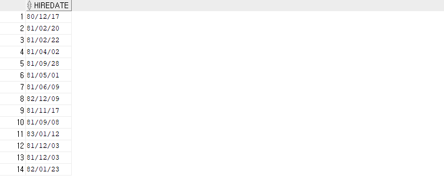

  - 82년에 입사한 사원을 검색

  ```
  select HIREDATE from emp where hiredate like '82%';
  ```

  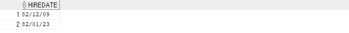

  - 날짜 출력 타입 변경 후 데이터 검색

  ```sql
  alter session set nls_territory = 'AMERICA'; --변경
  SELECT HIREDATE FROM EMP;
  ```

  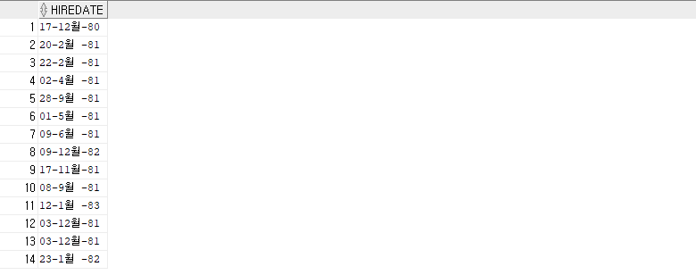

  - 위와 같이 82년생을 검색하는 쿼리문으로는 사원을 검색할 수 없다.
    - 날짜 출력 포맷이 변경되었으므로

  ```sql
  select HIREDATE from emp where hiredate like '82%';
  ```

  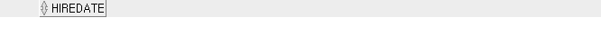

  - 그래서 to_char를 통해서 년도만 가져와서 데이터를 비교

  ```sql
  select HIREDATE from emp where to_char(hiredate,'yyyy') = 1982;
  ```

  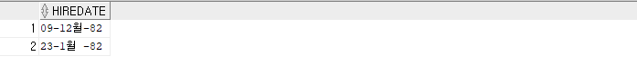

  - 그러나 위의 쿼리문은 L value를 가공해서 성능이 떨어짐

  - R value를 가공해서 다시 쿼리문 작성
    - **그러나 시분초의 데이터 손실이 올 수 있음**

  ```sql
  select hiredate from emp 
  where hiredate BETWEEN to_date('1982-01-01' , 'yyyy-mm-dd') and to_date('1982-12-31','yyyy-mm-dd');
  ```

  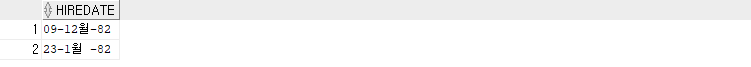

  - 다른 방식으로 쿼리문 작성
    - 위와 같은 결과 

  ```sql
  select * from emp where hiredate BETWEEN to_date('1982-01-01','yyyy-mm-dd','nls_date_language=KOREAN')
  and to_date('1982-12-31','yyyy-mm-dd','nls_date_language=KOREAN');
  ```

  


- **session level vs sql statement level vs instance level**
  - session level 예
    - alter session set nls_language = 'KOREAN'
  - sql statement level 예
    - select * from emp where hiredate BETWEEN to_date('1982-01-01','yyyy-mm-dd','nls_date_language=KOREAN')
      and to_date('1982-12-31','yyyy-mm-dd','nls_date_language=KOREAN');
  - 크기 : instance level > session level > sql statement level
    - 우선순위는 반대


- **NLS 관련 주요 변수**
  - NLS_TERRITORY : 영역 설정 
    - NLS_LANG 변수 값에 의해 자동 설정
    - 설정 방법 예 : ALTER SESSION SET NLS_TERRITORY = 'KOREA'
  - NLS_LANGUAGE : 언어 설정
    - NLS_LANG 변수 값에 의해 자동 설정 초기화 변수
    - 설정 방법 예 : ALTER SESSION SET NLS_LANGUAGE = 'KOREAN'
  - NLS_LANG : 언어, 영역, 캐릭터셋 설정 
    - 기본값은 'AMERICAN_AMERICA.US7ASCII'
    - OS 환경변수로 설정


- **pivot 기능**

  ```sql
  select * from (select deptno from emp)
  pivot (count(*) for deptno in(10 as "10번부서", 20 as "20번부서", 30 as "30번부서")
  );
  ```

  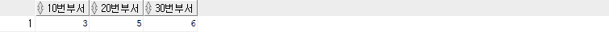


- **오라클 RAC(Real Application Cluster)란?**

  > https://12bme.tistory.com/322


- **관계**
- entity : 관리하고자 하는 데이터의 집합
  
- 기본키 
    - 최소성
    - 고유성(Unique)
    - 존재성(Not Null)
    - 불변성


- **OS 용량 관리**

  - 시스템 전체의 마운트 된 디스크 여유공간을 확인

    - -h 옵션은 사용하면 사람이 보기 좋게 메가(M), 기가(G) 단위로 디스크 공간을 확인

    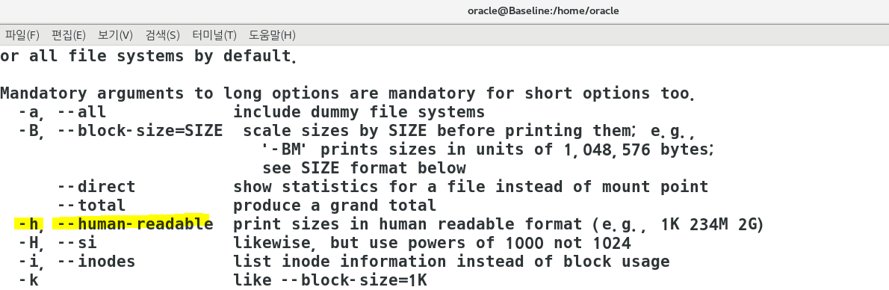

  ```shell
  df -h	
  ```

  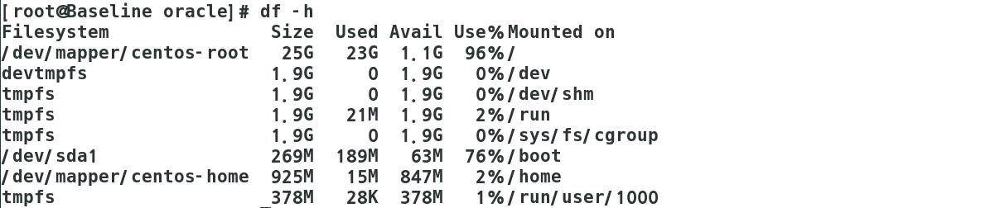

  - /dev/mapper/centos-root의 Use%Mounted on을 확인하면 96%인 것을 확인할 수 있다.
    - size : 할당된 공간
    - uesd : 사용하는 공간
    - avail : free 공간
    - Use%Mounted on : 몇퍼 사용했는지

  

  - 특정 디렉토리를 기준으로 디스크 사용량을 확인
    - -s : 용량의 합계
    - sort : 명령어 결과 혹은 문서 내용을 정렬
    - -n : 숫자 비교
    - -r  : 내림차순

  ```shell
  du -s /*  | sort -n -r > test.txt
  ```

  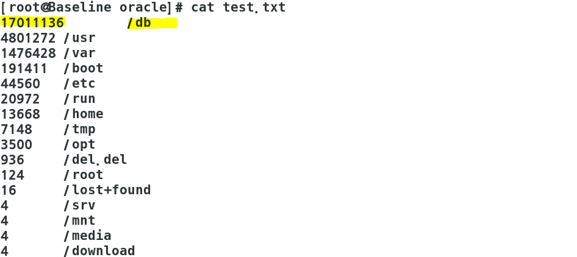

  

  - 좀 더 세부적으로 알아보기 위해서 하위 디렉토리를 합치지 않고 따로 계산

  ```shell
  du -S /* | sort -n -r > test.txt
  ```

  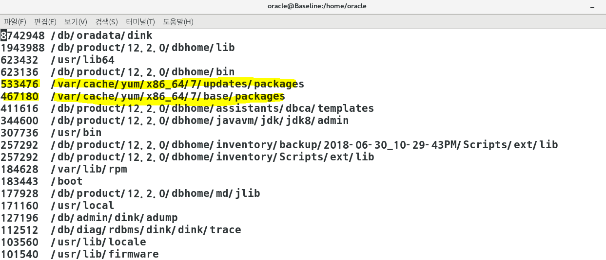

  

  - /var/cache/yum 디렉토리의 용량이 큰 것을 확인

  - yum 캐시를 정리해서 디스크 공간을 확보하거나 손상된 메타 데이터 파일로 인한 오류를 지움

  ```shell
  yum clean all
  ```

  


## Foreign key

- **테이블 간(테이블 내)의 참조 무결성(Referntial integrity)을 보장**

- **부모 테이블을 삭제하는 방법**

  - 이런 방식으로 drop을 하는 경우 foreign key 관계만 삭제하고 부모 테이블만 삭제하는 것임
  - 외래키 제약사항은 작동하지 않는 것으로 인식하도록 설정 

  ```sql
  drop table 테이블명 CASCADE CONSTRAINTS;
  ```


- **실습**

  ```sql
  --테이블 생성
  
  CREATE TABLE  DEPARTMENT(
      DEPTNO VARCHAR2(2)  CONSTRAINT DEPARTMENT_DEPTNO_PK PRIMARY KEY,
      DNAME VARCHAR2(10) CONSTRAINT DEPARTMENT_DNAME_NN NOT NULL
  );
  
  
  CREATE TABLE  EMPLOYEE(
      사번 VARCHAR2(8) PRIMARY KEY,
      이름 VARCHAR2(10),
      DEPTNO VARCHAR2(2) NOT NULL, 
      CONSTRAINT  EMPLOYEE_DEPARTMENT_DEPTNO_FK FOREIGN KEY(DEPTNO) 
      REFERENCES DEPARTMENT(DEPTNO)
  );
  INSERT INTO EMPLOYEE    VALUES('XMAN','10');
  ```

  

  - constraint 확인

  ```sql
  SELECT TABLE_NAME,CONSTRAINT_NAME,CONSTRAINT_TYPE FROM DBA_CONSTRAINTS WHERE TABLE_NAME IN('DEPARTMENT','EMPLOYEE');
  ```

  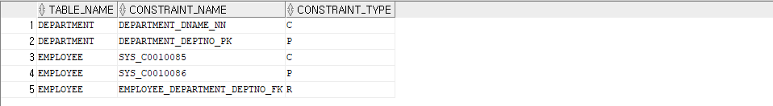

  

  - 데이터 insert

  ```sql
  --부모 테이블
  INSERT INTO DEPARTMENT(DEPTNO,DNAME) VALUES('10','관리팀'); 
  INSERT INTO DEPARTMENT(DEPTNO,DNAME) VALUES('20','전산팀');
  
  --자식 테이블
  INSERT INTO EMPLOYEE(사번,이름,DEPTNO)  VALUES('XMAN','TUNER',10); 
  INSERT INTO EMPLOYEE(사번,이름,DEPTNO)  VALUES('YMAN','DBA',20); 
  INSERT INTO EMPLOYEE(사번,이름,DEPTNO)  VALUES('ZMAN','DEVELOPER',30); 
  -- deptno가 30인 insert문은 오류가 발생한다
  -- 무결성 제약조건때문에
  ```

  

  - department 폐지

  ```sql
  delete from DEPARTMENT where deptno = 30; 
  delete from DEPARTMENT where deptno = 10; --무결성 제약조건 때문에 delete가 안 됨
  ```

  - department 01번 폐지 방법은?
    - 해당 department 근무자를 퇴사처리 하거나 다른 department로 이관하고 폐지


## SEQUENCE

- 정의

  일련번호(고유성) 생성기

- 용도

  의미가 없지만 고유성을 식별하는 일련번호(ex. 접수번호, 배송번호, 등록번호)에 사용

- 일련번호 자동 생성 방식

  - MAX(SEQ) + 1 방식
  - 채번 TABLE 방식
  - SEQUENCE


