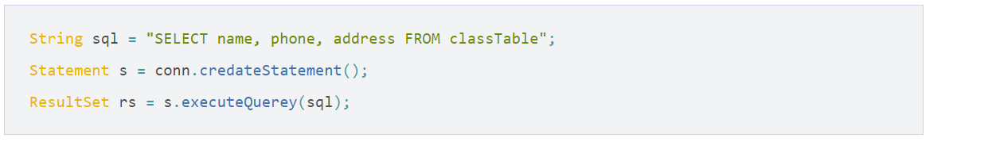
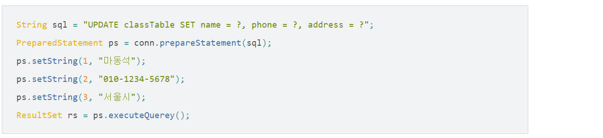
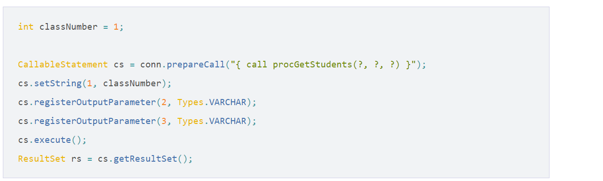

## 과제

- **Transaction 유형(정의, 특징, 사례) OLTP vs DSS(=Batch = OLAP) vs DTP(Distributed transaction)**

  - OLTP (Online Transaction Processing) - 온라인 거래 처리
    - 주 컴퓨터와 통신회선으로 접속되어 있는 복수의 사용자 단말에서 발생한 트랜잭션을 주 컴퓨터에서 처리하여  그 결과를 즉석에서 사용자에게 되돌려보내 주는 처리 형태. 여러 과정이 하나의 단위 프로세스로 실행되도록 하는 프로세스 
    - 다수의 이용자가 실시간으로 데이터를 갱신하거나 조회하는 경우 트랜잭션 단위로 작업을 처리하는 방식을 말합니다.
    - 주로 신용카드 조회 업무나 자동 현금 지급 등 금융 전산 관련 부문에서 많이 발생하기 때문에 ‘온라인 거래처리’라고도 한다.
    - 기업 운영에 필요한 비즈니스 프로세스를 자동화한 시스템으로,  인사 / 급여 / 구매 / 생산 / 재고 / 물류 등 기업 운영의 전반적인 측면을 포함하고 있다.
    - 정보를 트랜잭션 단위로 수집하고, 분류 / 저장 / 유지보수 / 갱신 / 검색하는 기능을 수행한다.
    - OLTP 에서 발생한 데이터를 모두 DW에 저장

  - OLAP(On - Line Analytical Processing ) 온라인 분석 처리
    - 다차원으로 이루어진 데이터로부터 통계적인 요약 정보를 제공할 수 있는 기술 
    - 대용량 데이터를 빠르게 처리하며 다양한 관점에서 추출, 분석할 수 있도록 지원하는 방식입니다. 
    - DW에서 데이터를 분석해서 의미있는 형태로 만들기 위한 과정 및 도구
  - 즉, 항공사의 예약시스템, 은행의 창구업무시스템 등이 대표적인 OLTP에 해당. OLTP 시스템으로부터 필요한 데이터를 추출, 수정, 요약해서 의사결정을 지원할 수 있는 데이터베이스를 만든 것이 DW. 이에 접근해 데이터를 분석하고 의사결정에 활용하는 방법이 OLAP.

  - 인터넷 뱅킹이 24시간*365일로 운영되긴 하지만, 대부분 주간에는 금융거래 중심의 트랜잭션들이 일어나고, 야간에는 대형 배치처리, 시스템간 데이터 전송이 많이 일어납니다.
  - Batch Processing
    - 작업을 몰아두었다가 한번에 처리하는 시스템. 
    - 예:선거투표결과 추출, 게임 이벤트 아이템 일괄 지급 등
  - DW (Data Warehouse)
    - 수년간 발생한 데이터를 모아서 주제별로 합쳐 분석할 수 있게 하는 통합시스템. 
    - 예) 운영데이터, 분산데이터, 시장데이터를 추출하여 DW를 구축하고 그걸 DSS나 OLAP로 분석
  - DSS (Decision Support System)
    - 의사결정 지원 시스템
    - 단순히 정보를 수집, 저장, 분배하기 위한 시스템을 넘어서 사용자들이 기업의 의사결정을 쉽게 내릴 수 있도록  사업 자료를 분석해주는 역할을 하는 컴퓨터 응용 프로그램
  - 분산 트랜잭션(DTP) 
    - 분산 트랜잭션이란 서로 다른 두 서버에 데이터를 처리할 때 하나의 트랜잭션으로 처리하는 것을 말한다. 
    - 개념적으로는 하나의 트랜잭션과 동일한 개념이지만 실제로 서버가 분리 되어 있다는 것만 차이가 있을 뿐이다. 
    - 쉬운 예로 서로 다른 은행간의 거래를 들 수 있다. 두 은행의 서버는 당연히 서로 독립적인 서버일 것이다. 그런데 두 은행간의 계좌 이체의 경우는 출금과 입금이 한꺼번에 이루어 져야 한다. 그래서 서버가 다르지만 하나의 트랜잭션으로 처리해야 하며 이를 분산 트랜잭션이라고 부르는 것이다.

- **계정계 시스템 vs 정보계 시스템 (용어 정의, 사례)**
  - 계정계
    - 본연의 금융 업무 처리 시스템으로, 고객의 거래 데이터 자체를 다루는 영역
    - 업무: 계좌 개설 및 폐쇄, 입금, 출금, 계좌이체, 외환 시스템 처리 등
    - 특징: 가장 핵심적인 시스템으로, 장애가 바로 금전적 피해로 이어져 가장 보수적으로 운영됨. (삼중백업 등)
    - OLTP와 매핑되는 개념
    - 금융권 영업점에서 실시간으로 고객의 거래를 처리하기 위한 업무 정보. 그래서 트랜잭션 단위로 발생. 예) 고객의 통장 정보(계좌번호, 입출금, 이체, 펀드, 주식 등)
  - 정보계
    - 계정계 데이터를 기반으로 영업점 및 각 부서의 업무 처리를 위해 필요한,  고객의 거래 데이터에 대한 "기록" 및 기록의 "통계"를 관리하는 시스템
    - 목적별 전문 데이터 관리: 신용평가, 여신승인, 리스크 관리
    - 기업 전략을 위한 데이터 관리: 수익관리, 고객관계관리, 성과관리, 위험 관리, 마케팅 등  - 특징: 최근 고객 중심 서비스가 중요해지며, 고객 접점 채널에 즉각적인 마케팅과  개인화가 가능하도록 빅데이터 분석 기술이 가장 많이 활용되고 있음.
    - OLAP와 매핑되는 개념
    - 고객정보, 분석정보 등을 말한다. 이러한 정보가 많이 들어있어서 정보계라고 부른다. 
    - 주요 시스템으로는 DW를 기반으로하는 수익관리, 고객관계관리, 성과관리, 위험관리 시스템 등이 있다.  
    - 거래의 데이터를 관리하고, 통계 및 분석하는 시스템

- **cluster, clustering 개념, 목적, 구성사례**

  - 개념

    서버 클러스터란 각기 다른 서버(Server Enterprise or server Datacenter)들을 하나로 묶어서  하나의 시스템같이 동작하게 함으로써, 클라이언트들에게 고가용성의 서비스를 제공하는것을 말한다. 

  - 목적

    - 클러스터로 묶인 한시스템에 장애가 발생하면, 정보의 제공 포인트는 클러스터로 묶인 다른 정상적인 서버로 이동한다.  서버클러스터는 사용자로 하여금 서버 기반 정보를 지속적이고, 끊기지않게 제공받을수 있게 한다.
    - CPU자원을 공유하거나, 여러 컴퓨터간의 부하 조정(Load Balancing), 가용성이 노은 시스템을 구축 ,  주 시스템이 다운 되었을 때를 대비한 Fail-Over 기능을 제공

  - 부하조정 (Load Balancing)  

    최근에 대규모 웹사이트 구축에 필수적으로 사용되는 기술로 여러대의 웹서버 노드를 두고  중앙의 관리툴에서 부하를 분산하게 해주는 기술이다. 이 기술의 특징은 노드 간 통신이 필요 없다는 것이다.  부하 조정을 이용하면 각 노드는 자신의 용량이나 로드에 맞게 요청을 처리할 수 있기도 하고,  클러스터 관리자에서 할당한 양의 프로세스를 처리할 수도 있다.

  - Fail-Over

    Fail-Over는 부하조정과 비슷하다. 하지만 조금 틀린 것이 있는데 부하조정의 경우에는 모든 노드가  한꺼번에 동작을 하는 것이고, Fail-OVer의 경우에는 평소엔 동작을 하지 않고 Primary 서버가 문제가 발생했을 시에  백업서버로써 가동을 하는 것이다. 부하조정을 응용하면 부하조정과 Fail-Over 기능을 동시에 하게 할 수가 있다.

- **JDBC API의 3종류**

  - statement 

    - 일반적인 sql쿼리를 실행
    - 매개변수를 전달할 수도 없고 실행할 때마다 컴파일을 하게된다. 
    - 따라서 성능적인 면에서 안좋을 수 밖에 없고, 유연하지 못하다. 
    - 그래서 대부분의 statement 구문은 DDL문(create, alter, drop …)에서 주로 사용된다.
    - statement는 string형태로 sql을 작성하기 때문에 sql 작성이 다른 인터페이스보다 편하고 직관적인 장점이 있다.

    

    

  - Prepared Statement

    - 동적 또는 매개변수가 필요한 sql쿼리를 실행
    - prepared는 사전적 의미로 ‘준비된’ 이란 뜻이다. 이름에서 알 수 있듯이 준비된 statement이며 여기서 준비 = 컴파일을 말한다. prepared Statement는 statement를 확장한다.
    - 미리 컴파일이 되어 준비하고 있기 때문에 statement에 비해 성능상으로 우위에 있다. 매개변수 전달이 필요한 sql 작성이나, for loop 등으로 여러번 sql을 실행하는 경우에 주로 사용한다.

    

    

  - Callable Statement

    - 저장된 프로시져를 실행
    - Callable Statement는 미리 작성해둔 프로시저를 실행하는데 사용한다. Callable Statement는 Prepared Statement를 확장한다.
    - Callable Statement를 사용할때는 ? 매개변수 자리에 프로시져에서 사용하는 매개변수와, 가져올 값에 대한 셋팅을 동시에 해준다. 프로시져 실행에 필요한 매개변수는 setString, setInt 등으로 해주고, 프로시져 응답으로 받을 값들에 대한 데이터 타입을 registerOutputParameter으로 모두 지정해주어야 한다.
    - Callable Statement 역시 미리 컴파일되어 DB에 저장되어 있기 때문에 성능상으로 이점이 있다.

    

