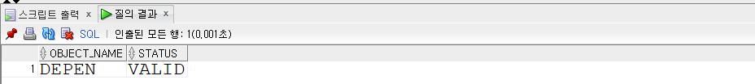
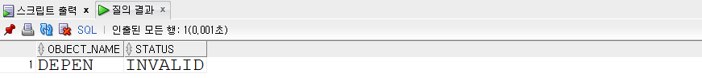
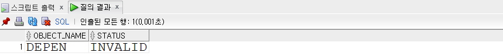
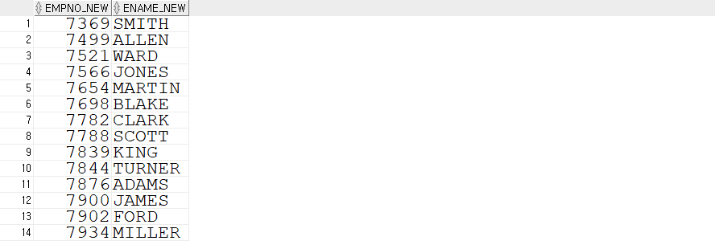
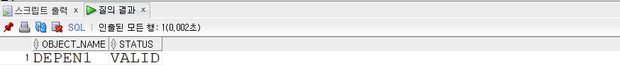

## 오라클 클러스터

- **오라클 클러스터란 ?**
  - 디스크로부터 데이터를 읽어오는 시간을 줄이기 위해서 조인이나 자주 사용되는 테이블의 데이터를 디스크의 같은 위치에 저장시키는 방법
  - 하나이상의 테이블 그룹이 같은 데이터 블록을 공유해서 저장하는 방법


- **클러스터된 테이블과 클러스터 되지 않은 테이블의 차이**
  - 테이블이 처음 생성될 때 행은 일반적으로 세그먼트의 첫 익스텐트의 첫 블록부터 삽입됨
  - 정규 테이블로 저장될 경우 EMP와 DEPT은 서로 다른 세그먼트에 위치하게됨, 이 말은 테이블이 자신들 고유의 블록을 사용한다는 뜻
  - 즉, EMP 테이블의 행을 저장하는데 사용된 블록은 DEPT 테이블의 데이터를 저장하지 않음. 그 반대의 경우도 마찬가지
  - 테이블 EMP와 DEPT의 클러스터로 저장되면 동일 클러스터 세그먼트를 공유하게 됨
  - 이 세그먼트의 블록은 양 테이블의 행을 모두 저장할 수 있음
  - 테이블이 클러스터로 저장되면 클러스터는 물리적 저장 단위가 되고 테이블은 논리적 엔티티 즉, 클러스터의 일부분이 됨


- **클러스터의 장점**
  - 그룹된 컬럼 데이터 행들이 같은 데이터 Block에 저장되기 때문에 디스크 I/O를 줄여줌
  - 공유 column(조인의 연결고리)이 있는 테이블을 cluster화하여 수행 속도를 향상
  - 클러스터된 테이블 사이에 조인이 발생할 경우 그 처리 시간이 단축됨
  - 클러스터키 열을 공유하여 한번만 저장하므로 저장 영역의 사용을 줄임


- **클러스터 하기 좋은 테이블**
  - 주로 조회가 자주 발생하고 수정이 거의 발생하지 않는 테이블
  - 컬럼안의 많은 중복 데이터를 가지는 테이블
  - 자주 Join되는 테이블


- **클러스터 Key가 되기 좋은 컬럼**
  - 특정 데이터 값이 적은 컬럼
  - 자주 데이터 수정이 발생하는 컬럼
  - LONG, LONG RAW 컬럼은 포함할 수 없음


> http://wiki.gurubee.net/pages/viewpage.action?pageId=688169
>
> http://www.dba-oracle.com/oracle_tip_hash_index_cluster_table.htm
>
> https://jungmina.com/821
>
> https://positivemh.tistory.com/323


## SEQUENCE

- 일련번호(고유성) 생성기
- 의미가 없지만 고유성을 식별하는 일련번호(ex. 접수번호, 배송번호, 등록번호)에 사용
- 일련번호 자동생성 방식
  - MAX(SEQ) + 1 방식
    - lock을 걸지 않거나 동시성에 대한 처리를 하지 않았을 경우 중복이 발생할 수 있다.
    - 속도 문제가 있을 수 있다. 데이터가 많이 쌓일수록
  - 채번 TABLE 방식
  - SEQUENCE 방식


- **실습**

  - 예
    - CACHE : 30개의 일련번호를 미리 생성해놓고 메모리에 미리 올려놓고 row가 일련번호를 요청하면 메모리에서 하나씩 할당
    - 30개가 모두 할당되면 다시 30개를 미리 메모리에 올려놓아라

  ```sql
  CREATE SEQUENCE SCOTT.ORDER_SEQ 
  INCREMENT BY 1
  START WITH 1
  MAXVALUE 999999999999
  MINVALUE 1 
  NOCYCLECACHE 30;
  ```


- 시퀀스와 rollback은 관련이 없다. rollback을 해서 시퀀스 번호가 되돌아가지 않는다.
- 테이블과는 독립적으로 생성되고 사용된다. 
- 여러 세션(여러 Application)에서 독립적으로 동시에 사용하는 공용 오브젝트
- insert는 rollback이 되지만 시퀀스는 rollback이 되지 않음


- **PL/SQL**
  - declare ~ begin : 선언부
  - begin ~ end : 실행부


- **curraval / nextval !!!!주의!!!!**
  - currval은 nextval을 호출한 세션에서 호출해야 한다.
  - currval의 값은 Thread-Safe 하지 않다.
  - 현재 세션에서 nextval을 호출하지 않으면 currval이 반환되지 않는다. 


## View

- View
  - 저장된 select문
  - view는 Data Dictionary에 저장이 된다.
    - 3가지 카테고리를 가지고 데이터를 조회 
    - user_ : 내 소유의 모든
    - all_
    - dba_
  - 예외 : MView 
  - 질의를 재작성(Rewrite)하여 수행 하며, 데이터를 가지고 있지 않지만 테이블의 역할을 동일하게 수행하기 때문에 가상 테이블(Virtual Table)로 불리기도 한다.
  - 여러테이블의 JOIN과 GROUP BY 같은 같은 복잡한 쿼리를 view로 저장시켜놓으면 다음부터는 저장한 view의 정보만 가져오면 되므로 쉽게 좀 더 편리하게 사용할 수 있다.
  - 일종의 함수라고도 생각하면 된다.
  - 뷰는 데이터 보안에서도 유리하다. 뷰를 보면 컬럼과 데이터만 공개되므로 원천 테이블은 알 수 없습니다. 


- **View merge (in all possible case)**

  - view 정의
  - 쿼리 자체가 데이터 딕셔너리에 저장된다.

  


- Oject Dependency

  - BASE OBJECT(TABLE or VIEW)의 DROP 시 VIEW 의 상태는?

    - 뷰의 상태가 valid 상태에서 invalid 상태로 바뀐다.
    - base 테이블을 다시 만들었을 때 invalid 상태에서 다시 valid 상태로 다시 바뀌냐?

    - 실습으로 확인

    ```sql
    -- BASE_TBL 테이블 생성 
    CREATE TABLE BASE_TBL(EMPNO_NEW,ENAME_NEW) AS SELECT EMPNO,ENAME FROM EMP;
     
    -- BASE_TBL을 사용해서 view 생성 
    CREATE VIEW DEPEN AS SELECT EMPNO_new,ENAME_new FROM BASE_TBL;
    
    --view의 상태 확인
    SELECT OBJECT_NAME,STATUS FROM USER_OBJECTS WHERE OBJECT_NAME ='DEPEN';
    ```

    

    

    ```sql
    -- BASE_TBL 테이블 삭제
    drop table base_tbl;
    
    -- view 상태 확인
    SELECT OBJECT_NAME,STATUS FROM USER_OBJECTS WHERE OBJECT_NAME ='DEPEN';
    ```

    

    

    ```sql
    -- 다시 BASE_TBL 테이블 생성 
    CREATE TABLE BASE_TBL(EMPNO_NEW,ENAME_NEW) AS SELECT EMPNO,ENAME FROM EMP;
    
    -- view 상태 확인
    SELECT OBJECT_NAME,STATUS FROM USER_OBJECTS WHERE OBJECT_NAME ='DEPEN';
    ```

    

    

    ```sql
    -- view select 수행 시 결과가 그대로 나옴
    select * from DEPEN;
    ```

    

    

    ```sql
    -- view 상태 확인
    SELECT OBJECT_NAME,STATUS FROM USER_OBJECTS WHERE OBJECT_NAME ='DEPEN';
    ```

    


- **View의 용도**

  - 보안성(RESTRICT DATABASE ACCESS) : 보여지는 데이터를 선택하여 제한 한다.

    - 예
      - 제한된 컬럼만 뷰로 볼 수 있도록 설정

    ```sql
    CREATE VIEW RESTRICT_SELECT(EMPNO_NEW,ENAME_NEW,DEPTNO_NEW) AS SELECT EMPNO,ENAME,DEPTNO FROM EMP WHERE SAL > 1500;
    
    SELECT * FROM RESTRICT_SELECT; -- BASE-DATA 의 COLUMN,ROW 를 제한
    ```

  

  - 편리성(SIMPLIFY QUERIES) : 복잡하게 JOIN 된 VIEW 를 단순하게 조회할 수 있다.

    - 예

    ```sql
    CREATE VIEW SIMPLE_VIEW
    AS SELECT EMP.EMPNO,EMP.ENAME,DEPT.DNAME,SALGRADE.GRADE AS GD
    FROM EMP,DEPT,SALGRADE
    WHERE EMP.DEPTNO = DEPT.DEPTNO AND
    EMP.SAL BETWEEN SALGRADE.LOSAL AND SALGRADE.HISAL;
    DESC SIMPLE_VIEW
    
    SELECT * FROM SIMPLE_VIEW;
    ```

  - 독립성(DATA INDEPENDENCE ) : 테이블구조 변경시 View 를 사용하는 응용 프로그램을 변경하지 않아도 된다.

    - 예
      - base table에 컬럼이 추가가 된다고 해도 view에는 영향을 받지 않음
      - 즉, ind_view에는 새롭게 추가된 컬럼이 보이지 않음

    ```sql
    CREATE TABLE BASE_TBL(EMPNO_NEW,ENAME_NEW) AS SELECT EMPNO,ENAME FROM EMP;
    
    CREATE VIEW IND_VIEW AS SELECT * FROM BASE_TBL;
    
    SELECT * FROM IND_VIEW;
    
    ALTER TABLE BASE_TBL ADD(NEW_COL DATE); -- BASE TABLE 변경.
    
    SELECT * FROM IND_VIEW; -- INDEPENDENCE OF TABLE CHANGE
    ```

    