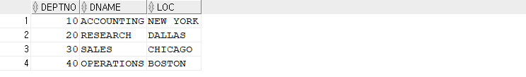
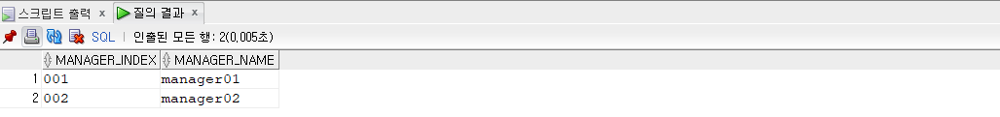
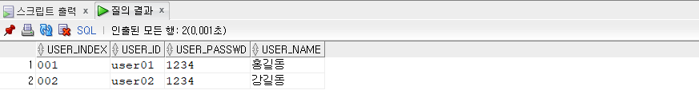
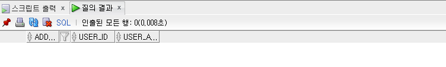
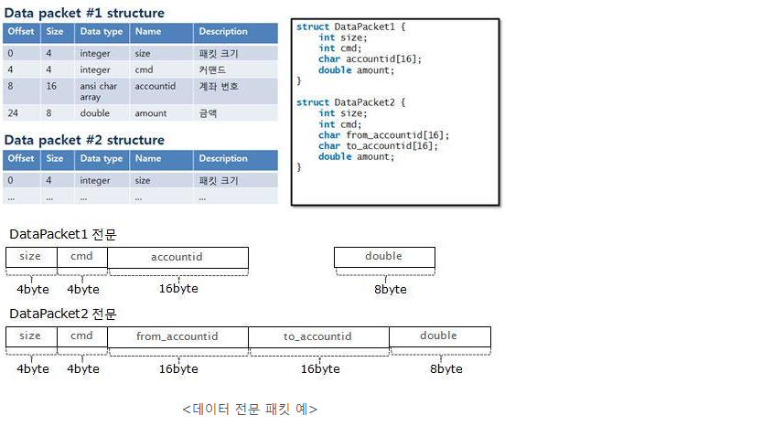

## 분산 트랜잭션

- 실습

  - DB Link 생성
    - SCOTT 계정과 서버실의 DB 계정인 da2106 와 연결
    - SCOTT 계정에서 DB Link 생성하기

  ```sql
  CREATE DATABASE LINK TLINK
   CONNECT TO da2106
   IDENTIFIED BY da06
   USING
  '(DESCRIPTION =
        (ADDRESS = (PROTOCOL = TCP)(HOST = 192.168.217.202)(PORT = 1521))
        (CONNECT_DATA =
          (SERVER = DEDICATED)
          (SERVICE_NAME = KOPODA))
  )';
  ```

  - 연결 확인

  ```sql
  --실습
  select * from DEPT@TLINK;
  ```

  

  - 트랜잭션 실습

  ```sql
  -- scott 계정에 생성
  create table t_manager(
      manager_index varchar2(30),
      manager_name varchar2(30)
  );
  
  -- 서버실 db에 test table 생성
  create table t_user(
      user_index varchar2(30) primary key,
      user_id varchar2(30) unique,
      user_passwd varchar2(30),
      user_name varchar2(30)
  );
  create table t_addr(
      addr_index varchar2(30) primary key,
      user_id varchar2(30),
      user_addr varchar2(100),
      constraints fk_user_id foreign key(user_id)
      references t_user(user_id)
  );
  ```

  ```sql
  begin
      insert into t_manager values('001','manager01');
      insert into t_manager values('002','manager02');
      insert into t_user@TLINK values('001','user01','1234','홍길동');
      insert into t_user@TLINK values('002','user02','1234','강길동');
      
      savepoint sp01;
      commit;
      insert into t_addr@TLINK values('001','user01','경기도 의정부시 금오동');
      
      -- 에러가 나는 코드
      insert into t_addr@TLINK values('002','user03','경기도 의정부시 금오동');
      commit;
      
  exception
      when others then
      rollback to sp01;
      
  end;
  ```

  ```sql
  select * from t_manager;
  ```

  

  ```sql
  select * from t_user;
  ```

  

  ```sql
  select * from t_addr;
  ```

  


## 전문 통신이란?

- **전문의 개념**

  - 전문 통신 방식이란 통신에 참여하는 애플리케이션들이 주고 받을 데이터의 포맷을 서로 약속(프로토콜)한 후 약속된 데이터 패킷을 전송하고 수신하는 것을 말한다.
  - 초창기 클라이언트/서버 환경에서 애플리케이션 사이의 통신은 네트워크 패킷(packet) 기반의 전문 방식이 주로 사용됐다.
  - 그림의 예와 같이 통신을 위한 패킷을 정의하고 이 데이터 패킷을 애플리케이션이 주고 받게 된다. 클라이언트는 약속된 데이터 패킷의 포맷에 맞춰 패킷을 생성, 서버로 전송한다. 서버는 패킷을 읽어 들이고 패킷에 기록된 데이터를 해석해 필요한 서버 측 작업을 수행하고 그 결과를 데이터 패킷에 기록해 클라이언트로 반환하는 것이다.

  


