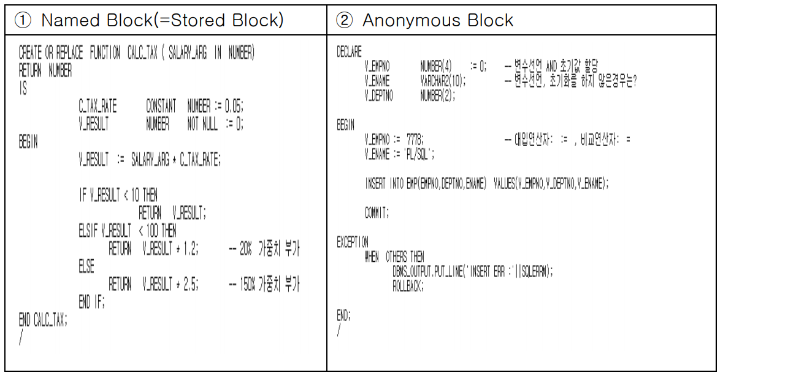
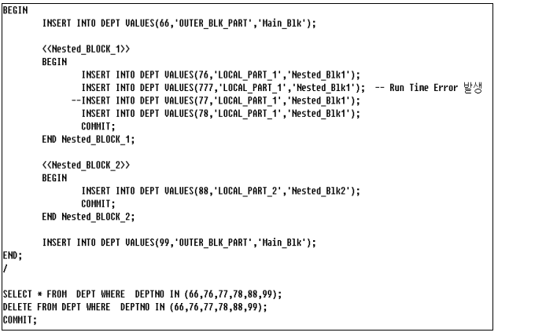

## PL/SQL 개요 및 주요 특징

- **PL-SQL개요**
  - 데이터베이스 관련 어플리케이션 개발시 생산성, 효율성을 가져다주며 PL+SQL의 합성어이다.
  - PL은 절차적 언어(Procedural Language)의 약어
  - SQL 기능에 PL(절차적) 기능을 추가한 언어
  - SQL의 특징 중 비절차적 언어의 특징과 PL이라는 용어가 서로 상충되는 의미


- **절차적 언어의 주요 특징 및 장점**
  - 변수 선언
  - 제어 구조(Control Structure)
  - 예외처리(Exception)
  - 모듈화(Modular Programming)


- **변수 선언**

  - 선언부(DECLARE ~ BEGIN)에서 변수/상수/**커서**/사용자 정의 예외를 정의하여 사용
  - := 가 대입연산자
  - **!!초기화하지 않은 변수는 null!!**

  

  - **!!!!!CURSOR (완전 중요!!!!)**
    - Multiple Rows 처리 
    - is 이하에는 select문만 올 수 있음

  


- **제어 구조**

  - 제어는 프로그램의 처리(실행) 흐름을 제어하는 조건문/반복문/GOTO 문
  - = : 비교연산자 
  - DBMS_OUTPUT 이런 것들을 Package라고 부른다. 

  


- **예외처리**

  - 자바나  C++ 같은 최근의 언어에서는 예외처리를 개발 언어 차원에서 지원
  - 예외처리의 목적: 안정적이고 오작동하지 않는 개발
    - runtime error를 예외처리 하는 것임(실행 시점에서의 에러)
  - when no_data_found then null;
    - 여기서 null은 명령어이다. 
    - 즉, 아무 것도 하지 않고 지나가라

  


- **모듈화**

  - 프로그램 개발시 모듈단위로 나누어 개발 하거나 독립 모듈(ex 사용자 정의 함수/ 프로시져) 을 만들어 라이브러리(Library)화 시켜 재사용. 
  - **PL/SQL 은 BLOCK 구조화된 언어로 BLOCK 단위를 통해 모듈화.**
    - **그래서 이 block 하나가 전부 네트워크로 가서 처리가 된다.**
    - 그래서 처리 효율성을 갖는다. 

  

  - 중첩 BLOCK 을 통해 모듈성을 높일수있다

  

  - 실행시 에러가 발생할 때 마다 에러를 기록하는 프로시져로 NAMED BLOCK 은 이름을 가지고(EX WRITE_LOG) DBMS 서버내에 저장돠어 공용 사용
    - 재사용(Reuse)을 위해서 사용한다.
    - NAMED BLOCK 으로 함수,프로시져,패키지,트리거 생성

  


- **PL/SQL의 장점**
  - 이식성(Portability)
    - 이식성은 개발 생산성 및 유지보수/기능개선 비용을 줄여주는 특징.
    - ORACLE DBMS 는 약 70 여종의 OS 및 H/W 풀랫폼에서 구동. ORACLE DBMS 가 지원하는 모든 플랫폼간에 PL/SQL 로 작성된 것은 그대로 호환 . 
    - JAVA 언어의 장점중 하나인“Write once Run anywhere”와 동일한 개념.
  - 통합성(Intergration) 
  - 성능(Performance) 
    - PL/SQL Module 의 이식성 밑 통합성으로 인해성능 향상의 장점을 가짐.
    - 여러 번 주고 받아야 하는 것을 묶어서 하나의 덩어리(BLOCK) 처리하면 네트웍 트래픽을 줄이는 효과는 나타나지만 PL/SQL 의 성능 향상은 데이터 와 데이터 처리 로직이 DBMS 서버내에 통합되어 처리되는 통합성에 의한 것.


- **실행구조 및 PL/SQL 엔진(중요!!!!)** 

  - PL/SQL 로 작성하는 BLOCK 은 **ANONYMOUS BLOCK** 과 **NAMED BLOCK(=STORED BLOCK)** 이 있으며 개괄적인 관점에서 실행구조를 이해할 필요가 있다.
    - NAMED BLOCK(=STORED BLOCK) : DBMS 서버 내에 저장된 BLOCK
      - 모듈이 서버 내에 저장되어서 많은 개발자들이 이 모듈을 불러서 재사용이 가능하다.
      - 데이터 딕셔너리 내에 저장된다. 
      - ex ) Function / Procedure / Package / Trigger 
    - ANONYMOUS BLOCK : Client App or SQL Script 내에 저장된 BLOCK 
  - ANONYMOUS BLOCK 은 BLOCK 의 이름이 없고 Client Program 내에 존재하며 NAMED BLCOK(=STORED BLOCK)은 이름을 가지고 있고 DBMS 서버내에 존재 한다.
  - ANONYMOUS BLOCK 은 실행시점에 CLIENT 내에 있던 BLOCK 이 네트웍을 통해 DBMS 서버에게 전달되어 서버내에서 실행된후 완료 신호가 CLIENT 에게 전달되는 구조로 실행.
  - 아래의 그림은 block이 client 안에 있으므로 ANONYMOUS BLOCK이다.

  

  - NAMED BLCOK(=STORED BLOCK)은 DBMS 서버내에 저장되어 있으며 CLIENT 에서는 서버에 저장된 해당 BLOCK 을 호출(CALL)하여 실행한후 완료신호가 CLIENT 에게 전달되는 구조로 실행.
    - 데이터 딕셔너리 내에 저장
    - 클라이언트는 호출만해서 실행시키면 된다. 

  


- PL/SQL 엔진

  - PL/SQL BLOCK 을 보면 변수선언 및 IF 조건은 PL/SQL 의 기능이며 INSERT 는 SQL 기능

  

  - 위의 ANONYMOUS BLOCK 이 실행되면 해당 BLOCK 은 DBMS 서버에 전달 된다. DBMS 서버내에 PL/SQL 엔진에게 PL/SQL BLOCK 이 전달 된다.
  - PL/SQL 엔진에서는 PL/SQL BLOCK 을 분석하여 PL/SQL 기능은 절차적 처리기 (Procedural Statement Executor)에게 보내어 실행하고 SQL 기능은 SQL 처리기 (SQL Statement Executor)에게 보내어 실행 한다.
  - 문맥교환이 일어나면서 성능차이가 발생할 수 있다. 

  

- 실습

  ```sql
  -- rem 주석
  rem default size 20000 bytes.
  --세션의 환경을 설정 
  set serveroutput on
  begin 
      for i in 1 .. 10
      loop --디버깅을 위해 사용(dbms_out.put_line) => 출력하는 것
      -- 출력을 받아줄 메모리 영역(출력 버퍼)가 필요하다.
      -- for loop를 다 돌고 출력 버퍼에 있는 내용을 최종적으로 찍어주는 것이다. 점심 뭐먹
          dbms_output.put_line('[' || to_char(i) || '] PROCESSED');
      end loop;
  end;
  /  
  -- /는 send의 의미이다. 
  ```

  ```sql
  -- 출력 버퍼의 크기 조절
  -- default size 20000 bytes
  -- max size unlimited
  set serveroutput on size 2000
  begin 
      for i in 1..40
      loop 
          dbms_output.put_line('[' || to_char(i) || ']' ||
          '1234567890123456789012345678901234567899012345678990');
      end loop;
  end;
  /
  ```


## PL/SQL 기본 문법

- block 구조

  - SQLERRM : SQL에서 발생한 에러에 대한 메시지를 나타낸다. 

  


- **Block의 종류**

  - PL/SQL은 Anonymous Block 과 Named Block(=Stored Block) 2가지 종류
    - Named Block(=Stored Block) : DBMS 서버 내의 데이터 딕셔너리 내에 저장한다.
    - Anonymous Block : Client 내에 저장 된다. 

  

  


- **조건식**

  - ELSE IF 가 아니라 ELSIF 
  - END IF 부분도. 문장 종결자 ; 
  - condition이 TRUE 인경우 실행 되고 FALSE,NULL인 경우 패스

  


- **반복문**

  - **기본 Loop**

    

    

  - **for Loop**

    

    ```sql
    declare
        loop_index number(4) := 1;
        max_loop_index number(4) :=30;
    begin
        -- for loop_index in 1..30
        -- for loop_index in 30..1 
        -- for loop_index in reverse 1..30
        -- for loop_index in reverse 30..1
        loop
            dbms_output.put_line('loop count ' || to_char(loop_index));
        end loop;
    end;
    /
    ```

    

  - **while Loop**

    - WHILE LOOP : 기본적인 LOOP 반복문에 BOOLEAN CHECK 기능 추가
    - FOR LOOP는 일정한 횟수만큼 LOOP 반복
    - WHILE LOOP는 조건식이 참(TRUE)일 동안 반복 합니다.
    - **(중요!!!!!!)조건식(condition)이 TRUE인 경우만 실행되고 FALSE 나 NULL인 경우 실행되지 않는다는 부분입니다. 다른 언어로 개발해본 경험을 가지는 경우에 TRUE 와 FLASE 에 의한 WHILE LOOP 처리는 익숙하게 이해하는 부분입니다. PL/SQL은 데이터 처리를 주요 목적으로 하는 언어 이기 때문에 BOOLEAN 연산에 NULL이 포함 되기에 NULL 과 관계된 연산의 결과는 기억해두셔야 하는 사항입니다.** 

    ```sql
    declare
        v_index number(3) := 0;
    begin 
        while(v_index >= 0)
        loop
            dbms_output.put_line('while loop [ ' || to_char(v_index) || ' ]');
            v_index := v_index - 1 ;
        end loop;
    end;
    /
    ```

    

  - null

    - 프로그램을 개발시 변수 선언후 초기화 하지 않는 경우NULL값이 존재하는 경우 연산(논리연산,비교연산)이 예상치 못하는 결과가 되는 경우가 있다.

    ```sql
    declare 
        v_num1 number(4,2) ;
        v_num2 number(4,2) := 30;
    begin
        if (v_num1 > 1 and v_num2 < 31) then 
            dbms_output.put_line('(v_num1 > 1 and v_num2 < 31) is true');
        elsif not (v_num1 > 1 and v_num2 < 31) then
            dbms_output.put_line('(v_num1 > 1 and v_num2 < 31) is false');
        else 
            dbms_output.put_line('not true, not false...???');
        end if;
    end;
    /
    ```

    

- **null과 boolean 연산**

  


## Block 구조와 Exception

- **Nested Block**
  - 중첩된 block으로 block안에 또 다른 block이 내포된 구조
  - 사용하는 주요 이유 
    - 예외처리
    - 모듈화


- 트랜잭션의 시작과 종료 부분을 잘 알아둬야 한다.

- 실습 

  

  

  

- **exception** 

  - 에러는 발생하는 시점에 다라 2가지 유형으로 구분
    - 컴파일 시점 에러
    - 실행시점 에러
  - 컴파일 시점 에러
    - NUMBER는 38자 유효자리

  

  

  - 실행시점 에러(run time error = exception)
    - 첫번째 Insert 시점에 Transaction이 시작
    - 두번째 Nested Block에서 컬럼 허용 자리 수를 초과하는 실행시점 에러(Run Time Error)가 발생하고 Statement Rollback이 실행된다.
    - Exception이 발생하게 되면 발생한 위치 이하의 작업을 수행하지 않고 Block내의 예외처리 영역으로 처리흐름(Control Flow)이 넘어 가게 된다. 
    - 예외처리가 없어서 statement level rollback이 발생하여 insert문이 아무 것도 commit되지 않음 

  

  

- **rollback**
  - statement level rollback(암시적 - 자동)
  - transaction level rollback(명시적 - 수동)
    - rollback이라는 명령어를 명시적으로 사용 

