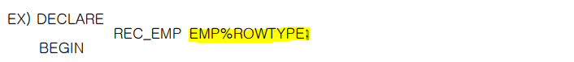

## PL/SQL Block & Exception

- **exception 정의**

  - PL/SQL Block 실행 시 발생하는 RUN TIME ERROR.
  - NON-PREDEFINED
    - ORA-00001 : error code
    - 무결성 제약 조건(SCOTT.DEPT_DEPTNO_PK)에 위배됩니다 : error msg

  


- **Exception 발생 및 처리**

  - error가 발생하면 rollback 처리하고 log로 남겨놔야 한다. 그래서 가용률을 높여야 한다. 
  - 실습
    - Exception이 발생 -> 해당 Statement를 Rollback처리
    - 다음 Statement를 처리하지 않고 해당 Block내의 예외처리부로 제어를 이동. OTHERS는 IF 조건문의 ELSE 역할과 동일한 기능으로 기타 나머지 모든 예외 를 처리하겠다는 의미
    -  NULL 명령어로 아무런 처리도 하지 않는 구문 기능적으로는 아무런 역할을 하지 않아도 되지만 문법적으로 명령 Statement가 필요한 경우 사용하는 명령어 이다.

  ```sql
  begin 
      insert into dept_copy values(66,'outer_blk_part','main_blk');
      <<nested_block_1>>
      begin
          insert into dept_copy values(76, 'local_part_1','nested_blk1');
          insert into dept_copy values(777, 'local_part_1','nested_blk1'); --run time error 발생
          insert into dept_copy values(78, 'local_part_1','nested_blk1');
          commit;
      exception 
          when others then
              null;        
      end nested_block_1;
      
      <<nested_block_2>>
      begin
          insert into dept_copy values(88,'local_part_2','nested_blk2');
          commit;
      end nestend_block_2;
      insert into dept_copy values(99,'outer_blk_part','main_blk');
  end;
  /
  
  select * from dept_copy;
  ```

  

  


- **exception을 처리한다는 의미를 설명**

  - block 내에서 발생한 exception이 외부로 전파되지 않도록 잡기만(catch)하는 행위
  - exception을 잡아서 오류의 원인을 처리한 후 재작업을 하거나 오류를 기록하는 행위(log) 
  - 실습
    - 예외처리부가 있어도 해당 exception을 해결하지 못하면 block 밖으로 나와서 다른  exception을 보낸다. 아래에서 exception을 찾지 못해서 다시 밖으로 던진다.
    - 해당 error는 no_date_found exception이 아니므로 처리를 못하는 것임 
    - 그래서 전체 rollback이 된다. 

  

  

  

  - **실습**
    - Exception 발생  Statement Level Rollback 발생
    - 다음 Statement를 처리하지 않고 해당 Block내의 예외처리부로 제어를 이동 합니다.
    - 위의 Exception에 대한 예외처리는 없지만 OTHERS 구문으로 인해 정의되지 않은 모든 예외에 대한 처리를 수행 할수 있게 된다.

  

  ```sql
  begin 
      insert into dept_copy values(66,'outer_blk_part','main_blk');
      <<nested_block_1>>
      begin
          insert into dept_copy values(76, 'local_part_1','nested_blk1');
          insert into dept_copy values(777, 'local_part_1','nested_blk1'); --run time error 발생
          insert into dept_copy values(78, 'local_part_1','nested_blk1');
          commit;
      exception 
          when no_data_found then
              null;
          when others then
              null;
      end nested_block_1;
      
      <<nested_block_2>>
      begin
          insert into dept_copy values(88,'local_part_2','nested_blk2');
          commit;
      end nestend_block_2;
      insert into dept_copy values(99,'outer_blk_part','main_blk');
  end;
  /
  
  select * from dept_copy;
  ```

  


- **exception 구문**

  - EXCEPTION 구문은 예외처리 ROUTINE의 시작 표시
  - WHEN 절에서 처리할 EXCEPTION을 명기 
  - 공통의 처리를 해야 하는 경우 여러 개의 EXCEPTION을 OR 로 연결 가능
  - Exception을 처리하기 위해 여러 Statement 사용 가능 
  - 이 위치에 Nested Block을 정의 할수 있다.
  - OTHERS는
    - 예외처리부 내에서 1번만 정의된다.
    - 예외처리부에서 명시되지 않은 모든 다른 exception을 처리한다.
    - 맨 마지막에 사용된다.(if 문장의 else와 유사한 개념)

  


## PL/SQL Data Type

- **DATA TYPE 특성에 따른 분류**

  | DATA TYPE 유형              | 주요특징                                                     |
  | --------------------------- | ------------------------------------------------------------ |
  | SCALAR DATA TYPE            | 단일값을 저장하는 DATA TYPE                                  |
  | COMPOSITE DATA TYPE         | 복수값을 저장하는 DATA TYPE                                  |
  | REFERENCE DATA TYPE         | 다른 DATA TYPE을 참조하는 DATA TYPE <br />타언어의 포인터와 유사한 개념으로 <br />커서 참조 유형과 객체 참조 유형으로 구분 |
  | LOB(Large Object) DATA TYPE | Large Object를 저장하는 DATA TYPE                            |
  | OBJECT DATA TYPE            | 객체지향 언어 개념의 객체를 저장하는 DATA TYPE               |

  

- **SCALAR DATA TYPE**

  - SCALAR DATA TYPE 으로 선언된 변수는 1개의 변수내에 단일 값(Value)을 저장 (Hold a single value)
    - number는 packed Decimal 방식으로 저장이 된다.
      - ex) 4bit가 하나의 1개의 digit를 저장한다. 그래서 40을 입력했을 때 4개의 digit를 저장한다. packed Decimal은 1byte로 저장한다. (즉, 한 바이트에 두 자리(4,0)를 묶어서 저장)
      - binary로 바꿔서 연산을 하고 연산 결과도 binary이다. 연산 끝나고 dbms에 저장될 때 또 변환이 되는 것이다. cpu가 binary 단위로 연산을 하고 다시 저장할 때는 packed Decimal로 바꿔서 저장을 한다. 
      - 

  

  


- **COMPOSITE DATA TYPE**

  - Composite Datatype은 내부 구성 요소를 가지고 있어서 1개의 변수가 여러 개의 값을 저장.타언어의 배열변수 나 구조체 변수와 유사 (Hold Multiple Value)
  - RECORD TYPE
    - RECORD 는 관계형 데이터베이스의 ROW 와 동일한 개념으로 사용된다. 

  


- **RECORD TYPE 실습**

  - RECORD는 여러 개의 FIELD로 구성되며 각 FIELD의 DATA TYPE에 SCALAR , RECORD,TABLE(INDEX-BY TABLE)을 사용할수 있으며 개발시 활용도가 높다.
  - 예를들면 RECORD의 구성요소인 FIELD를 정의할 때 RECORD를 사용할수 있다는 것은 중첩 RECORD (Nested Record)를 구현할수 있다.
  - 일반 PL/SQL 변수 정의와 동일하게 FIELD 정의시 초기값을 지정할수 있고 지정하지 않는 경우에는 NULL 값이DEFAULT로 지정.
  - T_ADDRESS는 사용자가 정의한 RECORD TYPE 으로 RECORD의 각 FIELD를 정의는 관계형 테이블의 컬럼 정의와 동일한 방식.
  - SYNTAX 구조를 보면 FILED 의 DATA TYPE 에 SCALAR,TABLE,RECORD 유형이 올수 있다. ADDRESS FIELD 의 DATA TYPE 에 T_ADDRESS 라는 RECORD TYPE 정의.
  - rec_emp t_emp_record;는 정의된 T_EMP_RECORD RECORD TYPE 의 변수를 선언하는 부분 입니다.
  - RECORD 내의 FIELD 에 데이터를 저장하거나 FIELD 의 데이터에 접근은 RECORD 변수명.FIELD 명(EX REC_EMP.EMPNO ) 
  - NESTED RECORD(중첩 레코드)의 FIELD 에 접근하는 방법은 RECORD 변수명.RECORD 변수명.FIELD 명 (EX REC_EMP.ADDRESS.ZIP). 

  ```sql
  declare 
      type t_address is record( --record type 정의
          addr1 varchar2(60),
          addr2 varchar2(60),
          zip varchar2(7),
          phone varchar2(14)
      );
      type t_emp_record is record(
          empno number(4),
          ename varchar2(10),
          job varchar2(9),
          address t_address,
          hiredate date
      );
  rec_emp t_emp_record;
  begin
      rec_emp.empno := 1234;
      rec_emp.ename := 'xman';
      rec_emp.job := 'dba';
      rec_emp.address.addr1 := '강남구 역삼동';
      rec_emp.address.zip := '150-036';
      rec_emp.hiredate := sysdate - 365;
      
      dbms_output.put_line('************************');
      dbms_output.put_line('사번 : ' || rec_emp.empno);
      dbms_output.put_line('사번 : ' || rec_emp.ename);
      dbms_output.put_line('사번 : ' || rec_emp.job);
      dbms_output.put_line('사번 : ' || rec_emp.address.addr1);
      dbms_output.put_line('사번 : ' || rec_emp.address.zip);
      dbms_output.put_line('사번 : ' || to_char(rec_emp.hiredate,'yyyy-mm-dd'));
      dbms_output.put_line('************************');
  end;
  /
  ```

  


- **TABLE TYPE**

  - sqlcode : error code를 출력
  - T_EMP_LIST 는 사용자가 정의한 TABLE TYPE 으로 VARCHAR2(20)은 ARRAY 에 비유 한다면 1 CELL 의 크기에 해당. INDEX BY BINARY_INTEGER 는 PL/SQL TABLE 의 KEY 에 사용되는 값을 BINARY_INTEGER DATA TYPE 으로 사용하겠다는 의미로 SYNTAX 문법상 사용자가 임의적으로 다른 DATA TYPE 을 사용할수 있는 것처럼 보이지만 Data Type 을 변경할수 없다. INDEX BY BINARY_INTEGER 는 PL/SQL TABLE 을 사용할때는 항상 사용하는 구문 이다.
  - TBL_EMP_LIST 라는 사용자 정의 PL/SQL TABLE 변수를 선언

  ```sql
  declare
      type t_emp_list is table of varchar2(20) -- table type 정의
          index by binary_integer;            -- dynamic array와 유사
      tbl_emp_list t_emp_list;                -- table 변수 선언
      v_tmp varchar2(20);
      v_index number(10);
  begin
      tbl_emp_list(1) := 'scott' ;            --table에 data를 입력한다.
      tbl_emp_list(1000) := 'miller' ;        --index 첨자의 범위
      tbl_emp_list(-2134) := 'allen' ;        -- 불연속적 첨자 사용
      tbl_emp_list(0) := 'xman';
      
      v_tmp := tbl_emp_list(1000);            --table에서 data조회
      
      --table에 있는 data를 조회해서 return 한다.
      dbms_output.put_line('data of key 1000 is ' || tbl_emp_list(1000) );
      dbms_output.put_line('data of key 1000 is ' || tbl_emp_list(-2134) );
      dbms_output.put_line('data of key 1000 is ' || tbl_emp_list(1) );
      
      --method 사용 ex)delete, count, first, next
      if not tbl_emp_list.exists(888) then
          dbms_output.put_line('data of key 888 is not exist' );
      end if;
      
      --loop를 사용하여 데이터 조회
      v_index := tbl_emp_list.first;          --ex)prior, first, last
      loop 
          dbms_output.put_line('loop : ' || to_char(v_index)|| ' ==> ' || tbl_emp_list(v_index) );
          v_index := tbl_emp_list.next(v_index);     -- 다음 번에 유효한 index return
          exit when v_index is null;
      end loop;
      
      dbms_output.put_line('data of key 999 is ' || tbl_emp_list(999) ); --존재하지 않는 값을 조회
      dbms_output.put_line('data of key 0 is ' || tbl_emp_list(0) );
      
  exception
      when no_data_found then
          dbms_output.put_line('error code => ' || to_char(sqlcode) );
          dbms_output.put_line('error msg => ' || sqlerrm  );
  end;
  /
  ```

  

- **참조 연산자**
  - %TYPE , %ROWTYPE 2 가지 유형의 참조 연산자.
  - %ROWTYPE : 하나의 레코드를 참조
  - %TYPE : 컬럼을 참조
  - 장점
    - 편리성
    - 유연성


- **%TYPE** 

  - TABLE내 COLUMN의DATA TYPE,LENGTH만을 참조하여 변수 선언
  - 참조하는 COLUMN의 NOT NULL제약사항을 참조하지 않는다. 

  

  

- **%ROWTYPE** 

  - TABLE, VIEW, **CURSOR**의 여러 COLUMN을 참조하여 RECORD TYPE 생성
  - 테이블내의 컬럼개수,데이터 타입,데이터 길이등을 확인하지 생성
  - ROW 단위의 데이터 FETCH 시 편리하다.

  

  - EMP라는 테이블 전체를 참조(Reference)해서 REC_EMP Record 생성 하며 %TYPE 과 RECORD의 조합을 하나의 기능으로 구현. EMP 테이블내의 모든 컬럼을 %TYPE으로 참조 한후 내부적으로 RECORD로 정의 된다.


- **실습**

  - %ROWTYPE 을 사용하여 Row 형태의 데이터(ex Table,Cursor,View)를 참조하고 %TYPE 을 사용하여 Column 형태의 데이터를 참조

  ```sql
  select * from emp_copy;
  
  declare
      rec_emp emp_copy%rowtype; --row 참조 연산자
      v_empno emp_copy.empno%type; --column 참조 연산자
  begin
      --1개의 row를 select 해서 record에 저장
      select * into rec_emp from emp_copy where empno = 7369;
      dbms_output.put_line('empno => ' || rec_emp.empno );
      dbms_output.put_line('ename => ' || rec_emp.ename );
      dbms_output.put_line('job => ' || rec_emp.job );
      dbms_output.put_line('mgr => ' || rec_emp.mgr );
      dbms_output.put_line('hiredate => ' || rec_emp.hiredate );
      dbms_output.put_line('sal => ' || rec_emp.sal );
      
      --record의 개개 field를 독립적으로 사용 가능
      select empno, ename into v_empno, rec_emp.ename
      from emp_copy
      where empno = 7369;
      
      dbms_output.put_line('---------------------------');
      dbms_output.put_line('empno => ' || v_empno );
      dbms_output.put_line('ename => ' || rec_emp.ename );
  end;
  /
  ```

  


- **block 내의 select**

  - select와 관련된 exception

  

  

  - **실습**
    - no data found

  ```sql
  declare
      v_empno emp.empno%type;
      v_ename emp.ename%type;
      v_hiredate EMP.HIREDATE%type;
  begin
      --select 되는 대상 데이터가 없는 조회
      select empno, ename, hiredate into v_empno, v_ename, v_hiredate
      from emp where empno=1;
      dbms_output.put_line('selected exactly one row => ' || v_empno );
  exception
      when no_data_found then
          dbms_output.put_line('no data found !!!');
      when too_many_rows then
          dbms_output.put_line('too many rows found !!!');
  end;
  /
  ```

  

   

  - **실습**
    - too_many_rows

  ```sql
  declare
      v_empno emp.empno%type;
      v_ename emp.ename%type;
      v_hiredate EMP.HIREDATE%type;
  begin
      --select 되는 대상 데이터가 없는 조회
      select empno, ename, hiredate into v_empno, v_ename, v_hiredate
      from emp where empno>=1;
      dbms_output.put_line('selected exactly one row => ' || v_empno );
  exception
      when no_data_found then
          dbms_output.put_line('no data found !!!');
      when too_many_rows then
          dbms_output.put_line('too many rows found !!!');
  end;
  /
  ```

  

  - TOO_MANY_ROWS는 스칼라변수에 복수 개의 값이 저장될수 없기 때문 에 RUN TIME ERROR(EXCEPTION)시 발생하는 것을 이해 할수 있다. 
  - 그러나 NO_DATA_FOUND는 0건의 데이터를 조회 했는데 왜 RUN TIME ERROR 일까 ? 
  - 사실은 ERROR는 아니다!!! PL/SQL BLOCK내에서 SELECT를 수행하는 목적이 무엇일까? 
  - 대부분은 SELECT 한 데이터를 기반으로 다른 연산을 수행하기 때문이다. 
  - SELECT 한것이 없기 때문에 후속 연산을 수행할 수가 없어 ERROR로 간주하여 예외처리를 할수 있도록 한 것이다.


## PL/SQL Cursor

- **커서의 종류(커서 중요!!!!!)**

  - 명시적 커서(Implicit Cursor)

    - EXPLICIT CURSOR는 PL/SQL BLOCK내에서 다중행(MULTIPLE-ROW)를 조회하여 데이타를 처리하려 할때 사용한다.
    - define(커서 정의) -> open(커서 오픈) -> fetch(커서를 패치) -> close 단계

    

    - DECLARE CURSOR
      - CURSOR의 이름과 접근하는 데이터의 대상 집합을 정의 
    -  OPEN CURSOR 
      - BIND VARIABLES AND EXECUTE SQL 를 수행
      - EXECUTE SQL : 오픈시점에 is 이하의 select문을 실행 
      - open 시점에 binding을 하고 execute를 수행하는 것임 그 수행이 is 이하의 select문을 수행 그래서 이때 resultset이 생성된다. 
    - FETCH CURSOR
      - CURSOR로 부터 CURRENT ROW의 DATA를 변수에 저장(LOAD) 
      - FETCH의 가져 온다는 사전적 의미를 가지고 있다. 
      - 즉 결과 집합(Active Set or Result Set)에서 현재 레코드의 데이터를 INTO 이하의 변수에 저장한다.
      - 만약 결과 집합이 3개의 Row를 가지고 있으면 LOOP ~ END LOOP 구간을 3번 반복 하며 1 Row 씩을 Fetch 를 수행한다.
      - 패치를 한 뒤에 커서가 다음 row를 가리킨다. 그리고 다음 row가 존재하지 않으면 loop를 빠져나오는 것임 
    - close cursor
      - 커서(CURSOR)를 종료한다. 결과집합(ACTIVE SET or RESULT SET)을 해제 하고 해당 자원을 반납 한다.
      - 즉, 메모리 리소스를 반납
      - 커서를 종료하는 경우에는 더 이상 결과 집합에 접근 할수 없다.

  - 암시적 커서(Explicit Cursor)
  - 1번이 명시적인 커서 2번이 암시적인 커서 

  

  ```sql
  declare
      cursor cur_emp is
          select empno, job, sal, comm from emp where deptno = 10;
          v_ename varchar2(10);
          v_job varchar2(9);
          v_sal number(7,2);
          v_comm number(7,2);
  begin
      open cur_emp;
          loop fetch cur_emp into v_ename, v_job, v_sal, v_comm;
          exit when cur_emp%notfound;
          insert into bonus(ename,job,sal, comm)
              values(v_ename, v_job, v_sal, v_comm);
          end loop;
          dbms_output.put_line('total ' || to_char(cur_emp%rowcount) || 'rows processed');
          close cur_emp;
          commit;
  end;
  /
  ```

  

  - 실행부에서 select를 쓰면 into를 무조건 써야한다. 그리고 into 이하는 스칼라 값일 때 1개의 값만 저장할 수 있다.


- Bulk binding ( = Array Processing = Bulk Collect)


- 커서 속성

  - 커서 속성자는 명시적/암시적이 동일하지만 의미상 약간의 차이가 나타난다. 각 의미의 차이를 기억

  

  - 실습

  ```sql
  REM 5_CURSOR_ATT_IMP.SQL
  SET SERVEROUTPUT ON
  BEGIN
      -- 첫번째 DELETE
       DELETE FROM emp WHERE SAL > 2000;
       DBMS_OUTPUT.PUT_LINE('[1-DELETE]'||TO_CHAR(SQL%ROWCOUNT)||'ROWS IS DELETED');
       IF SQL%FOUND THEN
          DBMS_OUTPUT.PUT_LINE('SQL%FOUND = TRUE ');
       ELSE
          DBMS_OUTPUT.PUT_LINE('SQL%NOTFOUND = FALSE ');
       END IF;
       DBMS_OUTPUT.PUT_LINE('-------------------------------------------------');
      
      -- 두번째 DELETE : 동일한 DELETE 를 2번째 실행하므로 삭제할 데이터가 없음
      DELETE FROM EMP WHERE SAL > 2000;
          DBMS_OUTPUT.PUT_LINE('[2-DELETE]'||TO_CHAR(SQL%ROWCOUNT)||'ROWS IS DELETED');
      IF SQL%FOUND THEN
          DBMS_OUTPUT.PUT_LINE('SQL%FOUND = TRUE');
      ELSE
          DBMS_OUTPUT.PUT_LINE('SQL%NOTFOUND = FALSE');
      END IF;
      ROLLBACK;
  END;
  /
  ```

  

  - 커서 정의시 Join 연산이 가능할까? ㅇㅋ 가능

  

  