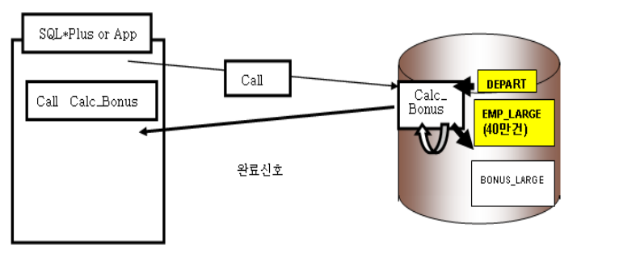
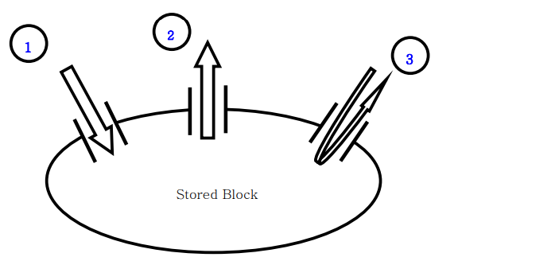
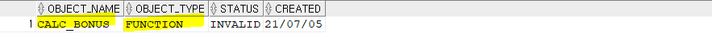
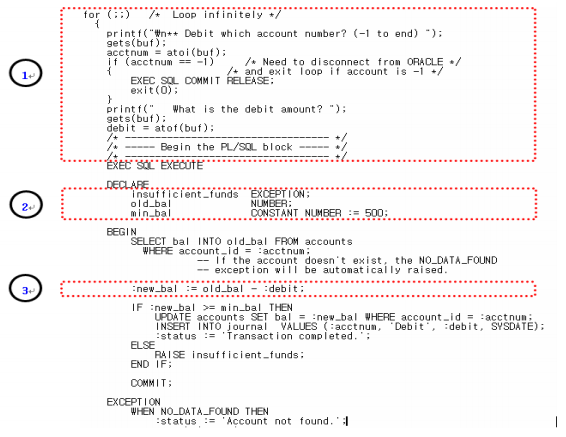
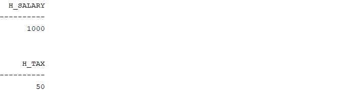
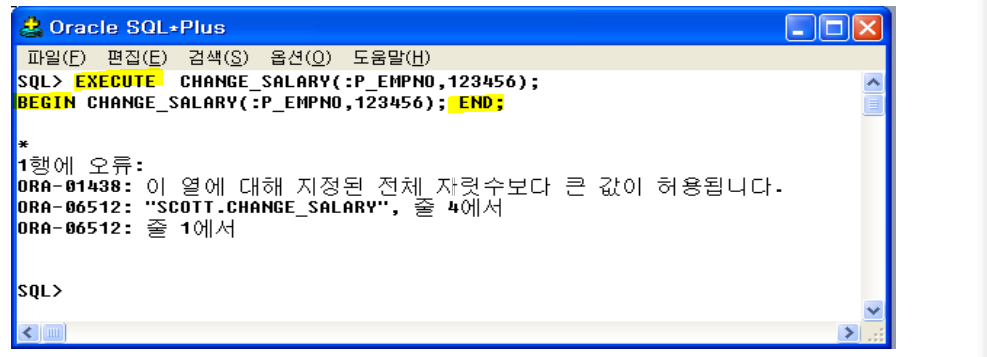
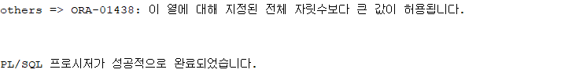
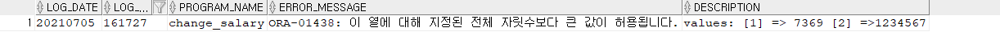
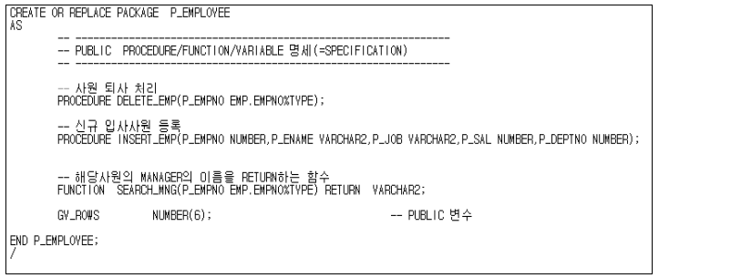

## PL/SQL Cursor

- 커서 파라미터
  -  커서의 이름 다음에 커서에게 넘겨줄 파라미터 변수를 정의 
  - 파라미터를 사용하게 되므로 커서 실행 전에 값을 동적으로 지정


- 명시적인 커서는 4단계로 처리

  - define (or declare) 
  - open 
    - 커서를 오픈하면 dbms 내부에서 pl/sql 엔진이 bind variables와 execute sql을 진행한다. 
    - sql을 실행하면 dbms 내부에 select인 경우 result set이 만들어 진다. 
    - cursor for loop는 암시적으로 커서를 open 한다. (for line에서) 내부적으로 변수를 바인드하고 sql을 실행. 
    - deptno에 20을 대입했고 20이라는 값을 sql 안에 대입시키는 것이 bind variables 
  - fetch
    - loop와 end loop 사이에 암시적으로 fetch를 진행 
    - 데이터를 변수에 저장한다.
  - close
    - 커서를 종료하고 자원을 반나한다.

  - 실습

    - 그동안은 커서 정의시에 상수가 지정 되었지만 커서에 파라미터를 사용하게 되므로 커서 실행전에 값을 동적으로 지정할 수 있음

    - deptno = 20인 row가 bonus_copy로 들어간다. 

  ```sql
  declare 
      cursor cur_emp(p_deptno in number) is 
          select ename, job, sal, comm from emp where deptno = p_deptno;
      v_deptno dept.deptno%type;
  begin 
      v_deptno := 20;
      for r_cur_emp in cur_emp(v_deptno)
      loop
          insert into bonus_copy(ename, job, sal, comm)
              values(r_cur_emp.ename, r_cur_emp.job, r_cur_emp.sal, r_cur_emp.comm);
      end loop; 
      commit;
  end;
  /
  ```

  

- **rowid를 사용하여 특정 레코드에 빠르게 접근한다. (성능 관련되어 중요!!!)**


## PL/SQL Named Block

- **PL/SQL block**
  - Anonymous Block
  - Stored(Named) Block
    - function
    - procedure
    - package(=class)
    - trigger


- **Anonymous Block**
  - 저장위치 : Client Program 내에 저장되거나 독립적인 SQL Script 형태로 저장
  - 호스트 변수를 참조하기 위해서는 변수 앞에 :(콜론)을 붙이면 된다. 
    - 호스트 환경에서 생성되어 데이터를 저장하기 때문에 호스트 변수라고 한다.
    - 키워드 VARIABLE을 이용하며, SQL문이나 PL/SQL블록에서도 사용 가능하다.


- Named Block

  - 저장위치 : DBMS내에 Data Dictionary에 저장
  - 실행방식 : 실행시점에 해당 Block을 호출(Call)하여 실행

  

  


- Parameter 유형 

  

  1. in
     - Stored Block 외부에서 있는 값을 Stored Block 에게 전달하는 Parameter Mode (예: 함수 수행시의 입력값 )
  2.  out
     - Stored Block 내부에서 있는 값을 Stored Block 외부에 전달하는 Parameter Mode (예: 프로시져 수행 결과를 저장하여 전달하기 위한 용도) 
  3. in out
     - IN 와 Out 2가지 역할 수행


- **function 실습**

  ```sql
  -- 동일한 function이 없으면 create 만약 동역한 function이 있으면 replace
  -- 파라미터를 지정할 때는 데이터 length를 지정하지 않음
  -- length가 필요하다면 코딩으로 제어를 해줘야 한다. 
  create or replace function calc_bonus(p_salary in number, p_deptno in number)
  return number -- return에도 length를 지정하지 않음
  is --stored block은 is와 begin 사이가 선언부 
      v_bonus_rate number := 0; 
      v_bonus number(7,2) := 0;
  begin
      -- 근무 부서별로 bonus 차등 지급
      if p_deptno = 10 then
          v_bonus_rate := 0.1;
      elsif p_deptno = 20 then
          v_bonus_rate := 0.2;
      else
          v_bonus_rate := 0.05;
      end if;
      v_bonus := round(nvl(p_salary,0) * v_bonus_rate,2);
      return v_bonus;
  end calc_bonus; -- end에 이름 주지 않고 end만 적어도 괜찮
  -- 함수가 정상적으로 생성되면 Stored Block은 DBMS 서버내에 데이터 딕셔너리에 저장된다.
  ```

  - 데이터 딕셔너리에 생성된 함수 확인하기
    - object_name은 대문자로 

  ```sql
  select object_name, object_type, status, created from user_objects where object_name = 'CALC_BONUS';
  ```

  

  - 데이터 딕셔너리에 저장된 function test source 확인

  ```sql
  SELECT NAME,LINE,TEXT FROM USER_SOURCE WHERE NAME = 'calc_bonus';
  ```


## PL/SQL Named Block2 - Function,Procedure

- 바인드 변수 (BIND VARIABLE= HOST VARIABLE = GLOBAL VARIABLE)

  - c언어에서 사용한 변수는 :(콜론)을 붙여서 사용한다. (호스트 변수)

  


- **VARIABLE & PRINT**

  - VARIABLE
    - PL/SQL BLOCK에서 참조 할수 있는 BIND VARIABLE(바인드변수) 선언
    - 선언된 바인드 변수 조회
  - PRINT
    - BIND VARIABLE(이하 바인드변수)의 값을 SQL*PLUS 화면에 출력 하는 기능

  - 실습

  ```sql
  
  -- 변수 선언 : 바인드변수=호스트변수=글로벌 변수
  -- variable에서 length가 없음
  variable h_salary number 
  variable h_tax number
  declare
      c_tax_rate number(2,3);
  begin
      c_tax_rate := 0.05; --근로소득세율(local variable)
      :h_salary := 1000; --급여(host variable)
      --근로소득세 계산, pl/sql block 내의 sql 함수 사용
      :h_tax := round(:h_salary * c_tax_rate,2);
  end;
  /
  --바인드 변수 = 호스트 변수 = 글로별 변수 출력
  print h_salary
  print h_tax
  ```

  


- **procedure 생성**

  - 실습

    - DESC 를 사용하여 PROCEDURE의 파라미터 구성 정보를 조회할수 있다

    - EXECUTE의 용도는 ?

      - STORED BLOCK 테스트 및 실행을 간편하게 할수 있도록 하는 명령어

      

  ```sql
  -- procedure 생성 : change_salary
  create or replace procedure change_salary(a_empno in number, a_salary number default 2000)
  as  --as 와 begin 사이에 아무 것도 없으면 사용자 정의 변수가 없음 
  begin
      update emp_copy
      set sal = a_salary
      where empno = a_empno;
      commit;
  end change_salary ;
  /
  
  desc change_salary
  -- procedure test 1 
  variable p_empno number
  variable p_salary number
  begin 
      :p_empno := 7369;
      :p_salary := 7369;
      change_salary(:p_empno,:p_salary);
  end;
  /
  select empno, sal from emp_copy where empno = 7369;
  
  -- procedure test 2
  -- execute는 내부적으로 begin ~ end로 바뀐다.(사용 편의) 
  execute chacnge_salary(:p_empno);
  select empno, sal from emp_copy where empno = 7369;
  ```

  - 실행시점에서 나는 error(exception)을 처리하기 위한 실습

  ```sql
  -- procedure 생성 : change_salary + exception
  create or replace procedure change_salary(a_empno in number, a_salary number default 2000)
  as  
  begin
      update emp_copy
      set sal = a_salary
      where empno = a_empno;
      commit;
  exception 
      when value_error then
          dbms_output.put_line('value_error => ' || sqlerrm);
          null;
      when no_data_found then
          dbms_output.put_line('no_data_found => ' || sqlerrm);
          rollback;
      when others then
          dbms_output.put_line('others => ' || sqlerrm);
          rollback;
  end change_salary ;
  /
  
  -- procedure test 1 
  execute change_salary(a_empno => 7369, a_salary => 1234657);
  ```

  


- 실습

  ```sql
  create or replace procedure change_salary(a_empno in number, a_salary number default 2000)
  as
      v_avg_salary    emp.sal%type;
      v_salary    emp.sal%type;
      v_max_salary    emp.sal%type := 90000;
      v_add_salary_rate   number  := 0.02;
  begin
      --평균 급여 산출
      select avg(sal) into v_avg_salary from emp;
  
      if a_salary < v_avg_salary then -- 평균 이하의 급여인 경우 2% 추가 보정
          v_salary := a_salary * round(a_salary *v_add_salary_rate,1);
      elsif a_salary > 99999 then -- 급여 상한액을 초과하는 경우 error로 -99999 입력
          v_salary := -99999;
      elsif a_salary is null then --null인 경우 0으로 치환
          v_salary := 0;
      end if;
  
      update emp
      set sal = v_salary
      where empno = a_empno;
  
      commit;
  exception
      when others then
          dbms_output.put_line('others => : ' ||SQLERRM);
  END change_salary;
  /
  EXECUTE CHANGE_SALARY(A_EMPNO => 7369 , A_SALARY => 1234567);
  ```

  


- **exception 발생 시 로그 남기는 방법**

  - 관게형 데이터베이스의 테이블에 기록
  - 운영체제의 파일에 기록 
  - 관계형 데이터베이스의 테이블에 기록하는 실습

  ```sql
  --exception 발생을 기록하는 log 테이블
  create table exception_log(
      log_date varchar2(8) default to_char(sysdate,'yyyymmdd'),
      log_time varchar2(6) default to_char(sysdate,'hh24miss'), 
      program_name varchar2(100),
      error_message varchar2(250),
      description varchar2(250)
  );
  
  create or replace procedure change_salary(a_empno in number, a_salary number default 2000)
  as
      v_error_message exception_log.error_message%type; --에러 메시지
  begin
      update emp set sal = a_salary where empno = a_empno;
      commit;
  exception
      when others then
          rollback;
          begin -- exception을 log 테이블에 기록
              v_error_message := sqlerrm;
              insert into exception_log(program_name, error_message,description)
                  values('change_salary',v_error_message, 'values: [1] => ' || a_empno || ' [2] =>' || a_salary);
                  commit;
              exception
                  when others then
                      null;
              end;
  end change_salary;
  /
  
  -- procedure test
  EXECUTE CHANGE_SALARY(A_EMPNO => 7369 , A_SALARY => 1234567);
  select * from EXCEPTION_LOG;
  ```

  

  - exception을 기록하는 로직을 매번 begin ~ end로 만드는 것보다 모듈화하는 것이 더 효율적이다. 


- **exception을 기록하는 procedure 생성**

  - 실습
    - exception를 table에 기록하는데 exception이 발생한다면 file에 기록하는 방법이 있다. 

  ```sql
  create or replace procedure 
      write_log(a_program_name in varchar2, a_error_message in varchar2, a_description in varchar2)
  as 
  begin
      --exception을 log 테이블에 기록
      insert into exception_log(program_name, error_message, description)
      values(a_program_name, a_error_message, a_description);
      commit;
  exception
      when others then
          null;
  end;
  /
  
  create or replace procedure change_salary(a_empno in number, a_salary number default 2000)
  as
      v_error_message exception_log.error_message%type; --에러 메시지
  begin
      update emp set sal = a_salary where empno = a_empno;
      commit;
  exception
      when others then
          rollback;
          write_log('change_salary', sqlerrm, 'values: [1] => ' || a_empno || ' [2] =>' || a_salary);
  end change_salary;
  /
  
  -- procedure test
  execute change_salary(a_empno => 7369, a_salary => 987654321);
  select * from emp where empno = 7369;
  select * from EXCEPTION_LOG;
  ```

  

## PL/SQL Named Block - 사용자 정의 Package,Trigger

- **PACKAGE**
  -  PACKAGE는 2 영역으로 구성
    -  PACKAGE HEADER 영역
      - 선언부만 존재
      - HEADER 영역에서 정의한 PROCEDURE/FUNCTION/VARIABLE은 접근 지정자 PUBLIC 으로 PACKAGE 외부에 공개된 METHOD. 공개가 되었다는 의미는 호출하여 사용할수 있다는 의미이다.
    -  PACKAGE BODY 영역 
      - BODY 영역에서만 정의한 PROCEDURE/FUNCTION/VARIABLE은 접근 지정자 PRIVATE 이다. 외부에서 사용자가 직접 호출하여 사용할수 없다.


- **package header 실습**

  - 선언부만 존재

  

  


