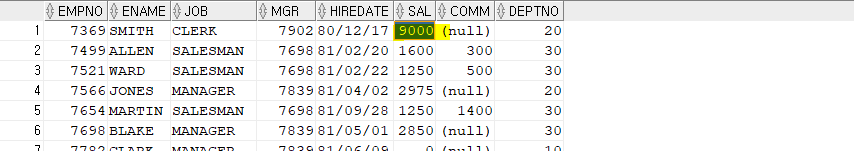
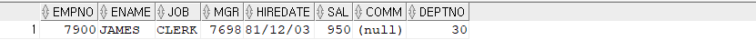
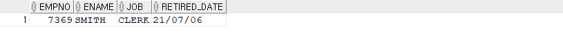

## PL/SQL Named Block

- **무결성 제약사항**
  - constraint
    - 선언적 무결성 제약사항 
    - dbms level : pk, uk, fk, nn, check
  - trigger
    - dbms level
    - PL/SQL로 구현
    - 복잡한 비즈니스 로직을 구현할 수 있다. 
  - app logic
    - application level


- **Trigger** 

  - 실습
    - for each row는 emp 테이블에 update되는 row의 개수만큼 수행된다.
    - for each row를 생략하면 statement level 트리거를 의미하고 해당 문장당 1번 실행된다. 
    - 아래의 예제는 각 row의 데이터에 접근하는 방식이라서 row level로 동작해야 한다. 

  ```sql
  create or replace trigger trg_change_sal
  before update of sal on emp_copy
  for each row --트리거의 실행 횟수(각각의 로우마다)
  begin
      if(:new.sal > 9000) then
          :new.sal := 9000;
      end if;
  end;
  /
  
  update emp_copy set sal = 9999 where empno = 7369;
  select * from emp_copy;
  ```

  

  

  - :new & :old
    - OLD : OLD는 이전에 학습했던 RECORD

  | 연산 | insert | delete | update |
  | ---- | ------ | ------ | ------ |
  | :NEW | O      | X      | O      |
  | :OLD | X      | O      | O      |

  

- **트리거의 특징**
  - 파라미터가 없고 오라클에 의해서 자동으로 호출


- **트리거의 주 용도**
  - PREVENT INVALID TRANSACTION 
  - COMPLEX BUSINESS RULE SUPPORT 
  - COMPLEX INTEGRITY SUPPORT 
  - EVENT LOGGING
    - 시스템 관점
    - 맥락은 이력관리와 유사하다.


- **이력관리(history table)**
  - 데이터의 변화를 기록하는 것
  - 데이터, 업무 관점  


- **TRIGGERING EVENT/TIMING/LEVEL**
  - event : insert, delete, update
  - timing : before, after
  - level : row-level(for each row : 트리거가 row의 개수만큼 실행), statement-level(for each row를 빼면 된다. : 트리거가 한 번만 실행)


- **트리거 생성**

  - 실습

  ```sql
  -- 퇴사자 명단 table
  create table retired_emp (
      empno number(4) not null, 
      ename varchar2(10), 
      job varchar2(9),
      retired_date date
  );
  
  --노조 명단 table
  create table labor_union(
      empno number(4) not null,
      ename varchar2(10),
      job varchar2(9),
      enroll_date date
  );
  
  create or replace trigger trg_emp_change
  before insert or delete or update of sal on emp_copy
  for each row
  declare
  begin
      if inserting and :new.job in ('CLERK','SALESMAN') then
          insert into labor_union(empno, ename, job, enroll_date) values(:new.empno, :new.ename, :new.job, sysdate);
      elsif deleting then
          begin
              insert into retired_emp(empno, ename, job, retired_date)
              values(:old.empno, :old.ename, :old.job, sysdate);
              exception
                  when others then
                      null;
              end;
      elsif updating then
          if :new.sal < 0 then
              :new.sal := :old.sal;
          end if;
      end if;
  end;
  /
  
  delete from emp_copy where empno = 7369;
  update emp_copy set sal = -1000 where empno = 7900;
  select * from emp_copy where empno = 7900;
  select * from retired_emp;
  ```

  ###### <emp_copy>

  

  ###### <retired_emp>

  


