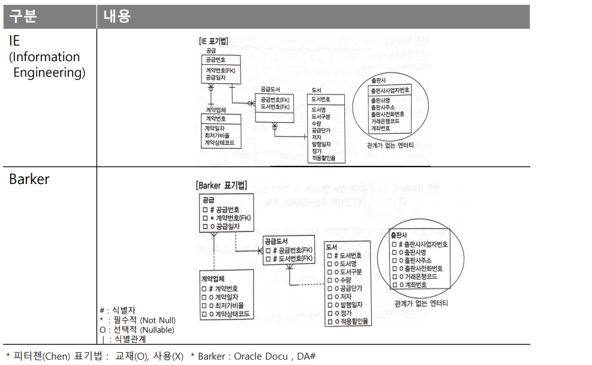
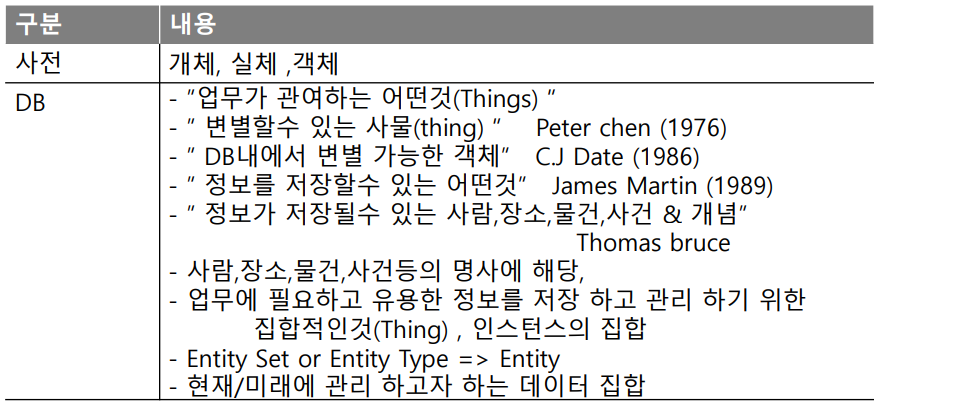
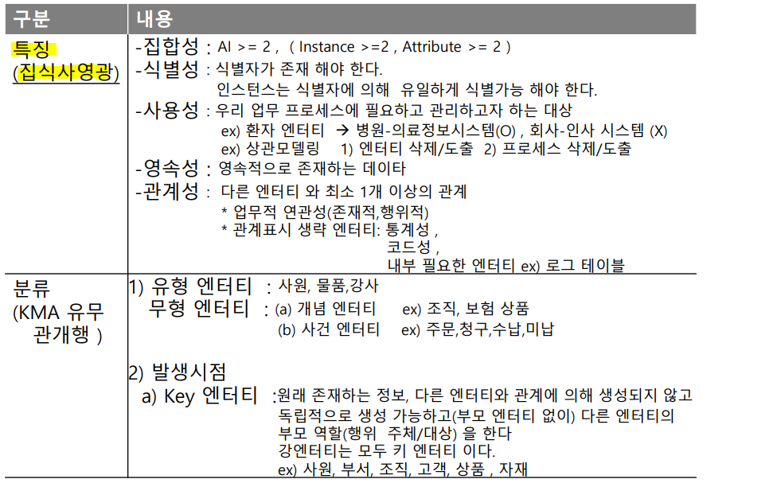
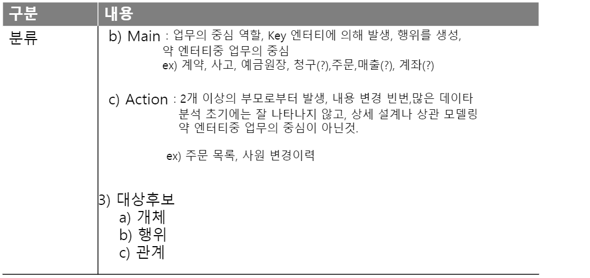
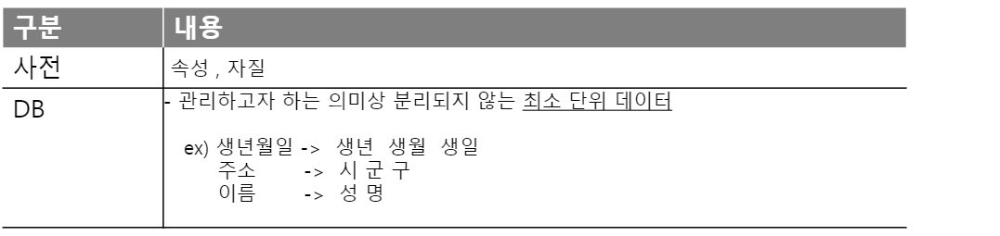
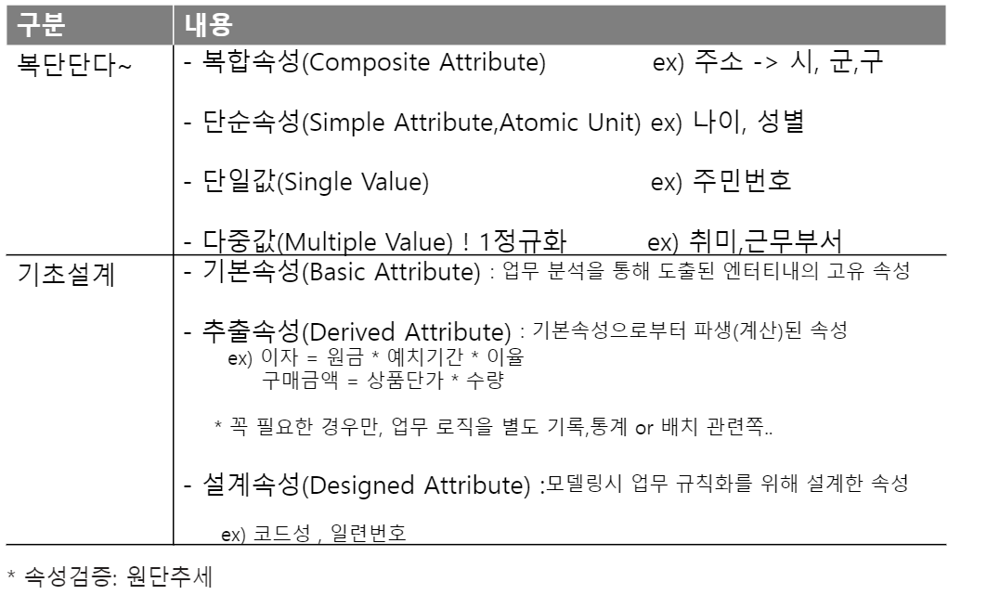

## PL/SQL Advanced Feature 

- select * from 회원
  - where id = 'xman' and password = 'yman'
    - sql이 새로 만들어지는 것 (상수 사용하여 코딩)
    - 정적 sql
    - sql injection에 동적 sql보다 안전하다.
  - where id =: v_zd and password =: v_pwd
    - :v_zd, :v_pwd (bind변수)
    - sql이 새로 작성되지 않고 id와 password 만 들어가는 것임
    - 동적 sql


- Dynamic SQL 

  - 실행시점(Run Time)에 실행 프로그램내에서 생성되는 SQL 또는 PL/SQL을 동적 SQL(Dynamic SQL) 

  - 실습

  ```sql
  begin 
      create table by_dynamic(x date); 
  end;
  /
  
  --pl/sql block 내에서 ddl을 직접 사용할 수 없다. 실행시 error 발생
  --그래서 v_sql 변수에 sql문장을 저장한 후 변수를 execute immediate 사용
  -- dy_dynamic 테이블이 없는 경우 execute immediate 실행 시 exception 발생
  -- exception immediate에 직접 sql문 사용 
  -- desc 명령어를 통해 생성된 테이블 구조 확인 
  
  declare
      v_sql varchar2(2000);
  begin
      --pl/sql block 내에서 ddl, dcl 등의 계열은 동적으로만 가능
      begin
          v_sql := 'drop table by_dynamic';
          execute immediate v_sql;
      exception
          when others then
              dbms_output.put_line('dynamic sql drop =>' || substr(sqlerrm,1,50));
          end;
          begin
              execute immediate 'create table by_dynamic(x date)'; --직접 sql 문장 사용
          exception
              when others then
                  dbms_output.put_line('dynamic sql create =>' || substr(sqlerrm,1,50));
          end;
  end;
  /
  desc by_dynamic;
  ```

  


## 데이터베이스 모델링 기초

- **모델링 표기법(Notation)**

  


- **Entity**

  - 인스턴스 = 레코드

  

  - 식별자 -> PK or UK
  - 상관 모델링 : CRUD
    - CRUD는 대부분의 컴퓨터 소프트웨어가 가지는 기본적인 데이터 처리 기능인 Create(생성), Read(읽기), Update(갱신), Delete(삭제)를 묶어서 일컫는 말이다. 사용자 인터페이스가 갖추어야 할 기능(정보의 참조/검색/갱신)을 가리키는 용어로서도 사용된다.
  - 관계표시 생략 엔터티 : 통계성, 코드성, 내부 필요한 엔터티
    - 왜 관계 표시를 생략했을까???
- Key > Main > Action 
    - key : 사용자 or 시스템의 입력에 의해서 발생하는 데이터
      - 부모 entity가 존재하지 않음 
      - ex) 코드 , 회원, 상품 데이터 등
    - main : 업무의 중심이 되는 entity
    - action : 행위에서 발생하는 데이터
  
  
  
  
  
  


- **Attribute**

  

  - 근무부서 
    - 1개
    - n개 
      - 수평적 확장 : 근무부서1, 근무부서2, ... 근무부서N(컬럼 증가)
        - 근무부서의 최대의 수를 정해놓을 수 있음
        - 만약 1개만 있는 경우에 다른 컬럼은 null이 들어갈 수 있는데 null이 많아진다고 해서 성능이 떨어지는 것은 아니다.
        - 정한 컬럼의 수만큼 한정적으로 db에 넣을 수 있다는 단점이 있다. 
      - 수직적 확장 : 테이블에 row를 늘림(즉, entity 추가)
        - 근무이력 테이블 추가 

  


