#### 리눅스의 개요

- 유닉스(Unix)

  - 중, 대형 서버시스템에서 가장 많이 사용되는 OS
  - 고성능, 고가용성의 운영체제
  - 예) IBM(AIX), HP(HP-UX), SUN(Soralis)
  - 서버용에 가장 많이 사용 

- 리눅스(Linux)

  - 1991년 리누스토발즈(Linus Torvalds)가 중/대형기종에서만 작동하던 유닉스를 PC에서도 동작 할 수 있게 만든 OS
  - 프로그램 소스코드를 무료로 공개하여 사용자는 원하는대로 특정기능을 추가함
  - 어느 플랫폼에도 포팅이 가능함
  - 현재는개인PC, 기업의중대형컴퓨터, 임베디드기기, 모바일기기에서도리눅스가동작

- 리눅스 구성

  - 리누스토르발스(Linus B. Torvalds)가 1991년에 리눅스 커널(kernel) 0.01 버전을작성
  - 1992년에0.02 버전을 내놓으면서 인터넷에 소스코드를 공개, 이것이 리눅스의 시초
  - 통상적인 리눅스는 토르발스가 만든 커널에 컴파일러, 셸, 기타프로그램이조합된배포판
  - 배포판은 전세계적으로 수백가지가 넘지만 모두 토르발스가 제작한 커널을 사용하며 대표적인 것이 우분투 리눅스

  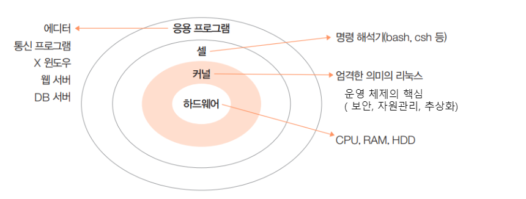

  - 쉘
    - 커널과 사용자간의 인터페이스로 중간매개의 역할을 담당함
    - 명령어를 해석하고 명령과 관련된 유틸리티나 커널을 호출하고 실행결과를 출력함
    - Dos의 command.com과 같이 기본 제공 OS명령어를 수행하는 곳

- 커널

  - 커널의 구성
    - 안정버전(stable version): 이미 검증된 개발 완료 코드로 구성
    - 메인라인 버전(mainline version): 토르발스가 개발 중인 버전, 안정버전이 나오기 전에 추가된 기능을 미리 접하고 싶을 때 사용
    - 프리패치 버전(prepatchversion): 안정버전이 나오기 전에 추가된 기능을 미리 접하고 싶을 때 사용

#### 가상머신의 개요

- 가상머신

  - PC 1대만으로 여러 대의 PC를 운영하는 것처럼 만드는 방법

    (가상머신 소프트웨어 또는 가상머신 프로그램이라 부름)

- 가상머신 소프트웨어

  - 컴퓨터에설치된운영체제(호스트OS) 안에가상의컴퓨터를만들고이가상의컴퓨터안에또다른운영체제(게스트OS)를설치·운영할수있도록제작된소프트웨어
  - PC에설치되어있는윈도우를호스트운영체제(host operating system) 또는호스트OS, 가상머신에설치한운영체제를게스트운영체제(guest operating system) 또는게스트OS라고함

  

  - 호스트컴퓨터에는윈도우가설치되어있고, 기존에설정된IP 주소를이용하여네트워크카드를통해인터넷에접속가능

  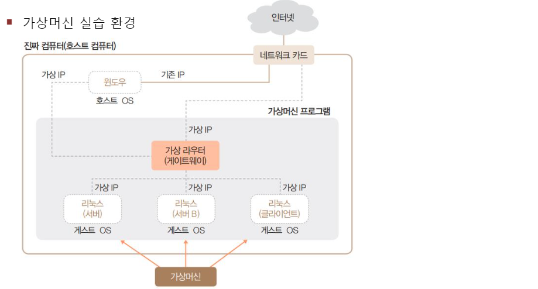

  - 가상머신(게스트컴퓨터) 3대를만들고리눅스3대설치
  - 가상머신3대에는가상IP 주소를할당하고, 가상라우터를통해가상머신3대를하나의네트워크로묶어동일한네트워크환경으로사용→ 윈도우(호스트OS) 1대와리눅스3대로이루어진환경이만들어짐

  

- 가상머신 사용의 장점
  - 컴퓨터1대에실무와비슷한네트워크환경구성
    - 실무환경에서 사용되는 각종 리눅스 네트워크서버 기능을 컴퓨터 1대에 구축 가능
  - 운영체제의 특정시점을 저장하는 스냅숏 기능
    - 중요한 시점을 저장하는 기능, 필요시 언제든 저장 시점으로 돌아갈 수 있음
  - 여러개의 하드웨어를 장착하여 테스트 가능
    - 가상머신에서는사용자가원하는용량의가상하드디스크를여러개장착가능
  - 현재 상태를 저장했다 추후에 이어서 작업하게 해주는 Suspend 기능
    - Suspend(일시중지) 기능을 이용하면 현재의 가상머신 상태를 그대로 보관하여 우선종료 하고, 추후에 가상머신을 다시 가동하여 Suspend 상태부터 이어서 작업가능

#### VMware 설치 실습

- VMware Workstation Player 다운로드

  https://www.vmware.com/kr/products/workstation-player/workstation-player-evaluation.html

  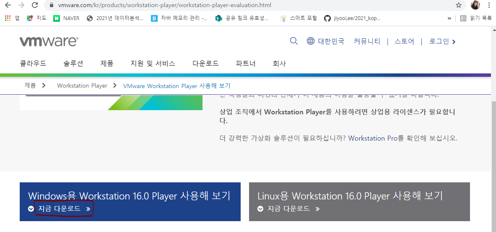

  

  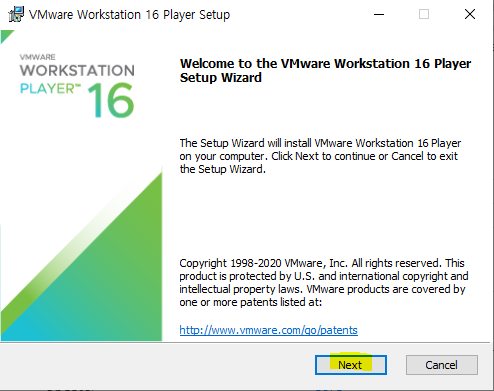 

   

  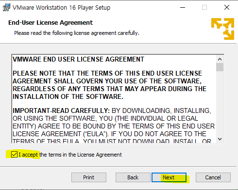 

   

  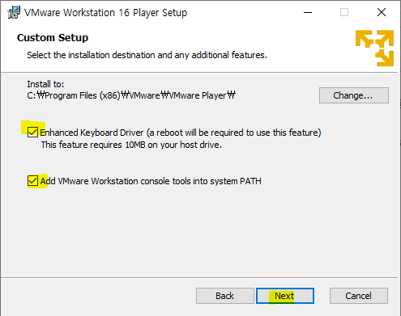 

   

  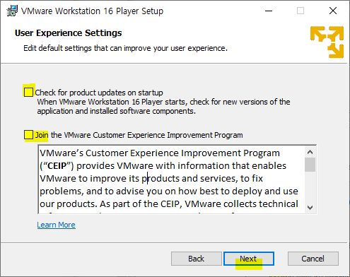 

   

  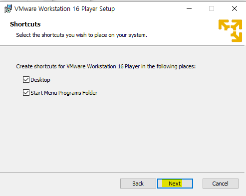 

   

   

   

  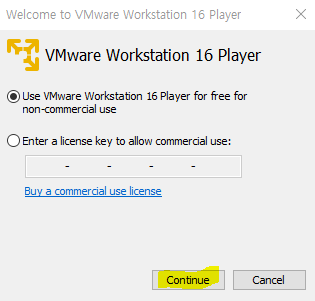 

   

  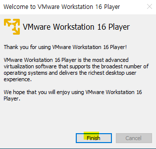 

  

  

- 우분투 설치

  https://ubuntu.com/download/desktop#download

  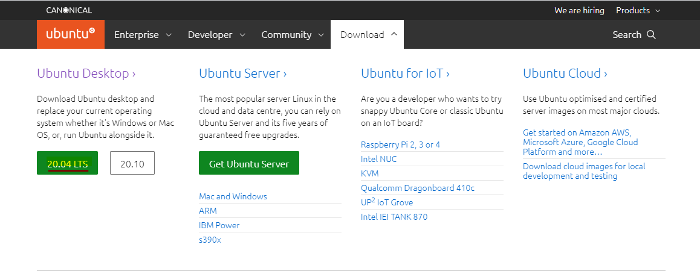

- Create a New Virtual Machine

  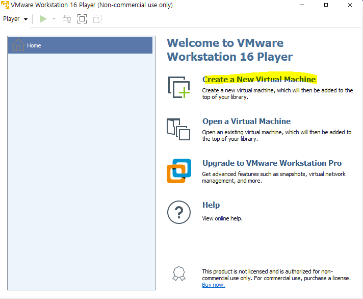

  

  - 다운받은 우분투의 경로 넣기

  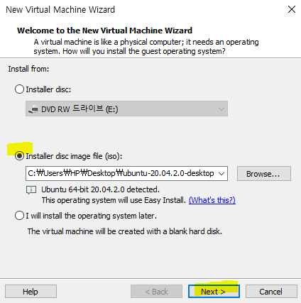 

  

  - User name은 모두 소문자로 입력 

  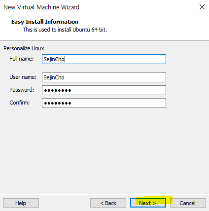 

  

  - machine name 설정

  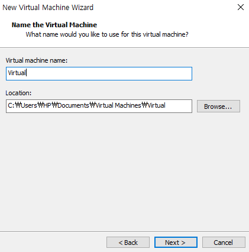 

  

  - next

  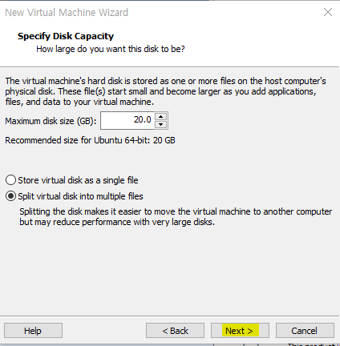 

  

  - finish

  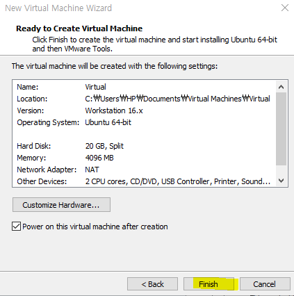 

  

  - download and install

  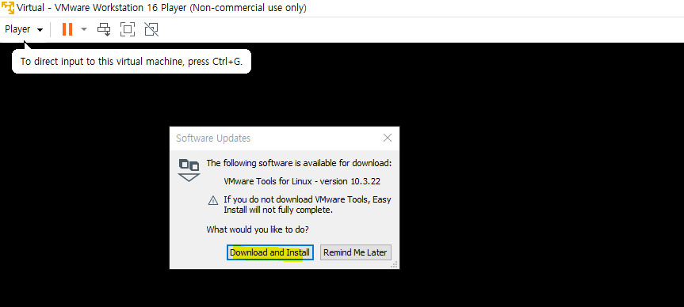

  

- **리눅스 기본 명령어**

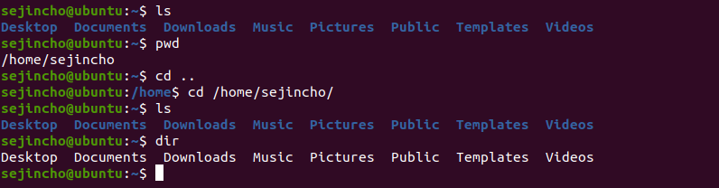

#### 파일 생성(test)

- i(insert)를 누르고 내용을 입력할 수 있음
- j : 밑으로 내리기
- k : 위로 올라가기
- l : 오른쪽 
- h : 왼쪽 
- : + wq : 저장

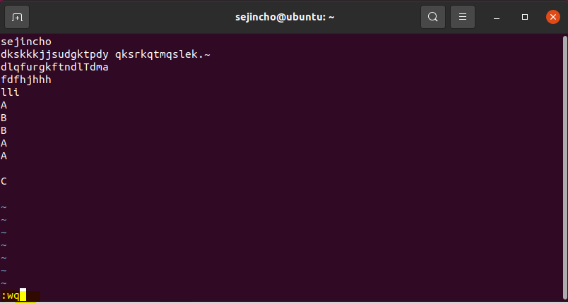

- :q! : 저장하지 않고 나가기(변경된 내용이 있더라고 저장하지 않고 무조건 종료)
- :q : vi 편집기가 종료
- x : 지우기
- d d : 한 줄 지우기
- 줄 보이기

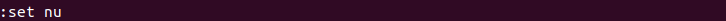

- ?d : d 글자 찾기 
  - ?를 사용하면 뒤에서부터 찾아주고
  - /를 사용하면 위에서부터 찾아준다.
  - n을 누르면 next

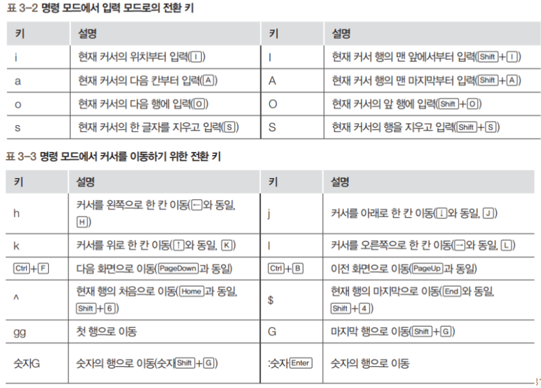

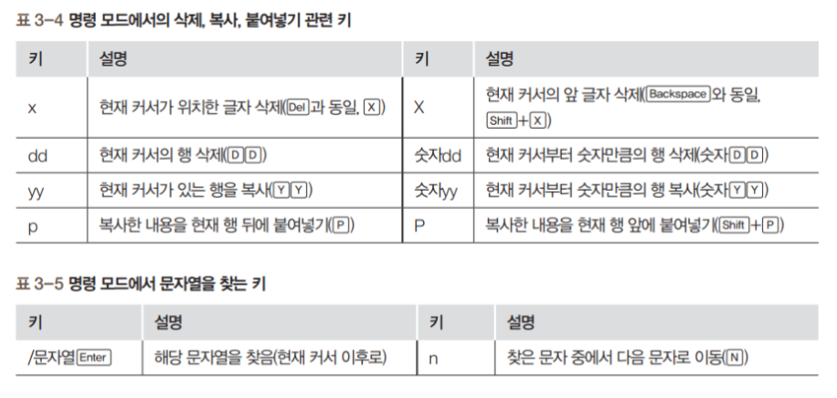

#### 콘솔에서 시스템 종료 명령

- poweroff
- shutdown -P now
  - shutdown 명령어 옵션 중 now 부분에 시간을 지정하면 설정한 시간에 시스템이 종료됨
  - shutdown -P +10 : 10분 후에 종료(poweroff)
  - shutdown -r 22:00 : 오후 10시에 재부팅(r: reboot)
  - shutdown -c : 예약된 shutdown 취소(c: cancel)
  - shutdown -k +15 : 현재 접속한 사용자에게 15분 후 종료된다는 메시지를 보내지만 실제로 종료되지는 않음
- halt -p
- init 0 

- **명령문 검색**

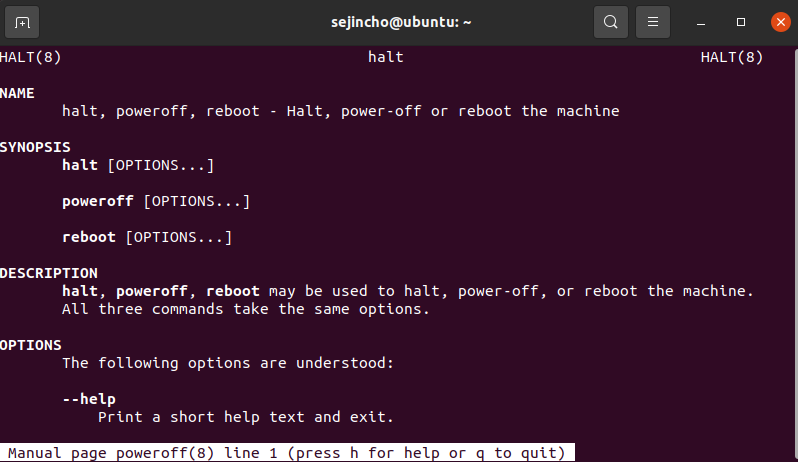

- ctrl + art + f2 : 터미널로 들어가기
- ctrl + art + f3 : 
- ctrl + alt + f4 :

- **root 권한으로 로그인 하는 방법**
  - sudo su 
  - passwd 
    - passwd 설정

- **shutdown 설정하기**

  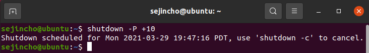

  

  - ctrl + art + f3로 들어가서 root로 로그인하기
    - showdown 설정했다는 내용이 나온다.

  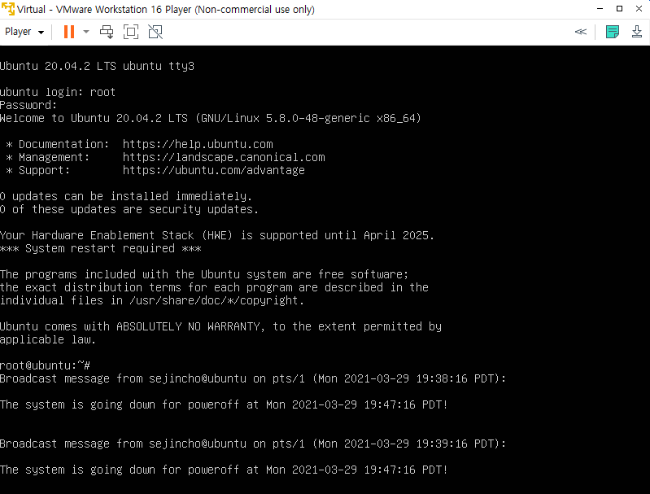

  

  - shutdown 취소 

  

  - root 계정에도 취소 되었다고 나온다.

  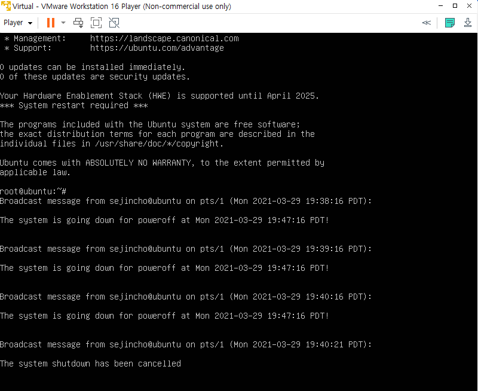

  

  - shutdown -k 옵션

  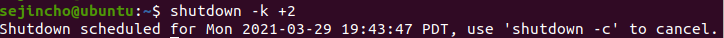

  - root 계정에서 메시지가 오는 것을 볼 수 있다.

  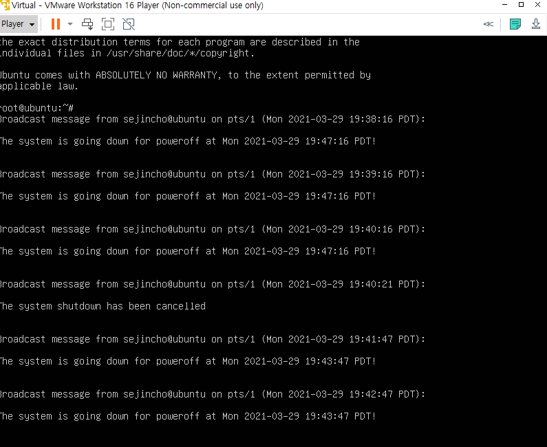

  - exit, logout으로 root 계정 나가기 

#### history

- 이전에 사용했던 명령을 모두 보려면 : history 명령 입력

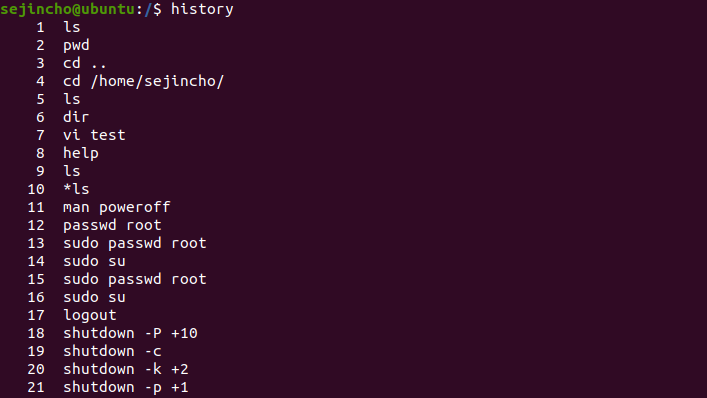

- **문서 편집기**
  - gedit : x 윈도우에서 제공하는 편리한 에디터
    - 윈도우 메모장과 동일한 역할
    - 터미널에서 간단히 gedit 파일명 명령을 입력하면 해당 파일 편집 가능
  - vi : 모든 유닉스, 리눅스 시스템에 기본으로 포함됨

- **vi 에디터의 비정상적 종료 해결하기**

  - 비정상적 종료로 인한 문제 발생
  - test 파일의 수정 작업이 정상적으로 종료되지 않았기 때문이다.

  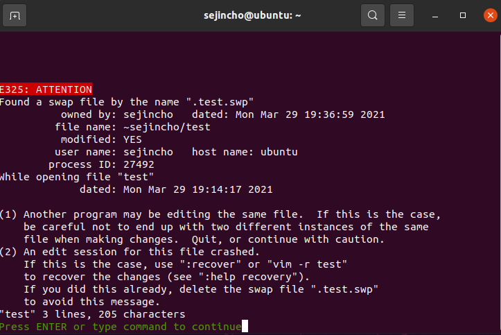

  

  - 스왑 파일을 삭제해서 문제를 해결
    - ls -a 명령을 입력하여 .test.swp 파일 확인
    - rm -rf .test.swp 명령을 이용해서 해당 스왑 파일을 삭제하면 test파일을 정상적으로 편집할 수 있음

  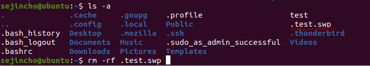

#### ls

- List의 약자, 윈도우의 dir 명령어와 같은 기능(해당 디렉터리에 있는 파일 목록 나열)

  - -a : all의 약자)
  - -l : long의 약자)
  - *.conf : *은 모두를 의미한다.

  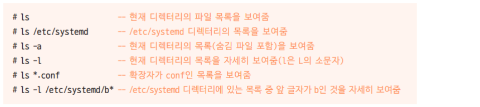

#### cd

- Change Directory의 약자, 디렉터리를 이동하는 명령어
  - cd ~sejincho : sejincho 사용자의 홈 디렉터리로 이동

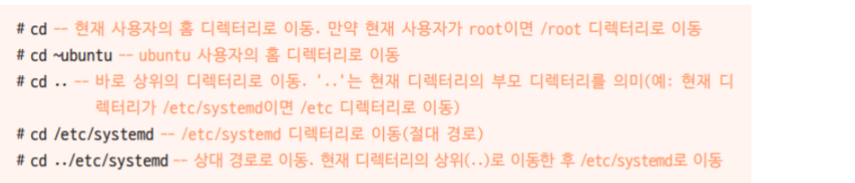

#### touch

- 크기가 0인 새 파일을 생성하거나, 이미 파일이 존재한다면 파일의 최종 수정 시간을 변경 

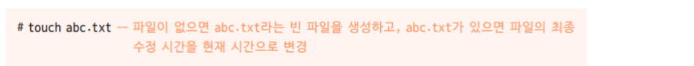

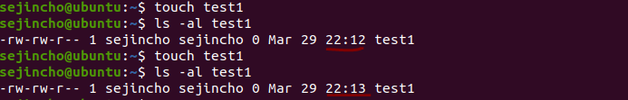

#### mkdir

- Make Directory의 약자, 새로운 디렉터리를 생성

  - 생성된 디렉터리는 명령을 실행한 사용자의 소유

  - 만약 -p를 절대경로로 사용하고 싶다면 sudo를 붙여서 사용하면 된다.

    - /def/fgh면 제일 상단이 root이다. root 같은 경우는 권한이 있어야 한다.

    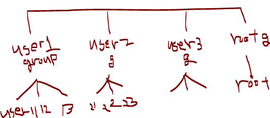

    - user1 그룹의 user1의 권한만 가지고 있는 정도이므로 root의 권한은 가지고 있지 않는다. 즉, 리눅스의 루트 계정은 모든 권한을 가진 계정이다. 

  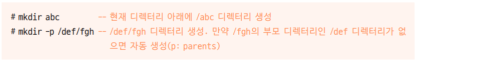

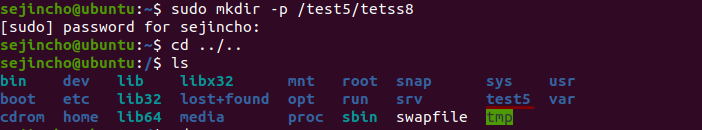

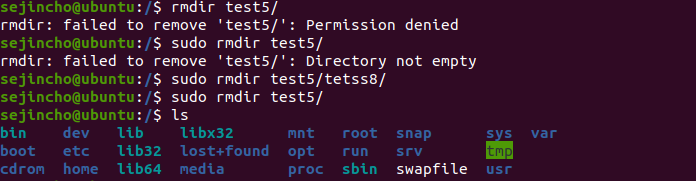

#### rmdir

- Remove Directory의 약자. 디렉터리를 삭제

  - 해당 디렉터리가 비어 있고 디렉터리에 대한 삭제 권한이 있어야 한다.
  - 파일이 들어 있는 디렉터리를 삭제하려면 "rm -r" 실행

  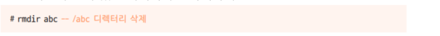

#### cp

- Copy의 약자, 파일이나 디렉터리를 복사
  - 새로 복사된 파일은 복사한 사용자의 소유
  - 명령을 실행하는 사용자에게 해당 파일의 읽기 권한이 있어야 한다.

#### rm

- ReMove의 약자, 파일이나 디렉터리를 삭제

  - 사용자에게 해당 파일이나 디렉터리의 삭제 권한이 있어야 함
  - root 사용자의 경우, 모든 권한을 가지고 있기 때문에 이 명령을 사용하는데 제약 없음

  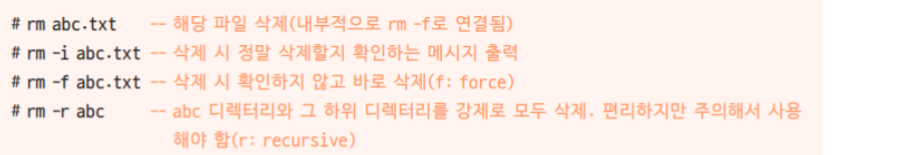

#### mv 

- MoVe의 약자, 파일이나 디렉터리 이름을 변경하거나 다른 디렉터리로 이동 할 때 사용

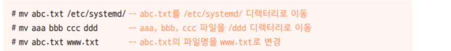

#### cat

- conCATenate의 약자, 파일의 내용을 화면에 출력

  - 명령어 뒤에 여러 개의 파일명을 나열하면 파일을 연결하여 내용을 화면에 출력

  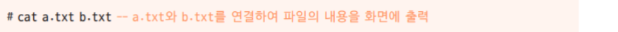

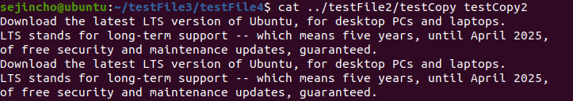

#### head, tail

- 텍스트 형식으로 작성된 파일의 앞10행 또는 마지막 10행만 화면에 출력

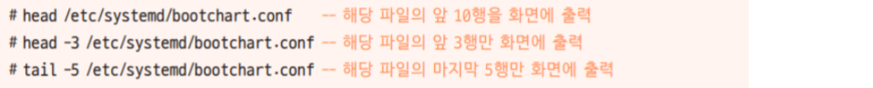

#### more

- 텍스트 형식으로 작성된 파일을 페이지 단위로 화면에 출력

  - Space bar를 누르면 다음 페이지로 이동,
  - B를 누르면 앞 페이지로 이동, Q를 누르면 종료 

  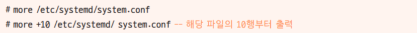

#### less

- more 명령어와 용도가 비슷하지만 더 확장된 기능의 명령어

  - more 명령어에서 사용하는 키도 사용할 수 있음
  - 추가로↑ , ↓ , ← , → , PageUp, PageDown도 사용 가능

  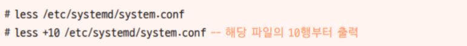

#### file

- 해당 파일이 어떤 종류의 파일인지 보여줌

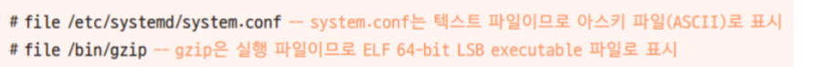

#### clear

- 현재 사용 중인 터미널 화면을 깨끗이 지워줌

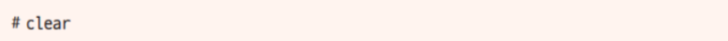

