#### 파일 압축하기

- **xz** 

  - 확장명 xz로 압축하거나 풀기
  - 비교적 최신 압축 명령어이며 압축률이 뛰어남
  - 디렉토리 압축은 안 됨

  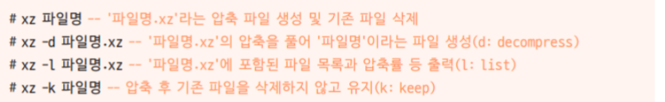

  

  - 두개 따로 압축이 된다.
    - 기존에 있던 파일 삭제

   

  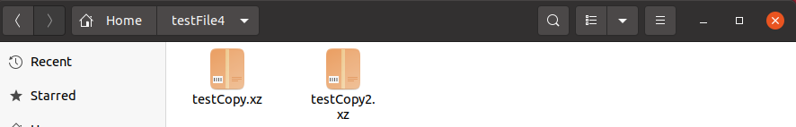

  - 압축된 파일에 포함된 파일 목록과 압축률 등 풀력 

  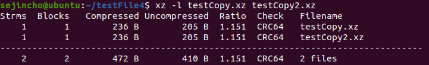

- **bzip2**

  - 확장명 bz2로 압축하거나 풀기
  - 폴더 압축은 안 됨

  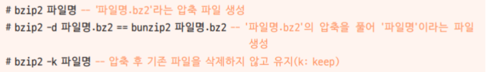

- **gzip**

  - 확장명 gz로 압축하거나 풀기
  - 폴더 압축은 안 됨

  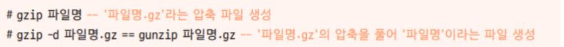

- **zip/unzip**

  - 윈도우와 호환되는 확장명 zip로 압축하거나 풀기
  - 디렉토리를 압축하면 그 안의 내용은 압축이 되지 않음(확인해보기!!!!)

  

#### 파일 묶기

- **Tar** 

  - 묶음 파일을 만들거나 풀기

  - 폴더 압축 가능

    - c(소문자) : 새로운 묶음 파일 생성
    - x : 묶음 파일 풀기
    - v : visual을 의미, 파일을 묶거나 푸는 과정을 보여줌 (생략가능)
    - f (필수) : 묶음 파일명을 지정
    - t : 묶음 파일을 풀기 전에 묶인 경로를 보여줌
    - C (대문자) : 지정된 디렉터리에 묶음 파일 풀기or 묶음 파일이 있는 디렉터리에 풀기
    - J : tar+xz
    - z : tar+gzip
    - j : tar+bzip2

    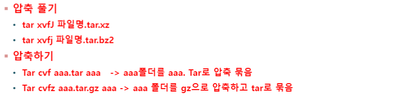

    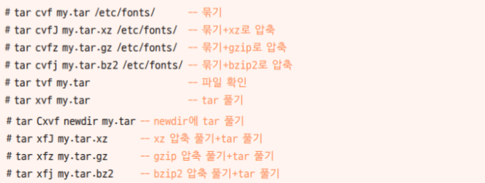

#### 파일 위치 검색

- **find 경로 옵션 조건 action**

  - 옵션: -name, -user(소유자), -newer(전, 후), -perm(허가권), -size(크기)
  - action: -print(기본값), -exec(외부명령실행)

  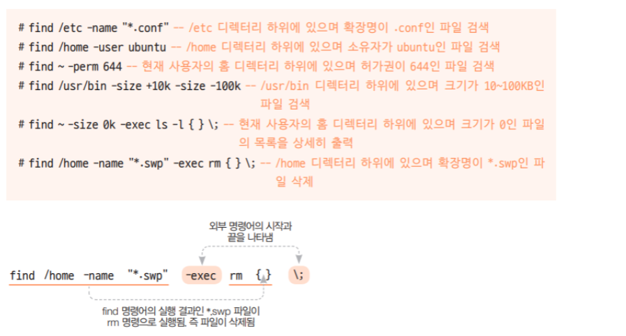

  

  - size 0 ~ 100KB인 파일 검색 

  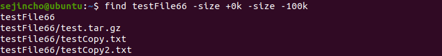

- **which 실행파일명**

  - PATH에 설정된 디렉터리와 절대 경로를 포함한 위치 검색
  - 특정 명령어의 위치도 알려준다. (검색 가능한 모든 경로에서 해당 명령어를 찾음)

  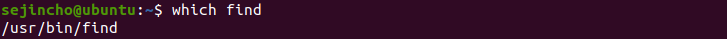

- **whereis 실행파일명**

  - 실행 파일과 소스, man(메뉴얼) 페이지 파일 위치까지 검색

  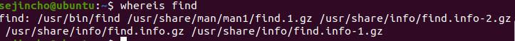

- **locate 파일명**

  - 실행 파일말고 모든 파일검색
  - sudoapt-get install mlocate
  - updatedb 명령을 한 번 실행해야 사용 가능

  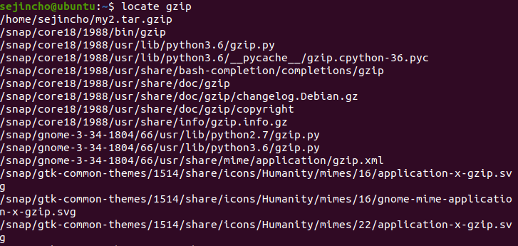

#### 파이프, 필터, 리디렉션

- **파이프** 

  - 두 프로그램을 연결하는 연결 통로를 의미, ‘|’(Shift + \)를 사용한다.

  - less 명령어로 한 페이지씩 보겠다고 설정 

  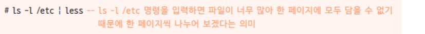

  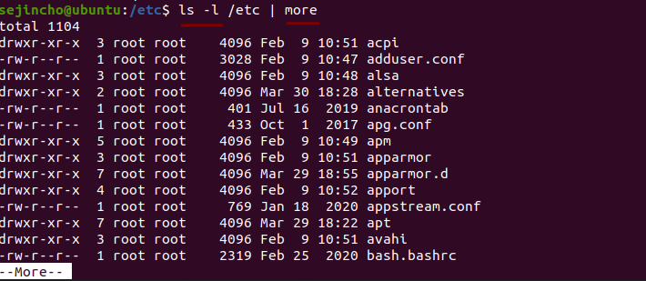

- **필터**

  - 필요한 것만 걸러주는 명령으로 grep, tail, wc, sort 등이 있음
    - grep : 파일 내 특정 패턴이나 문자열을 검색
    - wc : 파일 내 행, 단어, 문자의 수를 출력
  - 주로 파이프와 같이 사용
  - ps -ef는 모든 프로세스 번호를 출력하는 명령어

  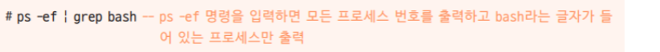

  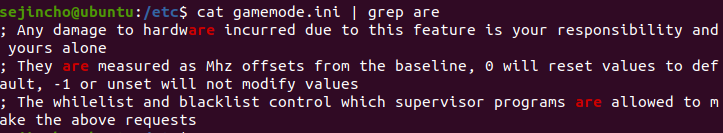

  

  - wc 사용법을 익혀보자. 매뉴얼찾기

    - 줄 단어 비트 파일명

    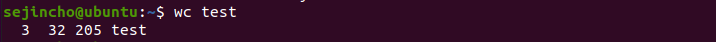

  - sort 사용법을 익혀보자. 매뉴얼찾기

- **리디렉션**

  - 표준 입출력의 방향을 바꾸는 것
  - 표준 입력은 키보드이고 표준 출력은 화면이지만, 이를 파일로 처리하고 싶을 때 주로 사용
  - sort –r   -> 역순 정렬

  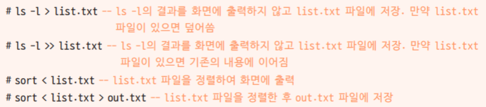

  

  - 연습

  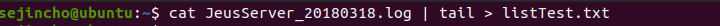

  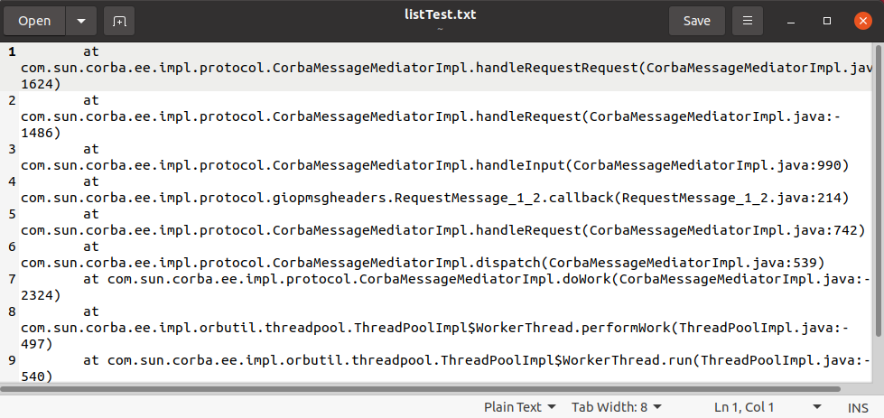

  - 연습

  

  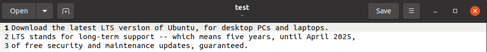

#### Standard Output

- **Output으로 찍히는 것을 1로 표현** 

  - [명령문] 1> file명

    ls 1> file1

  - 예

  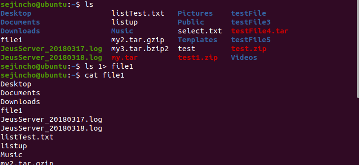

  - 예

  

  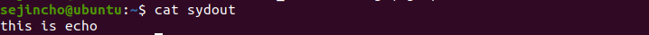

- **error 문구는 2로 표현함**

  - [명령문] 2> file명

    ls 2> file2 //이경우, ls에서 error문이 안나서 file2에 아무 값도 없음

    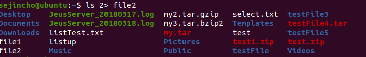

-----------

#### 사용자와 그룹의 개념

- **리눅스의 다중 사용자 시스템**
  - 리눅스 서버 1대에 여러 사용자가 동시에 접속 가능
  - 슈퍼 유저에게는 사용자 생성 권한을 포함해, 모든 작업을 실행할 수 있는 권한이 주어짐
  - 모든 사용자는 혼자서 존재하는 것이 아니라 하나 이상의 그룹에 소속되어야 함

- 사용자 list 보기

  - /etc/passwd 안에 저장되어 있다.
  - 각 행은 '사용자 이름: 비밀번호:사용자 ID:사용자 소속 그룹 ID:추가 정보:홈 디렉터리: 기본 셸'을 의미

  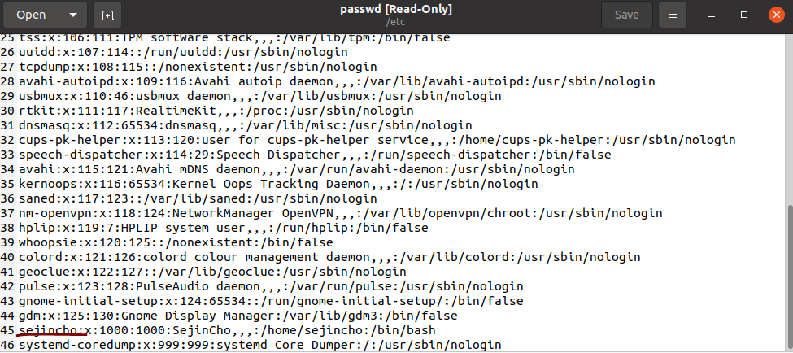

  - 패스워드 같은 경우는 다른 곳에 저장을 해두어서 x로 표시된다.
    - /etc/shadow 파일에 비밀번호가 지정되어 있다는 의미
  - 사용자ID는1000,sejincho가 속한 그룹의 ID도 1000
  - sejincho 사용자의홈디렉터리는/home/sejincho이고, 로그인시제공되는셸은/bin/bash

  - root 사용자를살펴보면사용자ID와소속그룹ID가모두0 으로설정되어있음

- **Group**

  - /etc/group 파일에 있음
  - 각 행은 ‘그룹이름:비밀번호:그룹ID:보조그룹사용자’를 의미
  - 보조 그룹 사용자는 이 그룹을 주 그룹이 아닌 보조 그룹으로 사용하는 사용자의 목록
  - 여러 그룹이면 쉼표(,)로 구분

  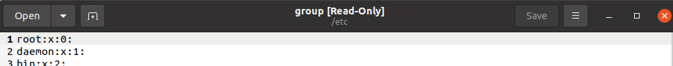

  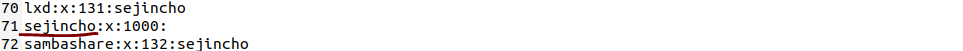

- **adduser**

  - 새로운사용자를추가하는adduser명령어를실행하면/etc/passwd, /etc/shadow,/etc/ group 파일에새로운행이추가됨
  - 예
    - adduser는 root 권한으로 실행해야 한다.
    - user1의 홈 디렉터리는 /home/user1

  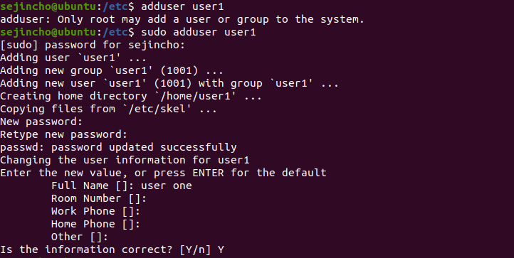

  

- **passwd**

  - 사용자의 비밀번호를 변경하는 명령어

  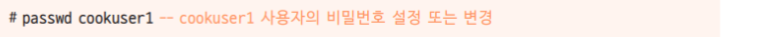

- **usermod**

  - 사용자의 속성을 변경하는 명령어

  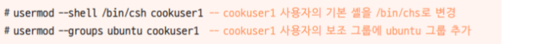

- **userdel / deluser**

  - 사용자를 삭제하는 명령어

  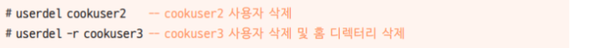

  - 만약 user1 그룹 안에 user2, user3이 들어있는 경우는 user1의 그룹은 사라지 않고 user1만 삭제된다.
  - 홈 디렉터리까지 지워지지 않은 경우는? -f옵션도 같이 줘보기 -rf 

- **change**

  - 사용자의 비밀번호를 주기적으로 변경하도록 설정하는 명령어

  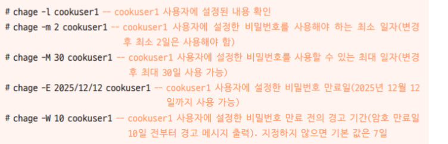

- **groups** 

  - 사용자가 소속된 그룹을 보여주는 명령어
    - 별도로 그룹을 지정하지 않으면 자동으로 사용자 이름과 동일한 그룹이 생성된다.

  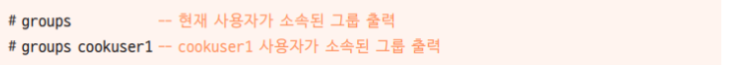

- **groupadd**

  - 새로운 그룹을 생성하는 명령어 

  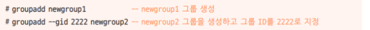

- **groupdel**

  - 그룹을 삭제하는 명령어

  

- **gpasswd**

  - 그룹의 비밀번호를 설정하거나 그룹 관리를 수행하는 명령어

  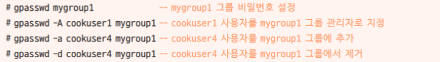

- 실습

  - user3 생성
  - user3 사용자가 추가되었는지 확인

  

  - 그룹을 생성하고 그 안에 유저 넣기

  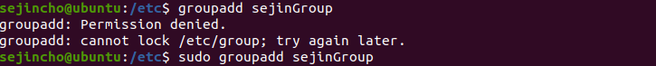

  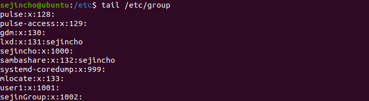

  

  

  - 사용자 변경
    - su (substitute user) : 사용자 변경

  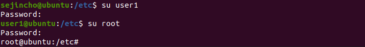

  

  - 새로 만든 사용자(home directory를 /etc/skel로 설정한다.)와 기존 사용자(sejincho)의 디렉터리를 비교

  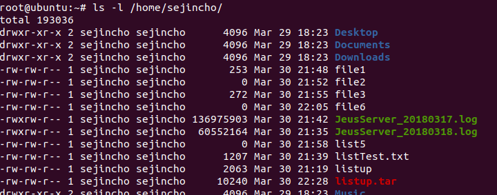

  

  
