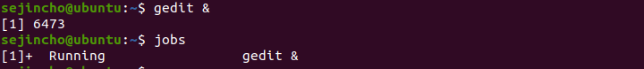

#### 사용자 변경

- su(substitute user) – 사용자변경

 

#### Root 계정 passwd 변경

- sudo passwd

  - Root의 passwd를 설정 혹은 변경
  - 초기에 설정 해주고 suroot 가능

  

  - 만약 특정 사용자의 비밀번호를 변경하고 싶으면 passwd [사용자명]

#### 환경변수 확인

- export 

  - 아무런 인자없이 export 명령을 내리면 전체 환경 변수 목록을 확인

  

- echo

  - 특정 환경변수의 값을 확인

  

#### 파일 유형

- 소유권(ownership)과 허가권(permission)

  - root 사용자가 자신의 홈 디렉터리에서 touch mydata.txt 명령으로 빈 파일을 만들고 ls -l 명령을 실행하면 다음과 같이 나타남

  

  - 예
    - 755: rwx r-x r-x
    - 641: rw- r-- --x
    - 554: r-x -r-x r--
    - 754: rwx r-x r--

#### 파일 허가권

- 파일 허가권

  - 파일허가권은 ‘rw-’, ‘r--’, ‘r--’와 같이 3개씩 끊어서 구분
  - r은 read, w는 write, x는 execute의 약자
  - ‘rw-’는 읽거나 쓸 수 있지만 실행할 수는 없다는 의미
  - 읽고 쓰고 실행할 수 있는 파일은 ‘rwx’로 표시

  

  

  - 첫번째의 ‘rw-’는 소유자(user)의 파일 접근 권한을, 두번째의 ‘r--’는 그룹(group)의 파일 접근권한을, 세번째의 ‘r--’는 그 외 사용자(other)의 파일 접근권한을 의미
  - 소유자의 허가권을 나타내는 6은 2진수로 110이므로 ‘rw-’로, 그룹의 허가권을 나타내는 4는 2진수로 100이므로 ‘r--’로,  그 외 사용자의 허가권을 나타내는 4도 2진수로 100이므로 ‘r--’로 표현
  - 디렉터리(폴더)를 해당 디렉터리로 이동하려면 실행(x) 권한이 반드시 있어야 함
  - 따라서, 일반적으로 디렉터리에는 소유자, 그룹, 그 외사용자의 실행(x) 권한이 설정 됨

- **chmod(알아두기)**

  - 파일 허가권을 변경하는 명령어
  - root 사용자 또는 해당 파일의 소유자만 실행 가능
  - chmod777 mydata.txt 명령을실행하면모든사용자가mydata.txt 파일은 읽고 쓰고 실행할 수있음
  - 상대모드(symbolic method)로도 사용
  - chmodu+x 파일명 명령은 소유자(User)에게 실행(eXecute) 권한을 허가하라(+)는 의미

  

  

  

#### 파일 소유권

- **파일 소유권 개념**
  - 파일 소유권은 특정사용자와 그룹이 파일에 대한 소유권한을 가지는 것을 의미
  - Mydata.txt 파일의 경우, 소유자가 root 사용자이고 소유 그룹도 root

- **chown**
  - 파일소유권을변경하는명령어
  - 'chown새사용자명(.새그룹명) 파일명’과같은형식으로사용
  - chown ubuntu mydata.txt 명령은mydata.txt 파일의소유자를ubuntu사용자로바꾸라는의미
  - chown ubuntu:ubuntu mydata.txt 명령은 파일 그룹도 ubuntu 그룹으로 바꾸라는 의미
  - chgrp ubuntu mydata.txt 명령은 그룹만 ubuntu 그룹으로 바꾸라는 의미

- 실습

  - 파일 생성 후 작성

  

  

  

  - 파일 속성 확인하고 ./sample 명령을 입력하여 파일을 실행해보기
    - 허가가 거부되었다는 메시지가 나타남

  

  

  - 파일 허가권 변경 및 실행
    - chmod u+e sample

  

  

  - 소유권 변경하기 
    - 파일의 소유권을 sejincho 사용자로 변경하기
    - 그룹을 sejincho 그룹으로 변경
      - 만약 사용자와 그룹을 한꺼번에 바꾸려면 chown sejincho:sejincho sample 명령 실행

  

  

  

#### 링크

- **하드링크(hard link)와 심벌릭링크(symbolic link) - 그림그리고 설명할 수 있어야 함**
  - 파일의 링크는 하드링크(hard link)와 심벌릭링크(symbolic link)  또는 소프트링크(soft link)로 구분 됨
  - 하드링크를 생성하는 명령은 'ln 원본파일 링크파일명'
  - 심벌릭 링크를 생성하는 명령은 'ln -s 원본파일 링크파일명'
  - 하드링크는 원본 파일과 동일한 inode를 가진다. 그렇기 때문에 원본 파일이 삭제 되더라도 원본 파일의 inode를 갖고 있는 링크 파일은 여전히 사용 가능하다. 사실 링크라는 표현도 애매하다. 같은 inode를 가르키는 서로 다른 이름이라고나 할까? 원본이라는 개념이 없다.
  - 심볼릭 링크는 원본 파일의 이름을 가르키는 링크다. 그러므로 원본 파일이 사라지게되면 역할을 수행할 수 없다. 장점은 전혀 다른 파일이라도 원본 파일과 이름이 같다면 계속 사용가능하다는 것이다. 주로 dynamic library의 so 파일과 연계해서 사용하게 된다. 
  - 심벌릭 링크 파일같은 경우는 원본파일의 inode를 가리키는 것이 아니고 따로 inode를 생성하여 그곳을 가리킨다. 그리고 데이터 블록에 있는 원본 파일 포인터가 원본파일의 주소를 가지고 있는 방식이다.

- **실습**

  -  original 파일 생성하고 하드릭크와 심벌릭 링크 파일 생성

  

  

  - 하드링크와 심벌릭 링크 내용 확인(동일)

  

  

  - 만약 원본 파일을 다른 곳으로 이동하고 하드 링크 파일과 심벌릭 링크 파일 확인
    - 심벌릭 링크 파일은 찾을 수 없다고 나온다.

  

  

  

  - 만약 같은 파일명의 다른 내용을 넣어서 파일을 새로 만들고 다시 확인해보면
    - 심벌릭 링크 파일 같은 경우는 새로 만든 내용이 출력된다.

  

  

  

  

  - 심벌릭 링크는 size가 더 작지만 만약 원본파일이 이동하거나 삭제되면 기존에 있던 내용을 읽지 못한다.
  - 하드링크는 inode를 그대로 가르키고 있기 때문에, 원본이 삭제되더라도 그대로 사용 가능
    - 원본을 유지
    - 파악하지 못한 하드링크가 있는 경우 불필요한 저장소 낭비
    - 원본이 이동되어도 사용 가능
  - 원본 이름만 같으면 다른 파일이어도 동작
  - Links는 inode에 연결되어 있는 수
    - 원본파일의 inode를 동일하게 가리키는 하드링크 파일의 수의만 원본파일의 Links에 영향을 준다. 그래서 원본 파일의 Links의 개수는 1(원본파일) + hardn(하드 링크 파일의 개수) 이다.

  

  

#### 프로세스

- **프로세스 정의**

  - 하드디스크에 저장된 실행코드(프로그램)가 메모리에 로딩되어 활성화 된 것

  - Ex) 웹 브라우저 프로그램인 파이어폭스는 ‘프로그램’, 파이어폭스를 실행하여 화면에 나타난상태(메모리에 로딩되어 화면에 나타난 상태가 더 정확한 표현)를 ‘프로세스’라 부름

  - 단순히 실행 중인 프로그램이라고 할 수 있다. 즉, 사용자가 작성한 프로그램이 운영체제에 의해 메모리 공간을 할당 받아 실행 중인 것을 말한다.

    - 여러 명의 사용자들에 의해 공유되고 있는 응용프로그램은 일반적으로 각 사용자들의 실행단계에서 하나의 프로세스를 갖게된다. 즉, 모든 프로그램은 실행될 때마다 하나 이상의 프로세스를 갖는다.

  - Process와 Thread의 차이

    > https://gmlwjd9405.github.io/2018/09/14/process-vs-thread.html 참고

    

- **Foreground process** 
  - 실행하면 화면에 나타나서 사용자와 상호작용을 하는 프로세스
  - 사용자와 상호작용을 해야만 하는 작업

- **Background process**
  - 화면에 나타나지 않은 채 뒤에서 실행되는 프로세스
  - 오래 걸리는 작업, 상호작용을 하지 않아도 되는 작업 실행

- 예

  - gedit을 입력하면 gedit 명령을 입력한 터미널을 더 이상 사용할 수 없음

  

  - 그래서 jedit & 을 입력하면 터미널을 계속 사용할 수 있다.
    - &는 백그라운드로 프로세스를 실행하겠다는 의미이다.

  

- **프로세스 번호**
  - 각 프로세스에 할당된 고유번호
  - 메모리에 로딩되어 활성화 된 프로세스를 구분하려면 고유번호가 필요함

- **부모 프로세스와 자식프로세스**

  - 모든 프로세스는 독립적으로 실행되는 것이 아니라 부모 프로세스에 종속되어 실행

  - 예를들어, 파이어폭스는X 윈도우 프로세스가 구동된 상태에서 실행 되어야 함 

    → X 윈도우:파이어폭스의 부모프로세스, 파이어폭스: X 윈도우의 자식 프로세스

  - 만약 파이어폭스는 그대로 두고 X윈도우만 강제 종료하면 파이어폭스도 종료됨

  - 부모 프로세스를 종료하면 부모 프로세스에 종속된 자식 프로세스도 종료 되는 것

- **ps**

  - 현재 프로세스의 상태를 확인하는 명령어
  - 많은 옵션과 함게 사용할 수 있음
  - 프로세스 번호와 상태를 확인할 때는 'ps -ef | grep 프로세스명' 명령을 주로 사용
  - x 윈도우가 부모 프로세스 그리고 파이어폭스 등이 자식 프로세스이다.
    - PID : 프로세스 아이디
    - PPID : Parent Process ID

  

  

  - 내가 실행시킨 프로세스 확인 

  

  

  

- **kill** 

  - 프로세스를강제로 종료하는 명령어
  - '-9' 옵션과 함께 사용하면 프로세스가 무조건 종료됨
  - 응답하지 않고 무한 루프를 도는 프로세스는 kill -9 프로세스번호 명령으로 강제 종료
  - 부모 프로세스인 4242를 삭제
    - 자식 프로세스가 모두 kill

  

  

- **pstree**

  - 부모 프로세스와 자식 프로세스의 관계를 트리 형태로 보여주는 명령어

  

- **실습**

  - jobs 명령어 - 현재 실행 중인 백그라운드 프로세스 확인 가능
    - 맨 앞에 나오는 것이 작업번호(현재 실행 중인 백그라운드 프로세스의 순차 번호)

  

- **실습 무한루프를 도는 프로세스 중지시키기**

  - 터미널에서 yes > /dev/null 명령 입력, 무한루프를 도는 단순한 프로세스 생성

  

  

  - 터미널을 하나 더 열어서 ps -ef | grep yes 명령으로 프로세스 번호 확인
    - sejincho는 프로세스의 소유자, 6562는 프로세스 번호, 6444는 부모 프로세스 번호

  

  

  - 프로세스 번호 확인 후 kill 명령어로 프로세스 종료
    - 다른 터미널에서 실행 중인 것도 자동으로 종료 됨
    - 작동 중인 포그라운드 프로세스만 종료 : 프로세스가 실행되고 있는 터미널에서 Ctrl + C

  

  

  

- **실습 - 프로세스 상황 바꾸기**

  - 포그라운드 프로세스 -> 백그라운드 프로세스 -> 포그라운드 프로세스로 바꾸기

    - 다시 yes > /dev/null 명력 입력해서 포그라운드 프로세스 생성 

    - Ctrl + Z를 눌러서 프로세스를 일시 중지시키고, bg 명령어 입력 

      잠시 중지된 프로세스를 백그라운드 프로세스로 계속 실행

  

  

  - 현재 실행 중인 백그라운드 프로세스 확인
    - [1]- , [2]+ 에서 -, +의 의미 : + 기호로 표시된 작업이 먼저 실행되는 job이고 - 기호가 그 다음으로 실행되는 작업니다. 

  

  

  - fg 작업번호 명령을 입력하면 포그라운드 프로세스로 만들 수 있음

  

  

  - Ctrl + C를 눌러서 프로세스 종료

  

