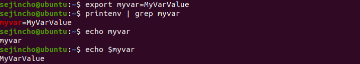
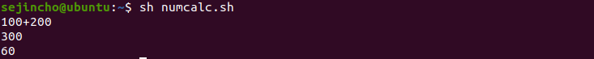
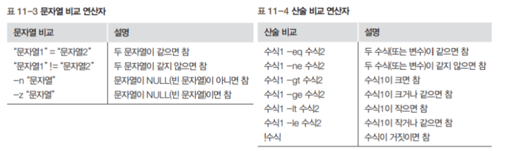

#### 패키지 설치 명령어

- dpkg(Debian Package) 명령어
  - 우분투에서 패키지(프로그램, 확장자*.deb)를 설치할 때 가장 많이 사용되는 명령어
  - 직접 프로그램을 다운 받아서, dpkg명령어를 활용하여 설치 함
  - Apt-get이 나오기 전에 주로 씀

- Apt-get 명령어
  - Dpkg의 단점을 보완한 패키지 설치 명령어
  - dpkg의 확장 개념

- X 윈도우용 계산기 프로그램인 galculator

  - 패키지명: galculator -> 패키지(프로그램)의 이름
  - 버전: 2.14 -> 대개 세 자릿수로 구성 / 주버전, 부버전, 패치 버전 순, 숫자가 높을수록 최신
  - 개정번호(revision number) : 1 -> 문제점을 개선할 때마다 붙이는 번호이며 높을수록 좋음
  - 아키텍처: amd64 -> 64비트 CPU, 즉, 이 파일을 설치할 수 있는 CPU를 말함

  

- 자주 사용하는 dpkg 명령어 옵션
  - -i 또는 --install
    - 패키지를 설치하는 옵션
    - dpkg -i 패키지파일명.deb
  - -r 또는 --remove
    - 설치되어 있는 패키지를 삭제하는 옵션
    - dpkg -r 패키지명
  - -P 또는 --purge
    - 설치되어 있는 패키지와 설정 파일을 모두 삭제하는 옵션
    - dpkg -P 패키지명
  - -l 또는 L
    - 패키지 관련 정보와 파일 목록을 보여주는 옵션
    - dpkg -l 패키지명
    - dpkg -L 패키지명
  - --INFO 패키지파일명.deb
    - 아직 설치되지 않은 deb 파일을 조회하는 옵션
    - dpkg --info 패키지파일명.deb
      - 패키지 파일의 정보를 보여줌. 어떤 기능을 설치하기 전에 deb 파일 안에 해당 기능이  포함되어 있는지 확인 

- X 윈도우용 계산기 프로그램인 galculator

  - http://archive.ubuntu.com/ubuntu/pool/universe/g/galculator/galculator_2.1.4-1build1_amd64.deb

  

  

  - install

  

  - libquadmath0을 먼저 설치해야하는 에러 
    - 의존성이 있는 패키지이므로

  

- dpkg 단점
  - 설치 이전에 직접 패키지 다운로드 필요(패키지 찾는 어려움, 자동화 안 됨)
  - 의존성 문제
    - 특정 패키지가 설치 되려면 미리 설치되어 있어야 할 패키지가 존재하는 것
    - e.g.)파이어폭스를 실행하고 싶으면 X 윈도우가 반드시 미리 설치 되어야 함
  - 단점을 해결 할 apt-get 등장

- 실습(dpkg 명령어로 패키지 설치하기)

  - deb 파일 다운로드 하기
    - http://archive.ubuntu.com/ubuntu/pool/universe/n/ncftp/

  

  

  - ncftp 패키지 설치

    - 이미 설치되어 있는지 dpkg -l ncftp 명령으로 확인

    

    

  - ncftp 패키지 설치 후, 잘 설치되었는지 dpkg -l ncftp 명령으로 확인

  

  - 터미널에서 ncftp 명령을 입력하면 FTP 클라이어트가 실행됨

    

    

#### apt-get

- apt-get 명령어
  - apt-get 명령어는*.deb 패키지를설치하는편리한도구
  - 우분투가제공하는deb 파일저장소에서자동으로deb 파일을다운로드하여설치 > 의존성문제를걱정하지않아도됨
  - dpkg명령어의경우,*.deb 파일을미리다운로드한후설치해야하는번거로움이있음

- apt-get 기본 사용법
  - apt-get install 패지지명
    - 패키지설치명령어, 패키지를 다운로드 한 후 사용자에게 설치 여부를 물음
    - ‘-y’ 옵션을 넣으면 사용자에게 yes/no를 묻는 부분에서 무조건 yes를 입력한 것으로 간주
  - apt-get update
    - /etc/apt/sources.list 파일의 내용이 수정되면 다운로드할 패키지 목록을 업데이트
  - apt-get upgrade
    - Update 이후에 최신 버전을 설치한다.
  - apt-get remove 패키지명
    - 설치되어 있는 패키지를 삭제
  - apt-get purge 패키지명
    - 사용하지 않는 패키지를 모두 삭제
  - apt-get clean 또는apt-get autoclean
    - 설치할 때 다운로드한 파일과 과거의 파일을 삭제

- apt-cache
  - Package의정보들을찾거나보여주는명령어
  - apt-cache search 검색어
    - 검색어와관련있는패키지를보여준다.
  - apt-cache show 패키지명
    - 패키지의정보를보여줌

- **실습(apt-get 명령어로 mc 패키지 설치 하기)**

  - 설치할 패키지의 정보를 apt-cache show mc 명령으로 확인

  

  - apt-cache depends mc 명령으로의존성정보도확인

  

  - apt-get install mc 명령으로 패키지 설치 진행
    - 그 전에 install 했을 때 났던 에러때문에 설치 진행이 안 됨
    - 그래서 sudo apt --fix-broken install을 진행
    - 정상적으로 설치되면 ‘Unpacking, Selecting, Processing ...’ 등의 메시지가 나타남

  

  

  

  

  

  

- 실습(https://devsnote.com/writings/64)

  - sl 명령어 
    - 리눅스에서 가장 많이 사용하는 명령어 중의 하나가 "ls" 일 것이다. 그러다보니 "ls"를 "sl"이라고 오타로 쓰는 경우가 꽤 발생하곤 한다. 이럴 때 "command not found"가 아니라 재미있는 결과를 보이게 할 수 있다.

  

#### apt-get의 작동 방식과 설정파일

#### 자바 실행

- java 파일 생성

  

  

- 자바 설치

  - 아래 명령어는 현재 default로 설정된 자바를 설치합니다.

  

  

  - 다운로드할 패키지 목록을 업데이트하고 자바 버전 확인

  

  

  - update 이후에 최신 버전을 설치

  

  

- 이클립스 다운로드

  - https://www.eclipse.org/downloads/packages/

  

  

  

  

  

  

  

  - 압축 풀기

  

- **자바 컴파일**

  

#### Git 설치

- **apt-get 사용**

- commit

#### 셸의 개념

- 리눅스 셸
  - 명령과 프로그램을 실행할 때 사용하는 인터페이스
  - 사용자가 입력한 명령을 해석하여 커널에 전달하거나 커널의 처리결과를 사용자에게 전달하는 역할
  - 우분투에서 기본적으로 사용하는 셸은 bash(Bourne Again Shell)이며 배시셸이라고 읽음

- bash의특징
  - 에일리어스(alias, 명령단축) 기능
  - 히스토리기능( ↑ 또는↓ )
  - 연산기능
  - Job Control 기능
  - 자동 이름 완성기능( Tab )
  - 프롬프트 제어 기능 명령 편집 기능

#### 셸의 명령문 처리 방법

- 셸 명령문 형식
  - (프롬프트) 명령 [옵션...] [인자...]
- 셸 명령문의 예

#### 환경변수

- 셸에서는 여러가지 환경 변수 값 저장
- 환경 변수 선언, 변경
  - export 환경변수=값(확인할 때는 printenv 명령 실행)
- 환경 변수 확인 방법
  - echo $환경변수

- 실습(환경변수 설정)

  - export myvar = MyVarValue

  

#### 셸 스트립트 작성

- 작성방법
  - 셸스크립트도일반적인프로그래밍언어와비슷하게변수, 반복문, 제어문등을사용
  - 별도로컴파일하지않고텍스트파일형태로셸에서바로실행
  - 셸스크립트는주로vi 에디터나gedit로작성

- vi name.sh 또는 gedit name.sh 명령 실행

  

  - 1행: 첫행에반드시써야하며, 특별한형태의주석(#!)으로배시셸을사용하겠다는의미
  - 2행: echo는화면에출력하는명령어. 먼저‘사용자이름:’이라는글자를출력하고옆에$USER라는환경변수의내용을출력
  - 4행: 종료코드를반환. 0은성공을의미

#### 셸 스크립트 실행

- sh 명령으로 실행

  - sh스크립트파일명령으로실행하는방법은셸스크립트파일의속성을변경할필요가없다는것이장점

  

- '실행 가능' 속성으로 변경한 후 실행

  - 먼저 셸 스크립트 파이르이 속성을 '실행 가능'으로 변경한 후 **./스크립트파일** 명령을 실행
  - **chmod + x 파일명**은 현재 파일의 속성에 '실행가능' 속성을 추가

  

#### 변수

- 변수는 값을 계속 변경하여 저장하는 개념
- 셸 스크립트에서는 변수를 사용하기 전에 미리 선언하지 않음. 처음 변수에 값이 할당되면 자동으로 변수가 생성
- 변수에 들어가는 모든 값은 string으로 취급되고 숫자를 넣어도 동일하게 취급
- 변수명은 대문자와 소문자를 구분
- 변수를 대입할 때 '=' 앞뒤에 공백이 없어야 한다.

- 변수의 입력과 출력

  - $가 포함된 글자를 출력하려면 ' '로 묶어나 앞에 \를 넣어야 한다.
  - " "로 변수를 묶거나 묶지 않아도 출력

  

  

- vi를 사용하는 것이 불편한 경우

  - sudo apt-get install vim
    - vi 파일명

  

- 숫자 계산
  - 변수값을 +, -, *, / 등으로 연산하려면 expr 키워드 사용
  - 단, 수식과 함께 키보드의 1 왼쪽에 있는 백쿼트(`)로 반드시 묶어야 함
  - 수식에 괄호를 사용하려면 그앞에반드시\ ( \ )를넣어야함
  - +, -, /와 달리 *도 예외적으로앞에\ ( \ )를 넣어야 함
  - 띄어쓰기 제대로 안해주면 에러난다.
  - 3행: 문자열로 취급하며 모두 붙여서 써야 함
  - 5행: 숫자로 취급하여 계산하며 각 단어를 띄어쓰기 해야 함
  - 7행: 괄호와 * 앞에는\ ( \ )를넣음

 

- 파라미터 변수

  - 파라미터 변수는 $0, $1, $2... 형태(실행하는 명령의 각 부분을 변수로 지정한다는 의미)
  - 명령 전체의 파라미터 변수는 $*로 나타냄($0는 제외)
  - apt-get -y install aftp 명령의 경우
    - $0에는 apt-get이, $1에는 -y가, $2에는 install이, $3에는 gftp가 저장

  

#### if문과 case문

- **기본 if문**

  - [ 조건 ] 안의 각 단어 사이어 공백이 있어야 한다는 것을 주의

  

  - 2행의 [ ] 안에는 참과 거짓을 구분하는 조건식이 들어감
  - ‘=’는 문자열이 같은지 비교하고 ‘!=’는 문자열이 같지 않은지 비교
  - if1.sh에서는 조건식이 참이므로 4행을 실행

- **if~else문**

  - 참인 경우와 거짓인 경우를 구분하여 실행

  

- **조건문의 비교 연산자**

  - 조건문에서는 문자열 비교와 산술 비교가 가능

  

  

- 파일 관련 조건

  

  - 2행: fname변수에 cron서버 실행 파일인 /lib/systemd/system/cron.service를 저장
  - 3행: fname변수에 저장된 /lib/systemd/system/cron.service 파일이 일반 파일이면 참이므로 5행을 실행하고, 그렇지 않으면 거짓이므로 7행을 실행
  - 5행: fname에 들어있는 파일의 앞 다섯행을 출력

  

