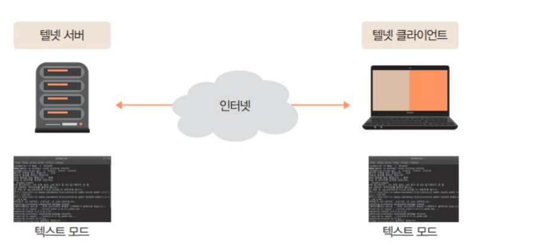
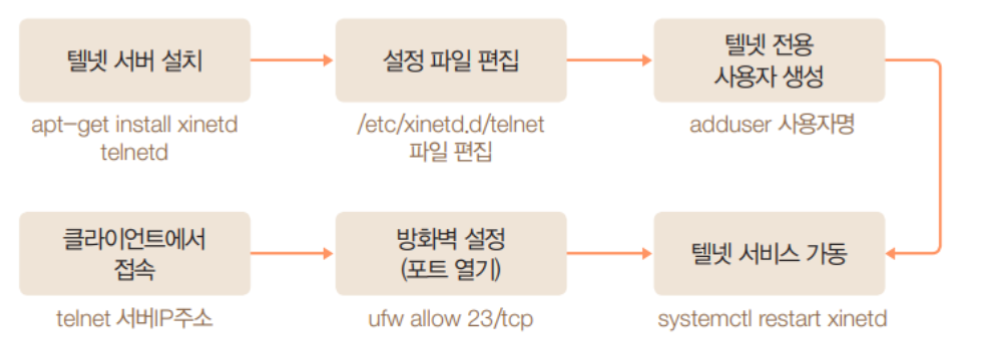
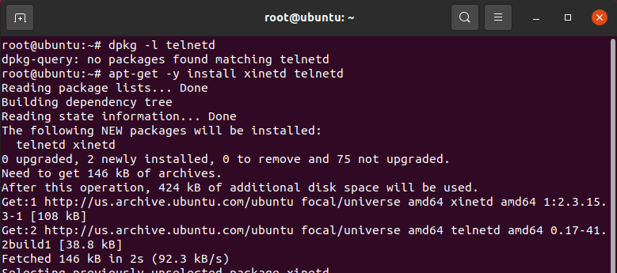
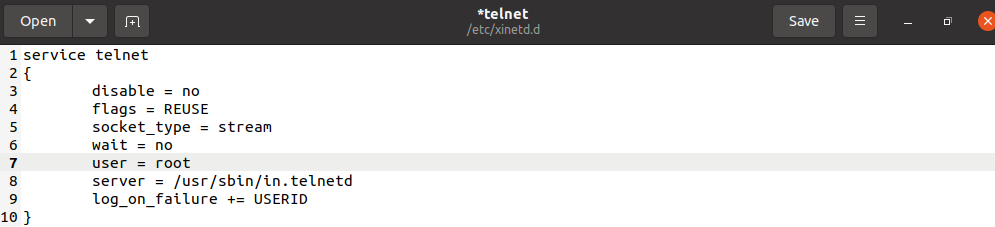
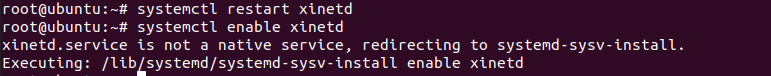
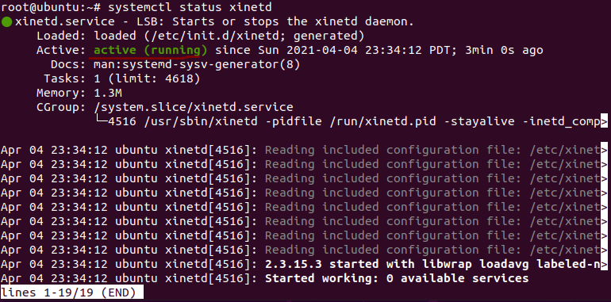
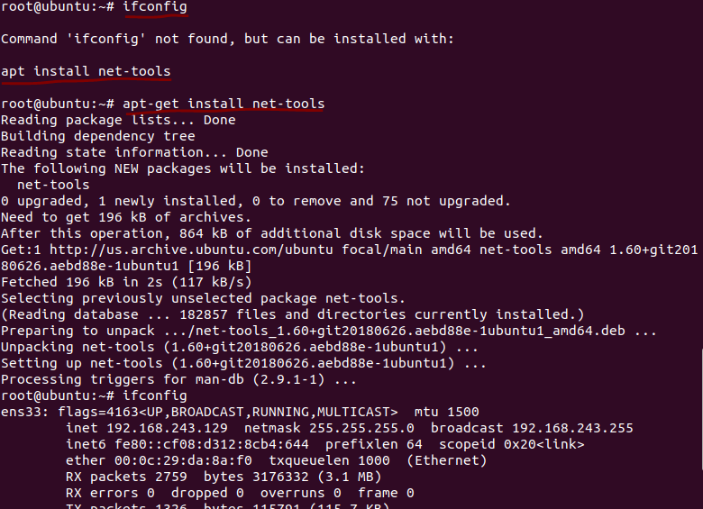
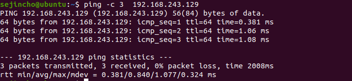
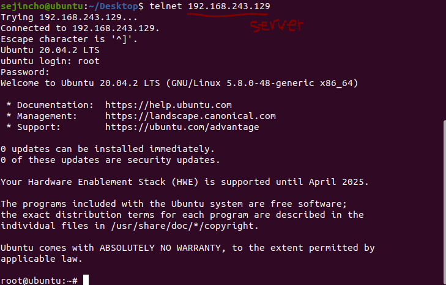
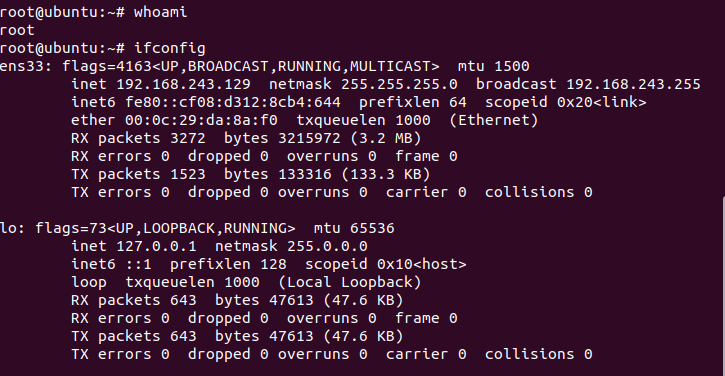

#### 텔넷의 서버 개요

- 텔넷 서버

  - 리눅스에서 원격 접속을 하기 위한 애플리케이션
  - 서버에 텔넷 서버를 설치하고 원격지 PC에는 텔넷 클라이언트 프로그램을 설치해야 함
  - 전통적인 원격 접속 방법인 텔넷은 보안에 취약하기 때문에 최근에는 보안 기능을 추가
  - 원격지의 PC(텔넷 클라이언트)에서 리눅스 서버에 접속하면 서버에서 직접 텍스트 모드로 작업하는 것과 동일하게 작업 가능

  

- 텔넷 서버 구축 과정

#### 텔넷 서버 설치

- 서버 하나 생성
  - 이름 : linuxserver / 비밀번호 : 1234

- 텔넷 서버 패키지 설치하기

  - apt-get -y install xinetd telnetd 명령으로 관련 패키지 설치
  - 새로운 linuxserver의 root에서 설치

  

  

- 텔넷 서버가 가동하도록 설정하기

  

  

- 텔넷 서비스 가동, 컴퓨터를 재부팅해도 텔넷 서비스가 가동되도록 설정

  -  systemctl restart xinetd명령으로 텔넷 서비스 가동
    - 텔넷의 설정을 변경했기때문에 restart 진행
  - 메시지가 나오지 않으면 정상 컴퓨터를 재부팅 해도 텔넷 서비스가 가동되도록 systemctl enable xinetd 명령으로 설정

  

- 텔넷 가동 여부 확인 

  - systemctl status xinetd

  

- 방화벽 열기

  - 텔넷의 23번 포트 허용
  - ufw allow 23/tcp

  

- ip 주소 확인

  - ifconfig로 ip 주소 확인 시 에러 발생
  - apt-get install net-tools 설치 진행 후 다시 ip 확인

  

- 서버가 클라이언트에서 접근 되는지 확인

  - ping -c 3 서버ip주소
  - ping 서버ip주소, 명령 입력, telnet Server와 네트워크로 연결되는지 확인
  - sejincho에서 서버에 접근 가능한지 확인함
    - Ttl – time to live – 이 패킷이 살아있는 시간(라우터를 거치는 횟수, 또 다른 network으로 이동한 횟수), 기본값은 정해져 있고, 하나의 라우터를 거치는동안 그 수만큼 차감된다. 0이되면 packet은 소멸한다. Rtt–round trip time –왕복시간

  

  

- **자신의 컴퓨터에서 teluser로 접속(서버로 접속)**

  - telnet 서버IP주소 //텔넷 클라이언트로 접속
  - whoami //접속된 사용자 이름 확인
  - exit //텔넷 종료

  

  

- **몇 가지 명령 실행(클라이언트에서 서버에 접속하고 몇가지 명령 실행)**

- **exit 명령으로 텔넷 종료** 

