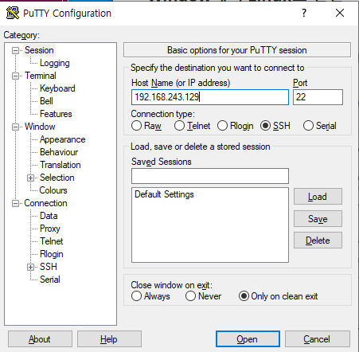
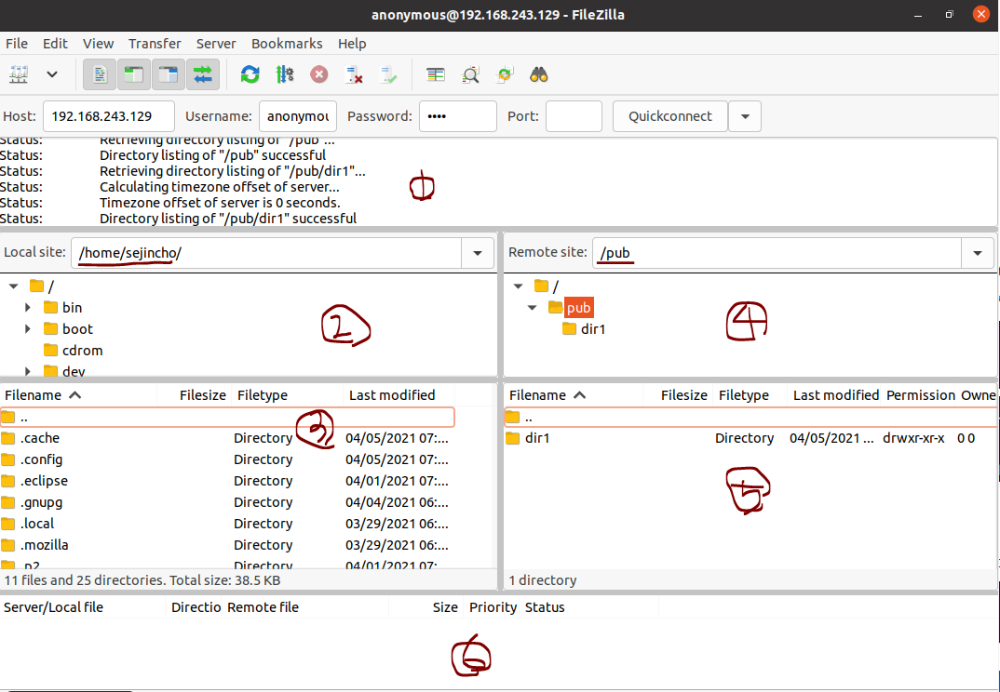

#### SSH 서버의 개요

- **SSH(Secure Shell Protocol)**

  - 컴퓨터와 컴퓨터가 인터넷과 같은 Public Network를 통해 서로 통신을 할 때 보안적으로 안전하게 통신을하기위해 사용하는 네트워크 프로토콜
  - 텔넷은 서버, 클라이언트 사이에 데이터를 전송할 때 암호화를 하지 않아 해킹 위험이 있음
  - 텔넷의 단점을 보완하기 위하여 SSH 사용
  - 리눅스에서는 Open SSH 서버를 지원
  - Open SSH서버는 텔넷 서버와 기능은 비슷하지만 데이터를 전송할 때 패킷을 암호화하여 보안이 우수

  

#### Open SHH 서버 설치

- **서버에 설치** 

  - apt-get -y install openssh-server

  

- **서비스 재가동, 상시 가동, 가동 여부 확인**

  - systemctl restart ssh //서비스 재가동
  - systemctl enable sst //서비스 상시 가동
  - systemctl status ssh //서비스 가동 여부 확인

  

- **방화벽 열기 (SSH의 22번 포트 허용)**

  - ufw allow 22/tcp

  

- **Client에서 Server의 SSH 서버에 접속하기**

  - ssh id@IP주소 명령 입력
    - 접속이 확실한지 물어보면 'yes' 입력
    - 접속되면 텔넷과 동일하게 사용 가능, 암호화하기 때문에 더 안전함

  

  

  - 그러면 sejincho에서 linuxserver를 사용할 수 있다.
    - exit로 서버 종료

  

#### 서버로 파일 전송하기

- **파일 전송/송신 명령어**

  - user1으로 111.111.111.111에 /home/user1/index.html을 내 컴퓨터에 /home/hjlee으로 옮김

    - scp user1@111.111.111.111:/home/user1/index.html /home/hjlee

  - port가 9999일 때

    - scp –P 9999 user1@111.111.111.111:/home/user1/index.html /home/hjlee

  - **server에 있는 파일을 가져오기**

    - server에 있는 test파일

    

    - test파일을 client로 복사해오기

    

    - client에 복사된 것을 확인 

     

  

  - **server에 파일 옮기기**

    - scp -r은 하위 디렉토리 모두 copy 한다는 의미

    

    - 서버에 파일이 옮겨진 것을 확인

    

------------------

#### Window에서 Linux로 연결

- Putty

  - https://www.chiark.greenend.org.uk/~sgtatham/putty/latest.html

  

  

  - server ip 입력 

  

  - 서버로 login

  

- **파일 전송 서비스 FTP**

  - File을 주고 받을 수 있는 서버를 운영한다.
  - FTP를 이용하지 않고도 웹에서 파일 전송이 가능해짐
  - Server/client 시스템
  - FTP 프로그램
    - vsftpd
    - proftpd

  **1. vsftpd **

  - **vsftpd 패키지 설치하기(서버에)**

    - apt-get -y install vsftpd

    

  

  - vi 에디터로 /etc/vsftpd.conf 파일 수정
    - anonymous 계정의 권한 변경
    - 줄 번호 보는 방법 > :set nu

  

  

  - **vsftpd에 anonymous로 접속되는 디렉터리는 /srv/ftp**

    - 이 디렉터리 아래에 pub 디렉터리를 만들고 모든 사용자의 읽기, 쓰기 권한 허용

     

  ​		

  

  - **설정을 변경했으므로 재시작**
    - systemctl restart vsftpd, systemctl enable vsftpd, systemctl status vsftpd

  

  

  - 외부에서 FTP 서버에 접근하도록 ufw allow ftp 명령으로 포트 허용
    - 원활한 외부 접속을 허용하기 위해서 방화벽을 잠시 꺼둠

  

  

  - 이번에는 client에서 FTP 서버에 접속하여 파일 다운로드/업로드 하기
    - sudo apt-get -y install filezilla 명령으로 filezilla 클라이언트 설치

  

  

  - fielzilla 명령으로 파일질라 실행, 접속
    - Host에는 Server의 IP주소, Username : anonymous, 비밀번호 : 1234, 빠른 연결 클릭

  

  

  - 접속된 상태
    - 1. 접속 메시지 창
      2. 클라이언트 폴더
      3. 폴더의 상세 내용
      4. 서버의 폴더
      5. 폴더의 상세 내용
      6. 파일 전송 상태

  

  

  - testFile을 server로 이동

  

  

  

  **2. Proftpd **

  - **Proftpd 패키지 설치하기**
    - apt-get -y install proftpd 

  

  - proftpd 설정 파일 변경
    - vi /etc/proftpd/proftpd.conf 열기

  

  - 서비스 restartgkrh FTP 서버에 접근하도록 포트 허용

  

  - 마지막으로 client에서 filezilla 실행해보기

  

-------

#### FTP 포트 변경(vsftpd, proftpd 충돌을 막기 위해서)

- netstat -ntlp

  - 활성 TCP 연결을 대기할 컴퓨터는 수신 대기, 이더넷 통계, IP 라우팅 테이블, (IP, ICMP, TCP 및 UDP 프로토콜)에 대 한 IPv4 통계 및 IPv6 (에 대 한 통계는 IPv6, ICMPv6, i p v 6 통해 TCP 및 UDP IPv6 프로토콜을 통해) 포트를 표시

    

- Netstat -ntlp

- proftpd 변경

  - gedit /etc/proftpd/proftpd.conf 

  

- 포트번호 변경하고, 재가동
  
  - systemctl restart vsftpd, systemctl enable vsftpd, systemctl status vsftpd
- Netstat -ntlp해서 해당 port로 열려있는지 확인

-----------

#### 반복문

- echo $?
  - 마지막으로 종료된 명령어의 종료 상태를 말해주는데, 종료 상태란 정상적인 종료 0과 비정상적인 종료인 0을 제외한 다른 값을 의미한다.
- echo$! 
  - 마지막으로 백그라운드에서 실행된 명령어의 PID 값을 출력한다.
- echo$$
  - 현재 쉘의 PID 값을 출력한다.

