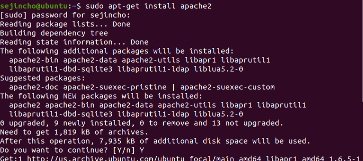
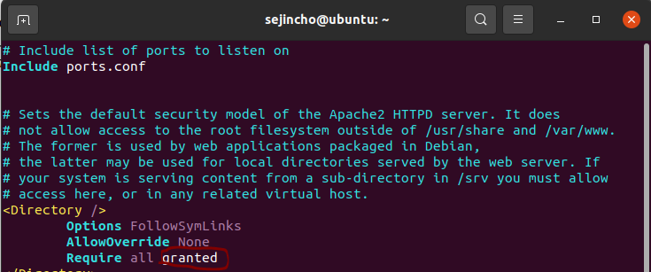
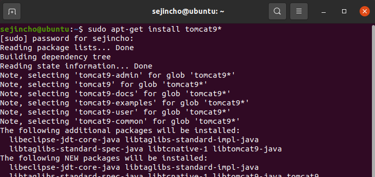

#### 웹 서버, WAS

- **Web Server의 역할**
  - Static resource
    - Web server에서 static resource를 다루고, WAS 서버에서 dynamic 정보를 다룬다.
    - DB까지 가지 않는 정보 전달. 그림파일, text 등
  - Security 
    - 방화벽 바깥에 webserver를 위치하고 WAS, DB 서버는 방화벽 안 쪽에 위치
    - SSL 처리
  - Load balancing
    - 하나의 Webserver가 여러 개의 WAS 서버에게 업무 분배

- **Web Serve의 장점**
  - Static resource 처리를 빨리 해주고,
  - WAS 서버의 주소 노출이 안되어 보안이 강화 (port 번호를 숨길 수 있음)
  - 여러 개의 WAS의 업무 분배해 주어 자원을 효율적으로 활용

- **apt-get 명령어로 웹 서버 설치하기**

  - apt-get install apache2

  

  

  - **설치 후 버전 확인**

    - apache2 -v

    

  

  - **apache 서비스 기동/멈춤**

    - service apache2 start
    - service apache2 stop
    - service apache2 restart

    

  

  - **웹 서버 동작 확인하기**

    - 파이어폭스에 http://localhost/ 입력
    - 이러한 창이 나오면 apache2 서비스가 정상 작동 된다는 것

    

  

  - **이 페이지 수정 방법**

    - 페이지에 적혀있는 /var/www/html/ 경로에 index.html을 수정하면 된다.

    

    

  - **서버 동작 확인**

    - netstatus -ntlp
    - listen port 80을 확인하여 정상 동작 확인

    

  

  - **apache server의 home diretory 변경**

    - 내 홈페이지 root로 변경해야함

    

    

  

  - **설정한 루트에 index.html 파일 생성**

  

  

  - **설정 변경**

    - restart를 진행하면 permission 에러가 난다.
    - /etc/apache2/apache2.conf에서 <Directory>에 관한 설정을 변경해야한다.
      - denied -> granted

    

    

  

  - **방화벽 해제**

    - 외부에서 웹 서버에 접근할 수 있도록 ufw allow 80 명령으로 포트 허용
    -  ifconfig로 가상머신의 ip 주소 확인

    

    

  - **apache2 restart 후 localhost 접속**

  

  

  - 해보기!!

    - DocumentRoot 아래에 다른 폴더 만들기(directory1)
    - 그 안에 a.html 만들기
    - 이걸 실행하려면? url에 어떻게 넣어야 하지?
      - http://localhost/directory1/a.html

    

    

    

#### Tomcat9 설치

- **설치**

  - apt-get install tomcat9*

  

  

- **Tomcat 실행/중지**

  - service tomcat9 start
  - service tomcat9 stop

- **설치 확인**

  - http://localhost:8080/ (8080은 tomcat에서 정한 port)
  - tomcat의 디폴트 페이지
  - tomcat의 기본 경로 : /var/lib/tomcat9/webapps/ROOT/index.html
  - 경로 변경 : /etc/tomcat9/server.xml

  

  

- **네트워크 상태 확인**

#### Tomcat-admin - GUI 관리도구

- **manager 페이지를 사용하기 위해 권한 부여**

  - manager webapp 을 들어가기 위해서 id가 있어야 한다.

  

  

  

  - **/etc/tomcat9/tomcat-users.xml에 manager-gui role 추가**

  

  

  

  - **설정한 username과 password로 접속하면 다음과 같은 페이지로 이동한다.**

  

  

  - manager라는 애플리케이션이 등록되어 있고 그래서 manager GUI를 볼 수 있는 것임

  

  

- **APP을 tomcat에서 deploy하는 방법**

  - Tomcat admin을 사용하여 deploy

  

  

  

  

  - 직접 app을 폴더에 넣어서 deploy
    - /var/lib/tomcat9/webapps/ 내에 war 파일을 위치시킴

  

  

  

- WAR(Web Application aRchive)
  - Web application을 묶는 확장자
  - 애플리케이션 실행을 위한 위한 컴파일된 모든 클래스 파일, 설정 파일들이 모두 포함
  - 웹 애플리케이션 설정을 정의한 배포 명세서(web.xml)이 존재

#### Web server와 WAS 서버 연결

- **Apache와 Tomcat을 연결하는 connector 모듈이 필요**

  -  sudo apt-get install libapache2-mod-jk*

  

  

- **설정**

  - apache-tomcat connector에 tomcat들의 별명을 지어주고, 정보를 설정

    - Connetor 설정 파일 : /etc/libapache2-mod-jk/workers.properties
      - Tomcat의 home directory, port, 통신 protocol를 설정

  - webserver apache에 apache-tomcat connector에 설정된 tomcat으로 요청을 보내도록 설정(별명 사용)

    - /etc/apache2/sites-available/000-default.conf
    - /etc/apache2/mods-available/httpd-jk.conf
    - /etc/apache2/mods-available/jk.load (없으면 만든다.)

  - WAS tomcat에 특정 port와 특정 protocol로 오는 요청을 받으라고 설정

    - AJP1.3으로 연결되고 port 8009로 요청이 들어올 것임을 설정
      - Tomcat 설정 파일 : /etc/tomcat9/server.xml
    - Deploy할 app위치 : /var/lib/tomcat9/webapps

    

- **실습**

  - apache-tomcat connector에 tomcat들의 별명을 지어주고, 정보를 설정
    - /etc/libapache2-mod-jk/workers-properties (설치시 자동 생성됨)
    - tomcat9 home과 java home 을 변경

   

  

  

  - webserver apache에 apache-tomcat connector에 설정된 tomcat 으로 요청을 보내도록 설정 (별명 사용)

    - 수정

    

    

    - 수정

    

    

    - 수정

    

    

  

  - **WAS tomcat에 특정 port와 특정 protocol로 오는 요청을 받으라고 설정**

    - /etc/tomcat9/server.xml

    

    

  

  - localhost와 localhost:8080 으로 들어갔을 때 동일한 화면이 나옴

  

