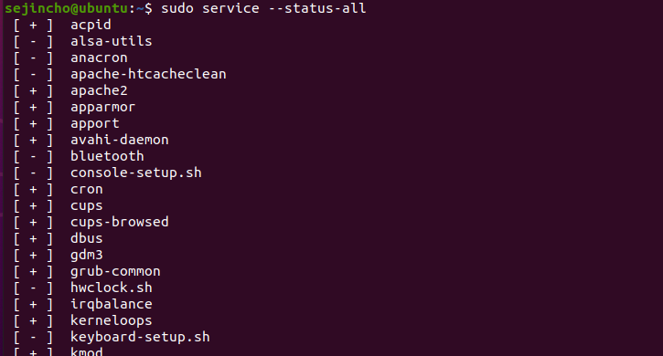
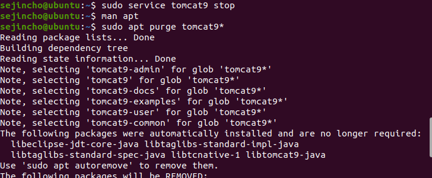
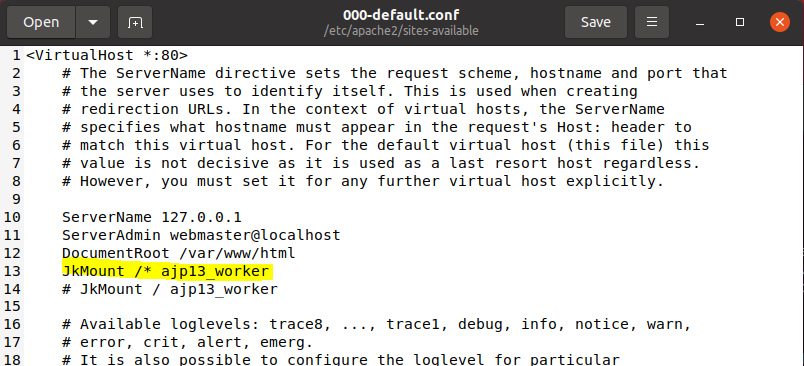
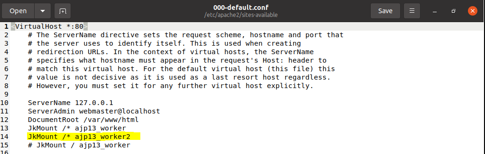
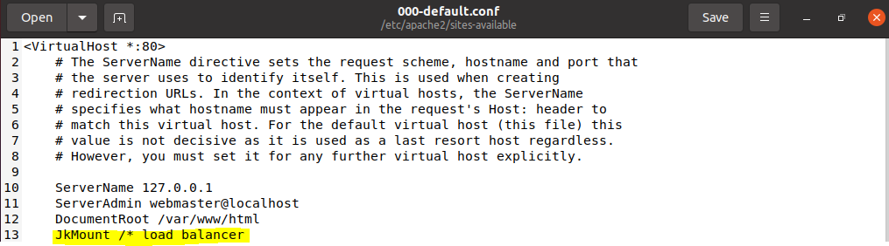

#### Web Server와 Tomcat 다시 연결

- 기본설치(같은 리눅스) web server1 -  was1
- web server(ip1), was(ip2)
- web server1(ip0) - was1(ip1, port1), was(ip2, port2)
  - 같은 app을 설치하는 경우 load balancer 설정
    - JkMount /* loadbalancer 
  - 다른 app을 설치하는 경우 JkMount app별로 설정
    - JkMount /app1/* ajpw1
    - JkMount /app2/* ajpw2

#### 기본설치(같은 리눅스) web server1 -  was1

- **기존의 tomcat 삭제**	
  - purge option은 설정 파일까지 삭제하는 옵션임, remove는 설정 파일은 유지함

- **설치**

- **web server와 was 연결**
  - apache와  tomcat을 연결하는  connertor 모듈이 필요함
  - sudo apt-get install libapache2-mod-jk*

- **AJP란?**

  - AJP는 웹서버(Apache) 뒤에 있는 어플리케이션 서버로부터 웹서버로 들어오늘 요청을 위임할 수 있는 바이너리 프로토콜이다.

  - 어플리케이션 서버로 핑을 할 수 있는 웹서버의 모니터링 기능을 지원한다.

    

- **mod_jk란?**
  
  - 아파치, 톰캣 연동을 위해 **mod_jk**라는 모듈을 사용하는데, 이는 AJP프로토콜을 사용하여 톰캣과 연동하기 위해 만들어진 모듈이다. mod_jk는 톰캣의 일부로 배포되지만, 아파치 웹서버에 설치하여야 한다.

- **설정**

  - /etc/apache2/sites-available/000-default.conf 

  - /etc/apache2/mods-available/httpd-jk.conf 

  - /etc/apache2/mods-available/jk.load (없으면 만든다.)

  - connector에 tomcat들의 별명을 지어주고, 정보를 설정

    

  

  - webserver apache에 apache-tomcat connector에 설정된 tomcat 으로 요청을 보내도록 설정 (별명 사용)

  

  

  - tomcat에서 특정 port와 특정 protocal로 오는 요청을 받으라고 설정

  

#### web server(ip1), was(ip2)

- 새로운 우분투(sejincho)를 만들어서 tomcat9를 설치

- apache가 깔려있는 곳(sejincho)에서 설정

  - /etc/libapache2-mod-jk/workers-properties 에서 sejincho2의 ip

  

  

  - sejincho2의 /etc/tomcat9/server.xml 수정

  

  

  

- http://192.168.243.130:8080/로 들어가서 다음과 같은 페이지가 나오면 된다.

#### web server1(ip0) - was1(ip1, port1), was(ip2, port2) -> 다른 app

- **우분투 추가 (sejincho3) - tomcat 설치** 

- **web service의 workers.properties 수정**

  

  

- **000-default.conf 수정**

  

  

  

#### web server1(ip0) - was1(ip1, port1), was(ip2, port2) -> 같은 app

- **loadbalancer** 

- **web service의 workers.properties 수정**

  

  

- **000-default.conf 수정**

  

  

  

#### WAR 직접 만들어서 deploy

- eclipse에서 war 제작

  - Dynamic Web Project 생성

  

  

  
