#### apache와 tomcat이란?

- apache

  - apache server는 http 웹서버를 지칭하는 말이다. http 웹서버는 http 요청을 처리할 수 있는 웹서버이다. 즉, 클라이언트가 get, post, delete 등의 http 메소드를 이용해 요청을 하면 apache 웹서버가 결과를 돌려주는 기능을 한다.

- tomcat이란?

  - tomcat은 흔히 WAS(Web Application Server) 라고 한다. WAS는 웹서버와 웹 컨테이너의 결합으로 다양한 기능을 컨테이너에 구현하여 다양한 역할을 수행할 수 있는 서버이다. 클라이언트의 요청이 있을 때 내부의 프로그램을 통해 결과를 만들어 내고 이것을 다시 클라이언트에 전달해주는 역할을 하는 것이 웹 컨테이너이다. 

  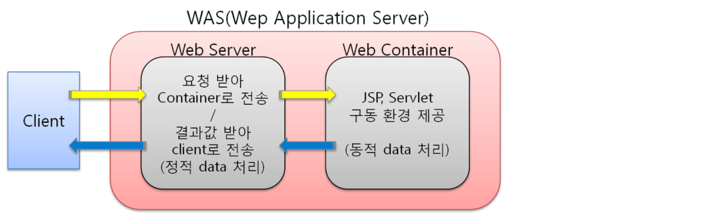

- apache와 tomcat의 차이는?

  - 웹 서버는 정적인 데이터를 처리하는 서버이다. 이미지나 단순 html 파일과 같은 리소스를 제공하는 서버는 웹 서버를 통하면 WAS를 이용하는 것보다 빠르고 안정적이다. 
  - WAS는 동적인 데이터를 처리하는 서버이다. DB와 연결되어 데이터를 주고 받거나 프로그램으로 데이터 조작이 필요한 경우 WAS를 활용해야 한다.
  - 두 서버의 목적의 차이 때문에 두 개의 서버를 연동해서 사용하면 더욱 효과적인 서비스를 제공할 수 있다. 사용자 요청은 http 웹 서버를 통해 받고 내부 프로그램은 was를 통해 처리하는 식으로 한다면 정적인 데이터와 동적인 데이터를 효과적으로 처리가 가능할 것이다.

#### Web Server와 Tomcat 다시 연결

- 기본설치(같은 리눅스) web server1 -  was1
- web server(ip1), was(ip2)
- web server1(ip0) - was1(ip1, port1), was(ip2, port2)
  - 같은 app을 설치하는 경우 load balancer 설정
    - JkMount /* loadbalancer 
  - 다른 app을 설치하는 경우 JkMount app별로 설정
    - JkMount /app1/* ajpw1
    - JkMount /app2/* ajpw2

#### 기본설치(같은 리눅스) web server1 -  was1

- **기존의 tomcat 삭제**	
  - purge option은 설정 파일까지 삭제하는 옵션임, remove는 설정 파일은 유지함

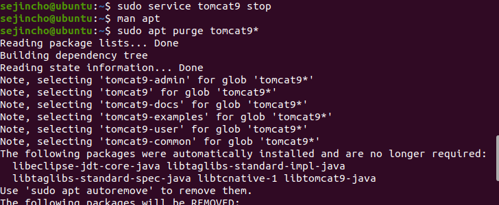

- **설치**

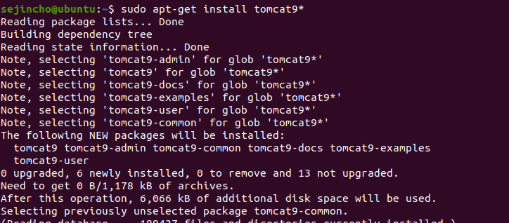

- **web server와 was 연결**
  - apache와  tomcat을 연결하는  connertor 모듈이 필요함
  - sudo apt-get install libapache2-mod-jk*

- **AJP란?**

  - AJP는 웹서버(Apache) 뒤에 있는 어플리케이션 서버로부터 웹서버로 들어오늘 요청을 위임할 수 있는 바이너리 프로토콜이다.

  - 어플리케이션 서버로 핑을 할 수 있는 웹서버의 모니터링 기능을 지원한다.

    

- **mod_jk란?**
  
  - 아파치, 톰캣 연동을 위해 **mod_jk**라는 모듈을 사용하는데, 이는 AJP프로토콜을 사용하여 톰캣과 연동하기 위해 만들어진 모듈이다. mod_jk는 톰캣의 일부로 배포되지만, 아파치 웹서버에 설치하여야 한다.

- **설정**

  - /etc/apache2/sites-available/000-default.conf 

  - /etc/apache2/mods-available/httpd-jk.conf 

  - /etc/apache2/mods-available/jk.load (없으면 만든다.)

  - connector에 tomcat들의 별명을 지어주고, 정보를 설정

    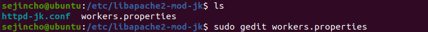

  

  - webserver apache에 apache-tomcat connector에 설정된 tomcat 으로 요청을 보내도록 설정 (별명 사용)

  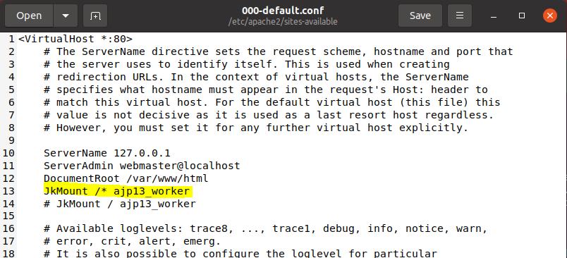

  

  - tomcat에서 특정 port와 특정 protocal로 오는 요청을 받으라고 설정

  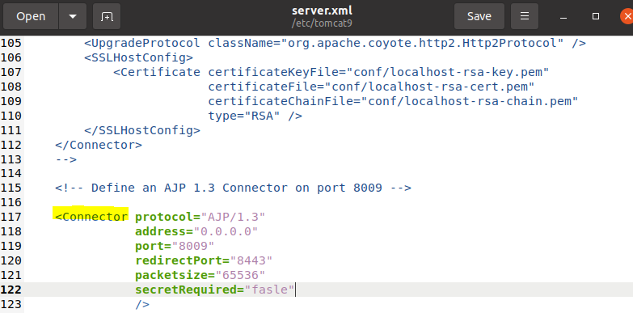

#### web server(ip1), was(ip2)

- 새로운 우분투(sejincho)를 만들어서 tomcat9를 설치

- apache가 깔려있는 곳(sejincho)에서 설정

  - /etc/libapache2-mod-jk/workers-properties 에서 sejincho2의 ip

  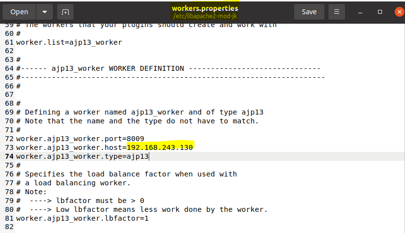

  

  - sejincho2의 /etc/tomcat9/server.xml 수정

  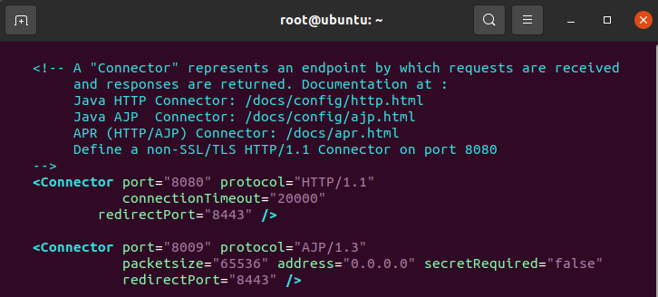

  

  

- http://192.168.243.130:8080/로 들어가서 다음과 같은 페이지가 나오면 된다.

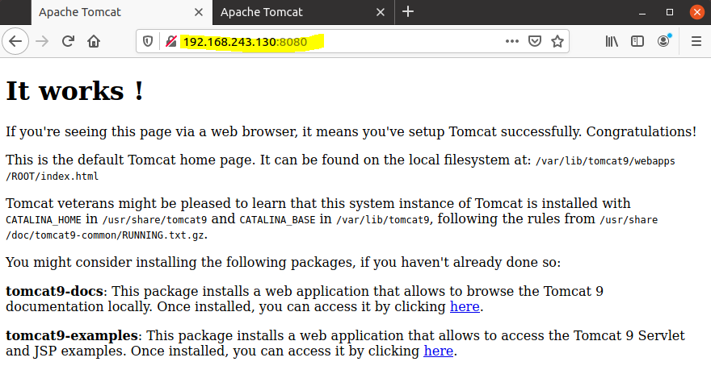

#### web server1(ip0) - was1(ip1, port1), was(ip2, port2) -> 다른 app

- **우분투 추가 (sejincho3) - tomcat 설치** 

- **web service의 workers.properties 수정**

  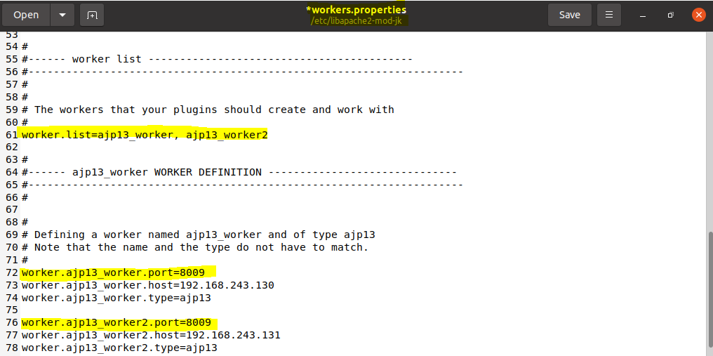

  

- **000-default.conf 수정**

  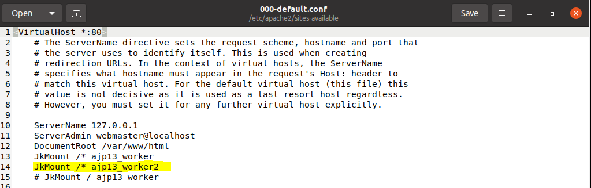

  

  

#### web server1(ip0) - was1(ip1, port1), was(ip2, port2) -> 같은 app

- **loadbalancer** 

- **web service의 workers.properties 수정**

  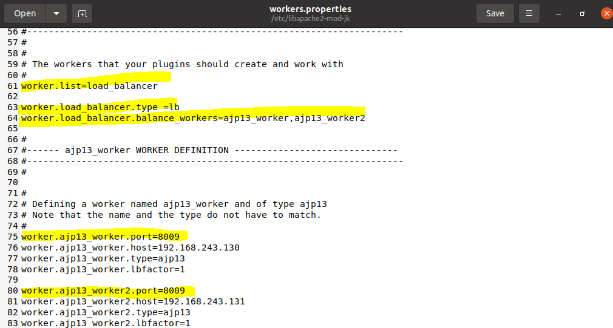

  

- **000-default.conf 수정**

  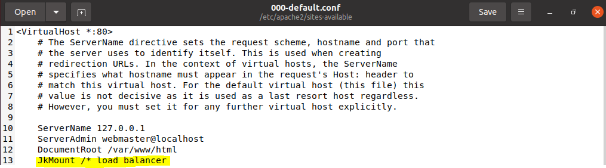

  

  

#### WAR 직접 만들어서 deploy

- eclipse에서 war 제작

  - Dynamic Web Project 생성

  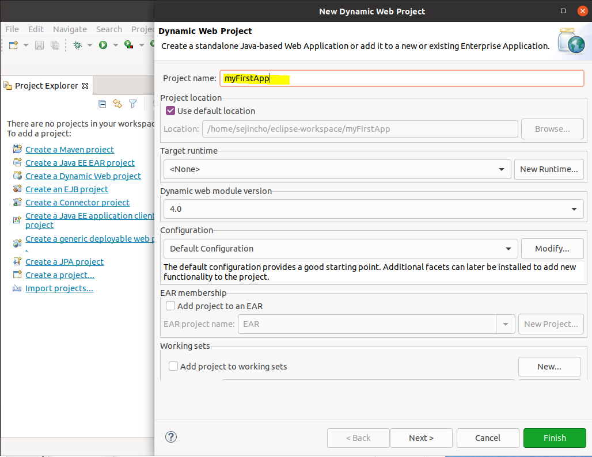

  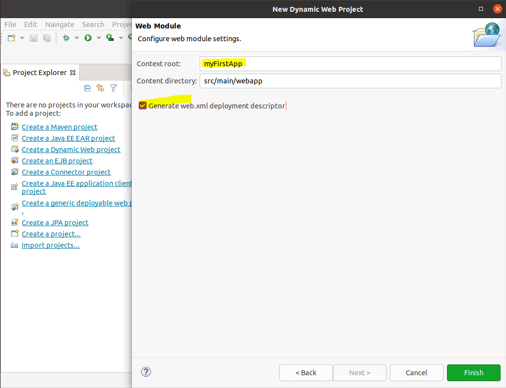

  
