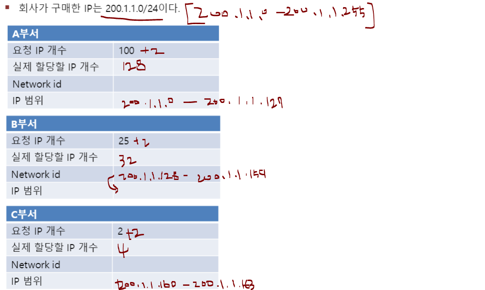

#### 네트워크 구성

- 공유기를 통해서 새로운 네트워크를 만들고 새로운 ip를 할당 받는다. 
  - 기본적으로 같은 네트워크에 묶여있다고 표현한다. 같은 네트워크에 묶여있으면 서로 통신이 가능하다. 그리고 기본적으로는 다른 네트워크면 통신을 막아놨다. 

#### 네트워크 정보 파악

- 설정된 네트워크 환경 
  - 호스트 OS에는 가상 IP  192.168.111.1이 자동으로 할당 
    - 호스트 OS에는 실제로 사용하는 별도의 IP 주소 존재 
    - 윈도우에게도 같은 그룹으로 묶을 수 있게 ip를 하나 할당한다. 즉, 윈도우는 여러 개의 ip를 가질 수 있고 ip 중 아무거나 들어가도 접속이 가능하다. 
  - 192.168.111.2는 게이트웨이와 DNS 서버 역할을 모두 하는 가상 장치의 IP 주소 
  - 192.168.111.254는 DHCP 서버 역할을 하는 가상의 주소 
  - Server, Server(B), Client는 모두 자 동으로 IP를 할당받도록 설정됨 
  - 이 IP 정보는 가상 DHCP 서버 (192.168.111.254)에서 할당받음

- **네트워크 관련 정보**
  - 가상머신에 인터넷을 연결하려면 각 가상머신에 네트워크 관련 정보를 입력해야 함
  - 네트워킹이 정상적으로 이루어지려면 각 가상머신(게스트 OS)에 IP 주소, 서브넷 마스크 (subnet mask), 게이트웨이(gateway) 주소, DNS(Domain Name System) 서버 주소 입력

-  **VMWare 네트워크 정보 확인**

  - 윈도우에서 ‘cmd’로 명령 프롬프트가 실행, ipconfig 명령 실행
    - 윈도우 기본 ip는 192.168.217.242이다.
  - ‘Vmware Network Adapter VMnet8’ 부분 확인
    - VMware가 준 ip
    - vmware는 디폴트로 2개의 ip를 할당해준다. 현재 사용하고 있는 네트워크는 VMnet8이다.

  

- 가상머신에서 게이트웨이 정보 확인
  - ip route
- 현재 설정된 DNS 서버의 정보 학인
  - systemd-resolve --status ens32

#### 네트워크 용어

- **IP 주소**

  - 네트워크상에 연결된 컴퓨터를 유일하게 구분하는 번호 체계
  - 각 8 bit 씩 4개의 번호로 이루어짐
  - 8 bit = 2^8 = 256
  - 네트워크를 나타내는 네트워크 id와 호스트를 나타내는 호스트 id로 구분된다. 
    - 네트워크 id가 같으면 같은 네트워크로 묶여 있는 것임
    - 뒤에 8비트만 호스트 id이다.
  - Ex) Server의 IP 주소는 192.168.111.141,  모든 컴퓨터에서 자기 자신을 의미하는 IP 주소는 127.0.0.1

  

- **네트워크 주소**
  - 여러 네트워크 중에서 해당 네트워크를 구분할 수 있는 대표주소
  - 해당 네트워크의 가장 앞 주소
  - 컴퓨터 4대의 IP 주소를 보면 앞의 세 자리가 ‘192.168.111’로 같고 뒤의 한 자리만 다름
  - 이 4대의 컴퓨터는 같은 네트워크에 있고, 서브넷 마스크는 공통으로 C 클래스(255.255.255.0)를 사용 → 이 경우 네트워크 주소는 192.168.111.0

- **브로드캐스트 주소**
  - 해당 네트워크의 모든 컴퓨터가 수신하는 주소
    - 해당 네트워크에 연결된 모든 컴퓨터에게 데이터를 보내야하는 경우 맨 마지막 주소를 입력하면 모든 컴퓨터에게 전송을 하는 방식
  - 해당 네트워크의 가장 마지막 주소
  - Ex) 그림의 브로드캐스트(broadcast) 주소는 192.168.111.255

- **게이트웨이**
  -  내부 네트워크를 외부와 연결하기 위한 컴퓨터 또는 장비
  - 인터넷을 사용하기 위해 외부 네트워크에 접속하려면 게이트웨이의 IP 주소를 알아야 함
  - 게이트웨이에는 내부로 향하는 문(네트워크 카드)과 외부로 향하는 문(네트워크 카드)이 있 어야 함 → 네트워크 카드가 2개 장착되어야 함
  - 게이트웨이 주소는 VMware에서 제공하며 192.168.○○○.2로 고정되어 있음

- **클래스**
  - A클래스는 하나의 네트워크에 256 * 256 * 256개의 컴퓨터가 들어갈 수 있다.
  - C클래스 안에는 256개의 컴퓨터가 들어갈 수 있다(8비트의 개수만큼)
  - 사설 IP는 private
  - 첫번째 앞의 8bit로 외우는게 더 편하다

- **서브넷 마스크**

  - IP 주소의 네트워크 아이디와 호스트 아이디를 구분하기 위한 것
  - 같은 클래스 안에서 같은 네트워크를 가진 더 작은 그룹으로 나누기 위한 것
  - 넷마스크로 네트워크의 규모가 결정됨 
  - 사설 네트워크에서 C 클래스를 사용하기 때문에 넷마스크가 255.255.255.0
  - 실제로는 256개의 IP 주소(192.168.111.0~192.168.111.255) 사용 가능
  - 이중에서 네트워크 주소인 192.168.111.0, 브로드캐스트 주소인 192.168.111.255, 게이트웨 이로 사용할 IP 주소(실습에서는 192.168.111.2)를 제외하면 253대의 컴퓨터를 네트워크 내 부에서 연결 가능
  -  Prefix
  - 서브넷 마스크를 통해서 네트워크를 나눈다.

  

- **Subnet 필요성**
  - 더 작은 network 필요 - Class로만 구분하기에는 너무 단위가 크다.

- **Subnet prefix** 

  - 네트워크 아이디와 호스트 아이디를 구분하기 위하여 사용한다.
  - Subnet mask와 동일한 기능
  - Subnet mask의 1인 bit의 갯수를 나타낸다.
  - /숫자 로 표기

  

- **Maximum Subnet**
  - 2^(32-prefix) - subnet으로 구하기
    - 32는 최대 prefix가 32개이므로

- **실습**

  

  

  
  
- subnet 주소가 열려있는 곳부터 사용이 가능하다.
    - 즉 브로드캐스트는 172.3.31.255이다.

  

  

  - 연습 

    https://btyy.tistory.com/entry/NETWORK-6%EC%9D%BC%EC%B0%A8-IP-%EC%A3%BC%EC%86%8C-%ED%8A%B9%EC%A7%95-%EA%B3%B5%EC%9D%B8-IP-%EC%82%AC%EC%84%A4-IP-%EC%84%9C%EB%B8%8C%EB%84%B7%ED%8C%85

    

  - **subnet  나누기** 

    P회사에네트워크를구축하려한다.3개의부서가아래와같은ip요청이있을때,향후를위하여효율적으로서브네팅을해보아라.

    - 회사가 구매한 IP는 200.1.1.0/24이다.

    
  
    

- **호스트 이름과 도메인 이름** 
  - 호스트이름(host  name)은 각각의 컴퓨터에 지정된 이름
  - 도메인이름(domain  name) 또는주소는hanbit.co.kr과 같은 형식으로 표기
  - Ex) 호스트 이름이 cookbook이고도 메인 이름이hanbit. co.kr이라면 전체 이름(FQDN,  Fully Qualified  Domain Name)은 cookbook.hanbit.co.kr 이 됨
  - 같은회사(도메인)에서 cookbook.hanbit.co.kr이라는 호스트(컴퓨터)는 유일

#### WAN & LAN

- **WAN(Wide Area Network)**
  - 중대형 영역의 네트워크 연결
  - 지역간/국가간 네트워크 연결
  - 장치: 라우터(L3)

- **LAN(Local Area Network)**

  - 작은 영역의 네트워크 연결
  - 네트워크의 최소 단위(사이즈는 다양)
  - 장치 : 허브, 스위치(L2)

  

  

- Layer 2  은LAN, Layer 3은WAN임

#### 스위치와 허브

- 같은 네트워크 안의 연결을 돕는 통신장치(외부망으로나가지못함)

- **허브**
  - 하나의 네트워크 라인에 여러 대의 컴퓨터를 분배하는 장치
  - 한 번에 하나의 컴퓨터에만 데이터 전송 가능
  - 멀티탭 같은 역할
  - 저가장비

- **네트워크 스위치(network switch)**
  - 허브와같은기능, 하나의 네트워크 라인에 여러 대의 컴퓨터를 분배하는 장치
  - 높은 데이터 전송대역으로, 허브보다 향상된 네트워크 속도를 제공
  - 처리 가능한 패킷의 숫자가 크고, 송신과 수신이 동시에 일어남
  - 동시에 여러 컴퓨터로 데이터를 전송 가능
  - 허브보다 고가 장비

#### 라우터

- 서로 다른 network를 연결해주는 장지
- L3 레벨 Network Layer를 담당하는 장치
- 데이터가 출발지에서 목적지까지 정확하게 이동할 수 있도록 연결해주는 장치
  - 데이터 안에 도착 router가 적혀 있음
- 다양한 사용
  - 가정용 : 유무선 공유기
    - 가정용 내부 network를 만듦
  - 기업용
    - 기업용 내부 망을 만듦

--------

#### 방화벽 설정

- **방화벽 설정**
  - 방화벽 기능을 설정-특정포트를접속가능/불가능하게 할 수 있다.
  - 보안을 위하여 외부에 서비스를 제공할 때 필요한 포트만 열어주는 방식으로 사용할 것
  - 텍스트 기반 방화벽 설정 - ufw
    - ufw allow 80

#### 서비스(데몬) 설정

- **서비스란? 데몬이란?**
  - OS에서 해당 서비스를 제공해주려고 대기 중인 모듈
  - Network daemon, web server daemon 등등

- **서비스(데몬) 설정 : 서비스(데몬)의 시작, 중지, 재 시작 및 사용 여부 설정**
  - command
    - systemctl status(restart/stop/start) 서비스 이름

#### NAT(Network Address Translation)

- 네트워크 주소 변환
- IP 패킷에 있는 출발지및목적지의IP 주소를바꿔재기록하면서네트워크트래픽을주고받게하는기술

- 장점

  - IP 주소절약
    - 하나의 공인 IP를 사용하여 여러 대의 호스트가 인터넷에 접속할 수 있다.
    - 예) 집에 외부IP 하나만 있고, 내부의 많은 기기들이 내부 IP를 사용하여 인터넷 통신할 수 있다.

  - 보안
    - NAT 동작 특성상 내부의 IP를 숨길 수 있다.
    - 예) 라우터를 통해서 나가는 내부ip는 외부에 노출이 되지 않기 때문에, 안쪽의 ip로 직접 공격할 수 없다. 

#### Port Forwarding

- 컴퓨터 네트워크에서 패킷이 라우터나 방화벽과 같은 네트워크 게이트웨이를 가로지르는 동안 하나의 IP 주소와 포트 번호 결합의 통신 요청을 다른 곳으로 넘겨주는 네트워크 주소 변환(NAT)의 응용
- 이기법은 게이트웨이(외부망)의 반대쪽에 위치한 보호/내부망에 상주하는 호스트에 대한 서비스를 생성하기 위해흔히 사용
- 통신하는 목적지IP 주소와 포트 번호를 내부 호스트에 다시 매핑함으로써 이루어 진다.
  - 아래 그림처럼 포트 번호가 달라도 된다.

