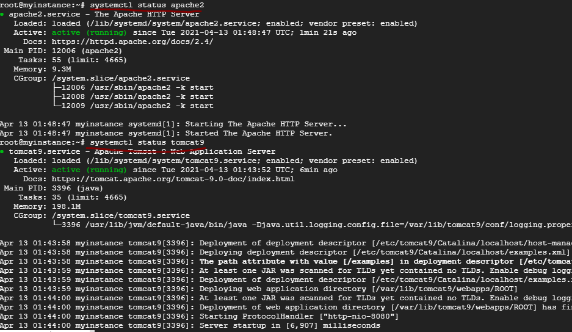
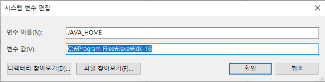

#### Cloud

- 클라우드 이전
  - was는 failover를 지원한다.
    - Failover란?
      - 
    - was끼리 그룹핑을 하고 그 그룹 안에서는 failover를 지원하도록 한다. 
      - was끼리 클러스터링을 진행(같은 어플끼리 클러스터로 묶는다. )

  

  - WAS 중에 하나는 다른 WAS들을 관리하는 역할을 한다. (매니저 역할을 하는 DAS(Domain Admin Server)가 있다.)
    - DAS안에 여러개의 Cluster가 있고 그 안에 여러개의 MS가 있다. 

- 클라우드 서비스의 종류
  - Infrastructure as a Service(IaaS, 아이아스, 이에스) 
    - 개발사에 제공되는 물리적 자원을 가상화 한다. 
  - Platform as a Service(PaaS, 파스)
    - 여기서 플랫폼은 웹, WAS, DB 등을 의미한다.
    - 개발사에 제공되는 플랫폼을 가상화 한다.
  - Software as a Service(SaaS, 사스)
    - 고객에게 제공되는 소프트웨어를 가상화 한다.

- Private / Public Cloud
  - public
  - private

#### 구글 클라우드 

- 가입

  https://cloud.google.com/gcp/?hl=ko&utm_source=google&utm_medium=cpc&utm_campaign=japac-KR-all-ko-dr-bkws-all-all-trial-e-dr-1009882&utm_content=text-ad-none-none-DEV_c-CRE_205812439628-ADGP_Hybrid%20%7C%20BKWS%20-%20EXA%20%7C%20Txt%20~%20GCP%20~%20General_cloud%20computing%20-%20cloud-KWID_43700061085501429-kwd-300427730551&userloc_1030724-network_g&utm_term=KW_%EA%B5%AC%EA%B8%80%20%ED%81%B4%EB%9D%BC%EC%9A%B0%EB%93%9C&ds_rl=1005428&gclid=Cj0KCQjw38-DBhDpARIsADJ3kjnNJ16MnICWt3ORGTWzZSg42JD3o926f_Px36pCoWC47z5PQiat-AAaAkVxEALw_wcB&gclsrc=aw.ds

  

  

  

- 구글 클라우드

  - 대시보드

  

  

  - VM 인스턴스 만들기

    - VM 인스턴스

    

    

    

    

    - apache, tomcat을 여기서 설치할 수 있다.

    

    

  - 방화벽 세부정보 확인

    

    

    

    

    

    

  - 방화벽 만들기(수신 송신 모두 생성해야 한다.)

    

    

    

    

    

    

    

    

  - tomcat 설치

    - apt-get update

    

    

    - tomcat install 

    

    

    - apache2 설치

    

    

    - 톰캣과 apache 상태 확인

    

    

    - 서버 동작 확인

    

    

    - 설치 확인

    

    

    

    - apache와 tomcat을 연결하는 connector 모듈 install

    

    

    - apache-tomcat connector에 tomcat들의 별명을 지어주고, 정보를 설정

    

    - webserver apache에 apache-tomcat connector에 설정된 tomcat 으로 요청을 보내도록 설정

    

    - WAS tomcat에 특정 port와 특정 protocol로 오는 요청을 받으라고 설정

    

-----------

#### 오라클 웹로직 

- 다운로드

  https://www.oracle.com/middleware/technologies/fusionmiddleware-downloads.html

  

  

- JDK 다운

  https://www.oracle.com/java/technologies/javase-jdk16-downloads.html

  - 환경 변수 설정

  

  

  

- 설치 명령어 (cmd는 관리자 권한으로 실행해야함)

  

  

  

  

  

  

  

  ​	

  

  

  

  

  

  

  - 완료 버튼을 누르면 Configuration Wizard가 실행된다. 

  

  

  

  

  - 관리자 계정 생성

  

  

  - 도메인 모드는 개발을 체크하고 JDK 기본값을 사용

  

  

  

  

  

  

  

  

  
  

  
- C:\Oracle\Middleware\Oracle_Home\user_projects\domains\base_domain\startWebLogic.cmd 입력
    - 새롭게 생성한 도메인 위치 

  

  
  
  - http://localhost:7001/console 
  
  

- **Oracle Weblogic 서버에 application 배포**

  - 배치 버튼 클릭

  

  

  - 설치 버튼 클릭

  

  

  - 올릴 war 파일을 선택

  

  

  

  

  

  

  - 완료 버튼 클릭

  
