#### Domain Name System

- **개념**

  - 도메인 네임을 IP 주소로 변환시켜 알려 주는 역할 

    - Domain Name : 컴퓨터의 ip주소를 사람이 기억하기 쉽게 단어로 부름

      ex) www.naver.com → 120.50.132.112

- DNS 역사

  - 1) 가장 초기의 네트워크 접속 방법
    - 컴퓨터가 몇 대 안 됨
    - 사용자가 모두 외워서 직접 IP주소로 접근함

  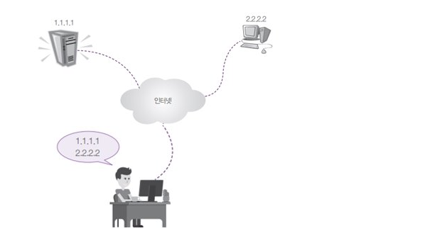

  

  - 2) hosts 파일을 이용하여 네트워크 접속

    - 인터넷에 연결된 컴퓨터가 수십 ~ 수백대로 늘어남

    - 'hosts' 파일에 URL과 IP주소를 기록해 놓는 방식 사용

      ex) 102.54.94.97 naver.com

      - window : C:\Windows\system32\drivers\etc\hosts
      - Linux : /etc/hosts

   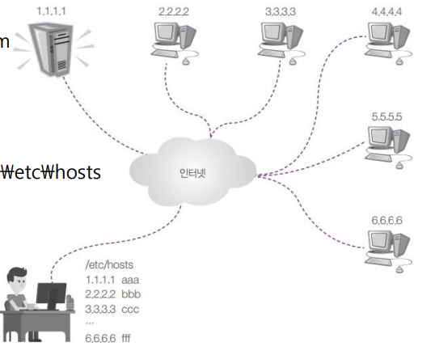

  

  - 3) 네임 서버를 이용하여 네트워크 접속
    - 기하급수적으로 늘어나는 네트워크 상의 컴퓨터에 대한 모든 IP 정보를 파일 하나에 기록하는 것은 무리
    - 이름 해석(Name Resolution)을 전문적으로 해 주는 서버 컴퓨터가 필요해짐 (=DNS 서버 = 네임 서버) 
    - 네임 서버는 인터넷에서 변화하는 모든 컴퓨터의 URL과 IP 정보를 실시간 제공
    - 사용자는 URL만 외우면, ip주소를 몰라도 된다.

  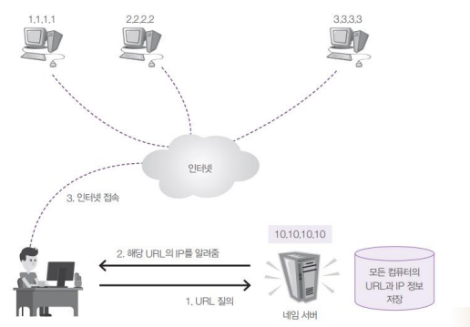

#### **실습**

- Domain name으로 ip 찾기

  - nslookup

  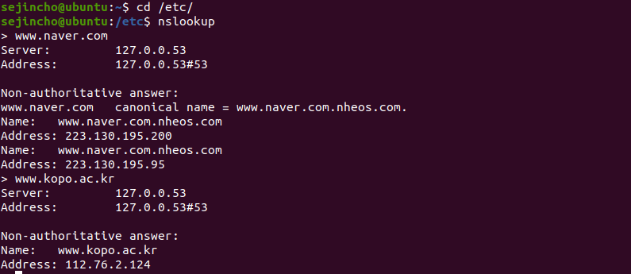

- /ect/hosts 파일 수정

  - 이 파일을 먼저 확인하고 여기 없으면 DNS에 물어보는 순서
  - Domain name과 ip를 바꿔보기(다음과 네이버)

   

  

  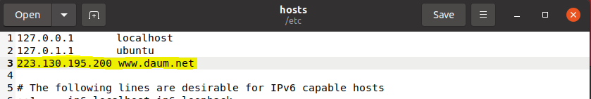

  

  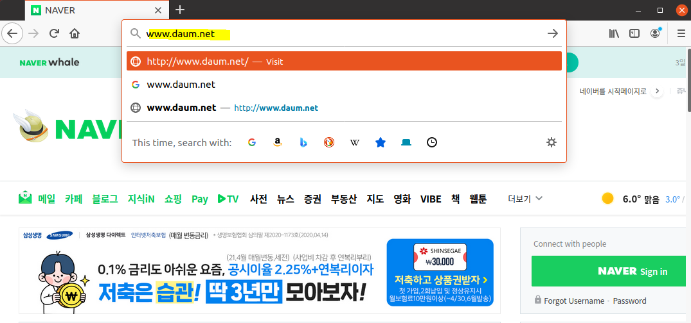

#### IP 주소를 얻는 내부 흐름

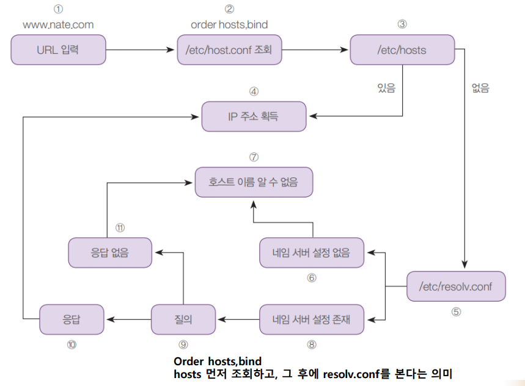

#### 도메인 이름 체계

- 초창기 인터넷에서는 1대의 네임 서버만으로도 충분히 IP주소와 이름의 관리가 가능
- 하지만 인터넷이 폭발적으로 확장되면서, 몇 대의 네임 서버로는 실시간으로 인터넷 상의 수많은 컴퓨터들을 관리할 수가 없게 되었음
- 그래서 트리 구조와 같은 ‘도메인 이름 체계’를 고안함

#### 로컬 네임 서버가 작동하는 순서

- PC가 사용하는 네임 서버가 /etc/resolv.conf 파일에 “nameserver IP주소”로 설정되어 있는데, 
  이 네임 서버를 로컬 네임 서버라고 부름​
- 그래서 www.nate.com의 IP주소를 요구하면 이 로컬 네임 서버에 질문을 함
- 로컬 네임 서버가 혼자서 모든 컴퓨터 도메인 이름을 관리할 수는 없기 때문에, 다음처럼 동작

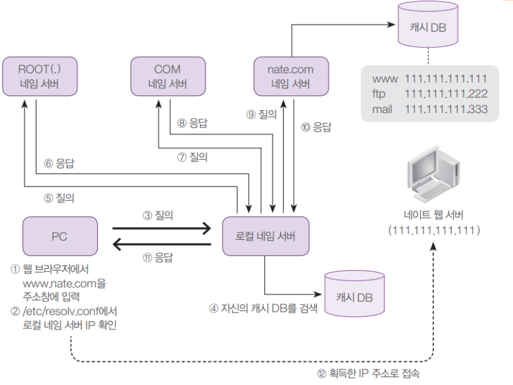

#### 실습

- DNS 서버 변경하기

  - 인터넷이 잘 되는지 [Firefox 웹 브라우저]를 클릭해서 확인
  - nm-connection-editor 명령 입력

  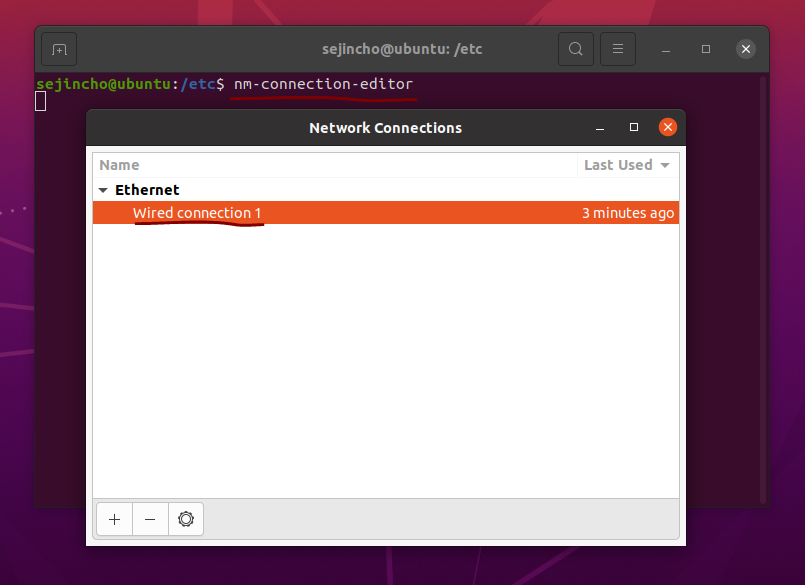

  

  - 구글이 지원하는 DNS 서버인 8.8.8.8을 입력하고 Gateway와 address를 수정해본다.

  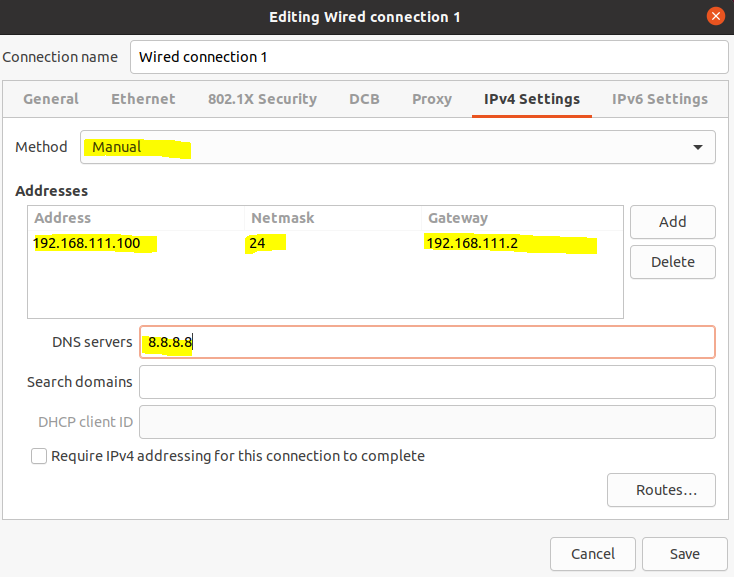

  

  - 리눅스를 재부팅 한 후 수정된 정보 확인

  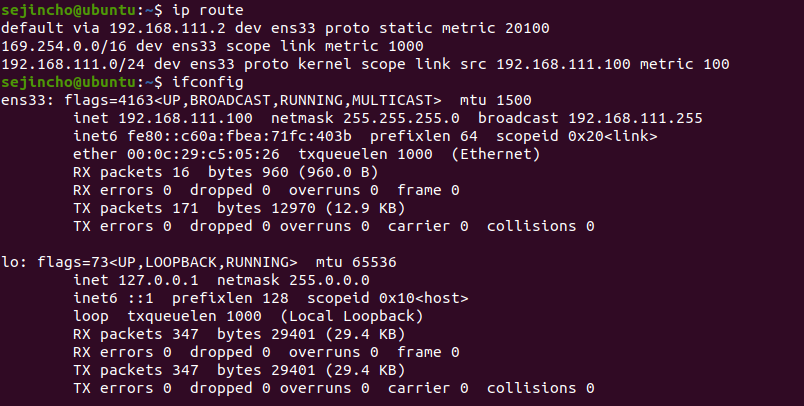

  

  - 잘못된 DNS 주소인 ‘100.100.100.100’을 입력하고 저장한 후 [네트워크 연결] 창 닫기      

  

  - DNS 서버가 고장 나거나 주소를 잘못 입력한 경우 서버가 응답하지 않음

  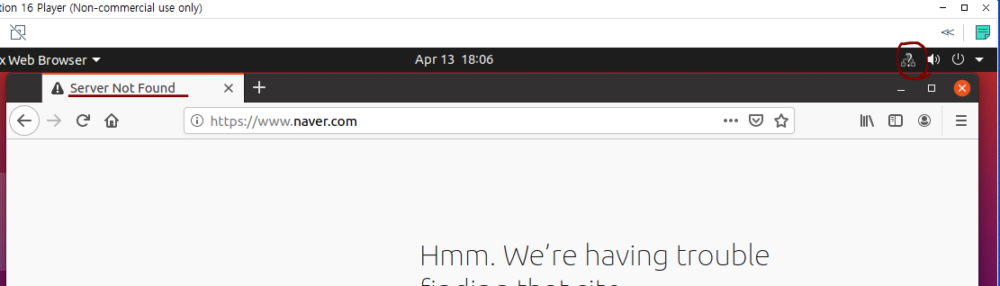

  - 만약 systemd-resolved 데몬이 돌고 있으면 종료시킨다.

  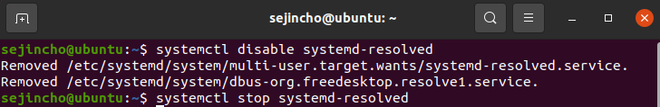

  

  - dns=default 추가

   

  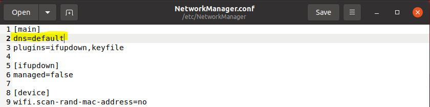

  

  - DNS 서버가 설정되어 있는 resolv.conf 파일을 다음 명령으로 삭제
    - network-manager 서비스를 시작하여 DNS가 100.100.100.100인 것을 확인
    - Network-manager를 재시작하면서 resolv.conf 새로 생성

  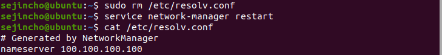

  - 웹 브라우저를 실행하면 다시 접속을 실패한다. nslookup을 입력했을 때 Default server가 100.100.100.100으로 나오는데 이 주소는 잘못된 주소이다. 그래서 정상 작동하는 구글의 8.8.8.8을 이용해본다. 
    - 그리고 reboot

  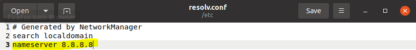

  

  - 영구 설정을 위해

  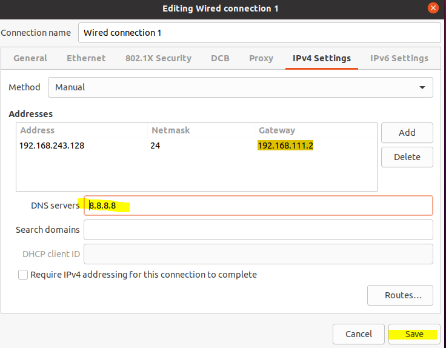

