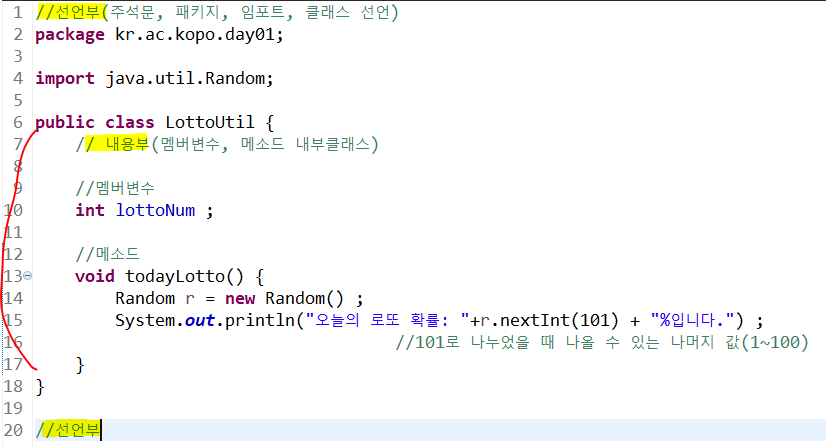
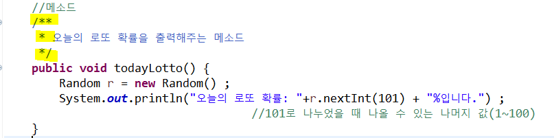
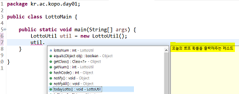
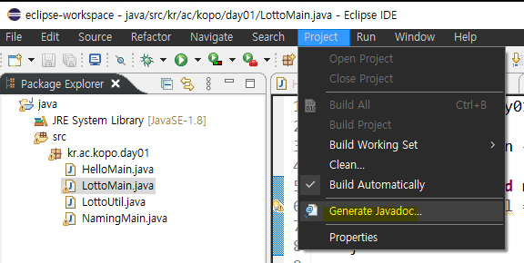
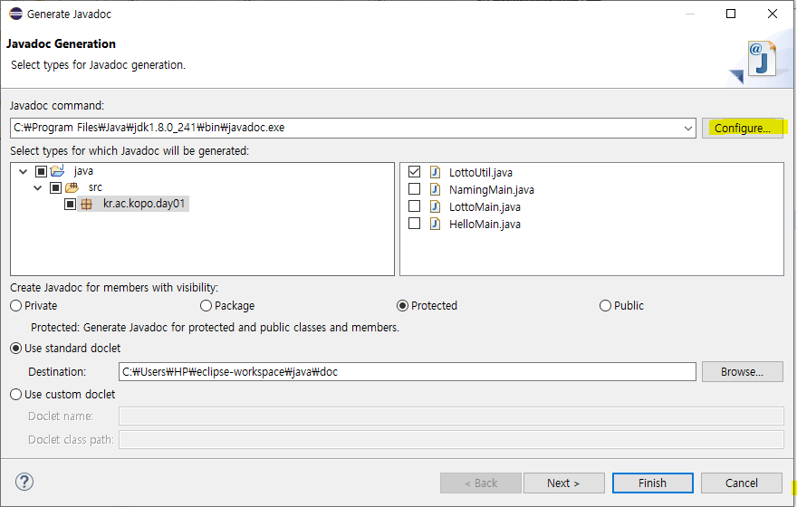
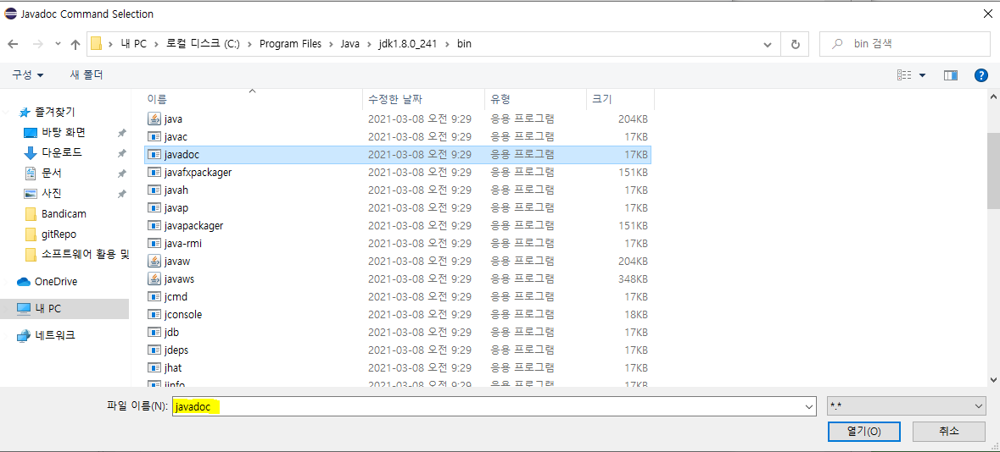
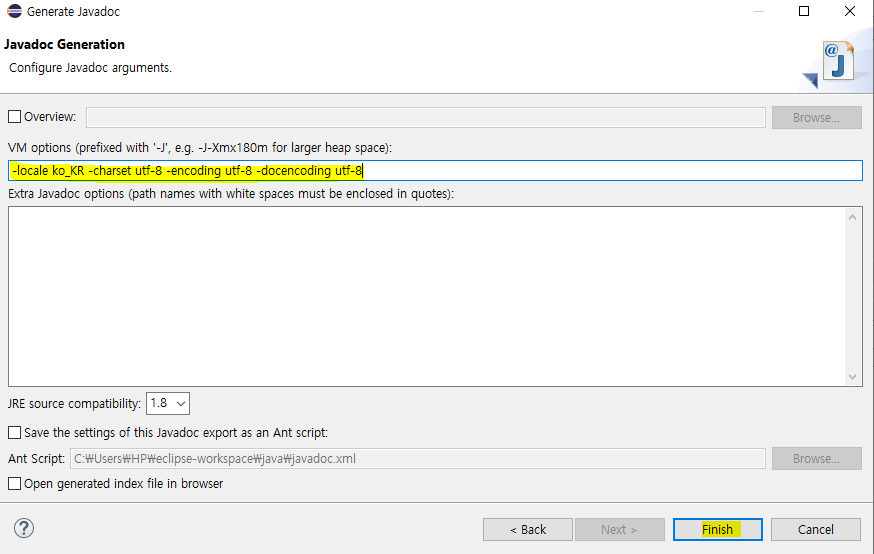
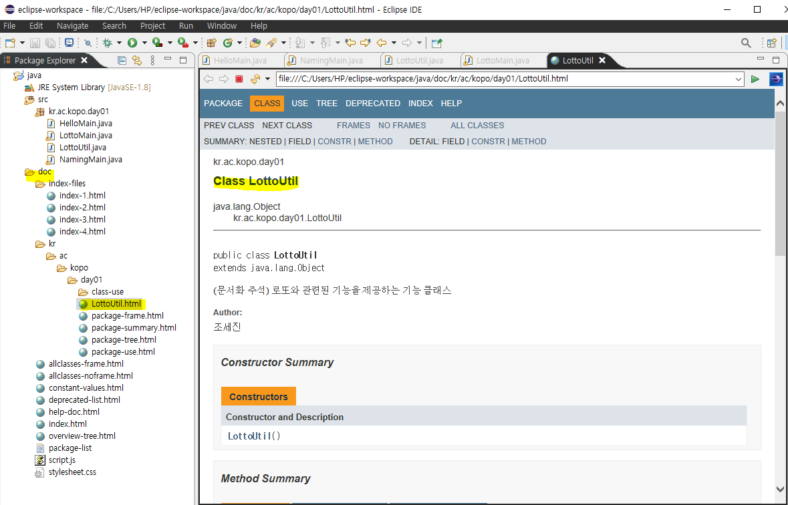
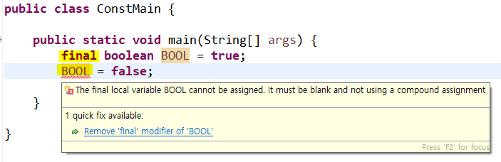

### 소프트웨어 활용 및 코딩

------------------

- 자바 디자인패턴 공부하기!!

#### 자바

- 자바의 특징
  - C언어는 플랫폼에 독립적이지 않아서  리눅스에서 돌리지 못한다. 그리고 교차사용이 불가하다 그러나 자바는 윈도우, mac 등 어떤 곳에서 개발하든 동일하게 동작한다. 
  - 자바는 컴파일러, 인터프리터 2개의 단계를 거친다.
  - WORA(Write Once Run Aniwhere, 어디서든 실행가능하게 한다.)

- 컴파일러와 인터프리터

  - 컴파일러(Compiler)

    컴파일러는 사람이 소스코드를 작성하면 그 소스코드를 한 번에 번역한다. 그래서 줄 단위로 번역을 진행하는 인터프리터에 비해 번역 시간이 오래 걸리고 과정이 복잡하다 하지만 한 번 번역을 하면 실행파일(목적파일)이 생성되어 메모리를 사용하지만 다음에 실행할 때는 이 파일만 실행하면 되기 때문에 실행 시간은 인터프리터에 비해서 빠르다. 컴파일러는 한 번에 번역을 하고 실행하기 때문에 프로그래머가 코딩을 하다가 오류를 작성했을 때 전부 작성을 하고 실행파일을 만들어서 실행해봐야 알 수 있다. 개발자의 입장에서는 인터프리터가 조금 더 유리하다고 할 수 있다.

  - 인터프리터(Interpreter)

    한 줄 한 줄 줄단위로 번역과 실행을 진행하기 때문에 번역시간은 빠르지만 실행시간은 느리고 직접 실행하기 때문에 실행파일을 생성하지 않아 메모리는 사용하지 않는다. 그리고 줄 단위로 번역과 실행을 진행하기 때문에 중간에 문제 있는 코드를 만난 경우 그 줄 아래는 실행되지 않는다. 

  - 그러면 개발자는 인터프리터를 사용하는 것이 좋은가? 아니다. 인터프리터의 경우 웹에서 많이 사용되는데 그 이유는 컴파일러로 웹을 작성할 경우 중간에 오류를 유발하는 코드를 작성했거나 유지보수 하는 도중에 치명적인 오류를 발생하는 코드를 집어넣는다면 그 웹은 아예 작동이 되지 않고 사용자가 볼 수 없게 된다. 하지만 인터프리터를 사용하면 일정 부분이 오류를 내도 그 전까지는 작동이 되기 때문에 컴파일러에 비해서 손실을 줄일 수 있다고 생각한다. 그리고 어디서 오류가 났는지 바로 확인할 수 있기 때문에 유지보수가 유리하다고 생각된다. 그렇다고 인터프리터가 항상 좋은 것은 아니다. 실행 속도가 느리기 때문에 퍼포먼스를 중요시한다면 컴파일러를 적용하는 것이 좋다.


- 컴파일러와 인터프리터의 차이 요약

|                                | 컴파일러        | 인터프리터      |
| ------------------------------ | --------------- | --------------- |
| 번역단위                       | 전체            | 한줄            |
| 실행속도                       | 상대적으로 빠름 | 상대적으로 느림 |
| 번역속도                       | 상대적으로 느림 | 상대적으로 빠름 |
| 목적 파일(실행 파일) 생성 유무 | 생성            | 생성 안 함      |
| 메모리 할당                    | 할당 받음       | 사용 안 함      |


- 접근제한자 : public, private, default


- api 설명

  https://docs.oracle.com/javase/8/docs/api/index.html


#### 클래스의 구조

- 선언부와 내용부

  - 선언부: 주석문, 패키지, 임포트, 클래스 선언
  - 내용부: 멤버변수, 메소드, 내부클래스

  

  


#### 문서화 주석

```java
/**
 *
 *
 */
```



- 사용시 내용 확인 가능




----------

#### 자바 Doc 생성

- Project > Generate Javadoc




- Configure 선택




- jdk > bin > javadoc.exe 폴더 경로 선택 후 Next 버튼 클릭




- VM options에 다음 입력 > Finish

```
-locale ko_KR -encoding UTF-8 -charset UTF-8 -docencoding UTF-8
```




- 생성된 doc 폴더에서 적은 문서화 주석을 확인할 수 있음 




-------------

#### 변수

- 8bit = 1byte
  - bit : 메모리에 있는 이진수 한 자리(컴퓨터가 이해할 수 있는 단위)
  - byte : 개발자가 이해할 수 있는 단위
  - 0 ~ 255(unsigned)
  - -128 ~ 127(signed) : 자바는 signed만 사용


#### 자료형

| 타입   | 세부타입 | 데이터형 | 크기  | 기본값       | 사용예           |
| ------ | -------- | -------- | ----- | ------------ | ---------------- |
| 논리형 |          | boolean  | 1bit  | false        | boolean b = true |
| 문자형 |          | char     | 2byte | null(\u0000) | char c = 'a'     |
| 숫자형 | 정수형   | byte     | 1byte | (byte) 0     | byte b = 100;    |
| 숫자형 | 정수형   | short    | 2byte | (short)0     | short s = 100;   |
| 숫자형 | 정수형   | int      | 4byte | 0            | int i = 100;     |
| 숫자형 | 정수형   | long     | 8byte | 0L           | long l = 100     |
| 숫자형 | 실수형   | float    | 4byte | 0.0f         | float f =3.1f    |
| 숫자형 | 실수형   | double   | 8byte | 0.0d         | double d = 3.1;  |


- 자료형의 크기 비교

byte < short < int < long < float < double < char < int <long < float < double


- 기본 자료형 참조 자료형의 차이

|            | 기본자료형          | 참조자료형                          |
| ---------- | ------------------- | ----------------------------------- |
| 변수값     | 실제 사용할 값      | 객체 참조값                         |
| 정의방식   | Java 내부 이미 정의 | 클래스, 인터페이스, 배열, enum 등.. |
| 생성방식   | 19, 3.14, true, 'a' | new 키워드 활용                     |
| 초기화방식 | default             | 생성자                              |

- ex) String a = "hello" 변수가 저장될 때 변수 a는 hello가 저장된 메모리 공간의 주소값만 저장되어 있는 상태이므로 참조자료형이라고 부른다.
  - 이름을 가지고 있는 공간은 stack(변수명을 가지고 있는 메모리), 이름이 갖고 있지 않은 영역은 heap
  - a(참조변수) 변수에 "abcd"로 재할당하면 abcd의 공간이 따로 만들어지고 변수 a는 abcd의 주소값으로  update하는 것
  - heap 영역에 새롭게 공간을 만들기 위해(문자 저장 공간) new를 사용한다.
    - String a = new String("hello") 
    - new는 새로운 영역이 생성
  - heap에 있는 사용하지 않는 공간은 JVM 자체가 제어해서 알아서 청소한다. (가비지 콜렉터) 
  - https://yaboong.github.io/java/2018/05/26/java-memory-management/


------

#### 상수

- 변경될 수 없는 고정된 데이터

- 코드의 이해와 변겨잉 쉬움

- 분산된 상수로 인한 에러를 방지

- final을 이용해서 정의

  ex) int age ;  //변수 	final double pi = 3.14  //상수



- 명명규칙에 의해서 모두 대문자로 사용

```java
package kr.ac.kopo.day01;

/*
 * 상수 : 5가지
 * 1. 정수형 상수 : 10, 20, -678
 * 2. 실수형 상수 : 1.2, 3.45678
 * 3. 문자형 상수 : '3', 'A', 'm', '!', '가' (한글 한 글자인 경우는 문자)
 * 4. 문자열 상수 : "abc", "A"
 * 5. 논리형 상수 : true, false
 * 
 */

public class ConstMain {

	public static void main(String[] args) {
		System.out.printf("%c%c\n",'A','B');
		System.out.println('a'+10);
		System.out.println('A'+'B');
		final boolean BOOL = true;
		System.out.println(BOOL);

	}

 

}
```

<콘솔>

AB

107

131

true


- 문자열 상수

| 문자상수 | 내용          | 문자상수 | 내용   |
| -------- | ------------- | -------- | ------ |
| \n       | 줄넘김        | \ "      | " 표시 |
| \t       | 탭만큼 띄우기 | \ '      | ' 표시 |
| \ \      | \ 화면에 표시 |          |        |


- 자바는 유니코드 그러나 아스키코드 기반인 곳에서도 사용할 수 있도록 

  byte단위가 다른 언어와 대화하기 위해 만들어진 언어이다. 