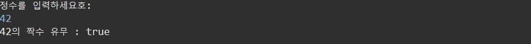

- 3/8 복습 키워드 

  아스키코드, 유니코드, Oak,  heap, stack, print(print, println, printf), sys-> java.lang package(jvm이 자동으로 load -> import없이 사용 가능), 주석(한줄, 여러줄, 문서화 주석), javac, 바이트 코드, java 실행파일, 컴파일러 인터프리터 같  이 사용, 컴파일된 바이트코드의 클래스 파일,  


#### 유니코드

- A=65, a=97 외우기

```java
package kr.ac.kopo.day02;

public class ConstMain02 {

	public static void main(String[] args) {
		char ch = 'A';
		
		//문자열+문자 = 문자열
		System.out.println("문자 : " + ch); //문자 : A 
		
		//(문자)유니코드로(2byte) 출력
		System.out.println('A' + 'B'); //131
		System.out.println("" + 'A' + 'B'); //AB
		
		ch = 65;
		System.out.println(ch); //'A'의 유니코드도 65이므로 전에 char로 설정했기에 A로 출력
		
		//유니코드로 입력
		ch ='\u0041'; //16진수의 형태로 써준다.(10진수: 65 -> 16진수: 41)
				//실제 2진수의 값을 빠르게 압축하기 위해서 8진수와 16진수를 사용
				//16진수는 1byte -> 2자리 , 2byte -> 4자리 
		System.out.println(ch);
		//utf-8  한글 하나를 3byte 
		//euc-kr  한글 하나를 2byte
		
		//만약 A의 유니코드 값을 print 하고 싶다면?
		//1. 
		int code = ch ; 
		System.out.println(code);
		//2. 형변환
		System.out.println((int)ch); 
	}
}
```


- UTF-8과 EUC-KR의 차이

https://m.blog.naver.com/PostView.nhn?blogId=junhwen&logNo=130080223604&proxyReferer=https:%2F%2Fwww.google.com%2F


----------

#### 형변환(기본자료형)

- 자료형의 크기 비교
  - byte < short < int < long < float < double
  - ​            char < int < long < float < double


- 명시적(Explicit Casting, 강제적) 형변환과 묵시적(Implicit Casting) 형변환
  - 묵시적 형변환은 크기가 큰 타입을 따라간다.

```java
package kr.ac.kopo.day02;

public class CastMain {

	public static void main(String[] args) {
		//크기가 큰 타입을 따라감(묵시적 형변환)
		System.out.println(10 + 20); //int
		System.out.println('A' + 20); //int (char<int)
		System.out.println(12.3 + 45); //double(12.3+(double)45)
		
		//명시적 형변환
		System.out.println((int)12.3 + 45);
        //소숫점을 지우고 더해줌
		
		double num = 12;
		int num2 = (int) 12.34;
		System.out.println(num2);
	}
}
```


--------------

#### 연산자

- 컴퓨터는 후위표현식으로 해석

- 산술연산자

| 연산자  | 사용법    | 설명                             |
| ------- | --------- | -------------------------------- |
| +, -, * |           |                                  |
| /       | op1 / op2 | op1을 op2로 나눈 몫을 구한다     |
| %       | op1 % op2 | op1을 op2로 나눈 나머지를 구한다 |


- 증감연산자
  - 속도는 선행처리가 더 빠르다.

| 연산자 | 사용법                         | 설명  |
| ------ | ------------------------------ | ----- |
| ++     | ++op(선행처리), op++(후행처리) | 1증가 |
| --     | --op(선행처리), op--(후행처리) | 1감소 |

```java
package kr.ac.kopo.day02;

public class OperationMain01 {

	public static void main(String[] args) {
		int num = 10;
		num += 1; // num = num + 1 
		System.out.println(num++);
		System.out.println(++num);
		System.out.println(--num);
		System.out.println(num);
		System.out.println(num--);
		System.out.println(num++);
	}
}
```


- 비교연산자
  - 결과는 true, false이 반환


- 논리연산자
  - 결과는 true, false로 반환
  - 교환법칙이 성립하지 않는다.


```java
package kr.ac.kopo.day02;

public class OperationMain02 {

	public static void main(String[] args) {
		int a = 1, b = -1, c = 0 ;
		boolean bool = ++a > 0 && ++b > 0 && ++c > 0;
		System.out.println("bool : "+ bool);
		System.out.println("a :"+ a + ", b: " + b + ", c: " + c);
	}
}
```


```java
package kr.ac.kopo.day02;

public class OperationMain02 {

	public static void main(String[] args) {
		int a = 1, b = -1, c = 0 ;
		boolean bool = ++a > 0 || ++b > 0 || ++c > 0;
		System.out.println("bool : "+ bool);
		System.out.println("a :"+ a + ", b: " + b + ", c: " + c);
	}
}
```


```java
package kr.ac.kopo.day02;

public class OperationMain02 {

	public static void main(String[] args) {
		int a = 1, b = -1, c = 0 ;
        //교집합의 우선순위가 더 높다. ( a++ > 0 || (b++ >= 0 && c++ > 0) )
		//a++ > 0 가 true이므로 뒤에는 확인하지 않는다.
        boolean bool = a++ > 0 || b++ >= 0 && c++ > 0;
		System.out.println("bool : "+ bool);
		System.out.println("a :"+ a + ", b: " + b + ", c: " + c);
	}
}
```


```java
package kr.ac.kopo.day02;

//자동import Ctrl + Shift + o
import java.util.Scanner;

public class OperationMain03 {
/*
 * 정수를 입력하세요 : 12
 * 12의 짝수 유무 : true
 * 
 * 정수를 입력하세요 : 5
 * 5의 짝수 유뮤 : false
 */
	public static void main(String[] args) {
		//키보드를 통해서 입력받음
		Scanner sc = new Scanner(System.in);
		
		// "정수를 입력하세요: " 문장을 출력
		System.out.println("정수를 입력하세요호: ");
		
		// 키보드로 정수를 입력
		int num = sc.nextInt();
		
		// 결과를 출력
		boolean result = (num > 0 && num % 2 == 0) ; //0보다 커야하므로 논리연산자 사용
		System.out.println(num + "의 짝수 유무 : " + result);
	}
}
```




- 3항 연산자

```java
조건식 ? 수식-1 : 수식-2 ; 
//수식-1 : 조건식의 결과가 true 일 때 수행되는 식
//수식-2 : 조건식의 결과가 false 일 때 수행되는 식
```

ex) System.out.println(a>b ? a : a<b ? b : 0);


-------------

#### 조건식

- if ~ else if ~ else

```java
package kr.ac.kopo.day02;

public class IFMain01 {

	public static void main(String[] args) {
		int a = 10, b = 5;
		System.out.println("MAX : " + (a>b?a:b));
		
		//ctrl+shift+f : 자동 줄맞춤
		if (a > b) {
			System.out.println("MAX : " + a);
		} else {
			System.out.println("MAX : " + b);
		}	
		/* {}를 생략 가능 if가 1개일 때는
		if (a > b)
			System.out.println("MAX : " + a);
		else {
			System.out.println("MAX : " + b);
		}
		*/	
		/*
		 * a가 b보다 크다면 a 출력
		 * a가 b보다 작다면 b 출력
		 * a와 b가 같다면 0 출력
		 */
		//첫 번째
		System.out.println(a>b?a:(a<b?b:0));
		
		//두 번째
		if(a>b) {
			System.out.println(a);
		} else if(a<b) {
			System.out.println(b);
		} else {
			System.out.println(0);
		}
		
		//세 번째
		if (a>b) {
			System.out.println(a);
		}else {
			if(a<b) {
				System.out.println(b);
			}else {
				System.out.println(0);
			}
		}
	}
}
```


- switch문 
  - 실수형 불가능 
  - break를 사용하지 않으면 그 아래의 case들도 모두 실행하게 된다.
  - default 같은 경우는 case가 모두 실행되고나서 실행이 된다. 그래서 default의 위치가 위에 있다고 해도 먼저 실행되는 것이 아니다.


```java
package kr.ac.kopo.day02;

import java.util.Scanner;

/*
 * 1 ~ 3 사이 정수 입력 : 1 
 * ONE
 * 1 ~ 3 사이 정수 입력 : 2
 * TWO
 * 1 ~ 3 사이 정수 입력 : 3
 * THREE
 * 1 ~ 3 사이 정수 입력 : 5
 * ERROR
 */
public class SwitchMain01 {

	public static void main(String[] args) {
		Scanner sc = new Scanner(System.in);
		System.out.println("1 ~ 3 사이의 정수 입력 : ");
		int num = sc.nextInt();
		switch (num) {
		case 1:
			System.out.println("ONE"); break;
		case 2:
			System.out.println("TWO"); break;
		case 3:
			System.out.println("THREE"); break;
		default:
			System.out.println("ERROR"); break;
		}	
	}
}
```


- alt + 방향키 : 이동
- ctrl + alt + 방향키 : 복사


```java
package kr.ac.kopo.day02;

import java.util.Scanner;

/*
 * 좋아하는 계절을 입력: spring
 * 봄은 3 ~ 5월까지 입니다.
 * 여름은 6 ~8월까지 입니다.
 * 나머지는 error
 */
public class SwitchMain02 {

	public static void main(String[] args) {
		Scanner sc = new Scanner(System.in);
		System.out.println("좋아하는 계절을 입력 : ");
		String season = sc.nextLine();
		
		//방법1
		//*****string은 ==로 비교할 수 없다.*****
		if(season.equals("spring")) {
			System.out.println("봄은 3월 ~ 5월입니다.");
		}else if(season.equals("summer")) {
			System.out.println("여름은 6월 ~ 8월입니다.");
		}else {
			System.out.println("error");
		}
		
		//방법2
		switch(season) {
		case "spring":
			System.out.println("봄은 3월 ~ 5월입니다."); break;
		case "summer":
			System.out.println("여름은 6월 ~ 8월입니다."); break;
		default: 
			System.out.println("error");
		}	
	}
}
```

