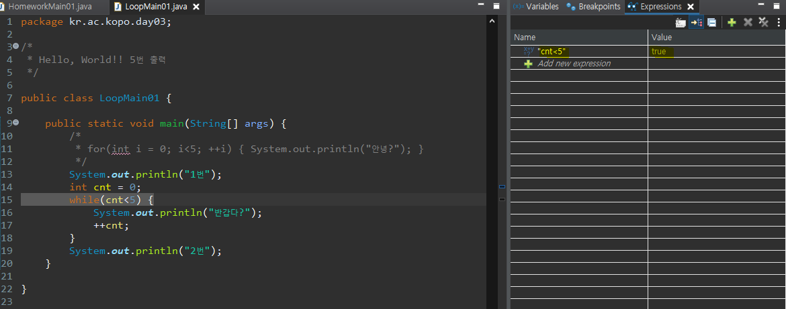

- **과제 피드백**

  - final을 이용해서 상수변수를 만들 때 모두 대문자로
  - 형변환 시에는 float보다는 double형을 표준으로 사용

  ```java
  package kr.ac.kopo.day03.homework;
  
  import java.util.Scanner;
  
  //day02 HW04
  public class HomeworkMain01 {
  
  	public static void main(String[] args) {
  		//sc를 재사용하면 된다.
  		Scanner sc = new Scanner(System.in);
  		System.out.println("첫 번재 정수 : ");
  		int num1 = sc.nextInt();
  		System.out.println("두 번째 정수 : ");
  		int num2 = sc.nextInt();
  		
  		//num2가 0인 경우 false로 나오게하기 > if문이 아니고 &&를 사용해서 출력 가능
  		System.out.println("정수 " + num1 + "이 " + num2 + "의 배수 여부 판단: "
  				+ (num2 > 0 && num1 % num2 == 0));		
  	}
  }
  ```

  

- **3/9 키워드 복습**

  비교연산자(결과는  boolean형), 논리연산자(교환법칙이 성립하지 않는다. / 결과는 boolean형), &&는 false 결과가 나오면 뒤에 연산은 확인하지 않는다., ||는 true가 나오면 뒤에 연산은 확인하지 않는다., 형변환(기본 자료형에서의 형변환), boolean형은 형변환이 불가능, 명시적 형변환, 묵시적 형변환,  조건문(if, switch), if는 n-1의 조건문, switch는 동등비교를 할 때 사용, case 뒤에 들어갈 수 있는 type: char, byte, short, int > jdk1.7버전 부터는 String도 가능, break, return과 break의 차이


#### 반복문

- **while**

  - 조건식이 false일 때까지 반복문이 동작한다. 즉, 조건식이 true인 동안 실행을 한다.
  - 초기화는 while문 밖에서 진행
  - 반복문의 특정한 종료조건만 아는 경우, 명확하게 얼만큼 반복할지에 대해 모르는 경우에 많이 사용

  ```java
  while(/*조건절*/){
  	//반복문장들
  }
  ```


- **for문**

  - for문 실행순서 1 - 2 - 4 - 3

    -2(조건이 참인 경우) - 4 - 3 

    -2(조건이 거짓일 경우) - 5 

  ```java
  for(1. 초기값;2. 조건;3. 증감){
      //4. 반복문장들
  }
  //5. 반복문 빠져나옴
  ```


- for문과 while문 안에서 생성한 변수는 그 안에서만 사용할 수 있음(지역변수)


- **while문 디버그**

  - 초기값 설정한 라인에 Toggle Breakpoint  선택

   

   

  - run > Debug 클릭

  

  

  - switch

   

  

  - 이러한 화면을 볼 수 있다
    - Expressions에서 Name에 확인하고 싶은 조건식 입력(cnt<5)
    - F6 누르기

  

  

  - cnt의 값과 cnt<5 가 true인 것을 확인

  

  

  

  - F6을 계속 누르면 진행이 되고 ++cnt을 만나고 while이 시작하는 동시에 cnt가 +1이 된 것을 확인할 수 있다.

  


