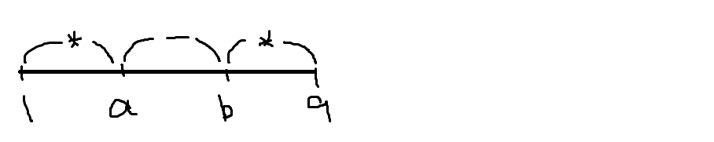

#### 과제 피드백

- **day03 ExamMain01 5번 문제**

###### <day04.exam.ExamMain01>

```java
package kr.ac.kopo.day04.exam;

//day03 ExamMain01 5번 문제 교수님 풀이
/*
 *  	5)
 	*****
 	 ****
 	  ***
 	   **
 	    *
 	   **
 	  ***
 	 ****
 	*****
 */
public class ExamMain01 {
	
	public static void main(String[] args) {
		
		System.out.println("*****첫 번째 방법*****\n");
		//for문 5개 + if문 1개
		for(int i =1;i<=9;i++) {
			if(i<=5) {
				for(int j=1;j<=i-1;j++) {
					System.out.print("-");
				}
				for(int j=1;j<=6-i;j++) {
					System.out.print("*");
				}
			}else {
				for(int j=1;j<=9-i;j++) {
					System.out.print('-');
				}
				for(int j=1;j<=i-4;j++) {
					System.out.print("*");
				}
			}
			System.out.println();
		}
		
		System.out.println("\n******두 번째 방법*****\n");
		//for문3개 + if문 3개
		 for(int i=1;i<=9;++i) {
			 if(i <=5) {
				 for(int j=1;j<=5;j++) { //한 행 당 *나 - 둘 다 합치면 5개 찍음
					 if(i>j) { //1행일때는 첫번째부터 * 2행일때는 두번째부터 *(규칙) 즉, i행일때는 i번째부터 별
						 System.out.print("-");
					 }else {
						 System.out.print("*");
					 }
				 }
			 }else { //6행일때는 4열부터 7행일때는 3열부터 *이 찍힘 즉, i열부터는 10-i열부터 *
				 for(int j=1;j<=5;++j) {
				 System.out.print(j<10-i?'-':'*');
				 }
			 }
			 System.out.println();
		 }
		 
		 System.out.println("\n*****세 번째 방법*****\n");
		 //세 번째 방법(for3+if1)
		 //어떤 행이든 - 먼저 찍고 *을 찍는다.
		 
		 int space = 0;
		 int star = 5;
		 for(int i=1;i<=9;++i) {
			 for(int j=1;j<=space;j++) { //행의 -의 개수 제어(새로운 변수)
				 System.out.print('-');
			 }
			 for(int j=1;j<=star;j++) {
				 System.out.print('*');
			 }
			 System.out.println();
			 if(i<5) { //5행이 되면 이미 스페이스를 찍은 상태이므로 i<5의 조건을 준다.
				 ++space;
				 --star;
			 }else {
				 --space;
				 ++star;
			 }
		 }
		 
		 System.out.println("\n*****네 번째 방법*****\n");
		 //네 번째 방법(세 번째 방법에서 변수 하나만 생성) 
		 //어떤 행이든 - 먼저 찍고 *을 찍는다.
		 
		 int cnt = 5;
		 for(int i=1;i<=9;++i) {
			 for(int j=1;j<=5-cnt;j++) { //행의 -의 개수 제어(새로운 변수)
				 System.out.print('-');
			 }
			 for(int j=1;j<=cnt;j++) {
				 System.out.print('*');
			 }
			 System.out.println();
			 if(i<5) { //5행이 되면 이미 스페이스를 찍은 상태이므로 i<5의 조건을 준다.
				 --cnt;
			 }else {
				 ++cnt;
			 }
		 }
		 
		 System.out.println("\n*****다섯 번째 방법*****\n");
		 //한 행 당 스페이스와 *의 개수를 합쳐서 총 5개만 찍는다.
		 
		 //그래서 별의 시작위치를 기억한다.
		 int starCol = 1;
		 
		 for(int i=1;i<=9;i++) {
			 for(int j=1;j<=5;j++) {
				 if(j<starCol) {
					 System.out.print('-');
				 }else {
					 System.out.print('*');
				 }
			 }
			 System.out.println();
			 if(i<5) {
				 starCol++;
			 }else {
				 starCol--;
			 }
		 }
	}//main
}
```


- **day03 ExamMain01  7번 문제**
  - n의 개수 + space의 개수 = 5
  - 그래서 변수는 n 하나로 사용하고 space의 개수를 5-n으로 사용

| i    | *    | n(2n-1) | space |
| ---- | ---- | ------- | ----- |
| 1    | 1    | 1       | 4     |
| 2    | 3    | 2       | 3     |
| 3    | 5    | 3       | 2     |
| 4    | 7    | 4       | 1     |
| 5    | 9    | 5       | 0     |
| 6    | 7    | 4       | 1     |
| 7    | 5    | 3       | 2     |
| 8    | 3    | 2       | 3     |
| 9    | 1    | 1       | 4     |


###### <day04.exam.ExamMain02>

```java
package kr.ac.kopo.day04.exam;

//day03 ExamMain01 5번 문제 교수님 풀이
/*
 	7)
 	    *
 	   ***
 	  *****
 	 *******
 	*********
 	 *******
 	  *****
 	   ***
 	    *
 */
public class ExamMain02 {
	
	public static void main(String[] args) {
		
		int n=1;
		for(int i=1;i<=9;i++) {
			for(int j=1;j<=5-n;++j) {
				System.out.print('-');
			}
			for(int j=1;j<=2*n-1;++j) {
				System.out.print("*");
				
			}
			System.out.println();
			if(i<5) {
				n++;
			}else {
				n--;
			}
		}
		
		System.out.println();
		//두 번째
		int space=4;
		for(int i=1;i<=9;i++) {
			for(int j=1;j<=9;j++) {
				if(j<=space||j>=10-space) {
					System.out.print("-");
				}else {
					System.out.print("*");
				}
			}
			System.out.println();
			if(i<5) {
				space--;
			}else {
				space++;
			}
		}
        
	}//main
}
```


- **day03 ExamMain01 8번 문제**



| *    | a (1 ~ a) | b (b ~ 9)  |
| ---- | --------- | ---------- |
| 1    | 1         | 9          |
| 2    | 2         | 8          |
| 3    | 3         | 7          |
| 4    | 4         | 6          |
| 5    | 5         | 5          |
| n    | 1 ~ n     | (10-n) ~ 9 |


###### <day04.exam.ExamMain03>

```java
package kr.ac.kopo.day04.exam;

//day03 ExamMain01 8번 문제 교수님 풀이
/*
 	8)
 	*_______*
 	**_____**
 	***___***
 	****_****
 	*********
 	****_****
 	***___***
 	**_____**
 	*_______*
 */
public class ExamMain03 {
	
	public static void main(String[] args) {
		
		//*부터 찍고 -찍고 *을 찍는 방식
		//모든 행은 *과 -를 합쳐서 9개의 문자를 찍어낸다.
		
		int star = 1;
		for(int i = 1; i <= 9; i++) {
			for(int j = 1; j <= 9; j++) {
				if(j <= star || j >= 10-star) {
					System.out.print('*');
				} else {
					System.out.print('-');
				} 
				/*
				if(j <= star) {
					System.out.print('*');
				} else if(j < 10-star) {
					System.out.print('-');
				} else {	// j >= 10-star
					System.out.print('*');
				}
				*/
			}
			System.out.println();
			if(i < 5) {
				star++;
			} else {
				star--;
			}
		}
        
	}//main
}
```


#### 제어

- **break의 역할**
  - switch문에서 switch문을 벗어나는데 사용
  - 반복문에서 반복루프를 벗어나는데 사용
  - 중첩된 반복문을 한번에 빠져나갈 때 사용

- **continue**
  - 반복문의 특정지점에서 제어를 반복문의 처음으로 보낸다.
  - 즉, continue를 만나면 그 밑의 문장을 수행하지 않고 다음 반복문을 수행한다.

```java
package kr.ac.kopo.day04;

public class LoopMain05 {

	public static void main(String[] args) {
		for(int i = 1; i <= 3; i++) {
			for(int j = 1; j <= 5; ++j) {
				if(j == 3) {
					break; //가까운 for문을 빠져나간다.
				}
				System.out.println(j);
			}
		}
	}
}
```


```java
package kr.ac.kopo.day04;

public class LoopMain05 {

	public static void main(String[] args) {
		for(int i = 1; i <= 3; i++) {
			for(int j = 1; j <= 5; ++j) {
				if(j == 3) {
					//break; //중첩된 for문인 경우 가까운 for문을 빠져나간다.
					continue; //continue는 많이 사용하지 않는다.
				}
				System.out.println(j);
			}
		}
	}
}
```


- 가장 가까운 반복문을 빠져나오는 것이 아닌 모든(원하는) 반복문을 빠져나오는 경우
  - 빠져나갈 for문 앞에 'name:'을 설정
  - break 뒤에 설정한 이름을 적어준다.

```java
package kr.ac.kopo.day04;

public class LoopMain05 {

	public static void main(String[] args) {
		//i로 시작되는 for문을 loof01의 이름으로 지정
		loop01: for(int i = 1; i <= 3; i++) {
			for(int j = 1; j <= 5; ++j) {
				if(j == 3) {
					break loop01; //가까운 for문을 빠져나간다.
					//continue;
				}
				System.out.println(j);
			}
		}
	}
}
```


#### 배열

- **배열이란?**
- **연속적인 공간에 같은 타입의 변수들을 모아놓은 집합**
    - 컴퓨터는 각각의 변수를 구분하기 위해서 주소값을 기억한다. int는 stack영역에 저장하는데 배열은 연속적인 공간에 저장하는데 4개의 정수를 저장하기 위해서는 16byte의 공간을 만든다. 컴퓨터는 배열의 주소값 하나를 기억하는데 int1의 주소가 OX40이라면 int2의 주소는 OX44이고 int3은 OX48이라고 유추할 수 있다. 그래서 컴퓨터는 배열에 있는 모든 줄을 기억할 필요가 없고 첫번째 주소만 기억해놓는다. (나머지 줄은 유추 가능) 그래서 메모리가 줄어든다. 만약 배열안의 데이터 타입이 모두 다르다면 주소를 유추할 수 없으므로 같은 타입이고 따로따로 떨어져있어도 주소를 유추할 수 없으므로 연속적인 공간인 것임. 
    - 실제적인 위치는 알 수 없고 jvm의 가상의 주소를 알려줌
  - 크기가 고정되어 있다(한 번 생성된 배열은 크기를 바꿀 수 없다.)
  - 배열을 객체로 취급
  - 배열의 요소를 참조하려면 배열이름과 색인(index)이라고 하는 것이 필요하다.
    - 배열은 시작위치를 알고 연속적인 공간이므로 그 시작위치로부터 얼만큼 떨어져있는지 상대적인 위치를 알 수 있다. 그것의 위치를 index라고 부른다. 
  - int 유형의 정수값을 조합하여 사용한다.
  
- string이나 배열같은 경우는 크기를 모르므로 new를 통해서 생성을 한다(heap영역에 생성, heap영역에 생성된 주소값을 기억하는 참조변수가 필요). new를 통해서 만든 것은 객체라고 부른다.(?) 
  - 변수생성 과정을 줄이기 위해서 배열을 만들었다.


- **배열의 선언**

  - []는 자바에서 배열을 나타낸다.
  - []의 개수가 배열의 차원 수를 나타낸다.

   

  - 배열보다 list를 많이 사용한다. 왜냐하면 배열은 크기가 고정되어 있어서 필요할때마다 가변적으로 공간을 늘리고 줄일 수 있는 list를 많이 사용한다.

  - 배열의 유형은 모든 것이 가능하다.(기본형, 참조형)

  - int[] arr = new int[4]; (arr은 heap영역에 생성된 배열의 주소값을 기억한다. 즉, arr은 참조변수, heap영역에 생성하기 위해서 new 키워드를 사용, 가비지컬렉터가 이동하는 영역이 heap영역임)

  - arr는 1차원 배열의 주소값을 기억하는 참조변수

    | 타입    | 배열이름 | 선언              |
    | ------- | -------- | ----------------- |
    | int     | iArr     | int [] iArrr;     |
    | char    | cArr     | char [] cArr;     |
    | boolean | bArr     | boolean [] bArr;  |
    | String  | srtArr   | String [] strArr; |
    | Date    | dateArr  | Date [] dateArr;  |

  - 배열의 이름 = new int [3] [2];

  

- **자동 초기화**

  - new라는 키워드에 의해서 만들어진 heap영역은 자동으로 초기화가 이루어진다.

  - boolean : fasle
  - char : '\u0000' (유니코드가 0인 값)
  - 참조형: null
    - 멤버변수와 로컬변수 모두 배열이 생성되면 자동 초기화된다.


- **배열의 생성**


- **배열의 크기 : 배열이름.length**


- **배열의 초기화**
  - 배열 값을 정해주어 생성 : {}를 활용하는 방식 - 배열 선언 시에만 설정 가능
  - int [] arr = {10,20,30,40} ; 
  - <=> int [] arr = int [] {10,20,30,40} ;
  - 위의 두가지는 똑같이 만들 수는 있지만 미묘하게 다르다. 
  - new를 사용하지 않아도 heap에 생성이 된다.


- **배열**
  - @가 나오면 주소값임 즉, arr에 생성된 1차원의 배열의 주소값이 들어가있음
  - heap에서 만들어진 영역은 자동으로 초기화가 되므로 지정해주지 않아도 0이 나옴

```java
package kr.ac.kopo.day04;

public class ArrayMain01 {

	public static void main(String[] args) {
		int [] arr = new int[4];
		System.out.println("arr : "+ arr); //arr 배열의 주소값
		System.out.println(arr[0]); //자동초기화로 0이 출력
		System.out.println(arr[1]);
		System.out.println(arr[2]);
		System.out.println(arr[3]);
		
		for(int i = 0;i < arr.length;i++) {
			System.out.print(arr[i]);
		}
		System.out.println("수정 전 크기: "+arr.length);
		arr = new int[3];
		System.out.println("arr : " + arr); //위의 주소값과 다름
		System.out.println("수정 후 크기: "+arr.length);		
	}
}
```


```java
package kr.ac.kopo.day04;

import java.util.Arrays;

public class ArrayMain02 {

	public static void main(String[] args) {
		//1, 2, 3, 4, 5를 가지는 배열 arr를 생성 후
		//int[] arr = new int[5];
		//int[] arr = {1,2,3,4,5};
		int[] arr = new int[] {1,2,3,4,5};
		
		arr = new int[] {10,20,30,40,50,60,70};
		
		//arr = {10,20,30,40,50,60,70}은 error
		//int[] arr = {10,20,30,40,50,60}만 가능
		
		
		//배열의 전체 요소를 출력하는 방식 3가지
		//1. index를 이용한 출력
		//2. 1.5버전의 for문을 이용한 출력
		//3. java.util.Arrays.toString() 메소드를 이용한 출력
		//	배열이 가지고 있는 요소들을 하나의 문자열로 만들어준다.
		// "[10,20,30]" 로 출력이 된다.
		
		System.out.println("방법1");
		for(int i=0; i<arr.length; i++) {
			System.out.print(arr[i] + "\t");
		}
		
		System.out.println("\n방법2");
		for(int a : arr) {
			System.out.print(a+"\t");
		}
		
		System.out.println("\n방법3");
		System.out.println(Arrays.toString(arr));
		
	}
}
```


- 2차원 배열은 주소값을 저장하는 배열이 생겨서 이것도 heap에 생긴다. 배열값의 주소를 저장하는 또 하나의 배열의 주소값이 arr애 저장되는 것이다.


- 배열선언을 할 때 int[] [] arr = new int[3] []처럼 뒤의 숫자를 선언하지 않을 수 있다. 
  - arr[0] = new int[4];
  - arr[1] = new int[2];
  - arr[2] = new int[3];
  - 위에 처럼 만들 수 있다. 
  - 2차배열인경우 arr[0]은 주소값이 나온다.  


- **1차원 배열과 2차원 배열 저장공간에 어떤 식으로 저장되는지 그림으로 꼭 정리해서 확인하기!!!!!!!!!!!!!!!!!!!!!**


- **2차원 배열의 크기**
  - aptInfoList.length = 3
  - aptInfoList[0].length = 2


```java
package kr.ac.kopo.day04;

import java.util.Arrays;

public class ArrayMain03 {

	public static void main(String[] args) {
		/*int[][] arr; */
		//System.out.println(arr); //error가 뜬다. 
								//왜냐하면 stack공간에 있는 것은 초기화가 x 그래서 error
		
		int[][] arr = new int[2][4];
		System.out.println("arr: " + arr);
		System.out.println("arr.length :" + arr.length);
		
		//주소값이 찍힘
		for(int i=0;i<arr.length;i++) {
			System.out.println("arr[" + i + "] : " + arr[i]);
		}
		
		System.out.println(arr[1].length);
		
		int[][] arr1 = new int[2][];
		
		//값을 정해두지 않아서 주소값이 저장되지는 않고 공간만 생성된 상태
		for(int i=0;i<arr1.length;i++) {
			System.out.println("arr1[" + i + "] : " + arr1[i]);
		}
		
		arr1[0] = new int[5];
		arr1[1] = new int[3];
		System.out.println(arr1[0].length);
		System.out.println(arr1[1].length);
		
	}
}
```


- **문자열 배열**

```java
package kr.ac.kopo.day04;

import java.util.Arrays;

public class ArrayMain04 {

	public static void main(String[] args) {
		String[] strArr = {"폴리텍", "데이터분석", "자바"};
		System.out.println("strArr : " + strArr); //주소값 출력
		
		System.out.println(strArr.length); //3
		
		//array 출력 방법1
		for(String a : strArr) {
			System.out.println(a);
		}
		
		//array 출력 방법2
		for(int i =0;i<strArr.length;i++) {
			System.out.println(strArr[i]);
		}
		
		//array 출력 방법3
		System.out.println(Arrays.toString(strArr));
	}
}
```

- 위의 저장방식은 아래의 그림처럼 이루어진다.(2차 배열처럼)


- 변수를 대신 만들어 주는 것이 String[] arr ; 이다. 그래서 arr은 주소값만 기억하는 배열이다. 
- String[] strArr = {"폴리텍", "데이터분석", "자바"}
  - String[] strArr = {new String("폴리텍"), new String("데이터분석"), new String("자바")} 처럼 해석하는 것이기 때문에 위의 그림처럼 나오는 것이다. 

