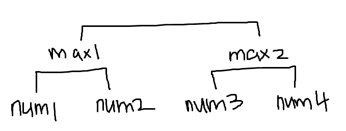
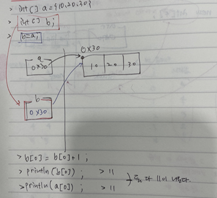
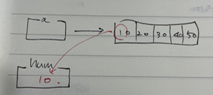

#### 과제 피드백

- **day04 과제 1번**

```java
package kr.ac.kopo.day05.homework;

import java.util.Scanner;

public class HomeworkMain01 {

	public static void main(String[] args) {
		Scanner sc = new Scanner(System.in);
		System.out.println("정수 3개 입력하시오 : ");
		int num1 = sc.nextInt();
		int num2 = sc.nextInt();
		int num3 = sc.nextInt();
		
        //num1이 작고 num2가 크다고 가정
		int min = num1, max = num2;
		if(num1 > num2) {
			min = num2;
			max = num1;
		}
		
		if(num3 < max) { //num3 < max면 num3가 가장 큰 수
			System.out.println(num3 + " > " + max + " > "+ min);
		}else if(num3 > min) { //num3가 max하고 min 사이에 있냐
			System.out.println(max + " > " + num3 + " > "+ min);
		}else { //num3가 가장 작을 때
			System.out.println(max + " > " + min + " > "+ num3);
		}
		
	} //main
}
```


- **day04 과제 2번 문제**

```java
package kr.ac.kopo.day05.homework;

import java.util.Random;

public class HomeworkMain02 {

	public static void main(String[] args) {
		Random r = new Random();
		
		//1 ~ 100사이의 정수를 임의로 4개 추출
		//범위 지정할 때 10으로 나누면 0~9까지만 나옴
		//1 ~ 100을 지정할 때는 r.nextInt() % 100 + 1 을 사용하지 않는다.
		//왜냐하면 음수값도 나올 수 있기 때문에
		//그래서 nextInt() 괄호 안에 숫자를 써주면 자동으로 양수의 값만 나온다.
		//r.nextInt(100) => 0 ~ 99
		int num1 = r.nextInt(100) + 1 ;//범위 지정
		int num2 = r.nextInt(100) + 1 ;//범위 지정
		int num3 = r.nextInt(100) + 1 ;//범위 지정
		int num4 = r.nextInt(100) + 1 ;//범위 지정
		
		//두개의 수를 비교하는 준결승의 형태
		int max1 = num1 > num2 ? num1 : num2 ;
		int max2 = num3;
		
		if(num4 > num3) {
			max2 = num4;
		}
		System.out.println("가장 큰 수는? :"+ (max1 > max2 ? max1 : max2));
		
	} //main
}
```




- **day04 과제 2번 문제 다른 풀이**

```java
package kr.ac.kopo.day05.homework;

import java.util.Scanner;

public class HomeworkMain03 {

	public static void main(String[] args) {
		Scanner sc = new Scanner(System.in);
		
		System.out.println("4개의 정수를 입력 : ");
		int max = 0 ;
		for(int i=0;i<4;++i) {
			int num = sc.nextInt();
			if(i == 0 || max < num) { //i == 0의 조건을 넣지 않으면 음수일 때 결과가 제대로 안나옴
				max = num;
			}
		}
		
	} //main
}
```


- day04과제 4번

```java
package kr.ac.kopo.day05.homework;

import java.util.Scanner;

//day04 과제 4번
public class HomeworkMain04 {

	public static void main(String[] args) {
		Scanner sc = new Scanner(System.in);
		System.out.println("정수를 입력하세요 : ");
		int num = sc.nextInt();
		
        //방법1.
		// 소수는 약수의 개수가 1과 자기자신 (즉, 2개)
		// 정수의 약수 개수를 구하기
		int cnt = 0 ;
		for(int i=1; i<=num; ++i) {
			if(num%i==0) {
				++ cnt ;
			}
		}
		if(cnt == 2) {
			System.out.println(num + "은 소수입니다.");
		}else {
			System.out.println(num + "은 소수가 아닙니다.");
		}
		
	} //main
}
```


- **day04 과제 4번 다른 풀이**

```java
package kr.ac.kopo.day05.homework;

import java.util.Scanner;

//day04 과제 4번
public class HomeworkMain04 {

	public static void main(String[] args) {
		Scanner sc = new Scanner(System.in);
		System.out.println("정수를 입력하세요 : ");
		int num = sc.nextInt();
        
        //방법2.
		//1과 자기자신의 정수를 제외한 약수 개수 구하기(소수는 약수0개)
		int cnt = 0;
		for(int i = 2; i <= num - 1; i++) {
			if(num % i == 0) {
				cnt ++;
			}
		}
		if(cnt == 0) {
			System.out.println("소수입니다.");
		}else {
			System.out.println("소수가 아닙니다.");
		}
        
	} //main
}
```


- **day04 과제 4번 다른 풀이**

```java
package kr.ac.kopo.day05.homework;

import java.util.Scanner;

//day04 과제 4번
public class HomeworkMain04 {

	public static void main(String[] args) {
		Scanner sc = new Scanner(System.in);
		System.out.println("정수를 입력하세요 : ");
		int num = sc.nextInt();
		
		//방법3.
		//만약 100의 약수를 구할거면 50까지만 확인하면 된다.
		//즉, 어떤 수(a)든 a%2까지만 확인하면 된다.
		//그리고 이미 소수가 아니란 것을 확인하면 결과 도출하기
		int cnt = 0;
		for(int i = 2; i<=num/2;i++) {
			if(num%i==0) {
				cnt ++;
				break;
			}
		}
		if(cnt == 0) {
			System.out.println("소수 입니다.");
		}else {
			System.out.println("소수가 아닙니다.");
		}
		
	} //main
}
```


- **day04 과제 4번 방법4**

```java
package kr.ac.kopo.day05.homework;

import java.util.Scanner;

//day04 과제 4번
public class HomeworkMain04 {

	public static void main(String[] args) {
		Scanner sc = new Scanner(System.in);
		System.out.println("정수를 입력하세요 : ");
		int num = sc.nextInt();
		
		//방법4.
		boolean bool = true; //소수다.
		for(int i=2; i<=num/2;++i) {
			if(num % i == 0) {
				bool = false; //소수가 아니다.
				break;
			}
		}
		if(bool) {
			System.out.println("소수이다.");
		}else {
			System.out.println("소수가 아니다.");
		}
	} //main
}
```


- **day04 과제 4번 방법5.**

```java
package kr.ac.kopo.day05.homework;

import java.util.Scanner;

//day04 과제 4번
public class HomeworkMain04 {

	public static void main(String[] args) {
		Scanner sc = new Scanner(System.in);
		System.out.println("정수를 입력하세요 : ");
		int num = sc.nextInt();
		
		//방법5.
		int i = 2;
		while(i<=num-1 && num%i != 0) { //i<=num/2 로 작성해도된다.
			i++;
		}
		if(i == num) {
			System.out.println("소수입니다.");
		}else {
			System.out.println("소수가 아닙니다.");
		}
	} //main
}
```


#### shallow copy & deep copy (단어 알아두기!)

- **shallow copy & deep copy 하는 방법** 

  - int a = 10; int b; b = a; 를 하는 것은 메모리가 2개가 생성된다.
  - 참조변수만 복사해서 하나의 배열을 2개의 참조변수가 가지고 있는 것이다.(공유)
  - 이러한 복사 방식을 shallow copy (주소값만 복사)

  

  - 이렇게 되면 안되고 heap 영역에 배열이 하나 더 복사가 되어야 한다.
  - 배열 자체를 복사하고 싶다면 **deep copy**

  

```java
package kr.ac.kopo.day05;

import java.util.Arrays;

public class ArrayMain05 {

	public static void main(String[] args) {
		int [] a = {10,20,30};
		int [] b ; //shallow copy를 위한 stack에 변수 b의 메모리 영역 생성
		b = a;
		System.out.println("a : " + Arrays.toString(a));
		System.out.println("b : " + Arrays.toString(b));
		System.out.println("a의 주소값 : " + a);
		System.out.println("b의 주소값 : " + b); //a와 b의 주소값이 같다.
		
		++b[0];
		System.out.println("++b[0] 수행 후...");
		System.out.println("a : " + Arrays.toString(a));
		System.out.println("b : " + Arrays.toString(b));
		//a와 b 둘다 바뀐 것을 확인 할 수 있다. 
		//왜냐하면 shallow copy를 했기 때문이다.
		//heap영역에 공간을 만들 수 있는 것은 new이기 때문에
		//deep copy를 하고싶다면 new를 사용해야 한다.
		//그럼 a가 가리키는 배열을 가리키고 싶을 때는 new를 사용한다.
		int [] c ; //deep copy를 위한 stack에 변수c의 메모리 영역 생성
		c = new int[a.length]; //heap영역에 배열c 메모리 영역 생성하며 
							//stack c영역에는 heap영역의 배열의 주소값이 저장이 된다.
							//heap에 생성된 배열 c는 new로 인해서 초기값이 모두 0으로 설정
		for(int i=0;i<a.length;++i) {
			c[i] = a[i] ; //안의 내용 copy
		}
		System.out.println("c : " + Arrays.toString(c));
		++c[0];
		System.out.println("c[0] update 후의 배열 c : " + Arrays.toString(c));
		System.out.println("c[0] update 후의 배열 a : " + Arrays.toString(a));
		//a와 c의 주소값이 다르고 다르므로 index 0번째 값이 함께 증가하지 않는다.
		
	}
}
```


- **두 배열을 합치기 **
  - System.arraycopy(src, srcPos, dest, destPos, length)
    - src: 원본 배열
    - srcPos: 원본배열의 복사 시작 위치(0부터 시작)
    - dest: 복사할 배열
    - destPos: 복사 받을 시작 위치
    - length: 복사할 크기

```java
package kr.ac.kopo.day05;

import java.util.Arrays;

public class ArrayMain06 {

	public static void main(String[] args) {
		int [] a = {10,20,30};
		int [] b = {5, 7, 8, 9, 20, 23} ;
		
		// int [] c = {10, 20, 30, 5, 7, 8, 9, 20, 23}의 결과 나오게 
		
		//방법1. 
		int[] c = new int[a.length + b.length] ; 
		int loc = 0 ;
		
		for(int i = 0; i < a.length; ++i) {
			c[loc++] = a[i];
		}
		for(int i = 0; i < b.length; i++) {
			c[loc++] = b[i];
		}
		System.out.println(Arrays.toString(c));
		
		//방법2. arraycopy
		//arraycopy 사용 방법 예
		int [] d  = new int[a.length] ;
		System.arraycopy(a, 0, d, 0, a.length);
		System.out.println("arraycopy를 이용해서 a를 d에 copy : " + Arrays.toString(d));
		
		//arraycopy로 int [] f = {10, 20, 30, 5, 7, 8, 9, 20, 23}의 결과 나오게 
		int[] f = new int[a.length + b.length] ; 
		System.arraycopy(a, 0, f, 0, a.length);
		System.arraycopy(b, 0, f, a.length, b.length);
		System.out.println("f배열 : " + Arrays.toString(f));
		
	}
}
```


- **배열안의 각 값을 더해주기**

  - 1.5버전의 for문으로 값을 더할 수 없다.(num이라는 독립적인 공간에 a배열이 잠시 들어왔다가 syso으로 값을 출력하고 다시 사라지게 되므로)

   

```java
package kr.ac.kopo.day05;


public class ArrayMain07 {

	public static void main(String[] args) {
		int[] a = {10, 20, 30, 40, 50};
		
		//*****배열 a의 값 확인 방법*****
		//방법1.
		for(int i = 0; i<a.length; ++i) {
			System.out.println(a[i]);
		}
		
		//방법2.
		for(int num : a) {
			System.out.println(num);
		}
		
		//*****a배열의 모든 요소에 100을 더하자*****
		//방법1.
		for(int i = 0; i<a.length; ++i) {
			a[i] += 100;
			System.out.println(a[i]);
		}
		
		//방법2. (1.5버전의 for문으로 100을 더할 수 없다.)
		for(int num : a) {
			num += 100;
			System.out.println(num);
		}
		//방법2는 결국 100이 더해지지 않는다. for문 안에서는 더해진 값으로 나옴
		//1.5버전의 for문은 값을 출력하든지 보는 용도로만 사용하지 값을 고치지 않음
		//num의 독립적인 공간으로 a의 각 값이 들어왔다가 다시 사라진다.
		
		
	}//main
}
```

 


